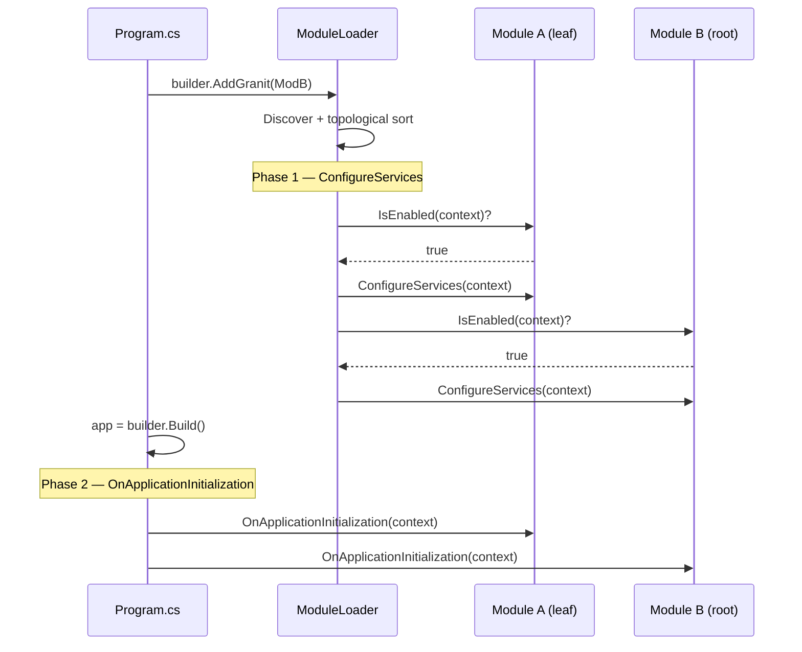

import { Tabs, TabItem } from "@astrojs/starlight/components";

## The problem

ASP.NET Core gives you dependency injection but no concept of a **module**. When a framework grows to %%PACKAGE_COUNT%% packages, you hit real problems fast:

- **Ordering** -- packages must register services in the right sequence (a caching module before a module that depends on it).
- **Lifecycle** -- some setup happens at DI registration time, other setup happens after `builder.Build()` (middleware, endpoints).
- **Conditional loading** -- Vault is useless in local development, Redis is optional if no connection string is configured.
- **Discovery** -- you need a single entry point that pulls in the entire dependency tree without listing every package by hand.

Granit solves this with a lightweight module system built on four primitives: `GranitModule`, `[DependsOn]`, topological sort, and a two-phase lifecycle.

## Core concepts

### Every package is a module

Each Granit NuGet package exposes exactly one class that inherits from `GranitModule`. This class is the package's entry point -- it declares dependencies and implements lifecycle hooks.

```csharp
[DependsOn(typeof(GranitPersistenceModule))]
[DependsOn(typeof(GranitCachingModule))]
public sealed class GranitNotificationsModule : GranitModule
{
    public override void ConfigureServices(ServiceConfigurationContext context)
    {
        context.Services.AddGranitNotifications();
    }

    public override void OnApplicationInitialization(ApplicationInitializationContext context)
    {
        // Map endpoints, register middleware, etc.
    }
}
```

### Dependency declaration with `[DependsOn]`

The `[DependsOn]` attribute accepts one or more module types. Multiple attributes can be stacked. The attribute is inherited, so a module automatically includes its base class dependencies.

### Topological sort

`ModuleLoader` walks the `[DependsOn]` graph starting from your root module, discovers all reachable modules, deduplicates them, and sorts them using **Kahn's algorithm**. Dependencies are loaded first; the root module is loaded last. Circular dependencies throw an `InvalidOperationException` at startup with the names of the involved modules.

### Two-phase lifecycle



**Phase 1 -- `ConfigureServices`** runs before `builder.Build()`. The `ServiceConfigurationContext` gives you access to:

| Property | Type | Purpose |
|---|---|---|
| `Services` | `IServiceCollection` | DI registration |
| `Configuration` | `IConfiguration` | appsettings, env vars |
| `Builder` | `IHostApplicationBuilder` | Full builder (needed by Observability, etc.) |
| `ModuleAssemblies` | `IReadOnlyList<Assembly>` | All loaded module assemblies for convention scanning |
| `Items` | `IDictionary<string, object?>` | Shared state for inter-module communication |

**Phase 2 -- `OnApplicationInitialization`** runs after `Build()`, before `app.Run()`. The `ApplicationInitializationContext` provides the resolved `IServiceProvider`.

Both phases have async variants (`ConfigureServicesAsync`, `OnApplicationInitializationAsync`) for modules that need to read remote config or verify connectivity at startup.

### Conditional modules

Override `IsEnabled` to skip a module's lifecycle methods based on configuration or environment. The module stays in the dependency graph (its dependents still load), but its `ConfigureServices` and `OnApplicationInitialization` are not called.

<Tabs>
  <TabItem label="Environment-based">
    ```csharp
    // Vault is disabled in Development — no Vault server needed locally
    [DependsOn(typeof(GranitEncryptionModule))]
    public sealed class GranitVaultModule : GranitModule
    {
        public override bool IsEnabled(ServiceConfigurationContext context) =>
            !context.Builder.Environment.IsDevelopment();

        public override void ConfigureServices(ServiceConfigurationContext context)
        {
            context.Services.AddGranitVault();
        }
    }
    ```
  </TabItem>
  <TabItem label="Config-based">
    ```csharp
    // Redis caching activates only when configured
    [DependsOn(typeof(GranitCachingModule))]
    public sealed class GranitCachingStackExchangeRedisModule : GranitModule
    {
        public override bool IsEnabled(ServiceConfigurationContext context)
        {
            RedisCachingOptions redisOpts = context.Configuration
                .GetSection(RedisCachingOptions.SectionName)
                .Get<RedisCachingOptions>() ?? new RedisCachingOptions();

            return redisOpts.IsEnabled;
        }

        public override void ConfigureServices(ServiceConfigurationContext context) =>
            context.Services.AddGranitCachingRedis();
    }
    ```
  </TabItem>
</Tabs>

### Single entry point

Your `Program.cs` needs exactly one call:

```csharp
var builder = WebApplication.CreateBuilder(args);

builder.AddGranit<AppHostModule>();

var app = builder.Build();
await app.UseGranit();
await app.RunAsync();
```

`AddGranit<T>()` discovers every module reachable from `AppHostModule`, sorts them, and runs Phase 1. `UseGranit()` runs Phase 2. That is the entire bootstrap.

A fluent builder API is also available when you need to compose modules from multiple independent roots:

```csharp
builder.AddGranit(granit => granit
    .AddModule<GranitPersistenceModule>()
    .AddModule<GranitObservabilityModule>()
    .AddModule<AppHostModule>()
);
```

## Soft dependencies

Not every cross-cutting concern requires a hard `[DependsOn]`. The `ICurrentTenant` interface lives in `Granit.MultiTenancy` and is available to every module without referencing `Granit.MultiTenancy`. A `NullTenantContext` (where `IsAvailable` returns `false`) is registered by default during `AddGranit`.

This means a module like `Granit.BlobStorage.EntityFrameworkCore` can inject `ICurrentTenant?` and apply tenant filters without declaring `[DependsOn(typeof(GranitMultiTenancyModule))]`. The hard dependency is reserved for modules that **must enforce** tenant isolation (e.g., BlobStorage throws if no tenant context is available, for GDPR reasons).

:::caution[Warning]
Always check `ICurrentTenant.IsAvailable` before accessing `Id`. The null object is the normal state when multi-tenancy is not installed.
:::

## How it fits together

The module graph **is** your architecture diagram. Every `[DependsOn]` is a compile-time-visible edge. The topological sort guarantees that if module B depends on module A, A's services are registered first. No runtime surprises, no ordering bugs.

:::tip[Pro tip]
If you cannot draw the `[DependsOn]` tree for your application on a whiteboard, your architecture needs simplification. The module graph should be a clean DAG, not a hairball.
:::

## Next steps

- [Core reference](/dotnet/core/module-system/) -- full API surface of `Granit`
- [Bundles](./bundles/) -- pre-composed module groups for common scenarios
