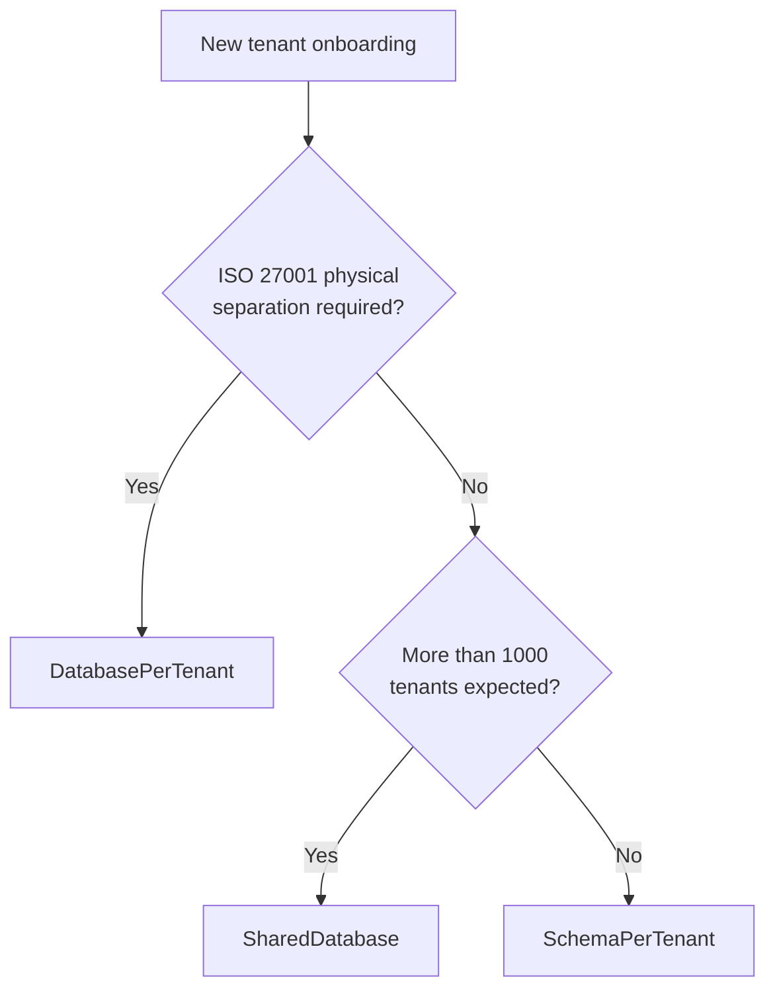

import { Tabs, TabItem } from "@astrojs/starlight/components";

## The problem

SaaS applications serve multiple organizations from a single deployment.
Without framework support, every repository method ends up with
`WHERE TenantId = @tenantId` scattered across the codebase. Miss one filter
and you leak data between tenants — a GDPR incident waiting to happen.

Granit solves this with **transparent tenant isolation**: the framework resolves
the current tenant, stores it in an async-safe context, and automatically
appends query filters to every EF Core query. Application code never writes
a tenant WHERE clause.

## Tenant resolution

The middleware pipeline resolves the tenant identity on every request.
Four built-in resolvers run in priority order — **first match wins**:

| Order | Resolver | Source | Use case |
|-------|----------|--------|----------|
| 50 | `DomainTenantResolver` | Subdomain → `ITenantReader` | SaaS branded URLs (`acme.monsaas.com`) |
| 100 | `HeaderTenantResolver` | `X-Tenant-Id` header | Service-to-service calls, API gateways |
| 200 | `JwtClaimTenantResolver` | `tenant_id` JWT claim | End-user requests via Keycloak |
| 300 | `QueryStringTenantResolver` | `?__tenant={guid}` | Development and debugging |

The domain resolver uses a configurable template (`{0}.monsaas.com`) and resolves
the identifier via `ITenantReader.FindByIdentifierAsync()`. The query string
resolver is a dev/debug fallback — disable in production by setting
`QueryStringParamName` to `null`.

### Custom resolvers

Implement `ITenantResolver` to add your own resolution logic (e.g., cookie-based).
Register in DI — the pipeline auto-discovers all implementations:

```csharp
services.AddScoped<ITenantResolver, CookieTenantResolver>();
```

## Async-safe tenant context

`ICurrentTenant` is backed by `AsyncLocal<T>`. This means:

- The tenant context **propagates** through `async`/`await` calls automatically.
- Parallel tasks (`Task.WhenAll`, `Parallel.ForEachAsync`) each get their own
  isolated copy — no cross-contamination.
- Background jobs must explicitly set the tenant context before executing
  tenant-scoped work.

```csharp
public class InvoiceService(ICurrentTenant currentTenant)
{
    public void PrintCurrentTenant()
    {
        if (!currentTenant.IsAvailable)
        {
            // No tenant context — running in a host-level scope
            return;
        }

        var tenantId = currentTenant.Id; // Guid
    }
}
```

:::caution[Warning]
Always check `ICurrentTenant.IsAvailable` before using `Id`.
`NullTenantContext` (`IsAvailable = false`) is the normal state when
multi-tenancy is not installed. Accessing `Id` without checking throws
`InvalidOperationException`.
:::

## Isolation strategies

Granit supports three isolation strategies. You choose per deployment — or
mix them dynamically for different tenant tiers.

### 1. SharedDatabase

All tenants share one database. Isolation is purely logical via
`WHERE TenantId = @id` query filters.

- Simplest to operate and migrate.
- Scales to **1 000+ tenants** without connection pool pressure.
- Single backup/restore covers all tenants.
- Not suitable when regulations require physical data separation.

### 2. SchemaPerTenant

Each tenant gets its own PostgreSQL schema within a shared database.
Tables are identical, but isolated at the schema level.

- Practical limit: **~1 000 tenants** (PostgreSQL catalog overhead).
- Per-tenant backup possible via `pg_dump --schema`.
- Migrations must run per schema — Granit handles this automatically.

### 3. DatabasePerTenant

Each tenant gets a dedicated database. Full physical separation.

- Required for **ISO 27001** when the client demands physical isolation.
- Practical limit: **~200 tenants** with PgBouncer connection pooling.
- Independent backup, restore, and retention policies per tenant.
- Highest operational cost.

### Decision matrix



### Dynamic strategy

Premium and standard tenants can coexist in the same deployment.
Configure the strategy per tenant in the tenant registry:

```csharp
public class Tenant
{
    public Guid Id { get; set; }
    public string Name { get; set; } = string.Empty;
    public TenantIsolationStrategy Strategy { get; set; }
    public string? ConnectionString { get; set; } // For DatabasePerTenant
    public string? Schema { get; set; }            // For SchemaPerTenant
}
```

The `TenantConnectionStringResolver` reads the strategy and returns the
appropriate connection string (or schema) at runtime:

```csharp
internal sealed class TenantConnectionStringResolver(
    ITenantStore tenantStore) : ITenantConnectionStringResolver
{
    public async Task<TenantConnectionInfo?> ResolveAsync(
        Guid tenantId, CancellationToken cancellationToken)
    {
        Tenant? tenant = await tenantStore
            .FindByIdAsync(tenantId, cancellationToken)
            .ConfigureAwait(false);

        if (tenant is null)
            return null;

        return tenant.Strategy switch
        {
            TenantIsolationStrategy.DatabasePerTenant =>
                new TenantConnectionInfo(
                    Strategy: TenantIsolationStrategy.DatabasePerTenant,
                    ConnectionString: tenant.ConnectionString!),

            TenantIsolationStrategy.SchemaPerTenant =>
                new TenantConnectionInfo(
                    Strategy: TenantIsolationStrategy.SchemaPerTenant,
                    Schema: tenant.Schema!),

            _ => new TenantConnectionInfo(
                    Strategy: TenantIsolationStrategy.SharedDatabase,
                    ConnectionString: null) // Uses the default connection
        };
    }
}
```

Register it in your module:

```csharp
services.AddSingleton<ITenantConnectionStringResolver, TenantConnectionStringResolver>();
```

:::note[Good to know]
The resolver is called once per request scope and its result is cached for the duration
of the scope. For `SchemaPerTenant`, `ApplyGranitConventions` prepends the schema name to
all table references via a `ModelCreatingContext`. No raw SQL schema-switching required.
:::

## Transparent query filters

When you call `modelBuilder.ApplyGranitConventions(currentTenant, dataFilter)`
in your `DbContext.OnModelCreating`, the framework automatically registers
a `HasQueryFilter` for every entity implementing `IMultiTenant`:

```sql
-- Generated by EF Core query filter, not written by hand
WHERE "t"."TenantId" = @__currentTenant_Id
```

This filter combines with other Granit filters (`ISoftDeletable`, `IActive`,
`IPublishable`, `IProcessingRestrictable`) into a single `HasQueryFilter`
expression per entity. You never write manual `HasQueryFilter` calls —
`ApplyGranitConventions` handles all of them centrally.

:::note[Good to know]
Manual `HasQueryFilter` calls conflict with the framework's auto-applied
filters. EF Core allows only one `HasQueryFilter` per entity — the last
one wins. Let `ApplyGranitConventions` own all query filters.
:::

## Implementing a multi-tenant entity

Entities opt into tenant isolation by implementing `IMultiTenant`:

```csharp
using Granit.Domain;
using Granit.MultiTenancy;

public class Invoice : AggregateRoot, IMultiTenant
{
    public Guid? TenantId { get; set; }
    public string Number { get; set; } = string.Empty;
    public decimal Amount { get; set; }
    public DateTimeOffset IssuedAt { get; set; }
}
```

:::caution[Warning]
`TenantId` must be `Guid?` (nullable), never `string`. The interface contract
in `Granit.Domain` enforces this. Non-nullable `Guid` will fail the
architecture tests.
:::

## Soft dependency rule

Granit modules that need to read `ICurrentTenant` should reference
`Granit.MultiTenancy` — **not** `Granit.MultiTenancy`. There is no need
to add `[DependsOn(typeof(GranitMultiTenancyModule))]` or a
`<ProjectReference>` to the `Granit.MultiTenancy` package.

A `NullTenantContext` is registered by default in every Granit application.
It returns `IsAvailable = false` and acts as the null object when
multi-tenancy is not installed.

Hard dependency on `Granit.MultiTenancy` is allowed **only** when a module
must enforce strict tenant isolation (e.g., `Granit.BlobStorage` throws if
no tenant context exists — required for GDPR data segregation).

```csharp
// Correct — soft dependency via Granit
using Granit.MultiTenancy;

public class ReportService(ICurrentTenant currentTenant)
{
    public async Task<Report> GenerateAsync(CancellationToken cancellationToken)
    {
        if (currentTenant.IsAvailable)
        {
            // Tenant-scoped logic
        }

        // Host-level fallback
        // ...
    }
}
```

## Automatic tenant provisioning

When a tenant is created at runtime, the framework automatically provisions its
database resources. `Granit.MultiTenancy.Provisioning` provides a handler that listens
to `TenantCreatedEvent` and delegates to `ITenantProvisioner`, which discovers all
isolated DbContexts, creates schemas, runs migrations, and seeds tenant data.

No application code is needed — install the package, add the module dependency,
and tenant provisioning works out of the box. See
[Automatic Tenant Provisioning](/dotnet/infrastructure/multi-tenancy/isolation/#automatic-tenant-provisioning)
for the full reference.

## Further reading

- [Multi-Tenancy reference](/dotnet/infrastructure/multi-tenancy/) — overview,
  resolvers, isolation strategies, cache isolation, host/tenant separation
- [Configure multi-tenancy](/dotnet/guides/configure-multi-tenancy/) — step-by-step
  setup guide
- [Persistence concept](./persistence/) — how query filters and interceptors
  integrate with tenant isolation
