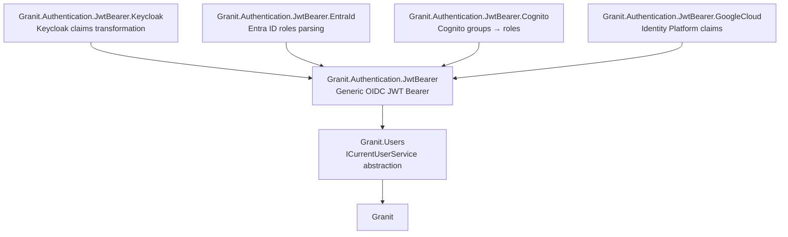
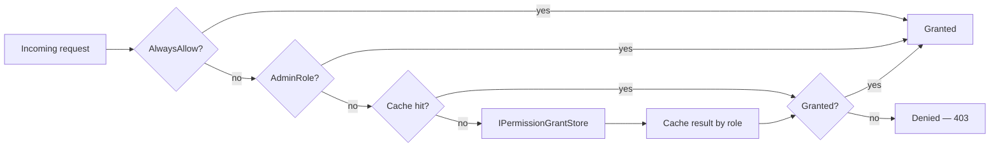
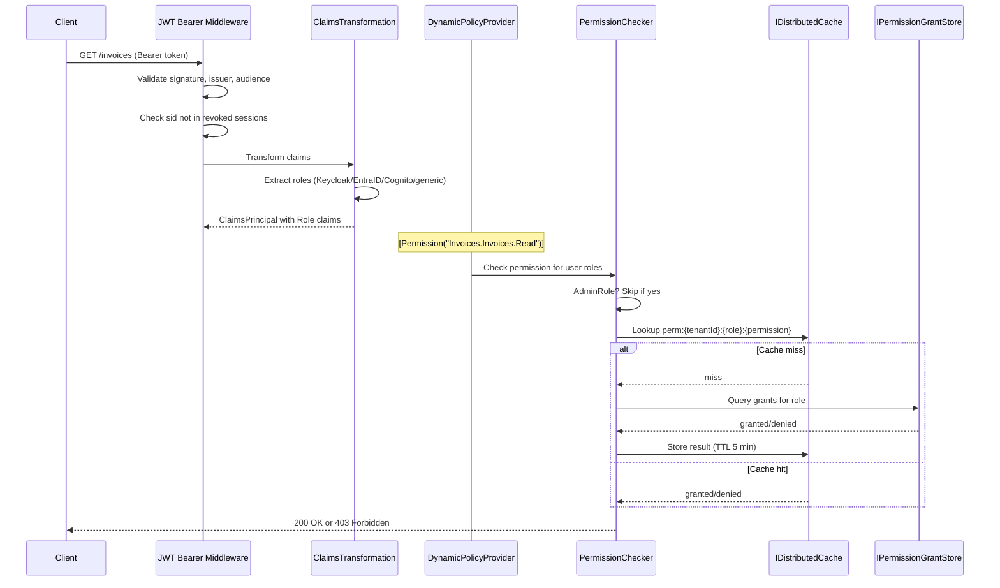

import { Tabs, TabItem } from "@astrojs/starlight/components";

## The problem

Modern APIs need three things from their security stack:

- **Pluggable authentication** -- swap Keycloak for Entra ID or Cognito without touching application code.
- **Fine-grained authorization** -- control access at the resource-action level without per-user permission assignments that spiral into unmanageable matrices.
- **Compliance-ready audit trails** -- every authenticated action must be traceable for ISO 27001 and GDPR.

Most frameworks punt on this: they give you `[Authorize]` and leave the rest to you. Granit provides a layered security stack where each layer has a single responsibility and can be replaced independently.

## Authentication stack

The authentication pipeline is built from a base package with provider-specific modules layered on top. Each provider module adds one concern: claims transformation from the provider's JWT format to standard .NET role claims.



### Granit.Users -- the foundation

`ICurrentUserService` is the sole abstraction for "who is calling." It lives in `Granit.Users` with zero dependency on ASP.NET Core, so domain services and background jobs can consume it without pulling in the HTTP stack.

```csharp
public interface ICurrentUserService
{
    string? UserId { get; }
    string? UserName { get; }
    string? Email { get; }
    bool IsAuthenticated { get; }
    ActorKind ActorKind { get; }
    IReadOnlyList<string> GetRoles();
    bool IsInRole(string role);
}
```

`ActorKind` distinguishes `User` (human), `ExternalSystem` (API key or service account), and `System` (background jobs). The `AuditedEntityInterceptor` uses this to fill `CreatedBy`/`ModifiedBy` -- when no user is authenticated, it falls back to `"system"`.

### Granit.Authentication.JwtBearer -- generic OIDC

This module registers ASP.NET Core JWT Bearer authentication, a `CurrentUserService` backed by `HttpContext.User`, and an `IRevokedSessionStore` for back-channel logout. It also registers the `"Authenticated"` authorization policy, which requires a valid JWT with no further claims.

Any OIDC-compliant provider works out of the box:

```json
{
  "Authentication": {
    "Authority": "https://idp.example.com",
    "Audience": "my-api",
    "RequireHttpsMetadata": true,
    "NameClaimType": "sub"
  }
}
```

### Granit.Authentication.JwtBearer.Keycloak -- PostConfigure pattern

The Keycloak module does not register its own authentication scheme. Instead, it **post-configures** `JwtBearerOptions` to add Keycloak-specific claims transformation. This is the key design choice: the consumer declares a single `[DependsOn]`, and the module wires itself in automatically.

```csharp
[DependsOn(typeof(GranitAuthenticationJwtBearerKeycloakModule))]
public class AppModule : GranitModule { }
```

Behind the scenes, the module:

1. Reads `realm_access.roles` and `resource_access.{clientId}.roles` from the JWT payload.
2. Maps them to standard `ClaimTypes.Role` claims.
3. Registers an `"Admin"` authorization policy matching the configured admin role.

No manual `PostConfigure<JwtBearerOptions>` calls, no claims transformation boilerplate.

### Granit.Authentication.JwtBearer.EntraId -- Microsoft Entra ID

For Azure-based deployments, the Entra ID module parses roles from both the v1.0 `roles` claim and the v2.0 `wids` claim. Like the Keycloak module, it post-configures `JwtBearerOptions` and maps provider-specific claims to standard `ClaimTypes.Role`.

### Granit.Authentication.JwtBearer.Cognito -- AWS Cognito

For AWS-based deployments, the Cognito module extracts groups from the `cognito:groups` claim and maps them to standard `ClaimTypes.Role`. Cognito has no native "roles" concept -- groups serve as roles.

### Granit.Authentication.JwtBearer.GoogleCloud -- Google Cloud Identity Platform

For Google Cloud deployments using Firebase Auth / Identity Platform, the module validates JWTs issued by `https://securetoken.google.com/{project-id}` and extracts custom claims from the `claims` object into standard `ClaimTypes.Role`.

<Tabs>
  <TabItem label="Keycloak">
    ```csharp
    [DependsOn(typeof(GranitAuthenticationJwtBearerKeycloakModule))]
    [DependsOn(typeof(GranitAuthorizationModule))]
    public class AppModule : GranitModule { }
    ```
  </TabItem>
  <TabItem label="Entra ID">
    ```csharp
    [DependsOn(typeof(GranitAuthenticationJwtBearerEntraIdModule))]
    [DependsOn(typeof(GranitAuthorizationModule))]
    public class AppModule : GranitModule { }
    ```
  </TabItem>
  <TabItem label="AWS Cognito">
    ```csharp
    [DependsOn(typeof(GranitAuthenticationJwtBearerCognitoModule))]
    [DependsOn(typeof(GranitAuthorizationModule))]
    public class AppModule : GranitModule { }
    ```
  </TabItem>
  <TabItem label="Google Cloud">
    ```csharp
    [DependsOn(typeof(GranitAuthenticationJwtBearerGoogleCloudModule))]
    [DependsOn(typeof(GranitAuthorizationModule))]
    public class AppModule : GranitModule { }
    ```
  </TabItem>
  <TabItem label="Generic OIDC">
    ```csharp
    [DependsOn(typeof(GranitAuthenticationJwtBearerModule))]
    [DependsOn(typeof(GranitAuthorizationModule))]
    public class AppModule : GranitModule { }
    ```
  </TabItem>
</Tabs>

:::tip[Pro tip]
Switching identity providers is a one-line `[DependsOn]` change. The authorization layer, permission definitions, and audit trail are completely decoupled from the authentication provider.
:::

## Authorization -- RBAC strict

Granit enforces a strict rule: **all permissions are attached to roles, never to individual users.** This is not a suggestion -- the framework provides no API for user-level permission grants. The reason is practical: user-level permissions create an N-users x M-permissions matrix that becomes unmanageable within months.

### Permission naming convention

Permissions follow the pattern `[Module].[Resource].[Action]`:

| Action | Meaning | Example |
|--------|---------|---------|
| `Read` | View resources | `Invoices.Invoices.Read` |
| `Create` | Create new resources | `Invoices.Invoices.Create` |
| `Update` | Modify existing resources | `Invoices.Invoices.Update` |
| `Delete` | Remove resources | `Invoices.Invoices.Delete` |
| `Manage` | Full CRUD (implies all four above) | `Invoices.Invoices.Manage` |
| `Execute` | Non-CRUD action | `DataExchange.Imports.Execute` |

Modules declare their permissions via `IPermissionDefinitionProvider`:

```csharp
public class InvoicePermissionDefinitionProvider : IPermissionDefinitionProvider
{
    public void DefinePermissions(IPermissionDefinitionContext context)
    {
        var group = context.AddGroup("Invoices", "Invoice management");
        group.AddPermission("Invoices.Invoices.Read", "View invoices");
        group.AddPermission("Invoices.Invoices.Create", "Create invoices");
        group.AddPermission("Invoices.Invoices.Update", "Edit invoices");
        group.AddPermission("Invoices.Invoices.Delete", "Delete invoices");
    }
}
```

:::tip[Pro tip]
Permission naming is your API contract with frontend teams. Get it right early -- changing it later means coordinating with every SPA consumer.
:::

### DynamicPermissionPolicyProvider

ASP.NET Core requires a named `AuthorizationPolicy` for every `[Authorize(Policy = "...")]`. Registering hundreds of policies at startup is wasteful. Instead, `DynamicPermissionPolicyProvider` creates policies on-the-fly from the permission name. When ASP.NET Core asks for a policy named `Invoices.Invoices.Read`, the provider builds one that delegates to `IPermissionChecker`.

### Per-role caching

Permission checks are cached **by role**, not by user. With K roles and M permissions, the cache holds K x M entries. Compare this to N users x M permissions in a user-level scheme -- for a system with 10,000 users, 5 roles, and 200 permissions, that is 1,000 cache entries instead of 2,000,000.

Cache key format: `perm:{tenantId}:{roleName}:{permissionName}`

Default TTL: 5 minutes, configurable via `Authorization:CacheDuration`.

### AdminRoles bypass

Roles listed in `Authorization:AdminRoles` bypass all permission checks entirely. This is a configured list, not a hardcoded constant. The bypass is evaluated before the cache lookup, so admin requests never touch the permission store.

```json
{
  "Authorization": {
    "AdminRoles": ["admin"],
    "CacheDuration": "00:05:00"
  }
}
```

### Permission checking pipeline



The `PermissionChecker` evaluates in strict order:

1. **AlwaysAllow** -- development-only escape hatch. The option validator rejects it outside `Development` environment.
2. **AdminRole bypass** -- users with any role in `AdminRoles` skip all further checks.
3. **Per-role cache** -- checks all roles the user holds, grants if any role has the permission.
4. **IPermissionGrantStore** -- queries the backing store (EF Core or custom). Result is cached for subsequent requests.

## Back-channel logout

Granit implements the [OIDC Back-Channel Logout](https://openid.net/specs/openid-connect-backchannel-1_0.html) specification, provider-agnostic.

The flow:

1. User logs out from the identity provider.
2. The IdP POSTs a `logout_token` to your API at `/auth/back-channel-logout`.
3. The endpoint validates the token: signature (against IdP JWKS), issuer, audience.
4. The `sid` (session ID) claim is extracted and stored in `IDistributedCache` with key `granit:revoked-session:{sid}`.
5. Subsequent requests carrying a JWT with a revoked `sid` are rejected by the JWT Bearer events handler.

```csharp
// In OnApplicationInitialization
app.MapGranitBackChannelLogout(); // POST /auth/back-channel-logout (anonymous)
```

:::caution[Warning]
The back-channel logout endpoint must be anonymous -- the IdP calls it directly. It is excluded from OpenAPI documentation by default. Make sure your reverse proxy allows unauthenticated POST requests to this path.
:::

```json
{
  "Authentication": {
    "BackChannelLogout": {
      "Enabled": true,
      "EndpointPath": "/auth/back-channel-logout",
      "SessionRevocationTtl": "01:00:00"
    }
  }
}
```

## Request flow

The complete security pipeline for an authenticated request:



## Design decisions

**Why no user-level permissions?** Permission creep. In every system we have built, user-level overrides start as "just one exception" and end as an unauditable mess. Role-based grants are reviewable: you can answer "what can role X do?" in one query. "What can user Y do?" across 50 individual grants is a different story.

**Why cache by role, not by user?** A role's permissions change rarely (admin action). A user's role membership changes more often (HR onboarding). By caching at the role level, a permission grant change invalidates K cache entries (one per role), not N entries (one per user).

**Why PostConfigure instead of a separate auth scheme?** ASP.NET Core's default authentication scheme is the one that runs on `[Authorize]`. If the Keycloak module registered its own scheme, every endpoint would need `[Authorize(AuthenticationSchemes = "Keycloak")]`. PostConfigure modifies the default JWT Bearer scheme in place, so `[Authorize]` just works.

## BFF pattern and advanced security

For single-page applications, the **Backend For Frontend (BFF)** pattern moves all token
handling to the server. The SPA never sees or stores access tokens — it only uses an
HTTP-only cookie for session binding. This eliminates the XSS token theft attack surface
entirely. See [BFF](/dotnet/security/bff/) for the full architecture.

Granit also supports **FAPI 2.0** financial-grade security features: **DPoP** (sender-constrained
tokens — prevents token replay), **PAR** (pushed authorization — prevents parameter tampering),
and **private_key_jwt** (asymmetric client authentication — eliminates shared secrets).
These are configured per BFF frontend and work with any OIDC provider.

For self-hosted identity, **OpenIddict** provides a full OIDC server embedded in your
application, with user management, account API, and all FAPI 2.0 features built in.
See [OpenIddict](/dotnet/security/openiddict/).

## Next steps

- [Security reference](/dotnet/security/authentication/) -- full API surface, configuration tables, EF Core permission store
- [BFF](/dotnet/security/bff/) -- Backend For Frontend security proxy for SPAs
- [OpenIddict](/dotnet/security/openiddict/) -- self-hosted OIDC server
- [FAPI 2.0](/dotnet/security/openiddict/advanced/fapi-2-security-profile/) -- financial-grade conformance
- [Compliance concept](/dotnet/concepts/compliance/) -- how the security model supports GDPR and ISO 27001
- [Identity reference](/dotnet/security/identity/) -- user management via Keycloak Admin API or Cognito User Pool API
