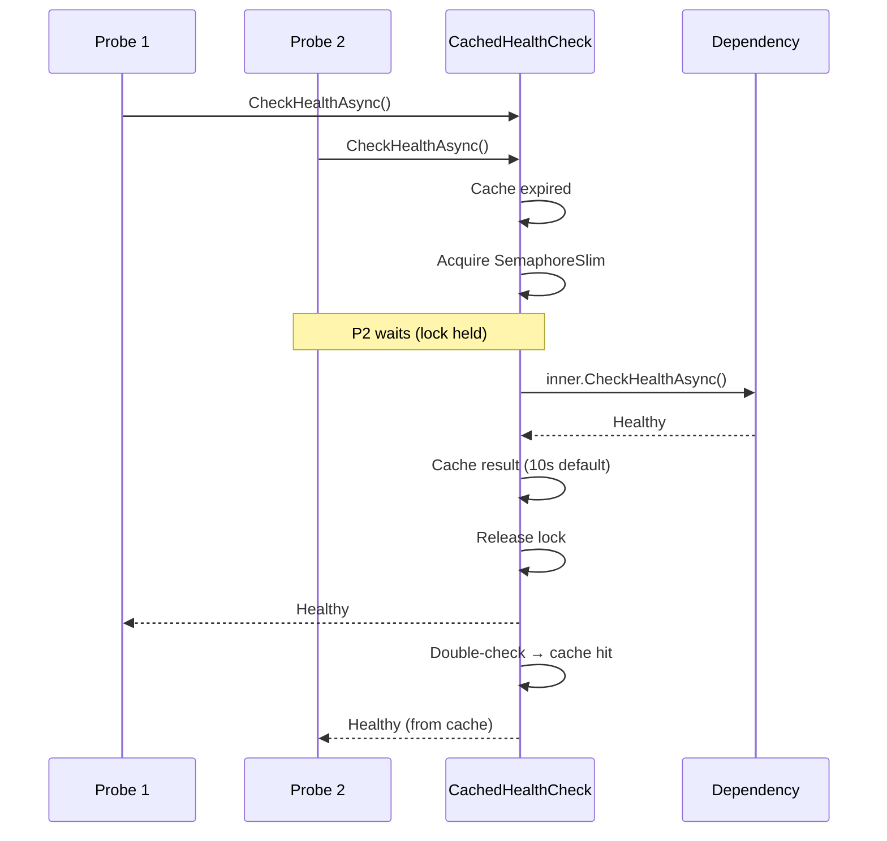

Granit.Diagnostics adds Kubernetes-native health check endpoints with
stampede-protected caching and a structured JSON response writer for Grafana
dashboards.

## Package

| Package | Role | Depends on |
| ------- | ---- | ---------- |
| `Granit.Diagnostics` | Health check endpoints, response writer, caching | `Granit.Timing` |

## Setup

```csharp
[DependsOn(typeof(GranitDiagnosticsModule))]
public class AppModule : GranitModule { }
```

In `Program.cs`, after `app.Build()`:

```csharp
app.MapGranitHealthChecks();
```

## Kubernetes health probes

`MapGranitHealthChecks()` registers three endpoints, all `AllowAnonymous` (the kubelet
cannot authenticate):

| Probe | Path | Behavior | Failure effect |
| ----- | ---- | -------- | -------------- |
| Liveness | `/health/live` | Always returns `200` — no dependency checks | Pod restart |
| Readiness | `/health/ready` | Checks tagged `"readiness"` | Pod removed from load balancer |
| Startup | `/health/startup` | Checks tagged `"startup"` | Liveness/readiness disabled until healthy |

### Status code mapping (readiness and startup)

| HealthStatus | HTTP | Effect |
| ------------ | ---- | ------ |
| `Healthy` | `200` | Pod receives traffic |
| `Degraded` | `200` | Pod stays in load balancer (non-critical degradation) |
| `Unhealthy` | `503` | Pod removed from load balancer |

## Built-in health checks

Granit modules provide opt-in health checks via `AddGranit*HealthCheck()` extension methods
on `IHealthChecksBuilder`. Each check follows the same pattern: sanitized error messages
(never exposing credentials), structured `data` where applicable, and appropriate tags
for Kubernetes probes.

| Module | Extension method | Probe | Tags |
| ------ | ---------------- | ----- | ---- |
| `Granit.Persistence` | `AddGranitDbContextHealthCheck()` | EF Core `CanConnectAsync` | readiness, startup |
| `Granit.Caching.StackExchangeRedis` | `AddGranitRedisHealthCheck()` | Redis `PING` with latency threshold | readiness, startup |
| `Granit.Vault` | `AddGranitVaultHealthCheck()` | Vault seal status + auth | readiness, startup |
| `Granit.Vault.Aws` | `AddGranitKmsHealthCheck()` | KMS `DescribeKey` (Degraded on PendingDeletion) | readiness, startup |
| `Granit.Identity.Federated.Keycloak` | `AddGranitKeycloakHealthCheck()` | `client_credentials` token request | readiness, startup |
| `Granit.Identity.Federated.EntraId` | `AddGranitEntraIdHealthCheck()` | `client_credentials` token request | readiness, startup |
| `Granit.BlobStorage.S3` | `AddGranitS3HealthCheck()` | `ListObjectsV2(MaxKeys=1)` | readiness, startup |
| `Granit.Notifications.Email.Smtp` | `AddGranitSmtpHealthCheck()` | EHLO handshake via MailKit | readiness |
| `Granit.Notifications.Email.AwsSes` | `AddGranitAwsSesHealthCheck()` | `GetAccount()` (Degraded if sending paused) | readiness, startup |
| `Granit.Notifications.Brevo` | `AddGranitBrevoHealthCheck()` | `GET /account` | readiness |
| `Granit.Notifications.Zulip` | `AddGranitZulipHealthCheck()` | `GET /api/v1/users/me` | readiness |
| `Granit.Vault.Azure` | `AddGranitAzureKeyVaultHealthCheck()` | GetKey probe | readiness |
| `Granit.Notifications.Email.AzureCommunicationServices` | `AddGranitAcsEmailHealthCheck()` | Send probe | readiness |
| `Granit.Notifications.Sms.AzureCommunicationServices` | `AddGranitAcsSmsHealthCheck()` | Send probe | readiness |
| `Granit.Notifications.MobilePush.AzureNotificationHubs` | `AddGranitAzureNotificationHubsHealthCheck()` | Hub description | readiness |

### Defensive timeout

All built-in health checks wrap their external call with `.WaitAsync(10s, cancellationToken)`.
If the dependency does not respond within 10 seconds, the check returns `Unhealthy`
immediately instead of blocking the Kubernetes probe cycle.

### Registering health checks

Tag your health checks with `"readiness"` and/or `"startup"` so they are picked up by
the correct probe. Use the built-in extension methods when available:

```csharp
builder.Services.AddHealthChecks()
    .AddGranitDbContextHealthCheck<AppDbContext>()
    .AddGranitRedisHealthCheck(degradedThreshold: TimeSpan.FromMilliseconds(100))
    .AddGranitKeycloakHealthCheck()
    .AddGranitAwsSesHealthCheck()
    .AddGranitBrevoHealthCheck()
    .AddGranitZulipHealthCheck()
    .AddGranitAzureKeyVaultHealthCheck()
    .AddGranitAcsEmailHealthCheck()
    .AddGranitAcsSmsHealthCheck()
    .AddGranitAzureNotificationHubsHealthCheck();
```

## JSON response format

`GranitHealthCheckWriter` produces a structured JSON payload for Grafana/Loki dashboards.
Kubernetes only reads the HTTP status code; the body is for operations teams.

```json
{
  "status": "Healthy",
  "duration": 12.3,
  "checks": [
    {
      "name": "database",
      "status": "Healthy",
      "duration": 8.1,
      "tags": ["readiness", "startup"]
    }
  ]
}
```

:::caution
The response never contains stack traces, connection strings, tokens, or PII
(ISO 27001 / GDPR compliance).
:::

## Health check caching

`CachedHealthCheck` wraps any `IHealthCheck` with a SemaphoreSlim double-check locking
pattern to prevent stampede when many pods are probed simultaneously.



With 50 pods probed every 3 seconds, an uncached database check generates ~16 req/s.
The cache reduces that to 1 request per `DefaultCacheDuration` per pod.

## Configuration reference

| Property | Type | Default | Description |
| -------- | ---- | ------- | ----------- |
| `LivenessPath` | `string` | `"/health/live"` | Liveness probe endpoint path |
| `ReadinessPath` | `string` | `"/health/ready"` | Readiness probe endpoint path |
| `StartupPath` | `string` | `"/health/startup"` | Startup probe endpoint path |
| `DefaultCacheDuration` | `TimeSpan` | `00:00:10` | Cache TTL for `CachedHealthCheck` |

## Public API summary

| Category | Key types | Package |
| -------- | --------- | ------- |
| Module | `GranitDiagnosticsModule` | -- |
| Health checks | `CachedHealthCheck`, `GranitHealthCheckWriter` | `Granit.Diagnostics` |
| Options | `DiagnosticsOptions` | `Granit.Diagnostics` |
| Extensions | `AddGranitDiagnostics()`, `MapGranitHealthChecks()` | `Granit.Diagnostics` |

## See also

- [Observability module](/dotnet/core/observability/) -- Serilog + OpenTelemetry OTLP
- [Caching module](/dotnet/data/caching/) -- Redis health check tagged `"readiness"`
- [Blob Storage module](/dotnet/data/blob-storage/) -- S3 health check
