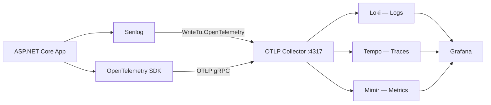

import { Tabs, TabItem } from "@astrojs/starlight/components";

Granit.Observability wires Serilog structured logging and OpenTelemetry (traces + metrics)
into a single `AddGranitObservability()` call. Logs ship to Loki, traces to Tempo, and
metrics to Mimir — all via an OTLP collector.

## Package

| Package | Role | Depends on |
| ------- | ---- | ---------- |
| `Granit.Observability` | Serilog + OpenTelemetry (traces, metrics, logs) | `Granit` |

## OTLP pipeline



## Setup

```csharp
[DependsOn(typeof(GranitObservabilityModule))]
public class AppModule : GranitModule { }
```

```json
{
  "Observability": {
    "ServiceName": "my-backend",
    "ServiceVersion": "1.2.0",
    "OtlpEndpoint": "http://otel-collector:4317",
    "ServiceNamespace": "my-company",
    "Environment": "production"
  }
}
```

## Serilog configuration

`AddGranitObservability()` configures two Serilog sinks:

| Sink | Purpose |
| ---- | ------- |
| `Console` | Local development, `[HH:mm:ss LEV] SourceContext Message` |
| `OpenTelemetry` | OTLP export to Loki via the collector |

Every log entry is enriched with `ServiceName`, `ServiceVersion`, and `Environment`
properties, matching the OpenTelemetry resource attributes for correlation.

Additional Serilog settings (minimum level, overrides, extra sinks) can be added via
standard `Serilog` configuration in `appsettings.json` — `ReadFrom.Configuration` is
called before the Granit enrichers.

## OpenTelemetry instrumentation

Three built-in instrumentations are registered automatically:

| Instrumentation | What it captures |
| --------------- | ---------------- |
| ASP.NET Core | Inbound HTTP requests (method, route, status code) |
| HttpClient | Outbound HTTP calls (dependency tracking) |
| EF Core | Database queries (command text, duration) |

Health check endpoints (`/health/*`) are filtered out of traces to avoid noise.

## Activity source auto-registration

Granit modules register their own `ActivitySource` names via `GranitActivitySourceRegistry.Register()`
during host configuration. `AddGranitObservability()` reads the registry and calls
`AddSource()` for each — no manual wiring needed.

```csharp
// Inside a module's AddGranit*() extension method
GranitActivitySourceRegistry.Register("Granit.Workflow");
```

### Registered activity sources

| ActivitySource | Span names |
| -------------- | ---------- |
| `Granit.Vault` | `vault.encrypt`, `vault.decrypt`, `vault.get-secret`, `vault.check-rotation` |
| `Granit.Vault.Azure` | `akv.encrypt`, `akv.decrypt`, `akv.get-secret`, `akv.check-rotation` |
| `Granit.Wolverine` | `wolverine.send`, `wolverine.handle` |
| `Granit.Notifications` | `notification.dispatch`, `notification.deliver` |
| `Granit.Notifications.Email.Smtp` | `smtp.send` |
| `Granit.Notifications.Email.AwsSes` | `ses.send` |
| `Granit.Notifications.Email.AzureCommunicationServices` | `acs-email.send` |
| `Granit.Notifications.Sms.AzureCommunicationServices` | `acs-sms.send` |
| `Granit.Notifications.MobilePush.AzureNotificationHubs` | `anh.send` |
| `Granit.Notifications.Brevo` | `brevo.send` |
| `Granit.Notifications.Zulip` | `zulip.send` |
| `Granit.Workflow` | `workflow.transition` |
| `Granit.BlobStorage` | `blob.upload`, `blob.download`, `blob.delete` |
| `Granit.DataExchange` | `import.execute`, `export.execute` |
| `Granit.EventBus` | `eventbus.publish.local`, `eventbus.publish.distributed` |
| `Granit.Privacy` | `privacy.export.execute`, `privacy.deletion.execute` |
| `Granit.Observability.AI` | `observability-ai.analysis.execute` |
| `Granit.Persistence` | `persistence.save`, `persistence.purge` |

## PII redaction — `LogRedaction`

Logs and trace spans must **never** contain raw PII (GDPR Art. 5, ISO 27001 A.5.34).
The `Granit.Diagnostics.LogRedaction` static class provides redaction helpers for use
in `[LoggerMessage]` call sites and `Activity.SetTag()` calls:

| Method | Input | Output | Use case |
| ------ | ----- | ------ | -------- |
| `Email(string)` | `john.doe@example.com` | `joh***@example.com` | Log templates |
| `EmailDomain(string)` | `john.doe@example.com` | `example.com` | Span tags (bounded cardinality) |
| `Phone(string)` | `+33612345678` | `+336*****78` | Log templates |
| `Token(string)` | `dLkj3FDmAbCdEfGh` | `dLkj...fGh` | Device tokens, API tokens |
| `IpAddress(string)` | `192.168.1.42` | `192.168.1.***` | IPv4 /24 masking |
| `Username(string)` | `john_admin` | `joh***` | DB credentials, identity |
| `HashPrefix(string)` | *(any)* | `a1b2c3d4` | Non-reversible correlation (span tags) |

**Architecture tests** enforce PII-safe naming in `[LoggerMessage]` templates
(`LoggerMessagePiiConventionTests`) and `*ActivitySource.cs` tag constants
(`ActivitySourcePiiConventionTests`). GUIDs (user IDs, session IDs) are
pseudonymous and exempt.

## PII redaction — `LogRedaction`

Logs and trace spans must **never** contain raw PII (GDPR Art. 5, ISO 27001 A.5.34).
The `Granit.Diagnostics.LogRedaction` static class provides redaction helpers for use
in `[LoggerMessage]` call sites and `Activity.SetTag()` calls:

| Method | Input | Output | Use case |
| ------ | ----- | ------ | -------- |
| `Email(string)` | `john.doe@example.com` | `joh***@example.com` | Log templates |
| `EmailDomain(string)` | `john.doe@example.com` | `example.com` | Span tags (bounded cardinality) |
| `Phone(string)` | `+33612345678` | `+336*****78` | Log templates |
| `Token(string)` | `dLkj3FDmAbCdEfGh` | `dLkj...fGh` | Device tokens, API tokens |
| `IpAddress(string)` | `192.168.1.42` | `192.168.1.***` | IPv4 /24 masking |
| `Username(string)` | `john_admin` | `joh***` | DB credentials, identity |
| `HashPrefix(string)` | *(any)* | `a1b2c3d4` | Non-reversible correlation (span tags) |

**Architecture tests** enforce PII-safe naming in `[LoggerMessage]` templates
(`LoggerMessagePiiConventionTests`) and `*ActivitySource.cs` tag constants
(`ActivitySourcePiiConventionTests`). GUIDs (user IDs, session IDs) are
pseudonymous and exempt.

## Configuration reference

| Property | Type | Default | Description |
| -------- | ---- | ------- | ----------- |
| `ServiceName` | `string` | `"unknown-service"` | Service name for OTEL resource |
| `ServiceVersion` | `string` | `"0.0.0"` | Service version |
| `OtlpEndpoint` | `string` | `"http://localhost:4317"` | OTLP gRPC endpoint |
| `ServiceNamespace` | `string` | `"my-company"` | Service namespace |
| `Environment` | `string` | `"development"` | Deployment environment |
| `EnableTracing` | `bool` | `true` | Enable trace export via OTLP |
| `EnableMetrics` | `bool` | `true` | Enable metrics export via OTLP |

## Public API summary

| Category | Key types | Package |
| -------- | --------- | ------- |
| Module | `GranitObservabilityModule` | -- |
| Options | `ObservabilityOptions` | `Granit.Observability` |
| Registry | `GranitActivitySourceRegistry` | `Granit` |
| PII redaction | `LogRedaction` | `Granit` |
| Extensions | `AddGranitObservability()` | `Granit.Observability` |

## See also

- [Application metrics reference](/dotnet/core/metrics/) -- All metrics emitted by Granit modules, with PromQL examples
- [ADR-001: Serilog + OpenTelemetry](/dotnet/architecture/adr/001-observability/) -- Why this observability stack was chosen
- [Diagnostics module](/dotnet/core/diagnostics/) -- Kubernetes health probes
- [Core module](/dotnet/core/module-system/) -- `GranitActivitySourceRegistry` and `LogRedaction` live in `Granit.Diagnostics`
- [Coding standards — PII redaction](/contributing/coding-standards/#pii-redaction-in-logs-and-traces) -- Mandatory `LogRedaction` usage in log templates
