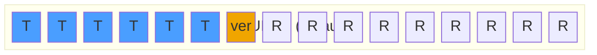

Granit.Guids provides `IGuidGenerator` with three strategies for generating identifiers
optimized for database performance. The default — **UUIDv7** — uses `Guid.CreateVersion7()`
from .NET 9: a standard time-ordered format that appends rows to the last index page
and eliminates B-tree page splits on PostgreSQL, MySQL, and SQL Server 2019+.

## Package

| Package | Role | Depends on |
| ------- | ---- | ---------- |
| `Granit.Guids` | `IGuidGenerator`, UUIDv7 / sequential / random strategies | `Granit.Timing` |

## Setup

```csharp
[DependsOn(typeof(GranitGuidsModule))]
public class AppModule : GranitModule { }
```

## Usage

```csharp
public class PatientService(IGuidGenerator guidGenerator, AppDbContext db)
{
    public Patient Create(string firstName, string lastName)
    {
        return new Patient
        {
            Id = guidGenerator.Create(), // UUIDv7 by default
            FirstName = firstName,
            LastName = lastName,
        };
    }
}
```

## Strategies

Three strategies are available via `GuidStrategy`:

| Strategy | Implementation | When to use |
| -------- | -------------- | ----------- |
| **`UuidV7`** *(default)* | `Guid.CreateVersion7(DateTimeOffset)` | PostgreSQL, MySQL, SQL Server 2019+, any modern DB |
| `Sequential` | `SequentialGuidGenerator` (custom byte layout) | Oracle, pre-2019 SQL Server |
| `Random` | `Guid.NewGuid()` | Public-facing IDs where enumeration must be prevented |

### UUIDv7 layout (RFC 9562)



**T** = 48-bit Unix timestamp (milliseconds), **ver** = version nibble (7), **R** = random.

### Legacy sequential types (`Strategy = Sequential`)

Used when `Strategy = GuidStrategy.Sequential`. The byte layout is tuned per database engine:

| `SequentialGuidType` | Timestamp position | Database |
| -------------------- | ------------------ | -------- |
| `SequentialAsString` | Front (sorted by string representation) | PostgreSQL, MySQL |
| `SequentialAsBinary` | Front (sorted by byte array) | Oracle |
| `SequentialAtEnd` | End (Data4 block) | SQL Server pre-2019 |

## Configuration

```csharp
// Default — UUIDv7, recommended for modern databases
services.AddGranitGuids();

// SQL Server 2019+ — still use UUIDv7
services.AddGranitGuids();

// Oracle — legacy sequential
services.AddGranitGuids(options =>
{
    options.Strategy = GuidStrategy.Sequential;
    options.DefaultSequentialGuidType = SequentialGuidType.SequentialAsBinary;
});

// Pre-2019 SQL Server — legacy sequential
services.AddGranitGuids(options =>
{
    options.Strategy = GuidStrategy.Sequential;
    options.DefaultSequentialGuidType = SequentialGuidType.SequentialAtEnd;
});

// Public-facing IDs — random
services.AddGranitGuids(options =>
{
    options.Strategy = GuidStrategy.Random;
});
```

| Property | Type | Default | Description |
| -------- | ---- | ------- | ----------- |
| `Strategy` | `GuidStrategy` | `UuidV7` | Generator strategy |
| `DefaultSequentialGuidType` | `SequentialGuidType?` | `SequentialAsString` | Byte layout for `Sequential` strategy |

## IGuidGenerator

```csharp
public interface IGuidGenerator
{
    Guid Create();
}
```

All three implementations are singletons. `TryAddSingleton` is used — register a custom
`IGuidGenerator` before calling `AddGranitGuids()` to override the default.

`SimpleGuidGenerator.Instance` is also available as a static instance for
non-DI contexts (domain events, value objects).

## Public API summary

| Category | Key types | Package |
| -------- | --------- | ------- |
| Module | `GranitGuidsModule` | -- |
| Strategies | `GuidStrategy` | `Granit.Guids` |
| Generators | `IGuidGenerator`, `UuidV7GuidGenerator`, `SequentialGuidGenerator`, `SimpleGuidGenerator` | `Granit.Guids` |
| Options | `GuidGeneratorOptions`, `SequentialGuidType` | `Granit.Guids` |
| Extensions | `AddGranitGuids()` | `Granit.Guids` |

## See also

- [Timing module](/dotnet/core/time-provider-clock/) — `TimeProvider` used by `UuidV7GuidGenerator`
- [Persistence module](/dotnet/data/persistence/) — GUIDs as EF Core primary keys
