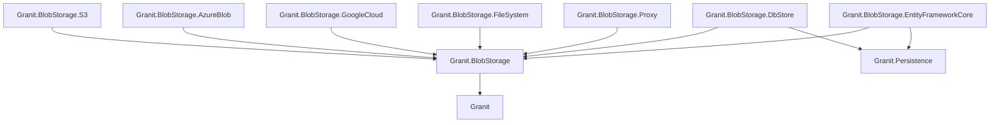
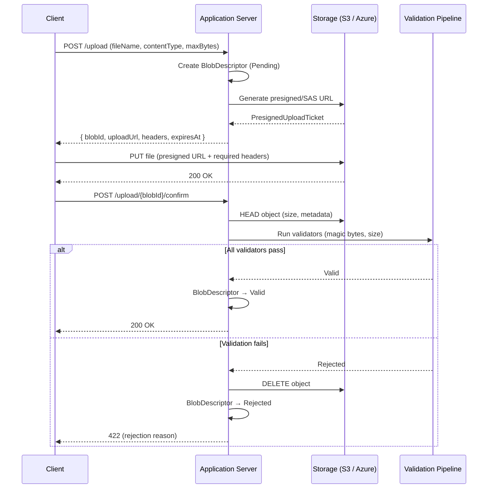
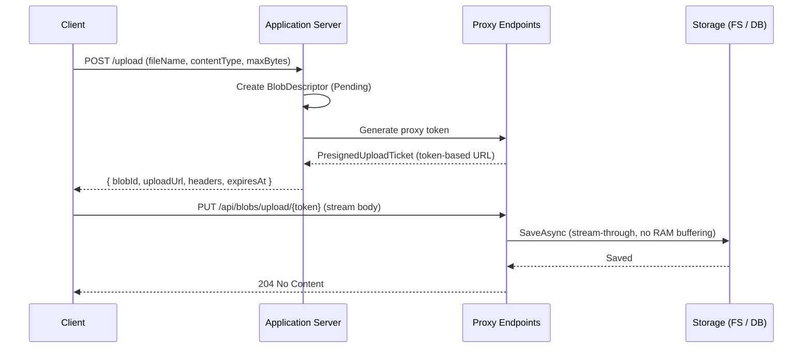
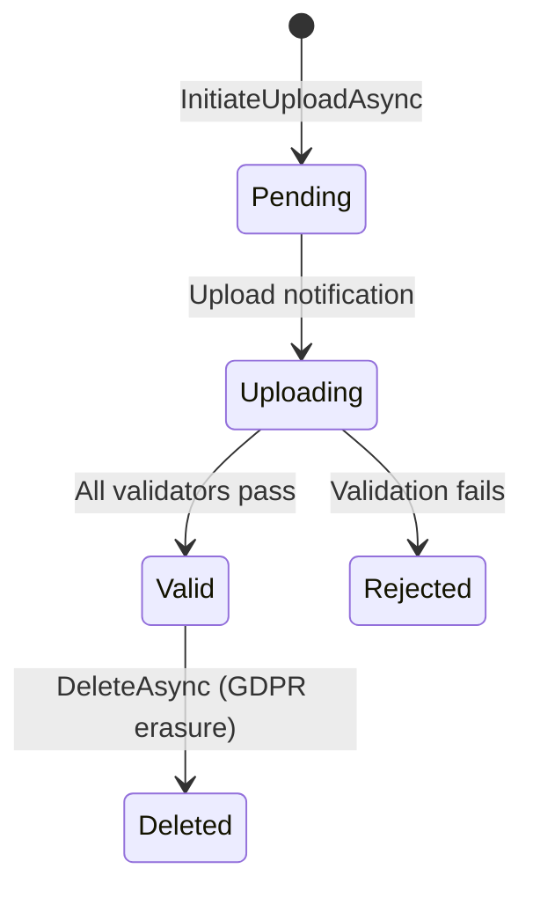

import { Tabs, TabItem, FileTree } from "@astrojs/starlight/components";

Granit.BlobStorage provides a multi-provider blob storage layer with a unified
`IBlobStorage` API. Cloud providers (S3, Azure Blob, Google Cloud Storage) use native presigned URLs for
Direct-to-Cloud uploads where the application server never touches file bytes.
Server-side providers (FileSystem, DbStore) use `Granit.BlobStorage.Proxy` to expose
token-based upload/download endpoints with identical client-side flow. A post-upload
validation pipeline (magic bytes, size) ensures integrity before marking blobs as valid.

## Why Direct-to-Cloud?

Traditional file upload architectures stream bytes through the application server,
which creates several problems at scale:

| Problem | Traditional upload | Granit Direct-to-Cloud |
| ------- | ------------------ | ---------------------- |
| **Server memory** | Entire file buffered in RAM | Server handles only metadata (< 1 KB) |
| **Bandwidth costs** | Bytes transit through your servers twice (in + out) | Client uploads directly to storage; server bandwidth near zero |
| **Horizontal scaling** | Upload throughput limited by server capacity | Unlimited -- storage provider handles all I/O |
| **Timeout risk** | Large uploads blocked by server timeouts | Upload goes directly to storage with its own timeout window |
| **Infrastructure cost** | Need large instances for file processing | Minimal compute -- only metadata and validation |

For cloud providers (S3, Azure Blob), bytes never touch the application server.
For server-side providers (FileSystem, DbStore), `Granit.BlobStorage.Proxy` streams
bytes through thin proxy endpoints without RAM buffering, keeping the architecture
consistent while minimizing server resource usage.

## Package structure

<FileTree>
- Granit.BlobStorage/ Core abstractions, validation pipeline, domain model
  - Granit.BlobStorage.S3 S3 client, native presigned URLs
  - Granit.BlobStorage.AzureBlob Azure Blob Storage client, SAS tokens
  - Granit.BlobStorage.GoogleCloud Google Cloud Storage client, signed URLs
  - Granit.BlobStorage.FileSystem Local file system storage
  - Granit.BlobStorage.DbStore EF Core database storage (small files)
  - Granit.BlobStorage.Proxy Token-based proxy endpoints for server-side providers
  - Granit.BlobStorage.Endpoints Minimal API admin endpoints (upload, confirm, download, delete)
  - Granit.BlobStorage.EntityFrameworkCore Isolated DbContext, EF persistence (metadata)
</FileTree>

| Package | Role | Depends on |
| ------- | ---- | ---------- |
| `Granit.BlobStorage` | `IBlobStorage`, `IBlobValidator`, `BlobDescriptor` domain | `Granit` |
| `Granit.BlobStorage.S3` | S3 native presigned URLs, `PrefixBlobKeyStrategy` | `Granit.BlobStorage` |
| `Granit.BlobStorage.AzureBlob` | Azure Blob SAS tokens, Managed Identity support | `Granit.BlobStorage` |
| `Granit.BlobStorage.GoogleCloud` | Google Cloud Storage signed URLs, Workload Identity support | `Granit.BlobStorage` |
| `Granit.BlobStorage.FileSystem` | Local file system storage, path traversal protection | `Granit.BlobStorage` |
| `Granit.BlobStorage.DbStore` | EF Core database storage (small files, 10 MB default) | `Granit.BlobStorage`, `Granit.Persistence` |
| `Granit.BlobStorage.Proxy` | Token-based proxy endpoints for FileSystem/DbStore | `Granit.BlobStorage` |
| `Granit.BlobStorage.EntityFrameworkCore` | `BlobStorageDbContext`, `EfBlobDescriptorStore` | `Granit.BlobStorage`, `Granit.Persistence` |

## Provider comparison

| Provider | Presigned URLs | Max file size | Use case |
| -------- | -------------- | ------------- | -------- |
| **S3** | Native (AWS SigV4) | Unlimited | Production cloud storage |
| **Azure Blob** | Native (SAS tokens) | Unlimited | Azure-hosted deployments |
| **Google Cloud** | Native (V4 signed URLs) | Unlimited | GCP-hosted deployments |
| **FileSystem** | Via Proxy | Disk capacity | Development, on-premise |
| **DbStore** | Via Proxy | 10 MB (configurable) | Small files, regulated environments |

Cloud providers (S3, Azure, Google Cloud) generate native presigned/SAS/signed URLs -- the application
server never touches file bytes. Server-side providers (FileSystem, DbStore) require
`Granit.BlobStorage.Proxy` which exposes ephemeral token-based endpoints that stream
bytes through to the underlying storage. The client-side upload/download flow is
identical regardless of provider.

## Dependency graph



## Setup

<Tabs>
<TabItem label="S3 (production)">

```csharp
[DependsOn(
    typeof(GranitBlobStorageEntityFrameworkCoreModule),
    typeof(GranitBlobStorageS3Module))]
public class AppModule : GranitModule { }
```

```csharp
builder.AddGranitBlobStorageS3();
builder.AddGranitBlobStorageEntityFrameworkCore(options =>
    options.UseNpgsql(builder.Configuration.GetConnectionString("BlobStorage")));
```

```json
{
  "BlobStorage": {
    "ServiceUrl": "https://s3.eu-west-1.amazonaws.com",
    "AccessKey": "<from-vault>",
    "SecretKey": "<from-vault>",
    "Region": "eu-west-1",
    "DefaultBucket": "myapp-blobs",
    "ForcePathStyle": false,
    "TenantIsolation": "Prefix",
    "UploadUrlExpiry": "00:15:00",
    "DownloadUrlExpiry": "00:05:00"
  }
}
```

</TabItem>
<TabItem label="Azure Blob">

```csharp
[DependsOn(
    typeof(GranitBlobStorageAzureBlobModule),
    typeof(GranitBlobStorageEntityFrameworkCoreModule))]
public class AppModule : GranitModule { }
```

```csharp
builder.AddGranitBlobStorageAzureBlob();
builder.AddGranitBlobStorageEntityFrameworkCore(options =>
    options.UseNpgsql(builder.Configuration.GetConnectionString("BlobStorage")));
```

```json
{
  "BlobStorage": {
    "ConnectionString": "<from-vault>",
    "DefaultContainer": "myapp-blobs",
    "TenantIsolation": "Prefix"
  }
}
```

For Managed Identity (recommended in production), omit `ConnectionString` and set:

```json
{
  "BlobStorage": {
    "UseManagedIdentity": true,
    "ServiceUri": "https://myaccount.blob.core.windows.net",
    "DefaultContainer": "myapp-blobs"
  }
}
```

</TabItem>
<TabItem label="Google Cloud">

```csharp
[DependsOn(
    typeof(GranitBlobStorageEntityFrameworkCoreModule),
    typeof(GranitBlobStorageGoogleCloudModule))]
public class AppModule : GranitModule { }
```

```csharp
builder.AddGranitBlobStorageGoogleCloud();
builder.AddGranitBlobStorageEntityFrameworkCore(options =>
    options.UseNpgsql(builder.Configuration.GetConnectionString("BlobStorage")));
```

```json
{
  "BlobStorage": {
    "ProjectId": "my-gcp-project",
    "DefaultBucket": "myapp-blobs",
    "TenantIsolation": "Prefix",
    "UploadUrlExpiry": "00:15:00",
    "DownloadUrlExpiry": "00:05:00"
  }
}
```

For Workload Identity (recommended in GKE), omit `CredentialFilePath` — Application Default Credentials are used automatically.

</TabItem>
<TabItem label="FileSystem (dev)">

```csharp
[DependsOn(
    typeof(GranitBlobStorageEntityFrameworkCoreModule),
    typeof(GranitBlobStorageFileSystemModule),
    typeof(GranitBlobStorageProxyModule))]
public class AppModule : GranitModule { }
```

```csharp
builder.AddGranitBlobStorageFileSystem();
builder.AddGranitBlobStorageProxy();
builder.AddGranitBlobStorageEntityFrameworkCore(options =>
    options.UseNpgsql(builder.Configuration.GetConnectionString("BlobStorage")));

var app = builder.Build();
app.MapGranitBlobProxy();
```

```json
{
  "BlobStorage": {
    "BasePath": "./blobs",
    "Proxy": {
      "BaseUrl": "https://api.example.com",
      "RoutePrefix": "/api/blobs"
    }
  }
}
```

</TabItem>
<TabItem label="DbStore">

```csharp
[DependsOn(
    typeof(GranitBlobStorageDatabaseModule),
    typeof(GranitBlobStorageEntityFrameworkCoreModule),
    typeof(GranitBlobStorageProxyModule))]
public class AppModule : GranitModule { }
```

```csharp
builder.AddGranitBlobStorageDatabase(options =>
    options.UseNpgsql(builder.Configuration.GetConnectionString("BlobStorage")));
builder.AddGranitBlobStorageProxy();
builder.AddGranitBlobStorageEntityFrameworkCore(options =>
    options.UseNpgsql(builder.Configuration.GetConnectionString("BlobStorage")));

var app = builder.Build();
app.MapGranitBlobProxy();
```

```json
{
  "BlobStorage": {
    "MaxBlobSizeBytes": 10485760,
    "Proxy": {
      "BaseUrl": "https://api.example.com",
      "RoutePrefix": "/api/blobs"
    }
  }
}
```

</TabItem>
<TabItem label="MinIO (dev)">

```csharp
[DependsOn(
    typeof(GranitBlobStorageEntityFrameworkCoreModule),
    typeof(GranitBlobStorageS3Module))]
public class AppModule : GranitModule { }
```

```csharp
builder.AddGranitBlobStorageS3();
builder.AddGranitBlobStorageEntityFrameworkCore(options =>
    options.UseNpgsql(builder.Configuration.GetConnectionString("BlobStorage")));
```

```json
{
  "BlobStorage": {
    "ServiceUrl": "http://localhost:9000",
    "AccessKey": "minioadmin",
    "SecretKey": "minioadmin",
    "Region": "us-east-1",
    "DefaultBucket": "dev-blobs",
    "ForcePathStyle": true
  }
}
```

</TabItem>
</Tabs>

:::caution
Never store `AccessKey`, `SecretKey`, or `ConnectionString` in `appsettings.json`
for production. Inject credentials from `Granit.Vault` with dynamic rotation.
:::

## Presigned upload flow

Cloud providers (S3, Azure) use native presigned URLs. The application server never
touches file bytes:



### Proxy upload flow (FileSystem / DbStore)

Server-side providers use `Granit.BlobStorage.Proxy` which generates ephemeral
token-based URLs. The upload is streamed through the proxy endpoint:



Proxy tokens are single-use, TTL-bound, and backed by `IDistributedCache`.

## IBlobStorage

The primary entry point for blob operations. All operations are scoped to the current
tenant resolved via `ICurrentTenant`.

```csharp
public interface IBlobStorage
{
    Task<PresignedUploadTicket> InitiateUploadAsync(
        string containerName,
        BlobUploadRequest request,
        CancellationToken cancellationToken = default);

    Task<PresignedDownloadUrl> CreateDownloadUrlAsync(
        string containerName,
        Guid blobId,
        DownloadUrlOptions? options = null,
        CancellationToken cancellationToken = default);

    Task<BlobDescriptor?> GetDescriptorAsync(
        string containerName,
        Guid blobId,
        CancellationToken cancellationToken = default);

    Task DeleteAsync(
        string containerName,
        Guid blobId,
        string? deletionReason = null,
        CancellationToken cancellationToken = default);
}
```

### Upload example

```csharp
public class PatientPhotoService(IBlobStorage blobStorage)
{
    public async Task<PresignedUploadTicket> InitiatePhotoUploadAsync(
        string fileName,
        CancellationToken cancellationToken)
    {
        var request = new BlobUploadRequest(
            FileName: fileName,
            ContentType: "image/jpeg",
            MaxAllowedBytes: 10 * 1024 * 1024); // 10 MB

        return await blobStorage.InitiateUploadAsync(
            "patient-photos", request, cancellationToken)
            .ConfigureAwait(false);
    }
}
```

The returned `PresignedUploadTicket` contains everything the frontend needs:

| Property | Description |
| -------- | ----------- |
| `BlobId` | Stable identifier for polling status and requesting downloads |
| `UploadUrl` | Presigned URL (S3/Azure) or proxy token URL (FileSystem/DbStore) |
| `HttpMethod` | Always `"PUT"` |
| `ExpiresAt` | UTC expiry of the presigned URL |
| `RequiredHeaders` | Headers the client must include verbatim (e.g. `Content-Type`) |

### Download example

```csharp
public async Task<PresignedDownloadUrl> GetPhotoDownloadUrlAsync(
    Guid blobId,
    CancellationToken cancellationToken)
{
    return await blobStorage.CreateDownloadUrlAsync(
        "patient-photos",
        blobId,
        new DownloadUrlOptions(DownloadFileName: "patient-photo.jpg"),
        cancellationToken)
        .ConfigureAwait(false);
}
```

Setting `DownloadFileName` injects a `Content-Disposition: attachment; filename="..."` header
into the presigned URL, forcing the browser to download rather than preview.
The filename is sanitized by `ContentDispositionHelper` to strip path traversal sequences
(`../`, `..\\`), null bytes, and non-ASCII control characters.

### GDPR deletion

```csharp
await blobStorage.DeleteAsync(
    "patient-photos",
    blobId,
    deletionReason: "GDPR Art. 17 erasure request",
    cancellationToken);
```

The storage object is physically deleted (crypto-shredding). The `BlobDescriptor` record is
**retained** in the database for the ISO 27001 3-year audit trail.

## BlobDescriptor lifecycle



| Status | Storage object | DB record | Description |
| ------ | -------------- | --------- | ----------- |
| `Pending` | Not yet uploaded | Exists | Upload ticket issued, waiting for client |
| `Uploading` | Uploaded | Exists | Validation pipeline running |
| `Valid` | Present | Exists | Ready for download |
| `Rejected` | Deleted | Retained | Magic bytes or size check failed |
| `Deleted` | Deleted | Retained (3 years) | GDPR Art. 17 crypto-shredding |

## CQRS persistence

Blob descriptor persistence follows the CQRS pattern with separate reader and writer
interfaces. Always inject the specific interface matching your intent:

```csharp
// Read-only: querying blob metadata
public class BlobQueryHandler(IBlobDescriptorReader reader) { }

// Write-only: updating blob state
public class BlobCommandHandler(IBlobDescriptorWriter writer) { }
```

`IBlobDescriptorReader` also provides specialized queries for background jobs:

| Method | Purpose |
| ------ | ------- |
| `FindAsync(blobId)` | Single descriptor by ID |
| `FindOrphanedAsync(cutoff, batchSize)` | Uploads stuck in `Pending`/`Uploading` (orphan cleanup) |
| `FindByContainerBeforeAsync(container, cutoff, batchSize)` | GDPR retention cleanup |

## Validation pipeline

Validators run **after** the file lands on storage. The `BlobValidationContext` provides
partial access (range read for magic bytes, HEAD for metadata) without buffering the
full file in the application server.

### Built-in validators

| Validator | Order | Check |
| --------- | ----- | ----- |
| `ContentTypeAllowlistValidator` | 5 | Rejects blobs whose declared content type is not in `AllowedContentTypes`. No-op when allowlist is empty. |
| `MagicBytesValidator` | 10 | Reads first 261 bytes via range read; compares magic-byte signature against declared `Content-Type`. Detects PDF, JPEG, PNG, GIF, TIFF, DICOM, ZIP. Rejects unverifiable types when `RejectUnverifiedContentTypes` is enabled. |
| `MaxSizeValidator` | 20 | Compares actual size against `MaxAllowedBytes` declared at upload time. |

The pipeline is **fail-fast**: processing stops at the first failing validator.

### Custom validator

Register application-specific validators (e.g. antivirus scanning) via DI:

```csharp
public sealed class AntivirusValidator(IAntivirusClient av) : IBlobValidator
{
    public int Order => 30;

    public async Task<BlobValidationResult> ValidateAsync(
        BlobValidationContext context,
        CancellationToken cancellationToken = default)
    {
        bool isSafe = await av.ScanAsync(
            context.Descriptor.ObjectKey, cancellationToken)
            .ConfigureAwait(false);

        return isSafe
            ? BlobValidationResult.Success()
            : BlobValidationResult.Failure("Malware detected by antivirus scan.");
    }
}
```

```csharp
builder.Services.AddSingleton<IBlobValidator, AntivirusValidator>();
```

## Tenant isolation

All providers use the same tenant-prefixed object key strategy:

```
{tenantId}/{containerName}/{yyyy}/{MM}/{blobId}
```

The date components distribute keys across a wider key-space prefix, reducing
hot-spot partitions on large buckets.

| Strategy | Key format | Isolation level | Provider support |
| -------- | ---------- | --------------- | ---------------- |
| `Prefix` (default) | `{tenantId}/{container}/{yyyy}/{MM}/{blobId}` | Key-prefix | All providers |
| `Container` | `{container}/{yyyy}/{MM}/{blobId}` | One container/bucket per tenant | S3, Azure only |

Single-tenant deployments (no `ICurrentTenant`) omit the tenant prefix:
`{containerName}/{yyyy}/{MM}/{blobId}`.

### Per-provider isolation details

| Provider | Isolation mechanism |
| -------- | ------------------- |
| **S3** | Tenant prefix in S3 object key. `Bucket` strategy uses one S3 bucket per tenant. |
| **Azure Blob** | Tenant prefix in blob name. `Container` strategy uses one Azure container per tenant. |
| **Google Cloud** | Tenant prefix in GCS object name. `Bucket` strategy uses one GCS bucket per tenant. |
| **FileSystem** | Tenant prefix in directory path: `{BasePath}/{tenantId}/...` |
| **DbStore** | Tenant prefix in `ObjectKey` column + `IMultiTenant` EF Core query filter |

## Domain events

`BlobDescriptor` publishes domain events on state transitions:

| Event | Trigger |
| ----- | ------- |
| `BlobValidatedEvent(BlobId, ContainerName, VerifiedContentType, SizeBytes)` | Blob passes all validators |
| `BlobRejectedEvent(BlobId, ContainerName, RejectionReason)` | Validation fails |
| `BlobDeletedEvent(BlobId, ContainerName, DeletionReason)` | GDPR crypto-shredding |

Subscribe via Wolverine handlers to react to blob lifecycle changes (e.g. trigger
image processing after validation, notify the user on rejection).

## Security hardening

### Content type restrictions

`BlobStorageOptions` exposes two properties for restricting accepted content types:

| Property | Default | Description |
| -------- | ------- | ----------- |
| `AllowedContentTypes` | `[]` (allow all) | When non-empty, only blobs with a declared content type in this set are accepted. Case-insensitive. |
| `RejectUnverifiedContentTypes` | `false` | When `true`, the magic-byte validator rejects files whose binary signature cannot be verified. |

```json
{
  "BlobStorage": {
    "AllowedContentTypes": ["application/pdf", "image/jpeg", "image/png"],
    "RejectUnverifiedContentTypes": true
  }
}
```

The `ContentTypeAllowlistValidator` (Order 5) runs before magic-byte validation and
rejects any blob whose declared content type is not in the allowlist. When the allowlist
is empty, all content types are accepted (default behavior).

## Health check

```csharp
builder.Services.AddHealthChecks()
    .AddGranitS3HealthCheck();
```

Verifies S3 connectivity by listing one object in the default bucket (`ListObjectsV2`
with `MaxKeys=1`). Tagged `["readiness", "startup"]`. Returns Unhealthy on access
denied or unreachable endpoint. Error messages are sanitized — credentials, bucket
names, and endpoint URLs are never exposed.

### Google Cloud Storage

```csharp
builder.Services.AddHealthChecks()
    .AddGranitGoogleCloudStorageHealthCheck();
```

Verifies GCS connectivity by listing one object in the default bucket. Tagged
`["readiness", "startup"]`. Returns Unhealthy on access denied or unreachable endpoint.

## Configuration reference

<Tabs>
<TabItem label="S3">

```json
{
  "BlobStorage": {
    "ServiceUrl": "https://s3.eu-west-1.amazonaws.com",
    "AccessKey": "<from-vault>",
    "SecretKey": "<from-vault>",
    "Region": "eu-west-1",
    "DefaultBucket": "myapp-blobs",
    "ForcePathStyle": false,
    "TenantIsolation": "Prefix",
    "UploadUrlExpiry": "00:15:00",
    "DownloadUrlExpiry": "00:05:00"
  }
}
```

| Property | Default | Description |
| -------- | ------- | ----------- |
| `ServiceUrl` | -- | S3-compatible endpoint URL (required) |
| `AccessKey` | -- | S3 access key (required, inject from Vault) |
| `SecretKey` | -- | S3 secret key (required, inject from Vault) |
| `Region` | `"us-east-1"` | S3 region for request signing |
| `DefaultBucket` | -- | S3 bucket name (required) |
| `ForcePathStyle` | `true` | Path-style URLs (`host/bucket/key`); required for MinIO |
| `TenantIsolation` | `Prefix` | `Prefix` (shared bucket) or `Bucket` (one per tenant) |

</TabItem>
<TabItem label="Azure Blob">

```json
{
  "BlobStorage": {
    "ConnectionString": "<from-vault>",
    "DefaultContainer": "myapp-blobs",
    "TenantIsolation": "Prefix"
  }
}
```

| Property | Default | Description |
| -------- | ------- | ----------- |
| `ConnectionString` | -- | Azure Storage connection string (from Vault) |
| `DefaultContainer` | -- | Default blob container name (required) |
| `UseManagedIdentity` | `false` | Use Azure Managed Identity instead of connection string |
| `ServiceUri` | -- | Storage account URI (required when `UseManagedIdentity = true`) |
| `TenantIsolation` | `Prefix` | `Prefix` (shared container) or `Container` (one per tenant) |

</TabItem>
<TabItem label="Google Cloud">

```json
{
  "BlobStorage": {
    "ProjectId": "my-gcp-project",
    "DefaultBucket": "myapp-blobs",
    "CredentialFilePath": null,
    "TenantIsolation": "Prefix"
  }
}
```

| Property | Default | Description |
| -------- | ------- | ----------- |
| `ProjectId` | -- | GCP project ID (required) |
| `DefaultBucket` | -- | Default GCS bucket name (required) |
| `CredentialFilePath` | `null` | Service account key JSON; ADC when null (Workload Identity) |
| `TenantIsolation` | `Prefix` | `Prefix` (shared bucket) or `Bucket` (one per tenant) |

</TabItem>
<TabItem label="FileSystem">

```json
{
  "BlobStorage": {
    "BasePath": "./blobs"
  }
}
```

| Property | Default | Description |
| -------- | ------- | ----------- |
| `BasePath` | -- | Root directory for blob storage (required) |

</TabItem>
<TabItem label="DbStore">

```json
{
  "BlobStorage": {
    "MaxBlobSizeBytes": 10485760
  }
}
```

| Property | Default | Description |
| -------- | ------- | ----------- |
| `MaxBlobSizeBytes` | `10485760` (10 MB) | Maximum blob size accepted by the provider |

</TabItem>
<TabItem label="Proxy">

```json
{
  "BlobStorage": {
    "Proxy": {
      "BaseUrl": "https://api.example.com",
      "RoutePrefix": "/api/blobs",
      "MaxUploadBytes": 104857600
    }
  }
}
```

| Property | Default | Description |
| -------- | ------- | ----------- |
| `BaseUrl` | -- | Public URL of the API server (required) |
| `RoutePrefix` | `"/api/blobs"` | Route prefix for proxy endpoints |
| `MaxUploadBytes` | `104857600` (100 MB) | Maximum upload size through proxy |

</TabItem>
</Tabs>

### Common options (all providers)

| Property | Default | Description |
| -------- | ------- | ----------- |
| `UploadUrlExpiry` | `00:15:00` | Presigned upload URL / proxy token TTL |
| `DownloadUrlExpiry` | `00:05:00` | Presigned download URL / proxy token TTL |
| `AllowedContentTypes` | `[]` | Content type allowlist (empty = allow all) |
| `RejectUnverifiedContentTypes` | `false` | Reject files with unverifiable magic bytes |

## Public API summary

| Category | Key types | Package |
| -------- | --------- | ------- |
| Module | `GranitBlobStorageModule`, `GranitBlobStorageS3Module`, `GranitBlobStorageAzureBlobModule`, `GranitBlobStorageGoogleCloudModule`, `GranitBlobStorageFileSystemModule`, `GranitBlobStorageDatabaseModule`, `GranitBlobStorageProxyModule`, `GranitBlobStorageEntityFrameworkCoreModule` | -- |
| Storage | `IBlobStorage`, `IBlobKeyStrategy` | `Granit.BlobStorage` |
| Persistence (CQRS) | `IBlobDescriptorReader`, `IBlobDescriptorWriter`, `IBlobDescriptorStore` | `Granit.BlobStorage` |
| Domain | `BlobDescriptor`, `BlobStatus`, `BlobUploadRequest` | `Granit.BlobStorage` |
| Presigned URLs | `PresignedUploadTicket`, `PresignedDownloadUrl`, `DownloadUrlOptions` | `Granit.BlobStorage` |
| Validation | `IBlobValidator`, `BlobValidationResult`, `BlobValidationContext`, `MagicBytesValidator`, `MaxSizeValidator` | `Granit.BlobStorage` |
| Events | `BlobValidatedEvent`, `BlobRejectedEvent`, `BlobDeletedEvent` | `Granit.BlobStorage` |
| S3 options | `S3BlobOptions`, `BlobTenantIsolation` | `Granit.BlobStorage.S3` |
| Azure options | `AzureBlobOptions` | `Granit.BlobStorage.AzureBlob` |
| Google Cloud options | `GoogleCloudStorageOptions` | `Granit.BlobStorage.GoogleCloud` |
| FileSystem options | `FileSystemBlobOptions` | `Granit.BlobStorage.FileSystem` |
| Database options | `DatabaseBlobOptions` | `Granit.BlobStorage.Database` |
| Proxy options | `ProxyBlobOptions` | `Granit.BlobStorage.Proxy` |
| Extensions | `AddGranitBlobStorageS3()`, `AddGranitBlobStorageAzureBlob()`, `AddGranitBlobStorageGoogleCloud()`, `AddGranitBlobStorageFileSystem()`, `AddGranitBlobStorageDatabase()`, `AddGranitBlobStorageProxy()`, `AddGranitBlobStorageEntityFrameworkCore()`, `MapGranitBlobProxy()` | -- |

## See also

- [Blob Storage Endpoints](/dotnet/api/blob-storage-endpoints/) -- Admin API (upload, confirm, download, delete, cleanup)
- [Configure blob storage](/dotnet/guides/configure-blob-storage/) -- Step-by-step guide
- [Pre-signed URL pattern](/dotnet/architecture/patterns/pre-signed-url/) -- Architectural pattern
- [Imaging module](/dotnet/data/imaging/) -- Image processing pipeline, WebP/AVIF, EXIF stripping
- [Persistence module](/dotnet/data/persistence/) -- EF Core interceptors, query filters
- [Privacy module](/dotnet/compliance/privacy/) -- GDPR compliance patterns
- [Background Jobs module](/dotnet/infrastructure/background-jobs/) -- Orphan cleanup, retention jobs
