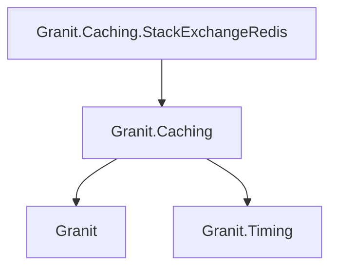
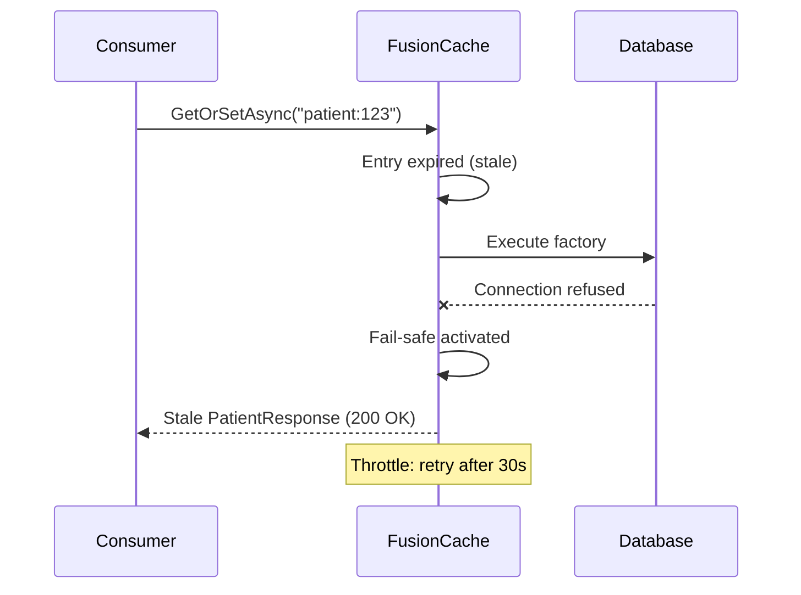
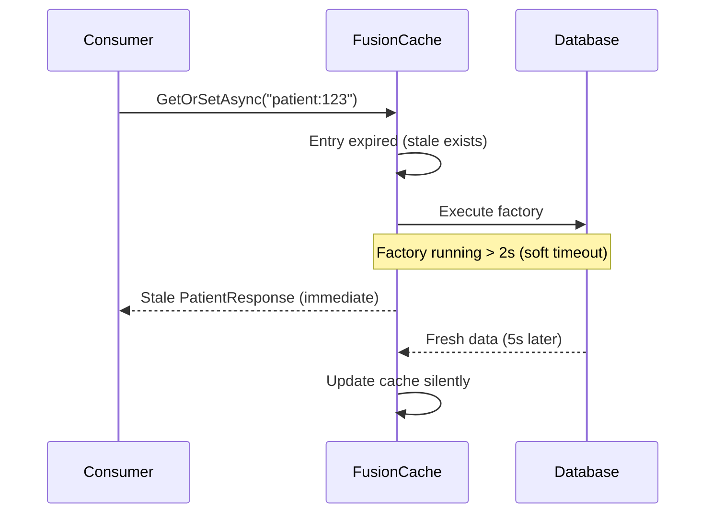
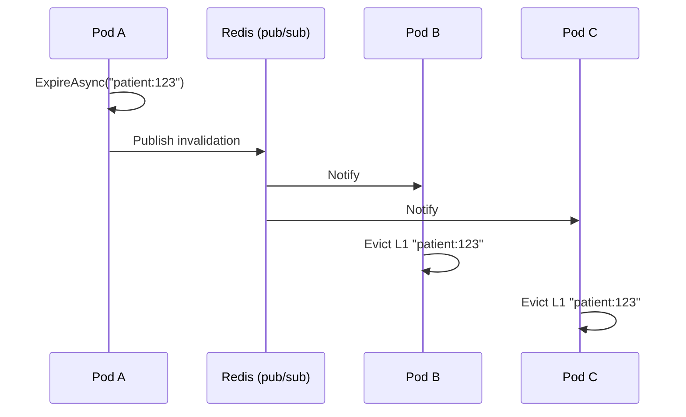

import { Tabs, TabItem, FileTree, Badge } from "@astrojs/starlight/components";

Granit.Caching integrates [FusionCache](https://github.com/ZiggyCreatures/FusionCache) as the
caching layer. Consumers inject `IFusionCache` directly — there is no custom abstraction.
Out of the box you get L1 in-memory cache with fail-safe (stale-on-error), soft/hard factory
timeouts, eager background refresh, stampede protection, and native OpenTelemetry metrics.
Add the Redis package for L2 distributed cache with AES-256 encryption and a pub/sub backplane
for real-time cross-pod L1 invalidation.

## Package structure

<FileTree>
- Granit.Caching/ FusionCache L1 in-memory, fail-safe, encryption, OTel
  - Granit.Caching.StackExchangeRedis/ Redis L2 + backplane + health check
</FileTree>

| Package | Role | Depends on |
|---------|------|------------|
| `Granit.Caching` | `IFusionCache` with L1 in-memory, fail-safe, factory timeouts, eager refresh, `EncryptingFusionCacheSerializer`, OpenTelemetry | `Granit`, `Granit.Timing` |
| `Granit.Caching.StackExchangeRedis` | Redis L2 distributed cache, Redis pub/sub backplane, AES-256 encryption, health check | `Granit.Caching` |

## Dependency graph



## Setup

<Tabs>
<TabItem label="Development (in-memory)">

```csharp
[DependsOn(typeof(GranitCachingModule))]
public class AppModule : GranitModule { }
```

No configuration needed. L1 in-memory cache with fail-safe and factory timeouts enabled
by default. Uses `MemoryDistributedCache` as a no-op L2 backend.

</TabItem>
<TabItem label="Production (Redis L2 + backplane)">

```csharp
[DependsOn(typeof(GranitCachingStackExchangeRedisModule))]
public class AppModule : GranitModule { }
```

```json
{
  "Cache": {
    "KeyPrefix": "myapp",
    "EncryptValues": true,
    "Encryption": {
      "Key": "<base64-aes256-key-from-vault>"
    },
    "Redis": {
      "Configuration": "redis-service:6379,password=secret,ssl=true",
      "InstanceName": "myapp:"
    }
  }
}
```

`GranitCachingStackExchangeRedisModule` upgrades the FusionCache instance registered by `GranitCachingModule`
with L2 Redis and a Redis pub/sub backplane. It also enables AES-256 encryption when
`EncryptValues` is `true`.

</TabItem>
</Tabs>

## Quick start

Inject `IFusionCache` (from `ZiggyCreatures.Caching.Fusion`) and use the FusionCache API
directly. No custom abstraction layer.

```csharp
using ZiggyCreatures.Caching.Fusion;

public sealed class PatientService(IFusionCache cache, AppDbContext db)
{
    public async Task<PatientResponse?> GetAsync(
        Guid id, CancellationToken cancellationToken)
    {
        return await cache.GetOrSetAsync<PatientResponse>(
            $"patient:{id}",
            async (ctx, ct) =>
            {
                var patient = await db.Patients
                    .Where(p => p.Id == id)
                    .Select(p => new PatientResponse(p.Id, p.FullName, p.DateOfBirth))
                    .FirstOrDefaultAsync(ct)
                    .ConfigureAwait(false);

                return patient!;
            },
            token: cancellationToken).ConfigureAwait(false);
    }

    public async Task InvalidateAsync(
        Guid id, CancellationToken cancellationToken)
    {
        // Mark stale — fail-safe keeps the entry as fallback
        await cache.ExpireAsync($"patient:{id}", token: cancellationToken)
            .ConfigureAwait(false);
    }
}
```

### Common API methods

| Method | Purpose |
|--------|---------|
| `GetOrSetAsync<T>(key, factory, options?, token:)` | Get from cache or populate via factory |
| `GetOrDefaultAsync<T>(key, token:)` | Get only, returns `default(T)` on miss |
| `SetAsync<T>(key, value, options?, token:)` | Store a value directly |
| `ExpireAsync(key, token:)` | Mark stale (fail-safe keeps it as fallback) |
| `RemoveAsync(key, token:)` | Delete completely (no fail-safe fallback) |
| `TryGetAsync<T>(key, token:)` | Returns `MaybeValue<T>` (check `.HasValue`) |

:::tip
Prefer `ExpireAsync` over `RemoveAsync` for cache invalidation. `ExpireAsync` marks the entry
as stale but keeps it available as a fail-safe fallback if the next factory call fails.
`RemoveAsync` deletes the entry entirely, removing the safety net.
:::

## Configuration

### CachingOptions (`Cache` section)

| Property | Default | Description |
|----------|---------|-------------|
| `KeyPrefix` | `"dd"` | Global key prefix. FusionCache keys become `{KeyPrefix}:{userKey}` |
| `DefaultAbsoluteExpirationRelativeToNow` | `01:00:00` | Default TTL (mapped to FusionCache `Duration`) |
| `DefaultSlidingExpiration` | `00:20:00` | Default sliding expiration |
| `EncryptValues` | `false` | Enable AES-256 encryption on L2 (Redis) serialization |
| `JsonOptions` | `null` | Custom `System.Text.Json` serializer options |

### CacheEncryptionOptions (`Cache:Encryption` section)

| Property | Default | Description |
|----------|---------|-------------|
| `Key` | -- | AES-256 encryption key (base64-encoded, 32 bytes) |

### FusionCachingOptions (`Cache:FusionCache` section)

| Property | Default | Description |
|----------|---------|-------------|
| `FailSafeIsEnabled` | `true` | Enable fail-safe (stale-on-error) |
| `FailSafeMaxDuration` | `02:00:00` | Maximum duration to keep fail-safe entries |
| `FailSafeThrottleDuration` | `00:00:30` | Minimum interval between fail-safe activations for the same key |
| `FactorySoftTimeout` | `00:00:02` | Soft timeout — return stale data if factory is slow |
| `FactoryHardTimeout` | `00:00:10` | Hard timeout — abandon factory execution |
| `EagerRefreshThreshold` | `0.8` | Fraction of TTL at which background refresh triggers (0 = disabled) |
| `BackplaneChannelPrefix` | `"granit:fc"` | Redis pub/sub channel prefix for backplane notifications |

### RedisCachingOptions (`Cache:Redis` section)

| Property | Default | Description |
|----------|---------|-------------|
| `IsEnabled` | `true` | Enable/disable Redis module (useful for dev override) |
| `Configuration` | `"localhost:6379"` | StackExchange.Redis connection string |
| `InstanceName` | `"dd:"` | Redis key prefix for app isolation |

### Full configuration example

```json
{
  "Cache": {
    "KeyPrefix": "myapp",
    "DefaultAbsoluteExpirationRelativeToNow": "01:00:00",
    "EncryptValues": true,
    "Encryption": {
      "Key": "<base64-aes256-key>"
    },
    "FusionCache": {
      "FailSafeIsEnabled": true,
      "FailSafeMaxDuration": "02:00:00",
      "FailSafeThrottleDuration": "00:00:30",
      "FactorySoftTimeout": "00:00:02",
      "FactoryHardTimeout": "00:00:10",
      "EagerRefreshThreshold": 0.8,
      "BackplaneChannelPrefix": "granit:fc"
    },
    "Redis": {
      "IsEnabled": true,
      "Configuration": "redis-service:6379,password=secret,ssl=true",
      "InstanceName": "myapp:"
    }
  }
}
```

## Fail-safe

Fail-safe keeps expired entries as a temporary fallback when the factory (database query,
HTTP call) fails or times out. Instead of propagating a 500 error to the user, FusionCache
serves the last known good value.



Fail-safe is enabled by default (`FailSafeIsEnabled = true`). The `FailSafeMaxDuration`
(default 2 hours) controls how long stale entries are kept. The `FailSafeThrottleDuration`
(default 30 seconds) prevents retry storms by spacing out factory re-executions.

## Factory timeouts

Factory timeouts protect the HTTP request pipeline from slow downstream calls:

- **Soft timeout** (default 2 seconds): if the factory is still running and a stale value
  exists, return the stale value immediately. The factory continues in the background and
  updates the cache when it completes.
- **Hard timeout** (default 10 seconds): if the factory exceeds this limit, it is abandoned
  regardless of stale data availability.



:::note
Soft timeout only works when a stale entry exists (fail-safe must be enabled). On a true
cache miss with no prior value, the request waits for the factory up to the hard timeout.
:::

## Eager refresh

When `EagerRefreshThreshold` is set (default 0.8 = 80%), FusionCache triggers a background
refresh when a request arrives after 80% of the TTL has elapsed. The current (still valid)
value is returned immediately while the factory runs in the background.

With a 1-hour TTL and 0.8 threshold, any request arriving after 48 minutes triggers a
background refresh. Consumers never see expired data under normal traffic patterns.

Set `EagerRefreshThreshold` to `0` to disable eager refresh.

## Backplane

In multi-pod Kubernetes deployments, each pod has its own L1 in-memory cache. Without
coordination, invalidating a cache entry on pod A leaves pods B and C serving stale L1 data.

The Redis backplane solves this via pub/sub notifications:



The backplane is automatically enabled when `GranitCachingStackExchangeRedisModule` is loaded. The
`BackplaneChannelPrefix` (default `"granit:fc"`) is used as the Redis pub/sub channel prefix.
FusionCache auto-recovery ensures that transient Redis disconnections do not lose invalidation
messages — they are replayed when the connection is restored.

## Encryption

`EncryptingFusionCacheSerializer` is a decorator around the SystemTextJson serializer that
applies AES-256-GCM authenticated encryption to all L2 (Redis) traffic. L1 in-memory cache
stores plain .NET objects — same threat model as `IMemoryCache`.

| Layer | Storage | Encrypted |
|-------|---------|-----------|
| L1 | In-memory (per pod) | No (plain .NET objects) |
| L2 | Redis (shared) | Yes (when `EncryptValues = true`) |

Encryption is activated by setting `CachingOptions.EncryptValues = true` and providing
an AES-256 key in `CacheEncryptionOptions.Key`. The `GranitCachingStackExchangeRedisModule` replaces
the no-op `NullCacheValueEncryptor` with `AesCacheValueEncryptor` at startup.

Each encryption operation generates a random 12-byte nonce and produces a 16-byte
authentication tag. Ciphertext format: `[12B nonce][16B tag][NB ciphertext]`.
Tampered values are detected and rejected via the GCM tag.

:::caution
The encryption key must be exactly 32 bytes (256 bits) when base64-decoded. In production,
load the key from a secret manager (Vault, Azure Key Vault) via environment variables.
Never commit encryption keys to source control.
:::

## OpenTelemetry

FusionCache emits native OpenTelemetry metrics under the `ZiggyCreatures.FusionCache` meter.
Key metrics include:

| Metric | Description |
|--------|-------------|
| `fusioncache.cache.hit` | Cache hits (L1 and L2) |
| `fusioncache.cache.miss` | Cache misses |
| `fusioncache.cache.stale_hit` | Fail-safe activations (stale data served) |
| `fusioncache.cache.set` | Cache writes |
| `fusioncache.cache.remove` | Cache removals |
| `fusioncache.factory.synthetic_timeout` | Factory soft timeout activations |
| `fusioncache.cache.expire` | Expire (mark stale) operations |
| `fusioncache.backplane.message_published` | Backplane notifications sent |
| `fusioncache.backplane.message_received` | Backplane notifications received |

No additional configuration is needed — FusionCache automatically integrates with
the OpenTelemetry SDK when it is registered in the application.

## Cache invalidation

Use `ExpireAsync` to mark cache entries as stale. This preserves the fail-safe fallback
while ensuring the next access triggers a fresh factory execution.

### Pattern: Wolverine event handler

Granit modules use Wolverine message handlers for cache invalidation. When a domain event
is raised (e.g., permission grant changed), the handler expires the corresponding cache key:

```csharp
using ZiggyCreatures.Caching.Fusion;

public static class PermissionCacheInvalidationHandler
{
    public static async Task HandleAsync(
        PermissionGrantChangedEvent @event,
        IFusionCache cache,
        CancellationToken cancellationToken)
    {
        string key = PermissionChecker.BuildCacheKey(
            @event.TenantId, @event.RoleName, @event.PermissionName);
        await cache.ExpireAsync(key, token: cancellationToken)
            .ConfigureAwait(false);
    }
}
```

This pattern is used across Authorization, Features, Settings, Localization, and
ReferenceData modules.

:::caution[ExpireAsync vs RemoveAsync]
`ExpireAsync` marks the entry as stale but keeps it in cache. On the next access, FusionCache
executes the factory. If the factory fails, fail-safe returns the stale value (resilience).

`RemoveAsync` deletes the entry completely. On the next access, if the factory fails, there
is no fallback — the error propagates to the consumer.

**Use `ExpireAsync` by default.** Only use `RemoveAsync` when stale data is actively harmful
(e.g., revoked security tokens).
:::

## Redis health check

```csharp
builder.Services.AddHealthChecks()
    .AddGranitRedisHealthCheck(degradedThreshold: TimeSpan.FromMilliseconds(100));
```

| Latency | Status | Effect |
|---------|--------|--------|
| < 100 ms | Healthy | Normal |
| >= 100 ms | Degraded | Pod stays in load balancer |
| Unreachable | Unhealthy | Pod removed from load balancer |

Tagged `["readiness", "startup"]` — integrates with Kubernetes readiness probes.

## Public API summary

| Category | Key types | Package |
|----------|-----------|---------|
| Modules | `GranitCachingModule`, `GranitCachingStackExchangeRedisModule` | -- |
| Cache interface | `IFusionCache` (from ZiggyCreatures.FusionCache) | `Granit.Caching` |
| Encryption | `ICacheValueEncryptor`, `AesCacheValueEncryptor`, `EncryptingFusionCacheSerializer` | `Granit.Caching` |
| Options | `CachingOptions`, `CacheEncryptionOptions`, `FusionCachingOptions`, `RedisCachingOptions` | -- |
| Extensions | `AddGranitCaching()`, `AddGranitCachingRedis()`, `AddGranitRedisHealthCheck()` | -- |
| Health check | `RedisHealthCheck` | `Granit.Caching.StackExchangeRedis` |

## When to use — and when not to

Use Granit.Caching when:

- You need **L1 + L2 caching** with fail-safe resilience and factory timeouts
- You run **multiple pods** and need a **backplane** for real-time cross-pod L1 invalidation
- You store **GDPR-sensitive data** in Redis and need **AES-256 encryption** at rest
- You want **native OpenTelemetry metrics** for cache observability
- You need **stampede protection** (one factory execution per key under concurrent requests)

Skip it when:

- You only cache **a handful of values** in a single-pod app — `IMemoryCache` is simpler
- Your cache values are **never shared** across requests — a local variable is enough
- You need **full-text search** or **complex querying** on cached data — Redis is a cache, not a database

## Common pitfalls

:::caution[Redis connection string in production]
The default `localhost:6379` is for development. In production, always configure
`Redis.Configuration` with authentication, TLS, and connection timeout. A missing Redis in
production degrades gracefully (FusionCache continues with L1 only) but you lose L2 persistence
and backplane notifications.
:::

:::caution[Encryption applies to L2 only]
`EncryptValues` encrypts data serialized to Redis (L2). The L1 in-memory cache stores plain
.NET objects and is not encrypted. This matches the threat model: L1 lives in the same process
memory as the application, while L2 is on a shared network resource.
:::

:::caution[Key prefix coordination]
`CachingOptions.KeyPrefix` is prepended to all FusionCache keys as `{KeyPrefix}:`. Ensure all
pods of the same application use the same prefix. Different applications sharing a Redis instance
must use different prefixes to avoid key collisions.
:::

## See also

- [ADR-018: FusionCache](/dotnet/architecture/adr/018-fusioncache-caching-provider/) -- Why FusionCache was chosen as the caching provider
- [ADR-002: Redis](/dotnet/architecture/adr/002-redis/) -- Why Redis was chosen as the distributed cache backend
- [FusionCache documentation](https://github.com/ZiggyCreatures/FusionCache/blob/main/docs/README.md) -- Official FusionCache docs
- [Persistence module](/dotnet/data/persistence/) -- EF Core interceptors, query filters
- [API Reference](/api/Granit.Caching.html) (auto-generated from XML docs)
