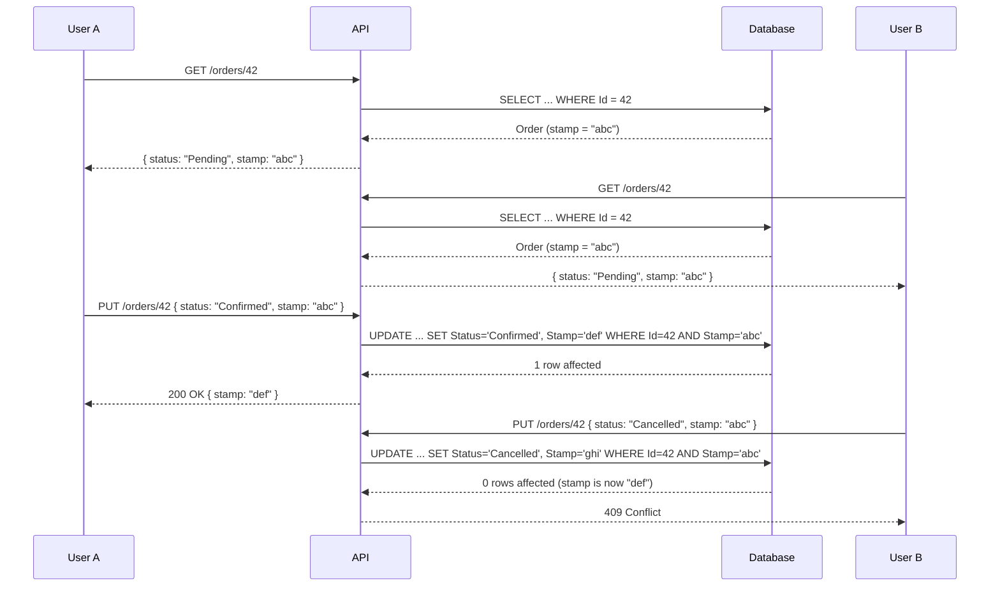

import { Tabs, TabItem } from "@astrojs/starlight/components";

Two users open the same order. Both change the status. Both click Save. Without
concurrency control, the last write wins and the first change is silently lost.
With `IConcurrencyAware`, the second save fails with HTTP 409 Conflict — the user
can review the updated data and retry.

## How it works



EF Core includes the `ConcurrencyStamp` in the `WHERE` clause of every `UPDATE`.
If the stamp in the database differs from the value EF loaded, zero rows are affected
and EF throws `DbUpdateConcurrencyException`. Granit maps this to HTTP 409 Conflict
automatically.

## Setup

No additional registration needed. `IConcurrencyAware` support is built into
`Granit.Persistence` — already activated by `AddGranitPersistence()` and
`ApplyGranitConventions()`.

The three components:

| Component | Role | Package |
|-----------|------|---------|
| `IConcurrencyAware` | Entity interface with `ConcurrencyStamp` property | `Granit` |
| `ConcurrencyStampInterceptor` | Regenerates stamp on every `SaveChanges` | `Granit.Persistence` |
| `ApplyGranitConventions()` | Configures `.IsConcurrencyToken()` automatically | `Granit.Persistence` |
| `EfCoreExceptionStatusCodeMapper` | Maps `DbUpdateConcurrencyException` to 409 | `Granit.Persistence` |

## Adding concurrency to an entity

Implement `IConcurrencyAware` on any entity that needs protection:

```csharp
public class Order : AuditedEntity, IConcurrencyAware
{
    public string Reference { get; set; } = string.Empty;
    public OrderStatus Status { get; set; }
    public decimal TotalAmount { get; set; }

    // Auto-managed by ConcurrencyStampInterceptor
    public string ConcurrencyStamp { get; set; } = string.Empty;
}
```

That's it. No Fluent API, no attributes, no manual interceptor wiring.
`ApplyGranitConventions()` auto-discovers all `IConcurrencyAware` entities and
configures `ConcurrencyStamp` as `VARCHAR(36)` with `.IsConcurrencyToken()`.

## Interceptor pipeline

`ConcurrencyStampInterceptor` runs in the standard pipeline:

| Order | Interceptor | Action |
|-------|-------------|--------|
| 1 | `AuditedEntityInterceptor` | Sets audit fields |
| 2 | `VersioningInterceptor` | Sets version number |
| **3** | **`ConcurrencyStampInterceptor`** | **Regenerates `ConcurrencyStamp`** |
| 4 | `DomainEventDispatcherInterceptor` | Collects domain events |
| 5 | `SoftDeleteInterceptor` | Converts DELETE to soft delete |

On `EntityState.Added`: sets the initial stamp (new GUID string).
On `EntityState.Modified`: regenerates the stamp (new GUID string).

## Endpoint patterns

### Response DTO — include the stamp

```csharp
public sealed record OrderResponse(
    Guid Id,
    string Reference,
    OrderStatus Status,
    decimal TotalAmount,
    string ConcurrencyStamp);
```

### Request DTO — accept the stamp back

Use `IConcurrencyStampRequest` as a convention:

```csharp
public sealed record UpdateOrderRequest(
    OrderStatus Status,
    string ConcurrencyStamp) : IConcurrencyStampRequest;
```

### Connected update (same DbContext)

When the entity is loaded from the same `DbContext`, EF Core tracks `OriginalValue`
automatically:

```csharp
app.MapPut("/orders/{id:guid}", async (
    Guid id,
    UpdateOrderRequest request,
    AppDbContext db,
    CancellationToken ct) =>
{
    Order? order = await db.Orders.FindAsync([id], ct);
    if (order is null)
        return TypedResults.NotFound();

    order.Status = request.Status;
    await db.SaveChangesAsync(ct); // stamp checked automatically
    return TypedResults.Ok(order.ToResponse());
})
.Produces<OrderResponse>()
.ProducesProblem(StatusCodes.Status409Conflict);
```

### Disconnected update (CQRS / new DbContext)

When the entity was not loaded by the current `DbContext`, you must set the
`OriginalValue` explicitly so EF Core knows what the client believes the stamp is:

```csharp
app.MapPut("/orders/{id:guid}", async (
    Guid id,
    UpdateOrderRequest request,
    AppDbContext db,
    CancellationToken ct) =>
{
    Order? order = await db.Orders.FindAsync([id], ct);
    if (order is null)
        return TypedResults.NotFound();

    order.Status = request.Status;

    // Tell EF Core what the client believes the current stamp is
    db.Entry(order).Property(e => e.ConcurrencyStamp).OriginalValue
        = request.ConcurrencyStamp;

    await db.SaveChangesAsync(ct);
    return TypedResults.Ok(order.ToResponse());
})
.Produces<OrderResponse>()
.ProducesProblem(StatusCodes.Status409Conflict);
```

:::caution[Always set OriginalValue in disconnected scenarios]
Without setting `OriginalValue`, EF Core compares the stamp against itself (current
DB value = original value) and the check always passes. The concurrency protection
is silently disabled.
:::

## Error handling

`EfCoreExceptionStatusCodeMapper` automatically maps `DbUpdateConcurrencyException`
to HTTP 409 Conflict with RFC 7807 `ProblemDetails`:

```json
{
  "type": "https://tools.ietf.org/html/rfc7231#section-6.5.8",
  "title": "Conflict",
  "status": 409,
  "detail": "The resource was modified by another request. Reload and retry."
}
```

No custom exception handling needed — the Granit exception middleware handles it.

### Client-side retry guidance

API consumers should implement this pattern:

1. **GET** the resource (receive `ConcurrencyStamp` in response)
2. **PUT/PATCH** with the stamp
3. If **409**: re-GET, show updated data to the user, let them retry
4. If **200**: success, update the local stamp

:::tip[Automated retry for non-interactive operations]
For background jobs or automated integrations, implement exponential backoff:
re-fetch, re-apply changes, re-submit. Limit to 3 retries.
:::

## When to use IConcurrencyAware

| Use case | Recommendation |
|----------|---------------|
| Orders, payments, invoices | **Yes** — financial data loss is unacceptable |
| Appointments, bookings | **Yes** — double-booking from concurrent edits |
| Shared configuration | **Yes** — admin panels with multiple operators |
| Inventory, stock levels | **Yes** — concurrent decrements cause overselling |
| User profiles | **Maybe** — low conflict probability, but protects against rare edge cases |
| Read-only / append-only entities | **No** — no concurrent writes to conflict |
| Audit log entries | **No** — immutable, never updated |

The overhead is negligible: one `VARCHAR(36)` column and one `WHERE` clause
parameter per update.

## Testing

Use SQLite for concurrency tests — the EF Core InMemory provider does not enforce
concurrency tokens.

```csharp
[Fact]
public async Task Concurrent_update_throws_DbUpdateConcurrencyException()
{
    // Arrange — create entity via context1
    using var factory = new SqliteDbContextFactory<OrderDbContext>();
    using OrderDbContext context1 = factory.CreateContext();
    Order order = new() { Reference = "ORD-001" };
    context1.Orders.Add(order);
    await context1.SaveChangesAsync();

    // Load same entity in context2 (EF tracks OriginalValue automatically)
    using OrderDbContext context2 = factory.CreateContext(ensureCreated: false);
    Order? sameOrder = await context2.Orders.FindAsync(order.Id);

    // Modify and save via context1 — stamp changes in DB
    order.Status = OrderStatus.Confirmed;
    await context1.SaveChangesAsync();

    // Act — context2 still has the old stamp
    sameOrder!.Status = OrderStatus.Cancelled;

    // Assert
    await Should.ThrowAsync<DbUpdateConcurrencyException>(
        () => context2.SaveChangesAsync());
}
```

:::caution[EF Core InMemory does not work]
`UseInMemoryDatabase()` silently ignores `.IsConcurrencyToken()`. Concurrency
conflict tests always pass (false positive). Always use `SqliteDbContextFactory`
or Testcontainers for PostgreSQL.
:::

## Common pitfalls

:::caution[ExecuteUpdate bypasses the interceptor]
`ExecuteUpdateAsync()` emits raw SQL — `ConcurrencyStampInterceptor` is never
called. The stamp is not regenerated and not checked. Use the change tracker for
entities that need concurrency protection.
:::

:::caution[Forgetting ConcurrencyStamp in the response DTO]
If the response doesn't include the stamp, the frontend cannot send it back on
update. The concurrency check silently passes because `OriginalValue` matches the
DB value.
:::

:::caution[Bulk operations]
`SaveChanges` with multiple modified `IConcurrencyAware` entities checks each stamp
independently. If entity A conflicts but entity B doesn't, the entire
`SaveChangesAsync` fails. Design your endpoints to modify one concurrency-aware
entity per save, or handle partial failures.
:::

## Public API summary

| Category | Type | Package |
|----------|------|---------|
| Entity interface | `IConcurrencyAware` | `Granit` |
| DTO convention | `IConcurrencyStampRequest` | `Granit` |
| Interceptor | `ConcurrencyStampInterceptor` | `Granit.Persistence` |
| Auto-config | `ApplyGranitConventions()` | `Granit.Persistence` |
| Exception mapping | `EfCoreExceptionStatusCodeMapper` | `Granit.Persistence` |

## See also

- [Persistence](/dotnet/data/persistence/) — full interceptor pipeline, query filters, isolated DbContext
- [Exception Handling](/dotnet/api/exception-handling/) — RFC 7807 ProblemDetails, global error mapping
- [Idempotency](/dotnet/api/idempotency/) — complementary pattern for preventing duplicate requests
