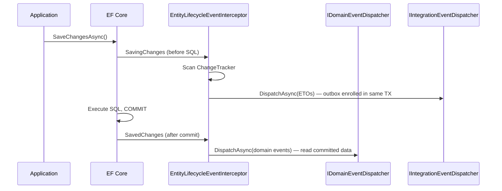
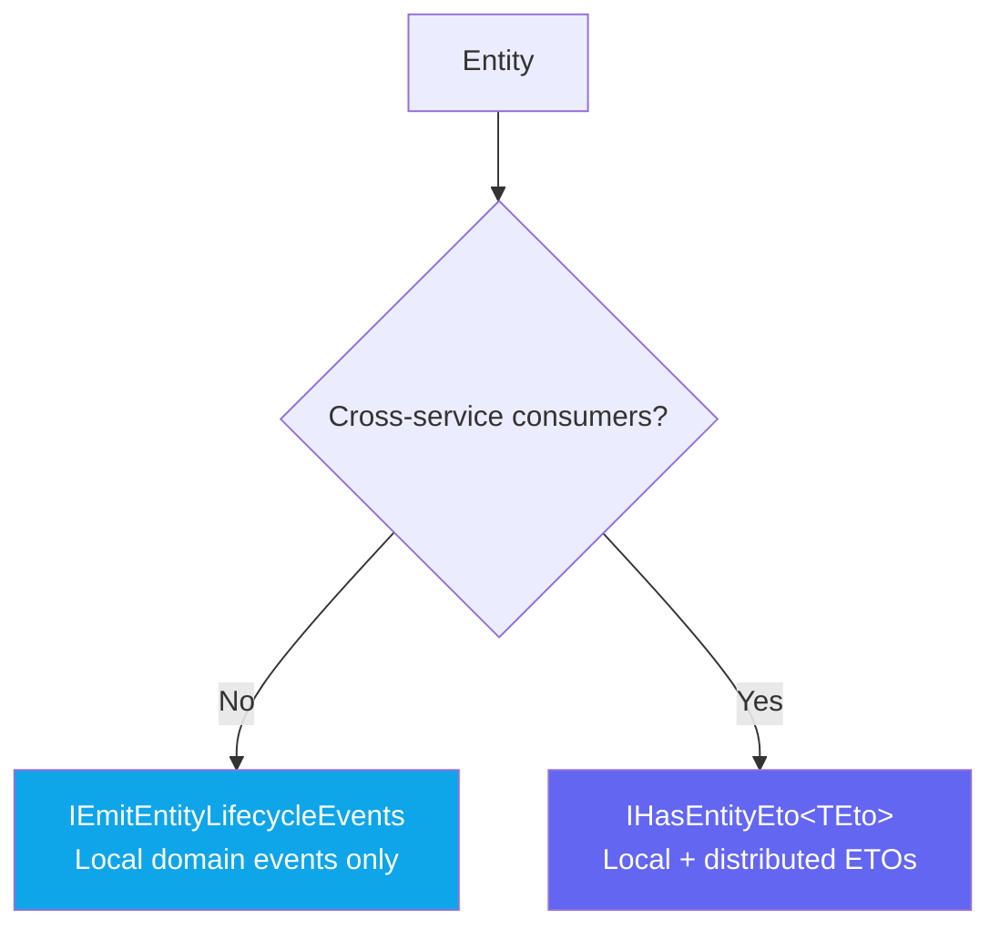

import { Tabs, TabItem } from "@astrojs/starlight/components";

Every time you save an entity, the same boilerplate appears: emit a `PatientCreatedEvent`,
build a `PatientEto`, publish it before the commit so the outbox stays consistent.
Entity lifecycle events eliminate that boilerplate. Mark your entity with one interface,
and Granit auto-dispatches the right events at the right time — every time.

## How it works

`EntityLifecycleEventInterceptor` hooks into EF Core's `SaveChanges` pipeline and
scans the change tracker for entities that opt into lifecycle events. For each
qualifying entity, it builds and dispatches the appropriate events automatically.



Two dispatch timings are used deliberately:

| Phase | Events | Why |
|-------|--------|-----|
| `SavingChanges` (before commit) | ETOs — `EntityCreatedEto<T>`, … | Wolverine enrolls the outbox message in the same database transaction → atomic |
| `SavedChanges` (after commit) | Domain events — `EntityCreatedEvent<T>`, … | Handlers can safely read committed data |

## Opt-in levels

Choose the level that matches your needs:



### Level 1 — Local events only

```csharp
public class Appointment : AggregateRoot, IEmitEntityLifecycleEvents
{
    public Guid PatientId { get; set; }
    public DateTimeOffset ScheduledAt { get; set; }
    public AppointmentStatus Status { get; private set; }
}
```

On `SaveChanges`, Granit auto-dispatches:

| EF Core state | `IEmitEntityLifecycleEvents` dispatch |
|---------------|--------------------------------------|
| `Added` | `EntityCreatedEvent<Appointment>` |
| `Modified` | `EntityUpdatedEvent<Appointment>` |
| `Modified` + `ISoftDeletable.IsDeleted` flips `false → true` | `EntityDeletedEvent<Appointment>` |
| `Deleted` | `EntityDeletedEvent<Appointment>` |

### Level 2 — Local + distributed

```csharp
public class Invoice : AggregateRoot, IHasEntityEto<InvoiceEto>
{
    public Guid PatientId { get; set; }
    public decimal TotalAmount { get; set; }
    public string Currency { get; set; } = "EUR";
    public InvoiceStatus Status { get; private set; }

    // Called by the interceptor before SaveChanges — snapshot of current state
    public InvoiceEto ToEto() => new(Id, PatientId, TotalAmount, Currency, Status);
}

// Flat, serializable — crosses service boundaries safely
public sealed record InvoiceEto(
    Guid InvoiceId,
    Guid PatientId,
    decimal TotalAmount,
    string Currency,
    InvoiceStatus Status);
```

`IHasEntityEto<TEto>` extends `IEmitEntityLifecycleEvents` — you get both local and
distributed events automatically:

| EF Core state | Local event (after commit) | Distributed ETO (before commit) |
|---------------|----------------------------|--------------------------------|
| `Added` | `EntityCreatedEvent<Invoice>` | `EntityCreatedEto<InvoiceEto>` |
| `Modified` | `EntityUpdatedEvent<Invoice>` | `EntityUpdatedEto<InvoiceEto>` |
| Soft delete | `EntityDeletedEvent<Invoice>` | `EntityDeletedEto<InvoiceEto>` |
| `Deleted` | `EntityDeletedEvent<Invoice>` | `EntityDeletedEto<InvoiceEto>` |

:::note
`ToEto()` is called in `SavingChanges` — **before** the database transaction commits.
The ETO captures the state of the entity at the moment the save is initiated, not the
final committed state. For soft deletes, `IsDeleted` is already `true` at this point.
:::

## Handling lifecycle events

### Local — domain event handler

```csharp
using Granit.Events;

public sealed class AppointmentCreatedHandler(
    INotificationWriter notifications) : ILocalEventHandler<EntityCreatedEvent<Appointment>>
{
    public async Task HandleAsync(
        EntityCreatedEvent<Appointment> evt,
        CancellationToken ct = default)
    {
        // Entity is the live EF entity — read-only at this point (committed)
        await notifications.SendAsync(
            evt.Entity.PatientId,
            $"Appointment scheduled for {evt.Entity.ScheduledAt:f}",
            ct).ConfigureAwait(false);
    }
}
```

Register the handler:

```csharp
services.AddScoped<
    ILocalEventHandler<EntityCreatedEvent<Appointment>>,
    AppointmentCreatedHandler>();
```

:::caution[Entity is live — not a snapshot]
`EntityCreatedEvent<T>.Entity` holds a reference to the actual EF Core entity object.
Do not store it across request boundaries or serialize it — use the distributed ETO
for that.
:::

### Distributed — integration event handler

```csharp
using Granit.Events;

public sealed class InvoiceCreatedIntegrationHandler
    : IDistributedEventHandler<EntityCreatedEto<InvoiceEto>>
{
    public async Task HandleAsync(
        EntityCreatedEto<InvoiceEto> evt,
        CancellationToken ct = default)
    {
        // evt.Eto is the flat, serialized snapshot — safe to use in any context
        InvoiceEto invoice = evt.Eto;
        await SyncToAccountingSystemAsync(invoice, ct).ConfigureAwait(false);
    }
}
```

With Wolverine, Granit auto-discovers handler methods — no explicit DI registration
needed for distributed handlers.

## Setup

`EntityLifecycleEventInterceptor` is registered automatically by `GranitPersistenceModule`.
No extra configuration is required to enable lifecycle events.

<Tabs>
<TabItem label="Local events only">

```csharp
[DependsOn(typeof(GranitPersistenceModule))]
public sealed class AppModule : GranitModule { }
```

Local domain events (`EntityCreatedEvent<T>`, …) are dispatched via `IDomainEventDispatcher`
after `SaveChanges`. With `GranitEventBusModule`, they route to registered
`ILocalEventHandler<T>` implementations.

</TabItem>
<TabItem label="With distributed ETOs">

```csharp
[DependsOn(
    typeof(GranitPersistenceModule),
    typeof(GranitEventBusWolverineModule))]  // Wolverine replaces NullIntegrationEventDispatcher
public sealed class AppModule : GranitModule { }
```

`GranitEventBusWolverineModule` registers `WolverineIntegrationEventDispatcher`, which
replaces the default no-op. ETOs are dispatched via `IMessageBus` and enrolled in
Wolverine's transactional outbox — atomically with the `SaveChanges` transaction.

</TabItem>
</Tabs>

:::note[Default dispatcher is a no-op]
Without `GranitEventBusWolverineModule`, `IIntegrationEventDispatcher` resolves to
`NullIntegrationEventDispatcher` — ETOs are silently dropped. This is intentional:
apps that do not use distributed events incur no overhead.
:::

## Designing a good ETO

An ETO (Event Transfer Object) is a flat, serializable DTO. The same rules as any
`IIntegrationEvent` apply — but entity lifecycle ETOs have one additional constraint:
`ToEto()` is called **before** the commit, so the snapshot must be self-contained.

```csharp
// ✅ GOOD — primitive types, Guids, value types
public sealed record PatientEto(
    Guid PatientId,
    string FirstName,
    string LastName,
    DateOnly DateOfBirth,
    bool Activated);

// ❌ BAD — lazy-loaded navigation, not serializable
public sealed record PatientEto(
    Patient Patient,              // EF entity — not serializable
    ICollection<Appointment> Appointments); // Lazy-loaded, causes N+1

// ❌ BAD — mutable, capturing internal state improperly
public sealed record PatientEto(
    ICurrentTenant Tenant);       // DI service reference — crashes in deserializer
```

Keep ETOs **flat** and **stable**. Adding properties is backwards-compatible (consumers
ignore unknown fields). Removing or renaming properties is a breaking change.

## Soft delete detection

`EntityLifecycleEventInterceptor` maps soft deletes to `EntityDeletedEvent<T>` —
not `EntityUpdatedEvent<T>` — when it detects the `ISoftDeletable.IsDeleted` property
transitioning from `false` to `true`:

```csharp
// Entity modified, IsDeleted transitions false → true:
// → EntityDeletedEvent<T>  (NOT EntityUpdatedEvent<T>)
// → EntityDeletedEto<TEto> (NOT EntityUpdatedEto<TEto>)
```

This means consumers handle deletion uniformly, regardless of whether it is a hard
delete (`EntityState.Deleted`) or a GDPR soft delete.

## Explicit integration events on aggregates

Entity lifecycle events cover the generic CRUD case. For domain-specific integration
events — where the event payload depends on the **business operation**, not just
the entity state — use `AddDistributedEvent()` on your aggregate root:

```csharp
public sealed class LegalAgreement : AggregateRoot
{
    public Guid PatientId { get; private set; }
    public bool IsSigned { get; private set; }

    public void Sign(Guid signedBy, DateTimeOffset signedAt)
    {
        IsSigned = true;

        // Domain event — local, dispatched after commit
        AddDomainEvent(new AgreementSignedEvent(Id, signedBy));

        // Integration event — distributed, dispatched before commit (outbox)
        AddDistributedEvent(new AgreementSignedIntegration(Id, PatientId, signedAt));
    }
}
```

`DomainEventDispatcherInterceptor` collects both:

| Source | Collected in | Dispatched in |
|--------|-------------|--------------|
| `IDomainEventSource.DomainEvents` (via `AddDomainEvent`) | `SavingChanges` | `SavedChanges` (after commit) |
| `IIntegrationEventSource.IntegrationEvents` (via `AddDistributedEvent`) | `SavingChanges` | `SavingChanges` (before commit — outbox) |

:::tip[Lifecycle events vs explicit events — when to use each]
Use `IEmitEntityLifecycleEvents` / `IHasEntityEto<TEto>` for **generic CRUD events** that
consumers subscribe to by entity type (sync to search index, audit log, CDC pipeline).
Use `AddDistributedEvent()` for **business operation events** where the payload represents
a domain action (`AgreementSignedIntegration`, `PaymentProcessedEvent`) rather than
an entity snapshot.
:::

## Performance notes

`EntityLifecycleEventInterceptor` uses compiled `Expression` factories cached in a
`ConcurrentDictionary` keyed by `(entityType, EntityState)`. After the first
`SaveChanges` for a given entity type, factory lookup is as fast as a dictionary
read — no `MakeGenericType`, no `Activator.CreateInstance` on the hot path.

Similarly, `IEntityEtoProvider.GetEto()` is resolved via a compiled expression that
calls `ToEto()` through the interface dispatch — zero per-call reflection.

## Testing

```csharp
[Fact]
public async Task SaveChangesAsync_AddedInvoice_EmitsEntityCreatedEvent()
{
    // Arrange
    IDomainEventDispatcher domainDispatcher = Substitute.For<IDomainEventDispatcher>();
    domainDispatcher.DispatchAsync(Arg.Any<IReadOnlyList<IDomainEvent>>(), Arg.Any<CancellationToken>())
        .Returns(Task.CompletedTask);

    IIntegrationEventDispatcher integrationDispatcher = Substitute.For<IIntegrationEventDispatcher>();
    integrationDispatcher.DispatchAsync(Arg.Any<IReadOnlyList<IIntegrationEvent>>(), Arg.Any<CancellationToken>())
        .Returns(Task.CompletedTask);

    EntityLifecycleEventInterceptor interceptor = new(domainDispatcher, integrationDispatcher);
    DbContextOptions<TestDbContext> options = new DbContextOptionsBuilder<TestDbContext>()
        .UseInMemoryDatabase(Guid.NewGuid().ToString())
        .AddInterceptors(interceptor)
        .Options;

    await using TestDbContext context = new(options);
    context.Invoices.Add(new Invoice { PatientId = Guid.NewGuid(), TotalAmount = 150m });

    // Act
    await context.SaveChangesAsync();

    // Assert — domain event dispatched after commit
    await domainDispatcher.Received(1).DispatchAsync(
        Arg.Is<IReadOnlyList<IDomainEvent>>(events =>
            events.Count == 1 && events[0] is EntityCreatedEvent<Invoice>),
        Arg.Any<CancellationToken>());

    // Assert — ETO dispatched before commit (Wolverine outbox)
    await integrationDispatcher.Received(1).DispatchAsync(
        Arg.Is<IReadOnlyList<IIntegrationEvent>>(events =>
            events.Count == 1 && events[0] is EntityCreatedEto<InvoiceEto>),
        Arg.Any<CancellationToken>());
}
```

## Public API summary

| Type | Kind | Package | Role |
|------|------|---------|------|
| `IEmitEntityLifecycleEvents` | Interface | `Granit` | Opt-in marker — local domain events |
| `IHasEntityEto<TEto>` | Interface | `Granit` | Opt-in — local + distributed ETOs |
| `IEntityEtoProvider` | Interface | `Granit` | Bridge for non-generic interceptor dispatch |
| `EntityCreatedEvent<T>` | Record | `Granit` | `IDomainEvent` emitted on insert |
| `EntityUpdatedEvent<T>` | Record | `Granit` | `IDomainEvent` emitted on update |
| `EntityDeletedEvent<T>` | Record | `Granit` | `IDomainEvent` emitted on delete (hard or soft) |
| `EntityCreatedEto<TEto>` | Record | `Granit` | `IIntegrationEvent` emitted on insert |
| `EntityUpdatedEto<TEto>` | Record | `Granit` | `IIntegrationEvent` emitted on update |
| `EntityDeletedEto<TEto>` | Record | `Granit` | `IIntegrationEvent` emitted on delete |
| `EntityLifecycleEventInterceptor` | Interceptor | `Granit.Persistence` | EF Core hook — auto-dispatch |
| `IIntegrationEventDispatcher` | Interface | `Granit` | Dispatch channel for ETOs |
| `NullIntegrationEventDispatcher` | Implementation | `Granit.Persistence` | No-op default — replaced by Wolverine |
| `WolverineIntegrationEventDispatcher` | Implementation | `Granit.EventBus.Wolverine` | Outbox-backed production dispatch |

## See also

- [Event Bus](/dotnet/infrastructure/event-bus/) — local and distributed event bus concepts, handler registration
- [Interceptors](/dotnet/data/interceptors/) — full interceptor pipeline (audit, soft delete, domain events)
- [Persistence](/dotnet/data/persistence/) — isolated DbContext pattern, `AggregateRoot.AddDomainEvent()`
- [Wolverine](/dotnet/infrastructure/wolverine-messaging/) — outbox, at-least-once delivery, context propagation
