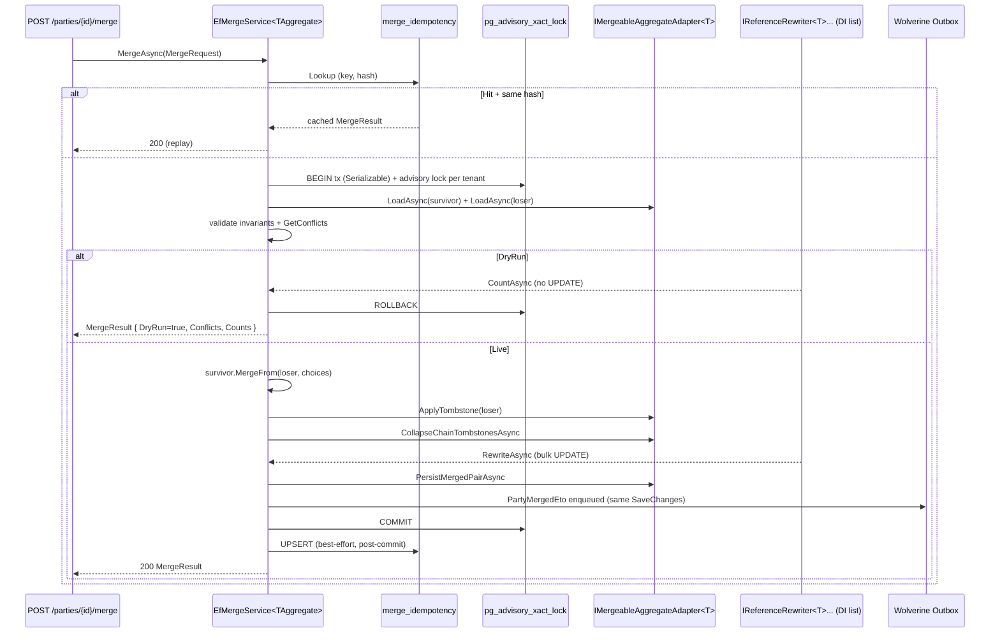
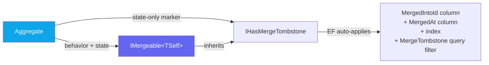

import { Tabs, TabItem } from "@astrojs/starlight/components";

Multi-channel data entry produces duplicates: the same customer created twice via
two CRM imports, a supplier mapped under two external providers, a party captured
both as an individual and as their employer. Without a merge primitive those
duplicates corrupt every aggregate that references them — invoices issued against
the wrong party, ledger fragmented across two balances, mappings in conflict.

`Granit.Mergeable` is a **generic** merge framework: define an `IMergeable<TSelf>`
aggregate, register one `IReferenceRewriter<TSelf>` per module that holds an FK to
it, and the orchestrator handles the rest — preview, validation, advisory locking,
bulk-SQL fan-out, tombstone, audit, integration event. The first consumer is
`Granit.Parties.Mergeable`; the same shape applies to `Granit.Catalog.Product`
deduplication and any future Lead / Opportunity / Asset aggregate.

## How it works

The orchestrator (`EfMergeService<TAggregate>` in
`Granit.Mergeable.EntityFrameworkCore`) runs every merge inside a single
`TransactionScope` at `IsolationLevel.Serializable` — under the framework's
single-PostgreSQL deployment assumption, every participating `DbContext` enrols
into the same physical transaction (no DTC). Rewriter failure rolls back
everything atomically.



Two key design points:

- **Locking is tenant-wide.** A `pg_advisory_xact_lock` keyed on
  `hashtext('party-merge-' || tenantId)` serialises concurrent merges within a
  tenant; merges across tenants stay parallel. Layered on top, `SELECT … FOR UPDATE`
  on both aggregate rows protects against intra-tenant interleaving (e.g. two
  admins picking the same loser).
- **Audit log is not rewritten.** Bulk-SQL rewriters target persisted typed FK
  columns. The audit log is intentionally immutable — the query layer joins on
  `parties.MergedIntoId` to render "Party X (merged into Y on …)". Same goes for
  in-flight payloads (Wolverine outbox/inbox, scheduled jobs, webhooks): they
  are resolved on receipt via `ResolveCurrentAsync` rather than rewritten in
  place. See [tombstone follow-through](#tombstone-follow-through).

## Authoring a mergeable aggregate

Two interfaces, both in the framework:



### `IHasMergeTombstone` — state only

Marker for the **tombstone state**, decoupled from the merge service so EF Core,
listings, query filters, and a future un-merge endpoint can target it without
referencing `Granit.Mergeable`:

```csharp
public interface IHasMergeTombstone
{
    Guid? MergedIntoId { get; }          // null on survivor; survivor.Id on loser
    DateTimeOffset? MergedAt { get; }
}
```

Implementing it is enough to get **all** the EF plumbing for free —
`ApplyGranitConventions` detects the interface and:

- Adds a nullable `MergedIntoId` (`Guid?`) and `MergedAt` (`DateTimeOffset?`) column.
- Indexes `MergedIntoId` (powers chain-collapse and admin "merged-out" listings).
- Registers the named query filter `GranitFilterNames.MergeTombstone` with
  expression `e.MergedIntoId == null` — every standard query excludes tombstoned
  rows by default, the same way `ISoftDeletable` excludes soft-deleted ones.

No per-module mapping code, no migration template to copy.

### `IMergeable<TSelf>` — behavior + state

```csharp
public interface IMergeable<TSelf> : IHasMergeTombstone
    where TSelf : Entity, IMergeable<TSelf>
{
    IReadOnlyList<FieldConflict> GetConflicts(TSelf loser);
    void MergeFrom(TSelf loser, MergeFieldChoices choices);
}
```

`GetConflicts` returns a list of `FieldConflict(FieldPath, SurvivorValue,
LoserValue, Default)` — empty when survivor and loser are scalar-equal; one entry
per differing scalar field otherwise. The orchestrator surfaces the list as
`MergeResult.Conflicts` for the preview UI.

`MergeFrom` folds the loser into the survivor using `MergeFieldChoices` —
overrides for individual fields, defaulting to the recommended `WinnerSide` from
`GetConflicts` when unspecified. Implementations throw `MergeException` for
**hard invariants** (tenant mismatch, kind mismatch, default-currency mismatch,
already-archived aggregates). Hard invariants cannot be overridden by an admin
choice — they translate to HTTP 422 at the endpoint boundary.

:::caution[Never touch child collections in MergeFrom]
`MergeFrom` only handles **scalar fields** (Name, Roles bitmap, owned VOs,
metadata dictionaries). Child collections referenced via shadow FK
(`HasMany.WithOne().HasForeignKey("PartyId")`) MUST NOT be merged in-memory —
adding tracked entities from the loser to the survivor's collection causes PK
conflicts and shadow-FK confusion. Children are rewritten by an
`IReferenceRewriter` issuing a SQL bulk-UPDATE on the shadow FK in the same
transaction. The orchestrator forbids the in-memory shape; the architecture test
catches accidental violations.
:::

### `Party` — reference implementation

```csharp
public class Party : AuditedAggregateRoot, IMultiTenant, IHasMetadata, IMergeable<Party>
{
    public Guid? MergedIntoId { get; private set; }
    public DateTimeOffset? MergedAt { get; private set; }

    public IReadOnlyList<FieldConflict> GetConflicts(Party loser) =>
        // Compare Name, Website, TaxStatus, ExternalMappings, Metadata… Empty when equal.
        BuildConflictList(loser);

    public void MergeFrom(Party loser, MergeFieldChoices choices)
    {
        // Hard invariants — non-overridable, translate to 422.
        if (loser.TenantId != TenantId) throw new MergeException("tenant mismatch");
        if (loser.Kind != Kind) throw new MergeException("kind mismatch");
        if (loser.DefaultCurrency != DefaultCurrency) throw new MergeException("currency mismatch");

        // Per-field choices — defaults documented per field, override at merge time.
        if (choices.ResolveOrDefault("Name", WinnerSide.Survivor) == WinnerSide.Loser)
            Rename(loser.Name);

        // Roles always union (bitwise OR — no conflict possible).
        AddRoles(loser.Roles);

        // Metadata: merge dictionaries with per-key overrides ("Metadata.segment" → Loser).
        MergeMetadataFrom(loser, choices);
    }

    // Internal mutation point used by IMergeableAggregateAdapter.ApplyTombstone — the
    // orchestrator never touches private setters via reflection.
    internal void MarkAsMergedInto(Guid survivorId, DateTimeOffset mergedAt)
    {
        MergedIntoId = survivorId;
        MergedAt = mergedAt;
        Status = PartyStatus.Archived;
    }
}
```

## Authoring a reference rewriter

One per module that holds a typed FK to the mergeable aggregate. The rewriter
**inlines inside the module's existing `*.EntityFrameworkCore` package** — early
plans called for a dedicated `*.Mergeable` package per module, but a 50-line SQL
class does not justify a new csproj + DI extension + test project + CI shard
wiring. The architecture test
([`MergeableConventionTests`](#architecture-tests)) accepts both `*.EntityFrameworkCore`
and `*.Mergeable` placements.

```csharp
namespace Granit.Invoicing.EntityFrameworkCore.Internal;

internal sealed class InvoicePartyReferenceRewriter(
    IDbContextFactory<InvoicingDbContext> contextFactory) : IReferenceRewriter<Party>
{
    public string Description => "Invoice.PartyId";  // Surfaced in audit + preview UI

    public async Task<int> RewriteAsync(
        Guid survivorId, Guid loserId, CancellationToken cancellationToken)
    {
        await using InvoicingDbContext db = await contextFactory
            .CreateDbContextAsync(cancellationToken).ConfigureAwait(false);

        PartyId loser = PartyId.Create(loserId);
        PartyId survivor = PartyId.Create(survivorId);

        return await db.Invoices
            .Where(i => i.PartyId == loser)
            .ExecuteUpdateAsync(s => s.SetProperty(i => i.PartyId, survivor), cancellationToken)
            .ConfigureAwait(false);
    }

    public async Task<int> CountAsync(
        Guid survivorId, Guid loserId, CancellationToken cancellationToken)
    {
        await using InvoicingDbContext db = await contextFactory
            .CreateDbContextAsync(cancellationToken).ConfigureAwait(false);

        PartyId loser = PartyId.Create(loserId);

        return await db.Invoices
            .Where(i => i.PartyId == loser)
            .CountAsync(cancellationToken)
            .ConfigureAwait(false);
    }
}
```

Two methods, both bulk SQL:

| Method | Purpose | SQL shape |
| ------ | ------- | --------- |
| `RewriteAsync` | Live merge — re-points FK | `UPDATE … SET partyid = @survivor WHERE partyid = @loser` |
| `CountAsync` | Dry-run preview — no mutation | `SELECT COUNT(*) FROM … WHERE partyid = @loser` |

**Always `ExecuteUpdateAsync`, never the change tracker.** Two reasons:

1. **Performance.** Tables with millions of rows (`invoice_line_items`, usage
   events) would crash an EF-tracked rewrite. Bulk SQL completes sub-second on a
   warm connection regardless of cardinality.
2. **EF child-collection trap.** Loading the loser's children with the change
   tracker, then re-attaching them to the survivor, conflicts with EF's PK and
   shadow-FK tracking. Bulk SQL bypasses the tracker entirely.

Register the rewriter in the module's existing
`AddGranit{Module}EntityFrameworkCore(...)` extension:

```csharp
public static IHostApplicationBuilder AddGranitInvoicingEntityFrameworkCore(
    this IHostApplicationBuilder builder, Action<DbContextOptionsBuilder> configure)
{
    // ... existing DbContext + interceptor wiring ...
    builder.Services.AddReferenceRewriter<Party, InvoicePartyReferenceRewriter>();
    return builder;
}
```

The orchestrator discovers all `IReferenceRewriter<Party>` registrations from DI
at merge time and fans out into them inside the same `TransactionScope`.

## Authoring an aggregate adapter

The orchestrator delegates aggregate-specific concerns to
`IMergeableAggregateAdapter<TAggregate>`, implemented by the consuming module
(`Granit.Parties.Mergeable.PartyMergeableAggregateAdapter`):

```csharp
public interface IMergeableAggregateAdapter<TAggregate>
    where TAggregate : Entity, IMergeable<TAggregate>
{
    Task<TAggregate?> LoadAsync(Guid id, CancellationToken cancellationToken);
    Task PersistMergedPairAsync(TAggregate survivor, TAggregate loser, CancellationToken cancellationToken);
    void ApplyTombstone(TAggregate loser, Guid survivorId, DateTimeOffset mergedAt);
    Task<int> CollapseChainTombstonesAsync(Guid newSurvivorId, Guid oldSurvivorId, CancellationToken cancellationToken);
}
```

Why an adapter rather than reaching into the aggregate via reflection:

- **`LoadAsync`** is responsible for **disabling the `IHasMergeTombstone` filter**
  when the merge orchestrator needs to observe a previously-merged loser (chain
  merges, recovery scenarios). The default filter would hide it.
- **`ApplyTombstone`** routes through the aggregate's internal mutation point
  (e.g. `Party.MarkAsMergedInto`) — keeping the framework on the public side of
  the encapsulation boundary.
- **`CollapseChainTombstonesAsync`** rewrites earlier tombstones when a chain
  merge happens (`A→B`, then later `B→C` rewrites `A.MergedIntoId` from `B` to
  `C`). Single-hop `ResolveCurrentAsync` always reaches the final survivor.
- **`PersistMergedPairAsync`** isolates the SaveChanges call so the orchestrator
  can stay agnostic of which `DbContext` owns the aggregate.

## Idempotency

Two layers, on purpose. The HTTP layer
(`Granit.Http.Idempotency` middleware) absorbs network retries with the same
`Idempotency-Key`. The DB layer protects against an SDK that regenerates the key
between retries of the same logical intent:

```sql
CREATE TABLE granit.merge_idempotency (
    id uuid PRIMARY KEY,
    key text NOT NULL,
    request_hash text NOT NULL,            -- SHA-256(JSON(MergeRequest))
    survivor_id uuid NOT NULL,
    loser_id uuid NOT NULL,
    result_json text NOT NULL,             -- cached MergeResult<T> payload
    created_at timestamptz NOT NULL,
    UNIQUE (key, request_hash)
);
```

The orchestrator looks up `(key, request_hash)` before opening the transaction:

| Lookup outcome | Behaviour |
| -------------- | --------- |
| Hit, same hash | Return the cached `MergeResult` — no DB work, no double rewrite |
| Hit, different hash | Throw `MergeException` → 409 Conflict (key reused for a different request) |
| Miss | Proceed; UPSERT the entry post-commit (best-effort) |

Entries are kept 24 h. Garbage collection is a future background job — for now
the table grows linearly with merge volume, which is single-digit per tenant per
day in steady state.

A host that prefers a single shared database over the isolated module DbContext
can fold the table into its own model:

```csharp
// In the host application's DbContext.OnModelCreating:
modelBuilder.ConfigureMergeableModule();
```

## Tombstone follow-through

Bulk SQL rewrites cover **persisted typed FK columns**. A `PartyId` may also live
in JSON-serialised payloads SQL cannot rewrite cleanly:

| Category | Where | Why no SQL rewrite |
| -------- | ----- | ------------------ |
| Wolverine messages | `wolverine_outbox`, `wolverine_inbox` | Schema-less JSON payload, `PartyId` at any depth |
| Scheduled jobs | `scheduling_deferred_actions` | Same |
| Pending webhooks | `webhook_envelopes` | Same |
| Queued notifications | `notifications_pending` | Same |
| Already-published events | External brokers | Out of our control |
| Audit log | `audit_entries.EntityId` | Immutable history — MUST NOT rewrite |

Consumers resolve the `PartyId` on receipt rather than relying on the rewrite:

```csharp
public class FinaliseInvoiceHandler
{
    public static async Task HandleAsync(
        FinaliseInvoiceCommand cmd,
        IPartyReader reader,
        IDataFilter dataFilter,
        IInvoicingService invoicing,
        CancellationToken ct)
    {
        // Single-hop resolution. Chain merges (A→B→C) are collapsed at merge time,
        // so MergedIntoId always points to the final survivor — no recursion needed.
        PartyId resolved = await cmd.PartyId.ResolveCurrentAsync(reader, dataFilter, ct);

        await invoicing.FinaliseAsync(cmd.InvoiceId, resolved, ct);
    }
}
```

The rule "any handler / job that accepts a `PartyId` must call
`ResolveCurrentAsync`" is currently a convention — the architecture test that
enforces it requires either a Roslyn analyser or an IL-level scan (NetArchTest
sees method signatures, not method bodies) and is tracked as
[#1409](https://github.com/granit-fx/granit-dotnet/issues/1409).

## Setup

<Tabs>
<TabItem label="Generic merge orchestrator">

```csharp
[DependsOn(
    typeof(GranitMergeableModule),
    typeof(GranitMergeableEntityFrameworkCoreModule))]
public class AppModule : GranitModule { }
```

```csharp
// Idempotency-cache DbContext (or ConfigureMergeableModule() on a shared DbContext)
builder.AddGranitMergeableEntityFrameworkCore(o =>
    o.UseNpgsql(builder.Configuration.GetConnectionString("Default")));
```

</TabItem>
<TabItem label="Party merge wiring">

```csharp
[DependsOn(
    typeof(GranitPartiesModule),
    typeof(GranitPartiesEndpointsModule),
    typeof(GranitPartiesMergeableModule))]   // adds adapter + Party-internal rewriters
public class AppModule : GranitModule { }
```

```csharp
builder.AddGranitPartiesEntityFrameworkCore(o =>
    o.UseNpgsql(builder.Configuration.GetConnectionString("Default")));

builder.AddGranitMergeableEntityFrameworkCore(o =>
    o.UseNpgsql(builder.Configuration.GetConnectionString("Default")));

// Adapter + Party-children + Party-parent rewriters.
// Cross-module rewriters (Invoice/Subscription/BalanceAccount) auto-register from
// their own AddGranit{Module}EntityFrameworkCore calls.
builder.AddGranitPartiesMergeable();
```

```csharp
app.MapGranitParties();   // exposes POST /parties/{id}/merge + preview
```

</TabItem>
</Tabs>

## API surface (`Granit.Mergeable`)

| Type | Role |
| ---- | ---- |
| `IHasMergeTombstone` | State marker — auto-mapped column / index / query filter |
| `IMergeable<TSelf>` | Behaviour + state — `GetConflicts`, `MergeFrom` |
| `IReferenceRewriter<TAggregate>` | Per-module bulk-SQL FK rewriter |
| `IMergeableAggregateAdapter<TAggregate>` | Per-aggregate Load / Persist / Tombstone / ChainCollapse |
| `IMergeService<TAggregate>` | Orchestrator contract — `MergePreviewAsync`, `MergeAsync` |
| `MergeRequest` | `(SurvivorId, LoserId, Choices, DryRun, Reason, IdempotencyKey)` |
| `MergeResult<T>` | `(Merged, Conflicts, RewriteCounts, DryRun)` |
| `MergeFieldChoices` | Per-field overrides — fluent builder via `MergeFieldChoices.NewBuilder()` |
| `WinnerSide` | `Survivor` (default) or `Loser` |
| `FieldConflict` | One row of the preview diff |
| `MergeException` | Hard-invariant violation → HTTP 422 |
| `AddReferenceRewriter<TAggregate, TRewriter>()` | DI registration helper |

## Architecture tests

`MergeableConventionTests` (in `tests/Granit.ArchitectureTests`) catches drift on
the framework at build time:

- **Curated whitelist actually ships rewriters.** Every assembly in the expected
  list (currently `Granit.Parties.Mergeable`, `Granit.Invoicing.EntityFrameworkCore`,
  `Granit.Subscriptions.EntityFrameworkCore`,
  `Granit.CustomerBalance.EntityFrameworkCore`) contains at least one
  `IReferenceRewriter<Party>` implementation. Catches the silent failure of an
  inlined rewriter being accidentally removed.
- **Every aggregate carrying `PartyId` outside `Granit.Parties` has a rewriter.**
  Reflection scan: every concrete `Entity` subclass with a typed `PartyId`
  property is mapped back to its sibling `*.EntityFrameworkCore` or `*.Mergeable`
  assembly, which must ship a rewriter. Catches "added a new aggregate carrying
  `PartyId` and forgot the rewriter" — the failure mode that leaves orphan FK
  references after a merge.
- **Every `IReferenceRewriter<Party>` lives in a persistence package.** Rewriters
  must live in `*.EntityFrameworkCore` or `*.Mergeable` — keeping the SQL /
  persistence concern next to the `DbContext` that owns the FK.

## See also

- [ADR-037 — Party merge framework](/dotnet/architecture/adr/037-party-merge-framework/) — design decisions, trade-offs, non-goals
- [Parties — central party-management aggregate](/dotnet/business/parties/) — the first consumer
- [Query Filters](./query-filters/) — the `MergeTombstone` filter alongside `SoftDelete`, `Active`, `MultiTenant`
- [Persistence overview](./persistence/) — `ApplyGranitConventions` and the auto-applied column conventions
- [Entity Lifecycle Events](./entity-lifecycle-events/) — `*Eto` integration events outbox pattern, used by `PartyMergedEto`
