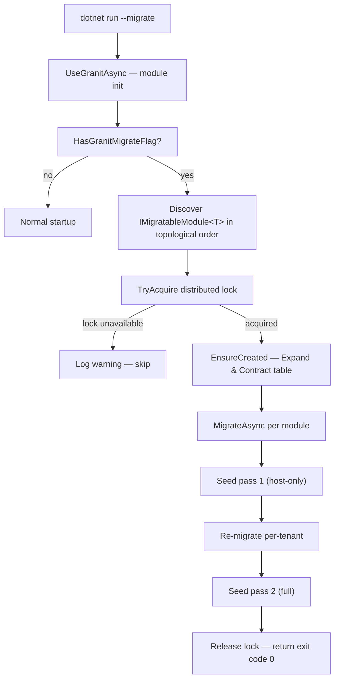
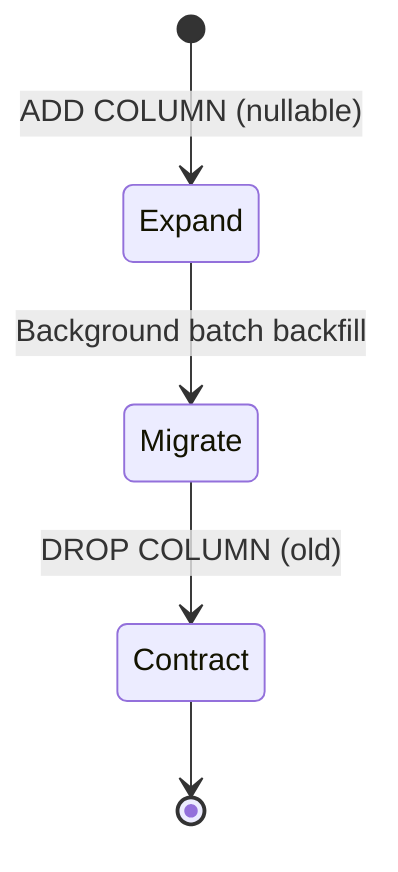

import { Tabs, TabItem, Steps } from "@astrojs/starlight/components";

Granit provides two complementary tools for schema management:

1. **How to _apply_ migrations** — at startup, via `--migrate`, or via a SQL script
2. **How to handle _breaking_ schema changes** — Expand & Contract for zero-downtime deployments

| | CLI mode | Standard (at startup) | SQL script (CI/CD) | Expand & Contract |
|---|---|---|---|---|
| **Package** | `Granit.Persistence.Hosting` | EF Core built-in | EF Core built-in | `Granit.Persistence.Migrations` |
| **When** | Production, K8s init container | Dev / single instance | Production DDL-only | Zero-downtime breaking changes |
| **Complexity** | Low | Low | Medium | High |
| **Multi-module** | ✅ Topological order, auto-discovery | Manual per DbContext | Manual per DbContext | Per DbContext |

Most production applications use `--migrate` to apply schema changes and Expand & Contract for
any migration that must rename, split, or backfill a column without downtime.

---

## CLI mode

`Granit.Persistence.Hosting` adds a first-class `--migrate` CLI mode to any Granit application.
Running `dotnet run --migrate` (or `docker run myapp --migrate` in CI/CD) applies all pending EF
Core migrations in dependency-graph order, runs data seeders, and exits cleanly. The HTTP server
never starts.

This replaces ad-hoc `MigrateAsync()` calls scattered across `Program.cs` and eliminates the
startup-time migration race condition in multi-replica deployments.

### Quick start

<Steps>

1. **Add the package**

   ```bash
   dotnet add package Granit.Persistence.Hosting
   ```

2. **Register migration support in `Program.cs`**

   ```csharp
   await builder.AddGranitAsync<AppHostModule>();
   builder.AddGranitMigrateSupport();  // registers the runner + lock

   WebApplication app = builder.Build();
   await app.UseGranitAsync();

   if (app.HasGranitMigrateFlag())
   {
       await app.RunGranitMigrationsAsync();  // migrate → seed → flush logs
       return;                                // clean exit — no HTTP server
   }

   app.UseAuthentication();
   app.UseAuthorization();
   // ... remaining middleware ...
   await app.RunAsync();
   ```

   `return` from top-level statements is the correct exit mechanism — it respects all
   `using` / `finally` blocks. `RunGranitMigrationsAsync` disposes the application and
   flushes Serilog sinks before returning.

3. **Mark your modules as migratable**

   On each `GranitModule` subclass that owns EF Core migrations, implement
   `IMigratableModule<TContext>`:

   ```csharp
   [DependsOn(
       typeof(GranitPersistenceModule),
       typeof(GranitAuthorizationEntityFrameworkCoreModule))]
   public sealed class AppCoreModule : GranitModule, IMigratableModule<AppDbContext>
   {
       public override void ConfigureServices(ServiceConfigurationContext context)
       {
           // ... DbContext registration, etc.
       }
   }
   ```

4. **Run migrations**

   ```bash
   # Local development
   dotnet run --project src/MyApp.Host -- --migrate

   # Docker / K8s init container
   docker run myapp --migrate

   # CI/CD pipeline (before `kubectl rollout`)
   docker run --rm myapp:$VERSION --migrate
   ```

</Steps>

### How the runner works



The discovery step reads the topologically sorted module list from `GranitApplication`
(respecting `[DependsOn]` declarations). Each module that implements
`IMigratableModule<T>` is migrated in order. The host application's DbContexts include
Granit module tables via `Configure*Module()` extension methods called in `OnModelCreating`,
so all tables — both application and framework — are covered by standard EF Core migrations.

Each Granit module exposes a `Configure*Module()` extension on `ModelBuilder`:

- **Host-level modules** (BackgroundJobs, BFF, MultiTenancy, Features, OpenIddict,
  Auditing, Localization, Scheduling, etc.) — call in the host `DbContext`.
- **Tenant-level modules** (Timeline, BlobStorage, DataExchange, QueryEngine, Webhooks,
  Notifications, Privacy, ApiKeys, etc.) — call in the tenant-isolated `DbContext`.

In SchemaPerTenant mode, the runner uses a **double-seed** flow:
1. **Seed pass 1** (`IsHostOnly = true`): only host seeders run (tenant creation, OpenIddict).
   Tenant-scoped seeders skip via `context.IsHostOnly`.
2. **Re-migrate per-tenant**: now that tenants exist, create schemas and apply migrations.
3. **Seed pass 2** (full): all seeders run — tenant tables now exist.

### `IMigratableModule<TContext>`

```csharp
// Granit.Persistence.Hosting
public interface IMigratableModule<TContext> where TContext : DbContext;
```

Marker interface — no methods to implement. One module = one DbContext = one
`IMigratableModule<TContext>` declaration. If your application has two DbContexts
(e.g., `CoreDbContext` and `SecurityDbContext`), create two modules:

```csharp
public sealed class AppCoreModule : GranitModule, IMigratableModule<CoreDbContext> { ... }

[DependsOn(typeof(AppCoreModule))]
public sealed class AppSecurityModule : GranitModule, IMigratableModule<SecurityDbContext> { ... }
```

`[DependsOn]` controls migration order: `CoreDbContext` is migrated before
`SecurityDbContext` because `AppSecurityModule` depends on `AppCoreModule`.

### Configuration

```csharp
builder.AddGranitMigrateSupport(options =>
{
    options.CliFlag            = "--migrate";            // default
    options.SeedAfterMigration = true;                   // default
    options.Timeout            = TimeSpan.FromMinutes(5);// default
    options.MaxRetries         = 3;                      // default
    options.RetryDelay         = TimeSpan.FromSeconds(5);// default
    options.SeedOnStartup      = false;                  // default — see below
});
```

| Option | Default | Description |
|--------|---------|-------------|
| `CliFlag` | `"--migrate"` | CLI argument that triggers migration mode. Environment variables are intentionally not supported — see [safety rules](#safety-rules). |
| `SeedAfterMigration` | `true` | Run `IDataSeeder` after all migrations complete. |
| `Timeout` | 5 minutes | Total timeout for the migration run. |
| `MaxRetries` | 3 | Retry attempts per DbContext on transient DB failures. |
| `RetryDelay` | 5 seconds | Wait between retry attempts. |
| `SeedOnStartup` | `false` | Re-enable data seeding at normal startup. **Unsafe for multi-replica deployments.** |

### Distributed lock

By default, `AddGranitMigrateSupport()` registers `NullMigrationLock` — a no-op that
always succeeds, suitable for single-instance deployments and init containers (which run
exactly once).

For multi-instance scenarios where multiple pods could start simultaneously, you need a
real distributed lock. The `IGranitMigrationLock` interface returns `null` when the lock
cannot be acquired — signalling the runner to skip migrations on that instance:

```csharp
public interface IGranitMigrationLock
{
    // Returns null if the lock could not be acquired (another instance is migrating).
    Task<IAsyncDisposable?> TryAcquireAsync(string resource, CancellationToken cancellationToken);
}
```

**For PostgreSQL**, `Granit.Persistence.Postgres` provides `NpgsqlAdvisoryMigrationLock`
out of the box — zero configuration required. Call `AddGranitPostgres()` before
`AddGranitMigrateSupport()` and the advisory lock is registered automatically via
`TryAddSingleton`:

```csharp
builder.AddGranitPostgres();           // registers NpgsqlAdvisoryMigrationLock
builder.AddGranitMigrateSupport();     // uses it automatically
```

See [Persistence — PostgreSQL](/dotnet/data/persistence-postgres/#distributed-migration-lock)
for how the advisory lock works and why it requires a raw connection instead of the EF
Core connection pool.

**For SQL Server or custom databases**, implement `IGranitMigrationLock` and register it
manually before `AddGranitMigrateSupport()`:

```csharp
builder.Services.AddSingleton<IGranitMigrationLock, MyCustomMigrationLock>();
builder.AddGranitMigrateSupport();
```

### Multi-tenant support

When `ITenantEnumerator` is registered in the DI container, the runner automatically
migrates each tenant's database in isolation:

```csharp
// ITenantEnumerator enumerates active tenant IDs
// ITenantDbIsolator configures the DbContext for a specific tenant
//   (e.g., sets search_path for schema-per-tenant, or swaps the connection string)
await foreach (Guid tenantId in tenantEnumerator.GetActiveTenantIdsAsync(ct))
{
    await isolator.IsolateAsync(dbContext, tenantId, ct).ConfigureAwait(false);
    await dbContext.Database.MigrateAsync(ct).ConfigureAwait(false);
}
```

See [Multi-tenancy](/dotnet/concepts/multi-tenancy/) for how to implement these interfaces.

#### Runtime provisioning

The `--migrate` runner handles **cold-start** provisioning (first deploy). For tenants
created **at runtime** (via the admin API), `Granit.MultiTenancy.Provisioning` provides
an automatic `TenantProvisioningHandler` that listens to `TenantCreatedEvent` and
delegates to `ITenantProvisioner`. See
[Automatic Tenant Provisioning](/dotnet/infrastructure/multi-tenancy/isolation/#automatic-tenant-provisioning)
for details.

### Data seeding

`AddGranitMigrateSupport()` **disables** `DataSeedingHostedService` at normal startup
by default. Seeding only runs during `--migrate` mode (when `SeedAfterMigration = true`).

```csharp
builder.AddGranitMigrateSupport(options =>
{
    // Dev convenience: re-enable seeding at startup (single instance only)
    options.SeedOnStartup = true;
});
```

:::caution
`SeedOnStartup = true` is unsafe for multi-replica deployments. All pods would run
seeders simultaneously on startup, causing race conditions. A warning is logged when
this option is enabled.
:::

### Deployment topologies

| Topology | Setup |
|----------|-------|
| **Simple app** | `dotnet run --migrate` once before `dotnet run` |
| **Docker** | `docker run myapp --migrate` in CI/CD before `kubectl rollout` |
| **K8s init container** | `args: ["--migrate"]` in the init container spec; pods start only after init succeeds |
| **K8s rolling update** | `--migrate` applies Expand migration; Expand & Contract backfills at runtime |
| **Microservice** | Same — typically one `IMigratableModule<T>` per service |
| **SaaS schema-per-tenant** | `ITenantEnumerator` iterates tenants; `ITenantDbIsolator` sets `search_path`; runtime: `AutoTenantProvisioner` |
| **Integration tests** | No `--migrate` arg → `HasGranitMigrateFlag()` returns `false` → no-op; `WebApplicationFactory` works normally |

### Safety rules

**No environment variable support for `CliFlag`.**
`GranitMigrateOptions.CliFlag` reads CLI arguments only, never environment variables.
This is intentional: if `--migrate` could be set via an env var and that var was
accidentally copied to a Kubernetes `Deployment`, every pod restart would trigger a
migration run, causing a CrashLoopBackOff cascade.

**`return`, not `Environment.Exit()`.**
Top-level statement `return` ensures all `IAsyncDisposable` / `finally` blocks execute
before the process terminates. `RunGranitMigrationsAsync` handles log flushing
internally — do not call `Environment.Exit()` after it.

---

## Standard migrations

The standard EF Core migration workflow: one migration file per schema change, applied
at startup in development or via SQL script in production.

### Creating a migration

```bash
dotnet ef migrations add AddAppointmentNotes \
    --project src/MyApp.Host \
    --context AppDbContext \
    --output-dir Migrations/App
```

EF Core diffs the current model (`OnModelCreating`) against the last snapshot and
generates the migration file.

### Applying migrations

<Tabs>
<TabItem label="At startup (dev)">

```csharp
// Program.cs — after builder.Build(), before RunAsync()
await using var scope = app.Services.CreateAsyncScope();
var factory = scope.ServiceProvider
    .GetRequiredService<IDbContextFactory<AppDbContext>>();
await using var db = await factory.CreateDbContextAsync();
await db.Database.MigrateAsync();
```

Works well with Testcontainers in integration tests. Blocks startup until migrations
complete, which is acceptable for a single instance with a maintenance window.

</TabItem>
<TabItem label="SQL script (CI/CD)">

Generate an idempotent script and apply it before the deployment:

```bash
dotnet ef migrations script --idempotent \
    --project src/MyApp.Host \
    --context AppDbContext \
    -o migrations/app.sql
```

The `--idempotent` flag wraps each migration in an `IF NOT EXISTS` check — safe to
apply multiple times and auditable in version control.

</TabItem>
</Tabs>

### EF Core CLI reference

```bash
# Add a migration
dotnet ef migrations add AddPatientFullName \
    --project src/MyApp.Host \
    --context AppDbContext \
    --output-dir Migrations/App

# Apply pending migrations
dotnet ef database update \
    --project src/MyApp.Host \
    --context AppDbContext

# Generate idempotent SQL script
dotnet ef migrations script --idempotent \
    --project src/MyApp.Host \
    --context AppDbContext \
    -o migrations/app.sql

# List applied / pending migrations
dotnet ef migrations list \
    --project src/MyApp.Host \
    --context AppDbContext

# Remove the last unapplied migration
dotnet ef migrations remove \
    --project src/MyApp.Host \
    --context AppDbContext
```

:::tip[Multiple DbContexts]
Use `--output-dir` to keep migrations organized per DbContext. A typical Granit
application has:

- `Migrations/App/` — business entities + Granit modules (Settings, Workflow…)
- `Migrations/Security/` — Authorization, Identity, ApiKeys
:::

### When standard migrations are enough

Standard migrations handle most schema changes without service interruption:

- Adding a table or nullable column (with or without a default)
- Adding or removing an index
- Changing column constraints (max length, nullability)
- Dropping an unused column or table

These changes are **backwards-compatible** — the old application version continues
running against the new schema during the deployment window.

### When standard migrations break

Some changes require the old and new application versions to coexist during rolling
updates:

- **Renaming a column** — old code still references the old name
- **Changing a column type** — old code expects the old type
- **Splitting a column** — old and new code write to different columns simultaneously
- **Backfilling computed data** — millions of rows cannot be updated in one transaction

These are the cases where Expand & Contract is necessary.

---

## Expand & Contract migrations

`Granit.Persistence.Migrations` implements the **Expand & Contract** pattern: split a
breaking schema change into three safe, backwards-compatible phases, each deployed
independently.

### Three phases



| Phase | Schema change | Application behavior |
|-------|--------------|---------------------|
| **Expand** | `ALTER TABLE ADD COLUMN` (nullable) | Writes to both old and new columns |
| **Migrate** | Background batch UPDATE | Reads new column, falls back to old |
| **Contract** | `ALTER TABLE DROP COLUMN` (old) | Reads/writes new column only |

Each phase is a separate EF Core migration deployed independently. The schema is never
incompatible with running instances.

### Relationship with `--migrate`

Expand & Contract and `--migrate` are complementary, not competing:

| Concern | `--migrate` | Expand & Contract |
|---------|-------------|-------------------|
| Schema DDL (CREATE TABLE, ADD COLUMN) | ✅ | ❌ |
| Data backfill (batch UPDATE) | ❌ | ✅ |
| Schema cleanup (DROP old column) | ✅ | ❌ |
| Timing | Deployment-time (before pods start) | Runtime (background worker, after all pods updated) |

A typical zero-downtime release looks like:

```text
Release v2 — Expand:
  1. docker run myapp:v2 --migrate
     └── Applies Expand migration: ADD COLUMN patient_full_name (nullable)
  2. kubectl rollout (zero downtime)
     └── Pods write to both first_name/last_name and full_name

Release v2 runtime:
  3. MigrationBatchWorker backfills full_name from first_name + ' ' + last_name

Release v3 — Contract:
  4. docker run myapp:v3 --migrate
     └── Applies Contract migration: DROP COLUMN first_name, DROP COLUMN last_name
```

### Annotating migrations

```csharp
[MigrationCycle(MigrationPhase.Expand, "patient-fullname-v2")]
public partial class AddPatientFullName : Migration
{
    protected override void Up(MigrationBuilder migrationBuilder)
    {
        migrationBuilder.AddColumn<string>(
            "FullName", "Patients", nullable: true);
    }
}
```

### Batch processing

Register a batch delegate that backfills data in chunks:

```csharp
registry.Register<AppDbContext>(
    "patient-fullname-v2",
    async (context, batch, ct) =>
    {
        var patients = await context.Set<Patient>()
            .Where(p => p.FullName == null)
            .OrderBy(p => p.Id)
            .Take(batch.Size)
            .ToListAsync(ct)
            .ConfigureAwait(false);

        foreach (var p in patients)
            p.FullName = $"{p.FirstName} {p.LastName}";

        await context.SaveChangesAsync(ct).ConfigureAwait(false);

        return new MigrationBatchResult(
            patients.Count,
            patients.Count < batch.Size
                ? null
                : patients[^1].Id.ToString());
    });
```

Batch delegates must be **idempotent** — re-processing already-migrated rows must have
no side effects.

### Configuration

```json
{
  "GranitMigrations": {
    "DefaultBatchSize": 500,
    "BatchExecutionTimeout": "00:05:00"
  }
}
```

### Channel vs Wolverine dispatch

| | `Granit.Persistence.Migrations` | `+ .Wolverine` |
|---|---|---|
| Dispatch | In-memory `Channel<T>` | Durable outbox |
| Restart safety | Lost batches on crash | Survives restarts |
| Multi-instance | Single node only | Distributed |

Use `Granit.Persistence.Migrations.Wolverine` when batch processing must survive
application restarts or run across multiple nodes.

---

## See also

- [Persistence overview](/dotnet/data/persistence/) — isolated DbContext, host-owned migrations, `ApplyGranitConventions`
- [Interceptors](/dotnet/data/interceptors/) — audit trail, soft delete, concurrency, domain events
- [Query filters](/dotnet/data/query-filters/) — named filters, runtime bypass, translations
- [Multi-tenancy](/dotnet/concepts/multi-tenancy/) — `ITenantEnumerator`, `ITenantDbIsolator`
