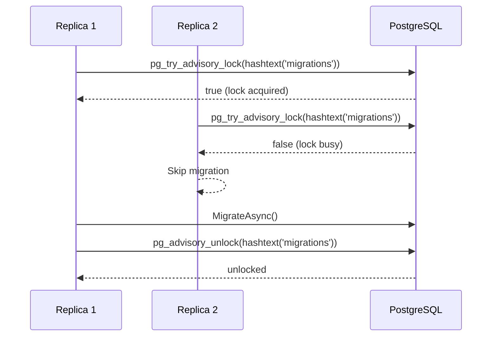

import { Tabs, TabItem, FileTree } from "@astrojs/starlight/components";

`Granit.Persistence.Postgres` is the PostgreSQL provider for Granit's persistence layer.
It wires three things that every production Postgres deployment needs but that the
base `Granit.Persistence` package deliberately leaves abstract: a **distributed migration
lock**, **schema-per-tenant isolation**, and a **lightweight health check** that doesn't
drag EF Core onto the readiness probe path.

## Package structure

<FileTree>

- Granit.Persistence.Postgres/
  - Extensions/
    - PersistencePostgresHostApplicationBuilderExtensions.cs `AddGranitPostgres()`
    - NpgsqlDbContextOptionsExtensions.cs `UseGranitNpgsql()`
    - NpgsqlHealthChecksBuilderExtensions.cs `AddGranitPostgresHealthCheck()`
  - Internal/
    - NpgsqlAdvisoryMigrationLock.cs `pg_try_advisory_lock` implementation
    - NpgsqlTenantSchemaActivator.cs `SET search_path` per tenant
    - NpgsqlTenantDbIsolator.cs schema-per-tenant migration isolation
  - GranitPersistencePostgresModule.cs module entrypoint

</FileTree>

## Setup

Declare the module dependency in your host module and call `AddGranitPostgres()`:

```csharp
[DependsOn(typeof(GranitPersistencePostgresModule))]
public sealed class AppModule : GranitModule { }
```

`GranitPersistencePostgresModule` depends on `GranitPersistenceHostingModule` — you
do not need to declare both.

:::caution
Register this module **before** `GranitPersistenceHostingModule` in the dependency
graph so that `TryAdd` registrations override the no-op fallbacks. The `[DependsOn]`
order controls registration order.
:::

## `AddGranitPostgres()`

Called automatically by `GranitPersistencePostgresModule`. Registers three services
via `TryAddSingleton` — safe to call multiple times, only the first registration wins:

| Service | Implementation | Role |
|---------|---------------|------|
| `IGranitMigrationLock` | `NpgsqlAdvisoryMigrationLock` | Distributed migration lock via `pg_try_advisory_lock` |
| `ITenantSchemaActivator` | `NpgsqlTenantSchemaActivator` | Executes `SET search_path = <tenant_schema>` on each connection |
| `ITenantDbIsolator` | `NpgsqlTenantDbIsolator` | Isolates a `DbContext` to a tenant schema before running migrations |

You can also call it directly on the host builder for more control:

```csharp
builder.AddGranitPostgres();
```

## `UseGranitNpgsql()`

Configures a `DbContextOptionsBuilder` with Granit's opinionated Npgsql defaults:

```csharp
services.AddDbContextFactory<AppointmentDbContext>((sp, options) =>
{
    options.UseGranitNpgsql(connectionString);
    options.UseGranitInterceptors(sp);
});
```

What it configures under the hood:

| Setting | Value | Why |
|---------|-------|-----|
| `EnableRetryOnFailure` | max 3 retries, 30 s max delay | Handles transient network failures and Kubernetes pod restarts |
| `CommandTimeout` | 30 s | Prevents slow queries from blocking connection pool slots indefinitely |

Override individual settings by passing `npgsqlOptionsAction`:

```csharp
options.UseGranitNpgsql(connectionString, npgsql =>
{
    // Override the default command timeout for a reporting context
    npgsql.CommandTimeout(120);
});
```

## Distributed migration lock

### Why it exists

When multiple replicas start simultaneously (rolling deployment, K8s readiness probe
race), each instance tries to run `MigrateAsync()`. Without coordination, concurrent
migrations corrupt the `__EFMigrationsHistory` table or cause duplicate DDL errors.

### How it works

`NpgsqlAdvisoryMigrationLock` wraps `pg_try_advisory_lock`, a PostgreSQL-native
session-level advisory lock keyed by a 64-bit integer. The lock name is hashed
via `hashtext()` so arbitrary string resource names map safely to an integer key.



### Raw connection — not EF Core

The advisory lock uses a raw `DbConnection`, **not** an EF Core `DbContext`. Advisory
locks are **session-scoped** in PostgreSQL: they are tied to the physical connection
and released automatically when the connection closes. EF Core's connection pooling
returns connections to the pool between operations — silently releasing the lock before
migrations finish.

The raw connection is held open for the full duration of the migration and disposed
(releasing the lock) only when the `IAsyncDisposable` handle is disposed.

:::note
If `DefaultConnection` is not configured or the Npgsql `DbProviderFactory` is not
registered, `NpgsqlAdvisoryMigrationLock` returns a no-op handle and migrations
proceed without a distributed lock. A warning is logged in both cases.
:::

## Schema-per-tenant isolation

For `SchemaPerTenant` deployments, `NpgsqlTenantSchemaActivator` executes
`SET search_path = <schema>` on every connection open, routing all queries to the
correct tenant schema transparently.

`NpgsqlTenantDbIsolator` applies the same isolation before running per-tenant
migrations, ensuring that `dotnet ef migrations` targets the right schema.

See [Multi-tenancy](/dotnet/infrastructure/multi-tenancy/) for isolation strategy
configuration and trade-offs.

## Health check

`AddGranitPostgresHealthCheck()` adds a readiness probe that opens a raw `NpgsqlConnection`
and executes `SELECT 1`. No EF Core, no ORM overhead — just a TCP connect and a
round-trip query:

```csharp
builder.Services
    .AddHealthChecks()
    .AddGranitPostgresHealthCheck(
        connectionString: builder.Configuration.GetConnectionString("DefaultConnection")!,
        name: "postgres",
        failureStatus: HealthStatus.Unhealthy,
        tags: ["readiness", "startup"]);
```

### Why raw connection

Health checks fire on every probe (every few seconds in Kubernetes). Running them
through EF Core would allocate a `DbContext`, resolve interceptors, and potentially
trigger model initialization — unnecessary work on the hot probe path.
A direct `NpgsqlConnection` + `SELECT 1` is ~10× cheaper and tests exactly what
the readiness probe needs to know: can the pod reach the database.

### Integration with ASP.NET health endpoints

Map health checks in `Program.cs`:

```csharp
app.MapHealthChecks("/health/ready", new HealthCheckOptions
{
    Predicate = check => check.Tags.Contains("readiness"),
});

app.MapHealthChecks("/health/live", new HealthCheckOptions
{
    Predicate = _ => false, // liveness is a TCP check only
});
```

Alternatively, use `AddGranitDbContextHealthCheck<TContext>()` from
`Granit.Persistence` when you want to probe via an existing `DbContext`.
Use `AddGranitPostgresHealthCheck()` for a lighter, EF-free probe.

## Public API summary

| Member | Kind | Description |
|--------|------|-------------|
| `GranitPersistencePostgresModule` | Module | Entry point — `[DependsOn(GranitPersistenceHostingModule)]` |
| `AddGranitPostgres()` | `IHostApplicationBuilder` extension | Registers migration lock, schema activator, tenant isolator |
| `UseGranitNpgsql()` | `DbContextOptionsBuilder` extension | Opinionated Npgsql config (retry + timeout) |
| `AddGranitPostgresHealthCheck()` | `IHealthChecksBuilder` extension | Raw-connection `SELECT 1` health check |

## See also

- [Persistence](/dotnet/data/persistence/) — base interceptors, isolated DbContext pattern, data seeding
- [Zero-downtime migrations](/dotnet/data/migrations/) — Expand & Contract pattern
- [Multi-tenancy](/dotnet/infrastructure/multi-tenancy/) — schema-per-tenant strategies
- [Interceptors](/dotnet/data/interceptors/) — audit, soft delete, domain events
