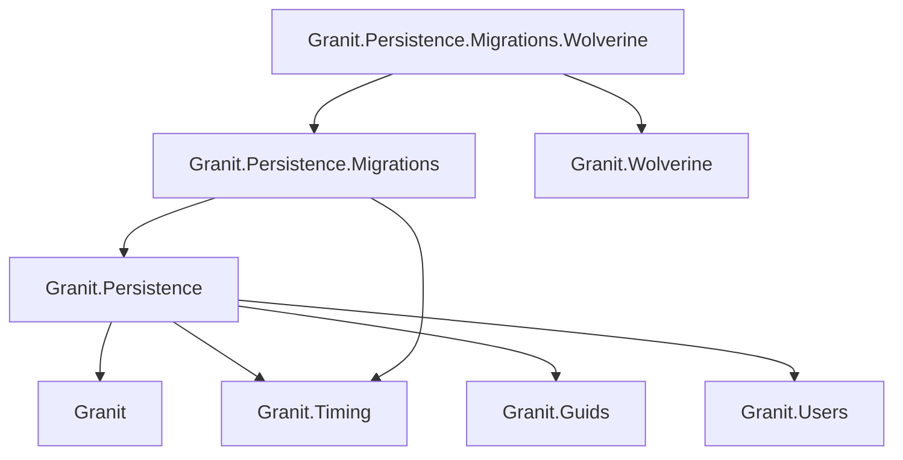

import { Tabs, TabItem, FileTree } from "@astrojs/starlight/components";

Granit.Persistence provides the data access layer for the framework. It automates
ISO 27001 audit trails, GDPR-compliant soft delete, optimistic concurrency control,
domain event dispatching, entity versioning, and multi-tenant query filtering — all
through EF Core interceptors and conventions. No manual `WHERE` clauses, no forgotten
audit fields, no silent data overwrites.

## Package structure

<FileTree>
- Granit.Persistence/ Base interceptors, conventions, data seeding
  - Granit.Persistence.Migrations Zero-downtime batch migrations (Expand & Contract)
  - Granit.Persistence.Migrations.Wolverine Durable outbox-backed migration dispatch
</FileTree>

| Package | Role | Depends on |
|---------|------|------------|
| `Granit.Persistence` | Interceptors, `ApplyGranitConventions`, data seeding | `Granit`, `Granit.Timing`, `Granit.Guids`, `Granit.Users` |
| `Granit.Persistence.Migrations` | Expand & Contract migrations with batch processing | `Granit.Persistence`, `Granit.Timing` |
| `Granit.Persistence.Migrations.Wolverine` | Durable migration dispatch via Wolverine outbox | `Granit.Persistence.Migrations`, `Granit.Wolverine` |

## Dependency graph



## Setup

<Tabs>
<TabItem label="Base (interceptors only)">

```csharp
[DependsOn(typeof(GranitPersistenceModule))]
public class AppModule : GranitModule { }
```

Registers all five interceptors and `IDataFilter`.

</TabItem>
<TabItem label="With migrations">

```csharp
[DependsOn(typeof(GranitPersistenceMigrationsModule))]
public class AppModule : GranitModule
{
    public override void ConfigureServices(ServiceConfigurationContext context)
    {
        context.Services.AddGranitPersistenceMigrations(context.Builder, options =>
        {
            options.UseNpgsql(context.Configuration.GetConnectionString("Migrations"));
        });
    }
}
```

</TabItem>
<TabItem label="With Wolverine migrations">

```csharp
[DependsOn(typeof(GranitPersistenceMigrationsWolverineModule))]
public class AppModule : GranitModule { }
```

Replaces `Channel<T>` dispatcher with durable Wolverine outbox — no batch is lost on failure.

</TabItem>
</Tabs>

## Isolated DbContext pattern

Every `*.EntityFrameworkCore` package that owns a `DbContext` **must** follow this
checklist. No exceptions.

```csharp
public class AppointmentDbContext(
    DbContextOptions<AppointmentDbContext> options,
    ICurrentTenant? currentTenant = null,
    IDataFilter? dataFilter = null)
    : DbContext(options)
{
    public DbSet<Appointment> Appointments => Set<Appointment>();

    protected override void OnModelCreating(ModelBuilder modelBuilder)
    {
        base.OnModelCreating(modelBuilder);
        modelBuilder.ApplyConfigurationsFromAssembly(typeof(AppointmentDbContext).Assembly);

        // MANDATORY — applies all query filters (soft delete, multi-tenant, active, etc.)
        modelBuilder.ApplyGranitConventions(currentTenant, dataFilter);
    }
}
```

Registration in the module:

```csharp
public override void ConfigureServices(ServiceConfigurationContext context)
{
    context.Services.AddGranitDbContext<AppointmentDbContext>(options =>
    {
        options.UseNpgsql(context.Configuration.GetConnectionString("Default"));
    });
}
```

`AddGranitDbContext<T>` handles interceptor wiring automatically — it calls
`UseGranitInterceptors(sp)` internally with `ServiceLifetime.Scoped`.

:::danger
Never call `HasQueryFilter` manually in entity configurations.
`ApplyGranitConventions` handles all standard filters centrally.
Manual filters cause duplicates or conflicts.
:::

## Host-owned migrations

Granit modules ship **entity configurations**, not migrations. Why? Because the host
application — not the framework — decides how to organize its database:

- **Which modules share a DbContext?** A simple app might put everything in one
  `AppDbContext`. A larger system might split `SecurityDbContext` and `BusinessDbContext`.
- **When do migrations run?** At startup (`MigrateAsync`) for dev/staging, or via
  idempotent SQL scripts in CI/CD for production.
- **How do schema changes deploy?** Simple `ALTER TABLE` for single-instance apps,
  or [Expand & Contract](./migrations/) for zero-downtime K8s deployments.

The framework cannot make these decisions — only the host can. So Granit modules
expose their entity configurations via `Configure{Module}Module()` and let the host
generate and own all migration files.

### How it works

Every `*.EntityFrameworkCore` module exposes a public `ModelBuilder` extension.
The host calls these in its own DbContext's `OnModelCreating`:

```csharp
public class AppDbContext(
    DbContextOptions<AppDbContext> options,
    ICurrentTenant? currentTenant = null,
    IDataFilter? dataFilter = null)
    : DbContext(options)
{
    protected override void OnModelCreating(ModelBuilder modelBuilder)
    {
        base.OnModelCreating(modelBuilder);

        // Include Granit module tables in this DbContext
        modelBuilder.ConfigureSettingsModule();
        modelBuilder.ConfigureBackgroundJobsModule();
        modelBuilder.ConfigureNotificationsModule();
        modelBuilder.ConfigureWorkflowModule();

        // MANDATORY — always call last
        modelBuilder.ApplyGranitConventions(currentTenant, dataFilter);
    }
}
```

The module's internal DbContext (used at runtime by module services) calls the
**same** `Configure{Module}Module()` method — guaranteeing that migration-time and
runtime EF models are always identical.

### DbProperties — table naming control

Each module defines a `Granit{Module}DbProperties` static class with configurable
table prefix and schema:

```csharp
// Override before ConfigureServices — EF Core caches the model after first use
GranitBackgroundJobsDbProperties.DbTablePrefix = "background_jobs_";
GranitBackgroundJobsDbProperties.DbSchema = "core";
```

Default prefixes follow the convention **module name in snake\_case + `_`**:

| Module | Default prefix | Example table |
|--------|---------------|---------------|
| `BackgroundJobs` | `background_jobs_` | `background_jobs_background_jobs` |
| `Settings` | `settings_` | `settings_setting_records` |
| `Workflow` | `workflow_` | `workflow_transition_records` |
| `Auditing` | `audit_log_` | `audit_log_log_entries` |
| `Notifications` | `notifications_` | `notifications_user_notifications` |
| `Webhooks` | `webhooks_` | `webhooks_subscriptions` |
| `BlobStorage` | `blob_storage_` | `blob_storage_descriptors` |
| `Features` | `features_` | `features_overrides` |
| `Localization` | `localization_` | `localization_overrides` |
| `AI` | `ai_` | `ai_workspaces` |
| `ApiKeys` | `api_keys_` | `api_keys_api_keys` |
| `Authorization` | `authorization_` | `authorization_permission_grants` |
| `OpenIddict` | `openiddict_` | `openiddict_users` |
| `Identity` | `identity_` | `identity_user_cache_entries` |
| `DataExchange` | `data_exchange_` | `data_exchange_import_jobs` |
| `QueryEngine` | `query_engine_` | `query_engine_saved_views` |
| `Templating` | `templating_` | `templating_revisions` |
| `Timeline` | `timeline_` | `timeline_entries` |

### Generating and applying migrations

Two approaches, depending on your deployment model:

<Tabs>
<TabItem label="Simple — MigrateAsync at startup">

Best for single-instance apps, dev, and staging environments. The application
creates or updates the schema on boot:

```csharp
// Program.cs — after builder.Build()
await using var scope = app.Services.CreateAsyncScope();
var factory = scope.ServiceProvider
    .GetRequiredService<IDbContextFactory<AppDbContext>>();
await using var db = await factory.CreateDbContextAsync();
await db.Database.MigrateAsync();
```

This also works with `WebApplicationFactory` + Testcontainers in integration tests.

</TabItem>
<TabItem label="Production — CI/CD SQL scripts">

For zero-downtime K8s deployments, generate an idempotent SQL script and apply it
**before** the new pods start. This decouples schema changes from application
startup — critical when running multiple replicas:

```bash
# Generate idempotent SQL script
dotnet ef migrations script --idempotent -o migrate.sql \
    --project src/MyApp.Host \
    --context AppDbContext

# Apply via CI/CD pipeline (e.g., Flyway, psql, sqlcmd)
psql -h $DB_HOST -U $DB_USER -d $DB_NAME -f migrate.sql
```

Combine with [Expand & Contract](./migrations/) for column renames, type changes,
and other breaking schema changes that require data backfill.

</TabItem>
<TabItem label="Adding a new migration">

```bash
dotnet ef migrations add AddBackgroundJobsTables \
    --project src/MyApp.Host \
    --context AppDbContext
```

</TabItem>
</Tabs>

:::caution[Never mix EnsureCreated with migrations on a host DbContext]
`EnsureCreatedAsync()` creates the schema without a migration history table.
Once used, `MigrateAsync()` will fail because it cannot determine which
migrations have already been applied. Pick one approach and stick with it.

This restriction applies to **host application DbContexts** that use EF Core migrations.
Internal framework DbContexts (e.g., `OpenIddictDbContext`) may use `EnsureCreated`
safely because they have isolated table prefixes and no migration history of their own.
:::

## Data seeding

Register seed contributors that run at application startup:

```csharp
public class CountryDataSeedContributor(AppDbContext db) : IDataSeedContributor
{
    public async Task SeedAsync(DataSeedContext context, CancellationToken cancellationToken)
    {
        if (await db.Countries.AnyAsync(cancellationToken).ConfigureAwait(false))
            return;

        db.Countries.AddRange(
            new Country { Code = "BE", Name = "Belgium" },
            new Country { Code = "FR", Name = "France" });

        await db.SaveChangesAsync(cancellationToken).ConfigureAwait(false);
    }
}
```

Register with `services.AddTransient<IDataSeedContributor, CountryDataSeedContributor>()`.

`DataSeedingHostedService` orchestrates all contributors at startup. Errors are logged
but do not block application start.

## Soft delete purging

Hard-delete soft-deleted records past retention (ISO 27001):

```csharp
await dbContext.PurgeSoftDeletedBeforeAsync<Patient>(
    cutoff: DateTimeOffset.UtcNow.AddYears(-3),
    batchSize: 1000,
    cancellationToken);
```

Uses `ExecuteDeleteAsync()` with `IgnoreQueryFilters([GranitFilterNames.SoftDelete])`
— only the soft-delete filter is bypassed; the multi-tenant filter remains active,
ensuring purge operations stay scoped to the current tenant. Provider-agnostic,
bypasses interceptors.

## Multi-tenancy strategies

`Granit.Persistence` supports three tenant isolation topologies:

| Strategy | Isolation | Complexity | Use case |
|----------|----------|------------|----------|
| `SharedDatabase` | Query filter (`TenantId` column) | Low | Most applications |
| `SchemaPerTenant` | PostgreSQL schema per tenant | Medium | Stronger isolation, shared infra |
| `DatabasePerTenant` | Separate database per tenant | High | Maximum isolation, regulated data |

Configuration:

```json
{
  "TenantIsolation": {
    "Strategy": "SharedDatabase"
  },
  "TenantSchema": {
    "NamingConvention": "TenantId",
    "Prefix": "tenant_"
  }
}
```

Built-in schema activators: `PostgresqlTenantSchemaActivator`, `MySqlTenantSchemaActivator`,
`OracleTenantSchemaActivator`.

:::caution
Schema activators must execute on every connection open. Pooled connections
retain the previous tenant's schema — failing to reset is a data isolation
breach (ISO 27001).
:::

## Public API summary

| Category | Key types | Package |
|----------|-----------|---------|
| Module | `GranitPersistenceModule` | `Granit.Persistence` |
| Interceptors | `AuditedEntityInterceptor`, `VersioningInterceptor`, `ConcurrencyStampInterceptor`, `DomainEventDispatcherInterceptor`, `SoftDeleteInterceptor` | `Granit.Persistence` |
| Extensions | `AddGranitPersistence()`, `AddGranitDbContext<T>()`, `UseGranitInterceptors()`, `ApplyGranitConventions()` | `Granit.Persistence` |
| Data seeding | `IDataSeeder`, `IDataSeedContributor`, `DataSeedContext` | `Granit.Persistence` |
| Purging | `ISoftDeletePurgeTarget`, `PurgeSoftDeletedBeforeAsync()` | `Granit.Persistence` |
| Query extensions | `IncludeTranslations()`, `WhereTranslation()`, `OrderByTranslation()` | `Granit.Persistence` |
| Multi-tenancy | `TenantIsolationStrategy`, `ITenantSchemaProvider`, `ITenantConnectionStringProvider`, `ITenantSchemaActivator`, `IsolatedDbContextMarker` | `Granit.Persistence` |
| Tenant provisioning | `ITenantProvisioner`, `AutoTenantProvisioner` | `Granit.Persistence.Hosting` |
| Host migrations | `Configure{Module}Module()`, `Granit{Module}DbProperties` | Each `*.EntityFrameworkCore` package |
| Migrations | `MigrationPhase`, `MigrationCycleAttribute`, `IMigrationCycleRegistry`, `BatchMigrationDelegate` | `Granit.Persistence.Migrations` |
| Wolverine dispatch | `GranitPersistenceMigrationsWolverineModule` | `Granit.Persistence.Migrations.Wolverine` |

## Testing persistence

For unit tests that need query filters and interceptors, use SQLite in-memory:

```csharp
[Fact]
public async Task Soft_deleted_entities_are_filtered_out()
{
    // Arrange
    await using var context = CreateSqliteContext<PatientDbContext>();
    var patient = new Patient { Name = "Jane Doe" };
    context.Patients.Add(patient);
    await context.SaveChangesAsync();

    // Act — soft delete
    patient.IsDeleted = true;
    await context.SaveChangesAsync();

    // Assert — filtered by default
    var patients = await context.Patients.ToListAsync();
    patients.ShouldBeEmpty();

    // Assert — visible when filter is disabled
    var all = await context.Patients.IgnoreQueryFilters([GranitFilterNames.SoftDelete]).ToListAsync();
    all.Count.ShouldBe(1);
}
```

For integration tests with real PostgreSQL, use Testcontainers to get full fidelity
(JSON columns, concurrent transactions, schema isolation).

## See also

- [Interceptors](./interceptors/) — audit, soft delete, concurrency, domain events, versioning
- [Query filters](./query-filters/) — named filters, runtime bypass, translations
- [Zero-downtime migrations](./migrations/) — Expand & Contract pattern
- [Adding Persistence guide](/dotnet/getting-started/adding-persistence/) — step-by-step tutorial
- [Core module](../core/module-system/) — domain base types, filter interfaces, `IDataFilter`
- [Multi-tenancy concept](../../concepts/multi-tenancy/) — isolation strategies in depth
- [Wolverine module](/dotnet/infrastructure/wolverine-messaging/) — domain event dispatch and durable messaging
