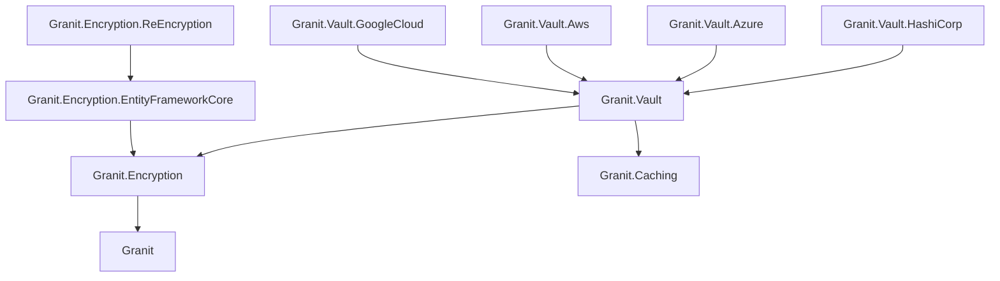

import { FileTree, LinkCard, CardGrid, Aside } from "@astrojs/starlight/components";

## Why you shouldn't store secrets in `appsettings.json`

If your connection string or encryption key lives in a config file, an environment
variable, or a CI secret, you have a rotation problem. The day the key leaks, you
touch every deployed service — under pressure, without a clear audit trail, and
often without knowing which rows were encrypted with the compromised version.

A vault solves that because:

- **Keys never leave the vault boundary.** Your app sends ciphertext over and gets
  plaintext back; the key never reaches process memory (HashiCorp Transit, Azure Key
  Vault RSA, AWS KMS, GCP KMS).
- **Database credentials are short-lived.** The vault mints a new username/password
  per lease; if one leaks, it expires on its own within minutes.
- **Arbitrary secrets are versioned.** mTLS certificates, signing keys, SMTP
  passwords, third-party API tokens are retrieved on demand, and rotations show
  up via a version identifier.

Granit.Vault wraps all four major vault providers behind **three focused .NET
interfaces** so your app doesn't care which cloud you run on. Provider modules
auto-disable in `Development`, so local testing needs zero vault infrastructure.

## Which abstraction do you need?

<CardGrid>
  <LinkCard
    title="I need to encrypt a field or column"
    href="/dotnet/data/vault/encryption/"
    description="ITransitEncryptionService — encrypt/decrypt strings, rewrap to the newest key, detect retired ciphertext. For PII columns, health data, email encryption-at-rest." />
  <LinkCard
    title="I need to read a secret (cert, API key, password)"
    href="/dotnet/data/vault/secrets/"
    description="ISecretStore — pull mTLS certs, signing keys, SMTP credentials, third-party API tokens with version metadata and optional caching." />
  <LinkCard
    title="I need my DB password rotated automatically"
    href="/dotnet/data/vault/credentials/"
    description="IDatabaseCredentialProvider — short-lived credentials with lease renewal managed by the framework; no restart when the vault rotates." />
  <LinkCard
    title="I need to configure HashiCorp / Azure / AWS / GCP"
    href="/dotnet/data/vault/providers/"
    description="Authentication, config reference, and health checks for all four supported providers." />
</CardGrid>

## Quickstart — 4 lines to wire HashiCorp Vault

```csharp
// 1. Install one provider package (others follow the same pattern):
//    dotnet add package Granit.Vault.HashiCorp

// 2. Declare the module (the abstraction module is transitive):
[DependsOn(typeof(GranitVaultHashiCorpModule))]
public class AppModule : GranitModule { }

// 3. Configure — appsettings.json:
//    "Vault": { "Address": "https://vault.example.com", "AuthMethod": "Kubernetes" }

// 4. Inject the abstraction you need:
public sealed class MyService(
    ITransitEncryptionService transit,
    ISecretStore secrets,
    IDatabaseCredentialProvider dbCreds) { /* ... */ }
```

That's it. `Development` uses local AES + no-op credentials; production swaps in the
real vault with no code change.

## Granit.Vault at a glance

| Need | Interface | What you get |
| ---- | --------- | ------------ |
| Encrypt a C# `string` | `ITransitEncryptionService.EncryptAsync` | Provider-specific ciphertext (Vault returns `vault:v3:...` with an embedded version) |
| Decrypt same | `ITransitEncryptionService.DecryptAsync` | Original plaintext |
| Rotate encryption key | `ITransitEncryptionService.RewrapAsync` | Ciphertext re-encrypted to the newest key (server-side on Vault, decrypt-then-encrypt elsewhere) |
| Detect old ciphertext | `ITransitEncryptionService.GetKeyVersion` + `ReEncryptionOptions` | Old rows throw `RetiredKeyVersionException` on decrypt |
| Encrypt an EF Core column | `[Encrypted]` attribute + `EncryptedStringConverter` | Transparent per-entity encryption via `Granit.Encryption.EntityFrameworkCore` |
| Read a cert / API key | `ISecretStore.GetSecretAsync` | `SecretDescriptor` with payload + version + optional `ExpiresOn` (proactive cert reload) |
| Read a secret without throwing on 404 | `ISecretStore.TryGetSecretAsync` | `null` **only** on not-found — 403 / 503 / config errors bubble |
| Get a DB username/password | `IDatabaseCredentialProvider` | Current pair + `IsReady` flag, refreshed in the background |
| Liveness probe for secrets | `AddGranitSecretStoreHealthCheck()` | Reads an optional canary secret, maps to `Healthy` / `Unhealthy` / `Degraded` |

## Package structure

<FileTree>
- Granit.Encryption/ AES-256-CBC default, IStringEncryptionService
  - Granit.Vault/ Abstractions — ITransitEncryptionService, IDatabaseCredentialProvider, ISecretStore, SecretStoreHealthCheck, localization
    - Granit.Vault.HashiCorp HashiCorp Vault provider — VaultSharp client, Transit engine, dynamic DB credentials, KV v2 secrets
    - Granit.Vault.Azure Azure Key Vault provider — RSA-OAEP-256 encryption, secrets, dynamic credentials
    - Granit.Vault.Aws AWS provider — KMS transit encryption, Secrets Manager for secrets & credentials
    - Granit.Vault.GoogleCloud Google Cloud KMS encryption, Secret Manager for secrets & credentials
</FileTree>

| Package | Role | Depends on |
|---------|------|------------|
| `Granit.Encryption` | `IStringEncryptionService`, AES-256-CBC provider | `Granit` |
| `Granit.Encryption.EntityFrameworkCore` | `[Encrypted]`, `EncryptedStringConverter`, `ApplyEncryptionConventions` | `Granit.Encryption`, `Granit.Persistence` |
| `Granit.Encryption.ReEncryption` | `IReEncryptionJob`, `DefaultReEncryptionJob<TContext>` | `Granit.Encryption.EntityFrameworkCore` |
| `Granit.Vault` | Abstractions — `ITransitEncryptionService`, `IDatabaseCredentialProvider`, `ISecretStore`, `SecretDescriptor`, `SecretStoreOptions`, `SecretStoreHealthCheck`, `ReEncryptionOptions` | `Granit.Caching`, `Granit.Encryption` |
| `Granit.Vault.HashiCorp` | VaultSharp client, Transit, dynamic DB credentials, KV v2 secrets | `Granit.Vault` |
| `Granit.Vault.Azure` | RSA-OAEP-256 encryption, secrets, dynamic credentials | `Granit.Vault` |
| `Granit.Vault.Aws` | KMS transit encryption, Secrets Manager | `Granit.Vault` |
| `Granit.Vault.GoogleCloud` | Cloud KMS symmetric encryption, Secret Manager | `Granit.Vault` |

## Dependency graph



<Aside type="note" title="Why does Granit.Vault pull Granit.Caching?">
The `ISecretStore` L1 FusionCache decorator is opt-in via
`Vault:SecretStore:CacheSeconds` (default `0`, disabled). When off, FusionCache is
a zero-cost transitive dependency; when on, it reuses the tenant-aware
`IFusionCache` already registered by `Granit.Caching`.
</Aside>

## See also

- [Field-level encryption](/dotnet/data/encryption/) — `[Encrypted]` attribute, EF Core convention, re-encryption job
- [Caching module](/dotnet/data/caching/) — AES-256 encryption for cached sensitive data
- [Persistence module](/dotnet/data/persistence/) — dynamic credentials integration, interceptors
