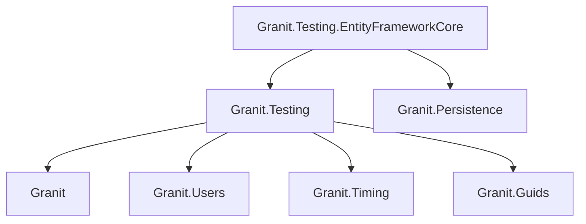

import { Tabs, TabItem, FileTree, Badge } from "@astrojs/starlight/components";

Granit.Testing eliminates the 50+ lines of boilerplate that every test project
repeats: DI setup, NSubstitute mocks for `IClock` / `ICurrentTenant` /
`ICurrentUserService` / `IGuidGenerator`, and EF Core context wiring. New test
setup drops to under 10 lines.

## Package structure

<FileTree>
- Granit.Testing/ Fakes, fixture, Bogus generators
  - Granit.Testing.EntityFrameworkCore InMemory + SQLite DbContext factories
</FileTree>

| Package | Role | Depends on |
|---------|------|------------|
| `Granit.Testing` | `GranitTestFixture`, fakes, `GranitWebApplicationFactory`, Bogus generators | `Granit`, `Granit.Users`, `Granit.Timing`, `Granit.Guids`, `Bogus` |
| `Granit.Testing.EntityFrameworkCore` | `InMemoryDbContextFactory`, `SqliteDbContextFactory`, `AddGranitTestDbContext` | `Granit.Testing`, `Granit.Persistence`, EF Core InMemory, EF Core Sqlite |

## Dependency graph



## AsyncLocal-backed fakes

All fakes store state in `AsyncLocal<T>`. This means each xUnit test gets
**isolated state** even when sharing a fixture via `IClassFixture<T>` — no
cross-test pollution when tests run in parallel.

| Fake | Interface | Default value |
|------|-----------|---------------|
| `FakeCurrentTenant` | `ICurrentTenant` | Unavailable (no tenant) |
| `FakeCurrentUser` | `ICurrentUserService` | Authenticated user `"test-user-001"` |
| `FakeClock` | `IClock` | `2026-01-15T10:00:00Z` |
| `FakeGuidGenerator` | `IGuidGenerator` | Sequential deterministic GUIDs |

### FakeCurrentTenant

```csharp
FakeCurrentTenant tenant = new();
tenant.Id = tenantId;
tenant.Name = "Acme Corp";

// Scope-based (restores previous state on Dispose)
using (tenant.Change(otherTenantId, "Other Corp"))
{
    // tenant.Id == otherTenantId
}
// tenant.Id == tenantId (restored)
```

### FakeClock

```csharp
FakeClock clock = new(); // 2026-01-15T10:00:00Z

clock.Advance(TimeSpan.FromHours(2)); // Now == 12:00
clock.Now = new DateTimeOffset(2030, 1, 1, 0, 0, 0, TimeSpan.Zero); // explicit
```

### FakeGuidGenerator

```csharp
// Queue mode: return exact GUIDs for assertions
FakeGuidGenerator gen = new();
gen.Enqueue(knownGuid);
gen.Create(); // returns knownGuid

// Sequential mode: deterministic GUIDs when queue is empty
gen.Create(); // 00000001-0000-0000-0000-000000000000
gen.Create(); // 00000002-0000-0000-0000-000000000000
```

## GranitTestFixture

Bootstraps the full Granit module graph and replaces core services with fakes.

```csharp
public sealed class CachingTests : IAsyncDisposable
{
    private readonly GranitTestFixture<GranitCachingModule> _fixture = new();

    [Fact]
    public async Task Cache_Service_Is_Resolved()
    {
        await _fixture.BuildAsync();

        var cache = _fixture.GetRequiredService<IFusionCache>();
        cache.ShouldNotBeNull();
    }

    // Customize fakes per test (AsyncLocal isolation)
    [Fact]
    public async Task Tenant_Aware_Cache()
    {
        _fixture.Tenant.Id = Guid.NewGuid();
        await _fixture.BuildAsync();
        // ...
    }

    public async ValueTask DisposeAsync() => await _fixture.DisposeAsync();
}
```

## GranitWebApplicationFactory

For endpoint integration tests with a real HTTP pipeline.

```csharp
public sealed class ApiTests : IClassFixture<GranitWebApplicationFactory<Program>>
{
    private readonly GranitWebApplicationFactory<Program> _factory;

    public ApiTests(GranitWebApplicationFactory<Program> factory)
    {
        _factory = factory;
    }

    [Fact]
    public async Task Get_Returns_Ok()
    {
        _factory.User.UserId = "admin-001";
        _factory.User.AddRole("Admin");

        HttpClient client = _factory.CreateClient();
        HttpResponseMessage response = await client.GetAsync("/api/items");

        response.StatusCode.ShouldBe(HttpStatusCode.OK);
    }
}
```

## EF Core factories

<Tabs>
<TabItem label="SQLite (recommended)">

```csharp
// Real SQL semantics — catches FK violations, type mismatches
using SqliteDbContextFactory<AppDbContext> factory = new();

using AppDbContext context = factory.CreateContext();
context.Orders.Add(new Order { Title = "Test" });
await context.SaveChangesAsync();

// Audit fields set automatically by interceptors
entity.CreatedAt.ShouldBe(factory.Clock.Now);
```

</TabItem>
<TabItem label="InMemory (interceptors only)">

```csharp
// Fast but no SQL translation — use only for interceptor/logic tests
InMemoryDbContextFactory<AppDbContext> factory = new();

using AppDbContext context = factory.CreateContext();
// ...
```

:::caution
The InMemory provider does **not** enforce foreign keys, transactions, or SQL
semantics. Tests will pass here but may fail on PostgreSQL/SQL Server.
Use `SqliteDbContextFactory` unless you have a specific reason not to.
:::

</TabItem>
<TabItem label="DI integration">

```csharp
// Inside GranitTestFixture — registers DbContext in the DI container
await fixture.BuildAsync(services =>
    services.AddGranitTestDbContext<AppDbContext>());

var context = fixture.GetRequiredService<AppDbContext>();
```

</TabItem>
</Tabs>

## Bogus generators

### GranitFaker

Static factory methods for generating realistic fake data.

```csharp
FakeCurrentUser user = GranitFaker.CurrentUser().Generate();
// user.UserId = "a3f1b2c4-...", user.Email = "john.doe@example.com"

FakeCurrentTenant tenant = GranitFaker.Tenant().Generate();
// tenant.Id = Guid, tenant.Name = "Acme Corp"
```

### Entity audit extensions

```csharp
// Populate audit fields on domain entities
List<Invoice> invoices = new Faker<Invoice>()
    .RuleForFullAudit()          // Id, CreatedAt/By, ModifiedAt/By, IsDeleted
    .RuleForMultiTenant(tenantId) // TenantId
    .RuleFor(i => i.Amount, f => f.Finance.Amount())
    .Generate(50);
```

| Extension | Constraint | Fields populated |
| --------- | ---------- | ---------------- |
| `RuleForCreationAudit<T>()` | `T : CreationAuditedEntity` | `Id`, `CreatedAt`, `CreatedBy` |
| `RuleForAudit<T>()` | `T : AuditedEntity` | + `ModifiedAt`, `ModifiedBy` |
| `RuleForFullAudit<T>()` | `T : FullAuditedEntity` | + `IsDeleted`, `DeletedAt`, `DeletedBy` |
| `RuleForMultiTenant<T>()` | `T : IMultiTenant` | `TenantId` |
