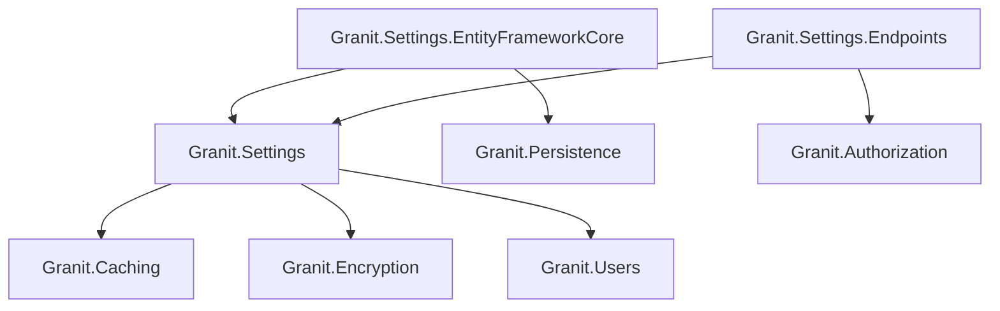

import { Tabs, TabItem, FileTree } from "@astrojs/starlight/components";

Cascading key-value settings engine with user/tenant/global scopes, encrypted storage,
and distributed cache. Each scope is resolved through a provider chain — the first
non-null value wins.

## Package structure

<FileTree>

- Granit.Settings/ Cascading settings engine (User, Tenant, Global, Configuration, Default)
  - Granit.Settings.EntityFrameworkCore Isolated SettingsDbContext
  - Granit.Settings.Endpoints User, Global, and Tenant setting HTTP endpoints

</FileTree>

| Package | Role | Depends on |
|---------|------|------------|
| `Granit.Settings` | `ISettingProvider`, `ISettingManager`, cascading resolution | `Granit.Caching`, `Granit.Encryption`, `Granit.Users` |
| `Granit.Settings.EntityFrameworkCore` | `SettingsDbContext` (isolated, multi-tenant + soft-delete) | `Granit.Settings`, `Granit.Persistence` |
| `Granit.Settings.Endpoints` | User/Global/Tenant HTTP endpoints, `SettingsCultureMiddleware` | `Granit.Settings`, `Granit.Authorization` |

## Dependency graph



## Setup

<Tabs>
<TabItem label="Core + EF Core">

```csharp
[DependsOn(
    typeof(GranitSettingsModule),
    typeof(GranitSettingsEntityFrameworkCoreModule))]
public class AppModule : GranitModule { }
```

```csharp
// Program.cs
builder.AddGranitSettingsEntityFrameworkCore(opt =>
    opt.UseNpgsql(connectionString));
```

</TabItem>
<TabItem label="With endpoints">

```csharp
[DependsOn(
    typeof(GranitSettingsModule),
    typeof(GranitSettingsEntityFrameworkCoreModule),
    typeof(GranitSettingsEndpointsModule))]
public class AppModule : GranitModule { }
```

```csharp
// Program.cs — map endpoints
app.MapGranitUserSettings();    // GET/PUT/DELETE /settings/user/{name}
app.MapGranitGlobalSettings();  // GET/PUT /settings/global/{name}
app.MapGranitTenantSettings();  // GET/PUT /settings/tenant/{name}
```

</TabItem>
</Tabs>

## Defining settings

Implement `ISettingDefinitionProvider` in any module. Providers are auto-discovered at startup.

```csharp
public sealed class AcmeSettingDefinitionProvider : ISettingDefinitionProvider
{
    public void Define(ISettingDefinitionContext context)
    {
        context.Add(new SettingDefinition("Acme.DefaultPageSize")
        {
            DefaultValue = "25",
            IsVisibleToClients = true,
            IsInherited = true,
            Description = "Default number of items per page"
        });

        context.Add(new SettingDefinition("Acme.SmtpPassword")
        {
            DefaultValue = null,
            IsEncrypted = true,
            IsVisibleToClients = false,
            Providers = { "G" }  // Global scope only
        });
    }
}
```

### SettingDefinition properties

| Property | Default | Description |
|----------|---------|-------------|
| `Name` | _(required)_ | Unique setting key |
| `DefaultValue` | `null` | Fallback when no provider supplies a value |
| `IsEncrypted` | `false` | Encrypt at rest via `IStringEncryptionService` |
| `IsVisibleToClients` | `false` | Expose via user-scoped API endpoints |
| `IsInherited` | `true` | Lower-priority scopes inherit from higher-priority ones |
| `Providers` | `[]` (all) | Allow-list of provider names (`"U"`, `"T"`, `"G"`) |

## Value cascade

Settings are resolved through a provider chain. The first provider that returns a
non-null value wins:

```
User (U) → Tenant (T) → Global (G) → Configuration (appsettings.json) → Default (code)
```

When `IsInherited = false`, each scope is independent and does not fall through.


## Reading settings

```csharp
public class ReportService(ISettingProvider settings)
{
    public async Task<int> GetPageSizeAsync(CancellationToken ct)
    {
        string? value = await settings
            .GetOrNullAsync("Acme.DefaultPageSize", ct)
            .ConfigureAwait(false);

        return int.TryParse(value, out int size) ? size : 25;
    }
}
```

## Writing settings

```csharp
public class AdminService(ISettingManager settingManager)
{
    public async Task SetGlobalPageSizeAsync(int size, CancellationToken ct)
    {
        await settingManager
            .SetGlobalAsync("Acme.DefaultPageSize", size.ToString(), ct)
            .ConfigureAwait(false);
    }

    public async Task SetTenantThemeAsync(Guid tenantId, string theme, CancellationToken ct)
    {
        await settingManager
            .SetForTenantAsync(tenantId, "Acme.Theme", theme, ct)
            .ConfigureAwait(false);
    }

    public async Task SetUserLocaleAsync(string userId, string locale, CancellationToken ct)
    {
        await settingManager
            .SetForUserAsync(userId, "Granit.PreferredCulture", locale, ct)
            .ConfigureAwait(false);
    }
}
```

## Endpoints

| Scope | Method | Route | Permission |
|-------|--------|-------|------------|
| User | `GET` | `/settings/user` | Authenticated |
| User | `GET` | `/settings/user/{name}` | Authenticated |
| User | `PUT` | `/settings/user/{name}` | Authenticated |
| User | `DELETE` | `/settings/user/{name}` | Authenticated |
| Global | `GET` | `/settings/global` | `Settings.Global.Read` |
| Global | `PUT` | `/settings/global/{name}` | `Settings.Global.Manage` |
| Tenant | `GET` | `/settings/tenant` | `Settings.Tenant.Read` |
| Tenant | `PUT` | `/settings/tenant/{name}` | `Settings.Tenant.Manage` |

:::note[Encrypted settings]
All `GET` endpoints mask settings declared with `IsEncrypted = true` -- their values
are returned as `"***"` instead of the decrypted plaintext. `PUT` endpoints accept
plaintext values which are encrypted transparently by the store layer.
:::

## SettingsCultureMiddleware

Hydrates `CultureInfo.CurrentUICulture` and `ICurrentTimezoneProvider` from the
authenticated user's `Granit.PreferredCulture` and `Granit.PreferredTimezone` settings.
Runs after authentication, before endpoint handlers. No-op for anonymous requests.

```csharp
// Program.cs
app.UseAuthentication();
app.UseMiddleware<SettingsCultureMiddleware>();
app.UseAuthorization();
```

## Configuration

```json
{
  "Settings": {
    "CacheExpiration": "00:30:00"
  }
}
```

| Property | Default | Description |
|----------|---------|-------------|
| `CacheExpiration` | `00:30:00` | Cache entry TTL for resolved setting values |

## Security

### Encryption at rest

Settings declared with `IsEncrypted = true` are encrypted by `IStringEncryptionService`
(AES-256 or Vault Transit) in the `EfCoreSettingStore` layer before database persistence.
The FusionCache layer stores plaintext to avoid double encryption -- Redis is protected
by `AesCacheValueEncryptor` independently.

### Value masking

Encrypted setting values are never exposed via HTTP:

- **GET endpoints** return `"***"` for encrypted settings (all scopes: User, Global, Tenant)
- **`SettingChangedEvent`** masks `OldValue` and `NewValue` for encrypted settings,
  preventing sensitive values from leaking into audit log handlers or event consumers

### Input validation

Setting values are limited to **4000 characters** (enforced both by endpoint validation
and a database column constraint).

### Observability

`SettingsMetrics` emits three counters via `IMeterFactory` (meter: `Granit.Settings`):

| Metric | Description |
|--------|-------------|
| `granit.settings.value.changed` | Setting values created or updated |
| `granit.settings.value.deleted` | Setting values deleted |
| `granit.settings.cache.invalidated` | Cache entries invalidated after a write |

All counters include `tenant_id`, `provider_name`, and `setting_name` tags.

## Public API summary

| Category | Key types | Package |
|----------|-----------|---------|
| Modules | `GranitSettingsModule`, `GranitSettingsEntityFrameworkCoreModule`, `GranitSettingsEndpointsModule` | -- |
| Abstractions | `ISettingProvider` (`GetOrNullAsync`, `GetAllAsync`), `ISettingManager` (`SetGlobalAsync`, `SetForTenantAsync`, `SetForUserAsync`) | `Granit.Settings` |
| Definitions | `SettingDefinition`, `ISettingDefinitionProvider`, `SettingDefinitionManager` | `Granit.Settings` |
| Options | `SettingsOptions` (section `"Settings"`, `CacheExpiration`) | `Granit.Settings` |
| Endpoints | `MapGranitUserSettings()`, `MapGranitGlobalSettings()`, `MapGranitTenantSettings()`, `SettingsCultureMiddleware` | `Granit.Settings.Endpoints` |

## See also

- [Features](/dotnet/infrastructure/feature-flags/) -- SaaS feature flags with plan-based activation
- [Reference Data](/dotnet/business/reference-data/) -- i18n lookup tables
- [Caching](/dotnet/data/caching/) -- used by Settings for value caching
- [Persistence](/dotnet/data/persistence/) -- isolated DbContext pattern
- [Security](/dotnet/security/security-overview/) -- permission-based access for admin endpoints
