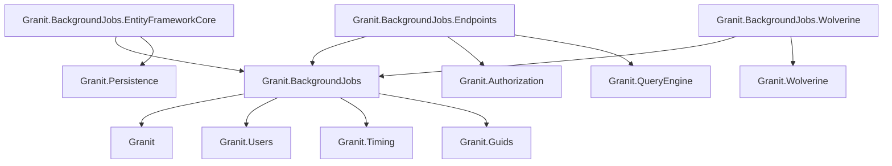
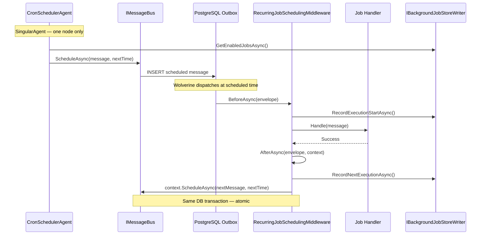

import { Tabs, TabItem, FileTree, Badge } from "@astrojs/starlight/components";

Granit.BackgroundJobs provides a declarative, attribute-driven recurring job system built on
[Cronos](https://github.com/HangfireIO/Cronos) cron parsing. Decorate a message class with
`[RecurringJob]`, write a handler, and the framework handles scheduling, persistence, pause/resume,
manual trigger, failure tracking, and ISO 27001 audit trail. By default, jobs dispatch through
in-process `Channel<T>` — add the Wolverine package for durable outbox scheduling with
cluster-safe singleton execution.

## Package structure

<FileTree>
- Granit.BackgroundJobs/ Core: \[RecurringJob\] attribute, Cronos cron, CQRS interfaces, Channel dispatcher
  - Granit.BackgroundJobs.EntityFrameworkCore EF Core store (SQL Server / PostgreSQL)
  - Granit.BackgroundJobs.Endpoints Minimal API admin endpoints (RBAC)
  - Granit.BackgroundJobs.Wolverine Durable outbox, SingularAgent, atomic rescheduling middleware
</FileTree>

| Package | Role | Depends on |
|---------|------|------------|
| `Granit.BackgroundJobs` | `[RecurringJob]` attribute, `IBackgroundJobReader`/`Writer`, in-memory store, Channel dispatcher | `Granit`, `Granit.Users`, `Granit.Timing`, `Granit.Guids` |
| `Granit.BackgroundJobs.EntityFrameworkCore` | `BackgroundJobsDbContext`, `EfBackgroundJobStore` (durable persistence) | `Granit.BackgroundJobs`, `Granit.Persistence` |
| `Granit.BackgroundJobs.Endpoints` | 5 Minimal API endpoints with `BackgroundJobs.Jobs.Manage` permission | `Granit.BackgroundJobs`, `Granit.Authorization`, `Granit.QueryEngine` |
| `Granit.BackgroundJobs.Wolverine` | `CronSchedulerAgent` (singleton), `RecurringJobSchedulingMiddleware`, DLQ inspector | `Granit.BackgroundJobs`, `Granit.Wolverine` |

## Dependency graph



## Setup

<Tabs>
<TabItem label="Development (in-memory)">

```csharp
[DependsOn(typeof(GranitBackgroundJobsModule))]
public class AppModule : GranitModule { }
```

No database required. Jobs are stored in a `ConcurrentDictionary`. State is lost on restart.

</TabItem>
<TabItem label="Production (EF Core + Wolverine)">

```csharp
[DependsOn(
    typeof(GranitBackgroundJobsEntityFrameworkCoreModule),
    typeof(GranitBackgroundJobsWolverineModule),
    typeof(GranitBackgroundJobsEndpointsModule))]
public class AppModule : GranitModule
{
    public override void ConfigureServices(ServiceConfigurationContext context)
    {
        context.Builder.AddGranitBackgroundJobsEntityFrameworkCore(
            options => options.UseNpgsql(
                context.Configuration.GetConnectionString("BackgroundJobs")));
    }
}
```

```json
{
  "ConnectionStrings": {
    "BackgroundJobs": "Host=db;Database=myapp;Username=app;Password=..."
  }
}
```

Route registration in `Program.cs`:

```csharp
app.MapGranitBackgroundJobs();
```

</TabItem>
<TabItem label="EF Core without Wolverine">

```csharp
[DependsOn(typeof(GranitBackgroundJobsEntityFrameworkCoreModule))]
public class AppModule : GranitModule
{
    public override void ConfigureServices(ServiceConfigurationContext context)
    {
        context.Builder.AddGranitBackgroundJobsEntityFrameworkCore(
            options => options.UseNpgsql(
                context.Configuration.GetConnectionString("BackgroundJobs")));
    }
}
```

Jobs persist in the database but dispatch uses in-process `Channel<T>`. Scheduling does not
survive process restarts and is not cluster-safe. Suitable for single-instance deployments.

</TabItem>
</Tabs>

## Naming convention

Background jobs follow a strict naming convention, parallel to events (`*Event` / `*Eto`):

| Aspect | Convention |
|--------|-----------|
| **Marker** | `IBackgroundJob` + `[RecurringJob]` attribute |
| **Suffix** | `*Job` (e.g., `OrphanBlobCleanupJob`) |
| **Record shape** | `[RecurringJob("cron", "name")] sealed record XxxJob : IBackgroundJob` |
| **Handler** | `internal static partial class XxxHandler` with `HandleAsync` |
| **Location** | `Granit.{Module}/Jobs/` (job + handler in same folder) |
| **Job name** | `{module-kebab}-{action-kebab}` (e.g., `"blob-storage-orphan-cleanup"`) |

Architecture tests enforce:

- All `IBackgroundJob` implementors must end with `Job`
- All `[RecurringJob]`-decorated types must implement `IBackgroundJob`

## Declaring a recurring job

Implement `IBackgroundJob`, decorate with `[RecurringJob]`, and write a handler:

```csharp
// src/Granit.MyModule/Jobs/NightlyCleanupJob.cs
[RecurringJob("0 2 * * *", "my-module-nightly-cleanup")]
public sealed record NightlyCleanupJob : IBackgroundJob;

// src/Granit.MyModule/Jobs/NightlyCleanupHandler.cs
internal static partial class NightlyCleanupHandler
{
    public static async Task HandleAsync(
        NightlyCleanupJob job,
        AppDbContext db,
        IClock clock,
        CancellationToken cancellationToken)
    {
        DateTimeOffset cutoff = clock.Now.AddDays(-90);
        await db.Appointments
            .Where(a => a.Status == AppointmentStatus.Cancelled
                && a.CancelledAt < cutoff)
            .ExecuteDeleteAsync(cancellationToken)
            .ConfigureAwait(false);
    }
}
```

### RecurringJobAttribute

```csharp
[RecurringJob(string cronExpression, string name)]
```

| Parameter | Description |
|-----------|-------------|
| `cronExpression` | Standard 5-field or 6-field (with seconds) cron expression, parsed by [Cronos](https://github.com/HangfireIO/Cronos) |
| `name` | Unique, stable identifier (kebab-case). Used as primary key in the persistent store |

Common cron expressions:

| Expression | Schedule |
|-----------|----------|
| `0 * * * *` | Every hour at minute 0 |
| `0 2 * * *` | Daily at 02:00 UTC |
| `0 0 * * 1` | Every Monday at 00:00 UTC |
| `*/5 * * * *` | Every 5 minutes |
| `0 0 1 * *` | First day of each month at 00:00 UTC |
| `0 */30 * * * *` | Every 30 seconds (6-field format) |

## Job discovery and seeding

On application startup, `RecurringJobDiscovery` scans the entry assembly (and any additional
assemblies passed to `AddGranitBackgroundJobs()`) for types decorated with `[RecurringJob]`.
Discovered jobs are seeded into the store via `IBackgroundJobStoreWriter.SeedJobsAsync()`:

- **New jobs** are inserted with `IsEnabled = true`.
- **Existing jobs** have their `CronExpression` and `MessageType` updated. Administrative state
  (`IsEnabled`, `TriggeredBy`, failure counters) is preserved across deployments.

## BackgroundJobDefinition entity

The persistent administrative record for each recurring job:

| Property | Type | Description |
|----------|------|-------------|
| `Id` | `Guid` | Primary key (sequential GUID) |
| `JobName` | `string` (max 200) | Unique identifier matching `[RecurringJob]` name |
| `MessageType` | `string` (max 500) | Assembly-qualified CLR type of the message |
| `CronExpression` | `string` (max 100) | Cron schedule (5 or 6 fields) |
| `IsEnabled` | `bool` | Active state (`false` = paused) |
| `LastExecutedAt` | `DateTimeOffset?` | UTC timestamp of last execution start |
| `NextExecutionAt` | `DateTimeOffset?` | UTC timestamp of next scheduled execution |
| `ConsecutiveFailureCount` | `int` | Failures since last success (reset on success) |
| `LastErrorMessage` | `string?` (max 500 + suffix) | Error from last failure, truncated to 500 chars to limit information disclosure (`null` on success) |
| `TriggeredBy` | `string?` (max 450) | UserId of manual trigger operator (ISO 27001 audit) |

EF Core table: `background_jobs_background_jobs` with a unique index on `JobName`.

## CQRS reader/writer interfaces

### IBackgroundJobReader

Read-only monitoring interface returning immutable `BackgroundJobStatus` snapshots:

```csharp
public interface IBackgroundJobReader
{
    Task<IReadOnlyList<BackgroundJobStatus>> GetAllAsync(
        CancellationToken cancellationToken = default);
    Task<BackgroundJobStatus?> FindAsync(
        string jobName, CancellationToken cancellationToken = default);
}
```

`BackgroundJobStatus` includes a `DeadLetterCount` field populated from Wolverine's DLQ
(returns `0` in in-memory mode).

### IBackgroundJobWriter

Administrative operations with ISO 27001 audit trail:

```csharp
public interface IBackgroundJobWriter
{
    Task PauseAsync(string jobName, CancellationToken cancellationToken = default);
    Task ResumeAsync(string jobName, CancellationToken cancellationToken = default);
    Task TriggerNowAsync(string jobName, CancellationToken cancellationToken = default);
}
```

| Method | Behavior |
|--------|----------|
| `PauseAsync` | Sets `IsEnabled = false`. Current execution completes; rescheduling is skipped. Emits `BackgroundJobPausedEvent` domain event |
| `ResumeAsync` | Sets `IsEnabled = true` and immediately schedules the next cron occurrence. Emits `BackgroundJobResumedEvent` domain event |
| `TriggerNowAsync` | Dispatches the job message immediately. Propagates caller identity via `X-Triggered-By` header for audit |

### Store-level interfaces

Low-level persistence (internal use by the framework, not typically consumed by application code):

| Interface | Role |
|-----------|------|
| `IBackgroundJobStoreReader` | `FindAsync`, `GetEnabledJobsAsync`, `GetAllJobsAsync` |
| `IBackgroundJobStoreWriter` | `SeedJobsAsync`, `RecordExecutionStartAsync`, `RecordNextExecutionAsync`, `RecordExecutionFailureAsync`, `SetEnabledAsync`, `SetTriggeredByAsync` |

## Scheduling flow

### Without Wolverine (in-process Channel)

```mermaid
sequenceDiagram
    participant Seed as SeedService
    participant Sched as ChannelCronSchedulerService
    participant Ch as Channel&lt;T&gt;
    participant Worker as BackgroundJobWorker
    participant Handler as Job Handler
    participant Store as IBackgroundJobStoreWriter

    Seed->>Store: SeedJobsAsync(registrations)
    Sched->>Store: GetEnabledJobsAsync()
    Sched->>Ch: ScheduleAsync(message, nextTime)
    Note over Sched,Ch: Task.Delay until scheduled time
    Ch->>Worker: ReadAllAsync()
    Worker->>Store: RecordExecutionStartAsync()
    Worker->>Handler: HandleAsync(message, ct)
    Handler-->>Worker: Success
    Worker->>Store: RecordNextExecutionAsync()
    Worker->>Ch: ScheduleAsync(nextMessage, nextTime)
```

The `ChannelCronSchedulerService` is a `BackgroundService` that schedules the first occurrence
of each enabled job on startup. After each successful handler execution, `BackgroundJobWorker`
computes and schedules the next occurrence. This does **not** survive process restarts and
does **not** guarantee singleton execution across nodes.

### With Wolverine (durable outbox)



## CronSchedulerAgent (cluster-safe singleton)

When `Granit.BackgroundJobs.Wolverine` is loaded, the `ChannelCronSchedulerService` is replaced
by a Wolverine `SingularAgent` (URI: `granit-background-jobs://singleton`). Wolverine guarantees
that exactly **one node** in the cluster runs this agent at a time, preventing duplicate
scheduling on multi-node startup.

**Anti-doublon guarantee:** before scheduling a job, the agent checks whether
`BackgroundJobDefinition.NextExecutionAt` is already in the future. If it is, the job is
already scheduled in the Outbox — no duplicate message is created.

## RecurringJobSchedulingMiddleware

Wolverine middleware automatically injected onto all handler chains whose message type carries
`[RecurringJob]`. Never applied manually.

**Before handler execution:**
- Records execution start time in the store
- Reads the `X-Triggered-By` envelope header and persists it for ISO 27001 audit

**After handler execution:**
- Computes the next cron occurrence
- Calls `context.ScheduleAsync()` inside the **same database transaction** as the handler
- Updates `NextExecutionAt` in the store

**Atomicity guarantee:** the next scheduled message is inserted in the Outbox within the same
transaction as the handler's business data. If the node crashes before commit, Wolverine
redelivers the current message — the "next" message was never inserted, so no duplicate exists.

:::caution
If a job is paused (`IsEnabled = false`), the middleware skips rescheduling after execution.
The current execution always completes normally.
:::

## Wolverine-optional pattern (Channel fallback)

Wolverine is **not** required to use Granit.BackgroundJobs. The core package registers
in-process `Channel<T>` implementations by default:

| Component | Without Wolverine | With Wolverine |
|-----------|-------------------|----------------|
| `IBackgroundJobDispatcher` | `ChannelBackgroundJobDispatcher` (in-memory) | `WolverineBackgroundJobDispatcher` (`IMessageBus`) |
| Scheduler | `ChannelCronSchedulerService` (`BackgroundService`) | `CronSchedulerAgent` (`SingularAgent`) |
| `IDeadLetterQueueInspector` | `NullDeadLetterQueueInspector` (returns `0`) | `WolverineDeadLetterQueueInspector` (`IMessageStore`) |
| Rescheduling | `BackgroundJobWorker` (in-process, post-handler) | `RecurringJobSchedulingMiddleware` (atomic, in-transaction) |

When `GranitBackgroundJobsWolverineModule` is loaded, it replaces all Channel-based registrations
with Wolverine-backed implementations via `ServiceDescriptor.Replace()`.

## Endpoints

Five Minimal API endpoints with split permissions — `BackgroundJobs.Jobs.Read` for read
operations and `BackgroundJobs.Jobs.Manage` for mutations:

| Method | Route | Handler | Permission | Response |
|--------|-------|---------|------------|----------|
| `GET` | `/{prefix}` | List all jobs (paginated) | `Jobs.Read` | `200 OK` with `PagedResult<BackgroundJobStatus>` |
| `GET` | `/{prefix}/{name}` | Get job by name | `Jobs.Read` | `200 OK` / `404 Not Found` |
| `POST` | `/{prefix}/{name}/pause` | Pause a job | `Jobs.Manage` | `204 No Content` / `404 Not Found` |
| `POST` | `/{prefix}/{name}/resume` | Resume a paused job | `Jobs.Manage` | `204 No Content` / `404 Not Found` |
| `POST` | `/{prefix}/{name}/trigger` | Trigger immediate execution | `Jobs.Manage` | `202 Accepted` / `404 Not Found` |

Default route prefix: `background-jobs`. Customize via `BackgroundJobsEndpointsOptions`:

```csharp
app.MapGranitBackgroundJobs(opts =>
{
    opts.RoutePrefix = "admin/jobs";
    opts.RequiredRole = "ops-team";
    opts.TagName = "Job Administration";
});
```

### Permission model

Two permissions control access with least-privilege separation:

| Permission | Grants |
|------------|--------|
| `BackgroundJobs.Jobs.Read` | View job status and metadata (GET endpoints) |
| `BackgroundJobs.Jobs.Manage` | Pause, resume, and trigger jobs (POST endpoints) |

Both integrate with the Granit RBAC pipeline:

1. `AlwaysAllow` bypass (dev/test: `GranitAuthorizationOptions.AlwaysAllow = true`)
2. Admin role bypass (`GranitAuthorizationOptions.AdminRoles`)
3. Permission grant store query per role

In production, grant permissions via:
- Add the role to `GranitAuthorizationOptions.AdminRoles`
- Call `IPermissionManagerWriter.SetAsync("BackgroundJobs.Jobs.Read", "my-role", tenantId, true)`
- Call `IPermissionManagerWriter.SetAsync("BackgroundJobs.Jobs.Manage", "my-role", tenantId, true)`

## Domain events

| Event | Emitted when |
|-------|-------------|
| `BackgroundJobPausedEvent(Guid JobId, string JobName)` | Job is paused via `IBackgroundJobWriter.PauseAsync` |
| `BackgroundJobResumedEvent(Guid JobId, string JobName)` | Job is resumed via `IBackgroundJobWriter.ResumeAsync` |

Both implement `IDomainEvent` and can be handled by Wolverine or in-process subscribers.

## Observability

The module registers a `Granit.BackgroundJobs` `ActivitySource` for distributed tracing.
Manual triggers create a `backgroundjobs.trigger` span with tags:

| Tag | Value |
|-----|-------|
| `backgroundjobs.job_name` | Job name |
| `backgroundjobs.triggered_by` | UserId or `"system"` |

When `Granit.Observability` is loaded, the activity source is auto-discovered via
`GranitActivitySourceRegistry`.

## Configuration reference

```json
{
  "BackgroundJobs": {
    "Mode": "Durable",
    "ConnectionString": "Host=db;Database=myapp;Username=app;Password=..."
  },
  "BackgroundJobsEndpoints": {
    "RoutePrefix": "background-jobs",
    "RequiredRole": "granit-background-jobs-admin",
    "TagName": "Background Jobs"
  }
}
```

| Property | Default | Description |
|----------|---------|-------------|
| `BackgroundJobs.Mode` | `InMemory` | `InMemory` (no DB) or `Durable` (EF Core) |
| `BackgroundJobs.ConnectionString` | — | Required when `Mode = Durable` |
| `BackgroundJobsEndpoints.RoutePrefix` | `"background-jobs"` | URL prefix for admin endpoints |
| `BackgroundJobsEndpoints.RequiredRole` | `"granit-background-jobs-admin"` | Role required for endpoint access |
| `BackgroundJobsEndpoints.TagName` | `"Background Jobs"` | OpenAPI tag name |

## Public API summary

| Category | Key types | Package |
|----------|-----------|---------|
| Module | `GranitBackgroundJobsModule`, `GranitBackgroundJobsEntityFrameworkCoreModule`, `GranitBackgroundJobsEndpointsModule`, `GranitBackgroundJobsWolverineModule` | -- |
| Marker | `IBackgroundJob` | `Granit.BackgroundJobs` |
| Attribute | `[RecurringJob]` | `Granit.BackgroundJobs` |
| CQRS | `IBackgroundJobReader`, `IBackgroundJobWriter` | `Granit.BackgroundJobs` |
| Store | `IBackgroundJobStoreReader`, `IBackgroundJobStoreWriter` | `Granit.BackgroundJobs` |
| Domain | `BackgroundJobDefinition`, `BackgroundJobStatus`, `RecurringJobRegistration`, `JobStoreMode` | `Granit.BackgroundJobs` |
| Events | `BackgroundJobPausedEvent`, `BackgroundJobResumedEvent` | `Granit.BackgroundJobs` |
| Abstractions | `IBackgroundJobDispatcher`, `IDeadLetterQueueInspector` | `Granit.BackgroundJobs` |
| Headers | `BackgroundJobHeaders` (`X-Triggered-By`) | `Granit.BackgroundJobs` |
| Options | `BackgroundJobsOptions`, `BackgroundJobsEndpointsOptions` | -- |
| Permissions | `BackgroundJobsPermissions.Jobs.Read`, `BackgroundJobsPermissions.Jobs.Manage` | `Granit.BackgroundJobs.Endpoints` |
| Middleware | `RecurringJobSchedulingMiddleware` | `Granit.BackgroundJobs.Wolverine` |
| Extensions | `AddGranitBackgroundJobs()`, `AddGranitBackgroundJobsEntityFrameworkCore()`, `MapGranitBackgroundJobs()` | -- |

## When to use — and when not to

Use Granit.BackgroundJobs when:

- You need **recurring scheduled work** (cron-based: nightly reports, weekly cleanups, hourly syncs)
- Jobs must be **durable** — surviving restarts and distributed across cluster nodes
- You need **admin visibility** — pause/resume/trigger jobs via endpoints, audit who did what
- Jobs must propagate **tenant context** and **user context** (multi-tenant background processing)

Skip it when:

- You need a **one-off async task** after an HTTP request (e.g., send a confirmation email) — use Wolverine's `IMessageBus.PublishAsync()` directly
- The work is **fire-and-forget with no durability requirement** — `Task.Run()` or a hosted service is simpler
- You need **sub-second scheduling** — cron's minimum granularity is 1 second; for real-time use Wolverine message scheduling

## Common pitfalls

:::caution[In-memory mode loses jobs on restart]
The default `BackgroundJobs.Mode = InMemory` is for development only. In production,
always set `Mode = Durable` with an EF Core store — otherwise, a pod restart drops
all pending and scheduled jobs silently.
:::

:::caution[Paused jobs skip rescheduling]
When a recurring job is paused, the cron scheduler stops scheduling new executions.
When resumed, it **does not** retroactively execute missed runs — it schedules the
next future occurrence. Design jobs to be idempotent and catch up on missed work
if needed.
:::

:::caution[Wolverine singleton agent]
The `CronSchedulerAgent` runs on a single Wolverine node (leader election). If that
node crashes, another node picks up after the leadership timeout (~30s). During this
window, no new cron jobs are scheduled. Existing running jobs on other nodes are not
affected.
:::

## Testing background jobs

Test job handlers as plain classes — no scheduler needed:

```csharp
[Fact]
public async Task Cleanup_job_deletes_expired_records()
{
    // Arrange
    await using var context = CreateSqliteContext<AppDbContext>();
    var clock = new FakeTimeProvider(DateTimeOffset.UtcNow);
    var handler = new ExpiredRecordCleanupJob(context, clock);

    context.Records.Add(new Record { ExpiresAt = clock.Now.AddDays(-1) });
    await context.SaveChangesAsync();

    // Act
    await handler.HandleAsync(new RunExpiredRecordCleanup());

    // Assert
    var remaining = await context.Records.CountAsync();
    remaining.ShouldBe(0);
}
```

## Security considerations

**Error message truncation:** `BackgroundJobDefinition.RecordFailure()` truncates error messages
to 500 characters before persisting them. This prevents accidental information disclosure through
the admin API or integration events. Job handlers should still avoid including PII in exception
messages.

**Type validation:** `CronSchedulerHelper.CreateMessage()` validates that the resolved CLR type
implements `IBackgroundJob` before instantiation, preventing arbitrary type activation from
tampered database values.

**Key material zeroization:** The `OpenIddictKeyRotationJob` clears RSA private key bytes from
memory via `CryptographicOperations.ZeroMemory()` immediately after encryption, minimizing the
window for key material exposure through memory dumps.

**GDPR deletion ordering:** `DeletionDeadlineEnforcerHandler` publishes deletion events into the
Wolverine outbox before marking the request as executed, ensuring deletion is never silently
skipped on partial failure.

## Notifications

`Granit.BackgroundJobs.Notifications` ships notifications for the lifecycle events
of this module. Tenants opt in via the notifications admin UI.

| Notification | Trigger | Channels | Severity |
| ------------ | ------- | -------- | :------: |
| `jobs.recurring_failing` | `BackgroundJobFailureThresholdExceededEto` — emitted when a recurring job exceeds its consecutive-failure threshold | Email, InApp | Warning |

Email templates ship in EN + FR; additional cultures are produced via the
[translation script](/dotnet/business/templating/) (US #1311).

## See also

- [Add background jobs guide](/dotnet/guides/add-background-jobs/) — step-by-step setup walkthrough
- [Wolverine module](./wolverine/) -- Transactional outbox, context propagation, retry policy
- [Persistence module](./persistence/) -- `ApplyGranitConventions`, isolated DbContext pattern
- [Security module](./authentication/) -- `ICurrentUserService` for audit trail propagation
- [Core module](../core/module-system/) -- `IDomainEvent`, `Entity`, module system
- [API Reference](/api/Granit.BackgroundJobs.html) (auto-generated from XML docs)
