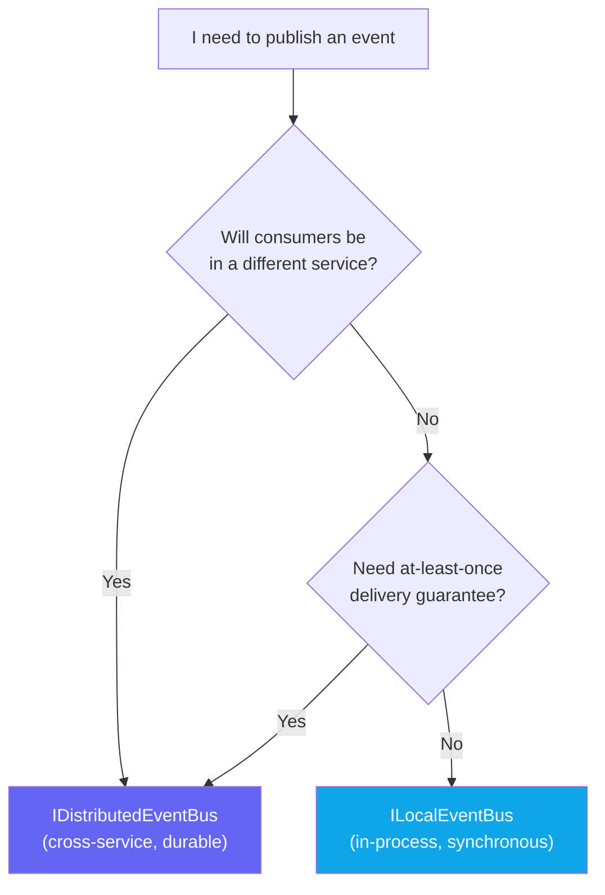
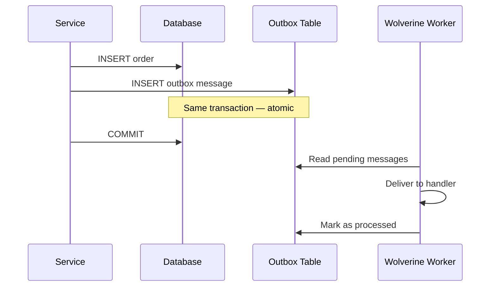
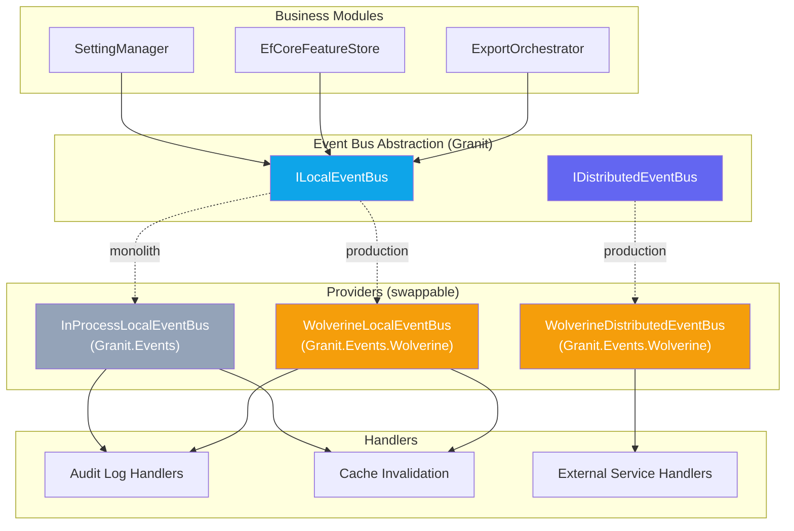

import { Tabs, TabItem, FileTree } from "@astrojs/starlight/components";

:::tip[See also]
Looking for the complete list of events? Check the [Event Catalog](/dotnet/infrastructure/event-catalog/).
:::

Think of events in two ways: a **phone call** (local — instant, same room, you hear
the answer immediately) and **registered mail** (distributed — crosses boundaries,
guaranteed delivery, but you don't know when). Granit's dual event bus
gives you both — and lets you swap the transport without touching business code.

## Package structure

<FileTree>
- Granit/Events/ Interfaces — always available, zero dependencies
  - ILocalEventBus publish in-process events
  - ILocalEventHandler\<T\> handle local events
  - IDistributedEventBus publish cross-service integration events
  - IDistributedEventHandler\<T\> handle distributed events
  - IIntegrationEvent marker for serializable event DTOs
- Granit.Events/ Default in-process providers (monolith, tests)
  - InProcessLocalEventBus resolves handlers from DI, calls sequentially
  - InProcessDistributedEventBus same — dev/test only, not durable
- Granit.Events.Wolverine/ Wolverine-backed providers (production)
  - WolverineLocalEventBus publishes to Wolverine local queue
  - WolverineDistributedEventBus publishes via IMessageBus with outbox
  - WolverineDomainEventDispatcher dispatches aggregate root domain events via IMessageBus
</FileTree>

| Package | Role | When to use |
| ------- | ---- | ----------- |
| `Granit` | `ILocalEventBus`, `IDistributedEventBus` interfaces | Always available — no extra dependency |
| `Granit.Events` | `InProcessLocalEventBus`, `InProcessDistributedEventBus` | Monoliths, unit tests, development |
| `Granit.Events.Wolverine` | `WolverineLocalEventBus`, `WolverineDistributedEventBus`, `WolverineDomainEventDispatcher` | Production — outbox-backed delivery |

## When to use Local vs Distributed



### Comparison table

| Aspect | `ILocalEventBus` | `IDistributedEventBus` |
| ------ | ----------------- | ---------------------- |
| **Scope** | Same process | Cross-process, cross-service |
| **TEvent constraint** | `class` (any C# class) | `IIntegrationEvent` (serializable DTO only) |
| **Delivery** | Synchronous, in-process | At-least-once via outbox |
| **Ordering** | Guaranteed (sequential in caller thread) | Not guaranteed (network, retries, parallelism) |
| **Retry on failure** | No — exception propagates to caller | Yes — provider-dependent backoff |
| **Serialization** | None (same CLR process) | JSON (must cross process boundary) |
| **Survives crash** | No — in-memory only | Yes — outbox persists before dispatch |
| **Default provider** | `InProcessLocalEventBus` | `InProcessDistributedEventBus` (dev only) |
| **Production provider** | `WolverineLocalEventBus` | `WolverineDistributedEventBus` |

### When to use which — real-world examples

| Use case | Bus | Why |
| -------- | --- | --- |
| Cache invalidation after setting change | Local | Same process, handler runs synchronously before response returns |
| Audit trail persistence (ISO 27001) | Local | Audit handler lives in same bounded context |
| Feature flag change logging | Local | In-process handler via `Granit.Auditing.ConfigurationChanges` |
| Data import/export job completion | Local | Notification handlers in same service (for now) |
| Cross-service workflow trigger | Distributed | Consumer may be in billing, notification, or analytics service |
| External system notification (webhook, ERP) | Distributed | Needs durability — crash must not lose the event |

:::tip[Start local, migrate later]
When in doubt, start with `ILocalEventBus`. You can migrate to `IDistributedEventBus`
later by adding the `IIntegrationEvent` marker and changing one line. The handler
code stays the same.
:::

## Events vs Commands

Events and commands solve different problems. Do not mix them.

| | **Event** | **Command** |
| - | --------- | ----------- |
| Consumers | 0 or more (broadcast) | Exactly 1 (point-to-point) |
| Delivery | Fire-and-forget | Must be processed |
| Retry / DLQ | No (local) or provider-dependent (distributed) | Yes — exponential backoff, dead letter queue |
| Abstraction | `ILocalEventBus` / `IDistributedEventBus` | Module-specific dispatchers |
| Provider-swappable? | Yes | No (Wolverine-specific) |
| Example | `SettingChangedEvent` | `ExecuteImportCommand` |

:::caution[Commands stay on Wolverine]
Never publish a command via `ILocalEventBus`. Commands need retry, DLQ, and delivery
guarantees that a generic event bus cannot provide. These dispatchers stay
Wolverine-specific: `IBackgroundJobDispatcher`, `IWebhookCommandDispatcher`,
`INotificationPublisher`, `ICommandSender`.
:::

## Quick start — Local event

**Step 1.** Define the event as a record:

```csharp
namespace MyApp.Events;

public sealed record OrderPlacedEvent(Guid OrderId, string CustomerEmail, DateTimeOffset Timestamp);
```

**Step 2.** Create the handler:

```csharp
using Granit.Events;

namespace MyApp.Handlers;

public sealed class OrderPlacedAuditHandler(IAuditingWriter writer) : ILocalEventHandler<OrderPlacedEvent>
{
    public async Task HandleAsync(OrderPlacedEvent localEvent, CancellationToken ct = default)
    {
        // Persist audit entry, send internal notification, update cache...
        await writer.WriteAsync(BuildAuditEntry(localEvent), ct).ConfigureAwait(false);
    }
}
```

**Step 3.** Register the handler in DI:

```csharp
services.AddScoped<ILocalEventHandler<OrderPlacedEvent>, OrderPlacedAuditHandler>();
```

**Step 4.** Publish from your business service:

```csharp
public sealed class OrderService(ILocalEventBus eventBus, TimeProvider time)
{
    public async Task PlaceOrderAsync(PlaceOrderRequest request, CancellationToken ct)
    {
        // ... create order in database ...
        await eventBus.PublishAsync(
            new OrderPlacedEvent(order.Id, request.CustomerEmail, time.GetUtcNow()), ct)
            .ConfigureAwait(false);
    }
}
```

## Quick start — Distributed event

**Step 1.** Define the event — must implement `IIntegrationEvent`:

```csharp
using Granit.Events;

namespace MyApp.IntegrationEvents;

// Flat, serializable DTO — no EF entities, no IQueryable, no internal domain objects.
public sealed record OrderShippedEto(
    Guid OrderId,
    string TrackingNumber,
    DateTimeOffset ShippedAt) : IIntegrationEvent;
```

:::caution[Integration event rules]
Integration events cross service boundaries and are serialized to JSON.
**Never** include EF Core entities, `IQueryable`, or internal domain objects.
Use flat records with primitive types and `Guid` references only.
:::

**Step 2.** Create the handler:

```csharp
public sealed class ShippingNotificationHandler : IDistributedEventHandler<OrderShippedEto>
{
    public async Task HandleAsync(OrderShippedEto integrationEvent, CancellationToken ct = default)
    {
        // Notify external ERP, send customer email, update tracking dashboard...
    }
}
```

**Step 3.** Publish:

```csharp
await distributedEventBus.PublishAsync(
    new OrderShippedEto(orderId, tracking, timeProvider.GetUtcNow()), ct);
```

:::tip[Idempotency is your responsibility]
With at-least-once delivery, handlers may be called more than once (crash after
processing, before ACK). Design handlers to be idempotent: use natural keys,
version fields, or `INSERT ... ON CONFLICT DO NOTHING`.
:::

## Handler discovery and registration

<Tabs>
  <TabItem label="In-process (manual DI)">
    With `Granit.Events` (in-process provider), handlers are resolved from DI.
    You must register them explicitly:

    ```csharp
    // In your module's ConfigureServices or DI extension:
    services.AddScoped<ILocalEventHandler<OrderPlacedEvent>, OrderPlacedAuditHandler>();
    services.AddScoped<IDistributedEventHandler<OrderShippedEto>, ShippingNotificationHandler>();
    ```

    Multiple handlers per event type are supported — all are called sequentially.
  </TabItem>
  <TabItem label="Wolverine (auto-discovery)">
    With `Granit.Events.Wolverine`, handlers that follow Wolverine's naming
    convention are auto-discovered. But `ILocalEventHandler<T>` implementations
    still need explicit DI registration — Wolverine discovers by convention
    (`HandleAsync` method), not by interface.

    ```csharp
    // Register in your module:
    services.AddScoped<ILocalEventHandler<OrderPlacedEvent>, OrderPlacedAuditHandler>();
    ```

    The Wolverine provider publishes to `IMessageBus`, and Wolverine routes to
    handlers via its own discovery. Both paths work in parallel.
  </TabItem>
</Tabs>

:::caution[Handler never called?]
If your handler is never invoked, check this list:

1. Is the handler registered in DI? (`services.AddScoped<ILocalEventHandler<T>, ...>()`)
2. Is `AddGranitEvents()` called? (auto-called by Settings, Features, DataExchange)
3. For distributed: is `Granit.Events.Wolverine` loaded? (check module dependencies)
4. Is the event type correct? (generic type must match exactly)

:::

## Provider configuration

<Tabs>
  <TabItem label="In-process (default)">
    Registered automatically by `AddGranitEvents()`. No configuration needed.

    ```csharp
    // Already registered by Settings, Features, DataExchange modules.
    // Or explicitly in your host:
    services.AddGranitEvents();
    ```

    :::caution
    The in-process distributed bus logs a warning on first use:
    *"InProcessDistributedEventBus is not durable — events will be lost on crash. Use Granit.Events.Wolverine for production"*
    Never use in production for critical integration events.
    :::
  </TabItem>
  <TabItem label="Wolverine (production)">
    Replaces in-process defaults when `Granit.Events.Wolverine` is loaded.

    ```csharp
    // Program.cs
    builder.AddGranitWolverine();
    builder.AddGranitWolverineWithPostgresql(); // Outbox + transport

    // Granit.Events.Wolverine auto-replaces via [DependsOn] module system
    ```

    Events published via `IDistributedEventBus` are now outbox-backed:
    they survive crashes, get retried on failure, and are delivered at-least-once.
  </TabItem>
  <TabItem label="Per-tenant (advanced)">
    For multi-tenant deployments with isolated databases per tenant:

    ```csharp
    builder.AddGranitWolverineWithPostgresqlPerTenant<AppDbContext>();
    ```

    Wolverine propagates `X-Tenant-Id` in message headers. The handler-side
    `TenantContextBehavior` restores the tenant context automatically, ensuring
    EF Core query filters apply correctly in background handlers.
  </TabItem>
</Tabs>

## Transactional guarantees and the outbox pattern

With the **in-process** provider, there are **no guarantees**. If the process
crashes between publishing and handling, the event is lost.

With **Wolverine**, distributed events use the transactional outbox pattern:



The event is written to the outbox **in the same database transaction** as the
business data. If the process crashes after COMMIT, Wolverine picks up the
pending message on restart. This guarantees at-least-once delivery.

## Integration event best practices

```csharp
// ✅ GOOD — flat record, serializable, only primitives and Guids
public sealed record InvoiceGeneratedEto(
    Guid InvoiceId,
    Guid CustomerId,
    decimal TotalAmount,
    string Currency,
    DateTimeOffset GeneratedAt) : IIntegrationEvent;

// ❌ BAD — leaks EF entity, not serializable across services
public sealed record InvoiceGeneratedEto(
    Invoice Invoice,           // EF entity — breaks module boundary
    Customer Customer,         // Internal domain object
    IQueryable<LineItem> Items // Not serializable at all
) : IIntegrationEvent;
```

**Naming**: use `XxxEto` for integration events (e.g., `OrderShippedEto`) and `XxxEvent`
for domain events (e.g., `OrderPlacedEvent`). Never `*Dto`, never `*Message`.

**Versioning**: adding new fields is safe (JSON deserialization ignores unknowns).
Removing or renaming fields is a breaking change — introduce a new event type instead.

## Multi-tenancy and context propagation

In the **in-process** provider, the handler inherits the caller's `ICurrentTenant`
and `ICurrentUserService` context (same DI scope, same `AsyncLocal`).

With **Wolverine**, context is propagated via message headers:

| Header | Source | Restored by |
| ------ | ------ | ----------- |
| `X-Tenant-Id` | `ICurrentTenant.Id` | `TenantContextBehavior` |
| `X-User-Id` | `ICurrentUserService.UserId` | `UserContextBehavior` |
| `X-Actor-Kind` | `ActorKind` (User, System, ExternalSystem) | `UserContextBehavior` |
| `X-Api-Key-Id` | `ICurrentUserService.ApiKeyId` | `UserContextBehavior` |
| `traceparent` | `Activity.Current?.Id` (W3C Trace Context) | `TraceContextBehavior` |

:::tip
In-process: context is automatic (same scope). With Wolverine: context is
propagated via headers — your handler sees the correct tenant and user even
when running in a background worker thread.
:::

## Testing

### Unit test: verify event is published

```csharp
[Fact]
public async Task PlaceOrder_PublishesOrderPlacedEvent()
{
    // Arrange
    ILocalEventBus eventBus = Substitute.For<ILocalEventBus>();
    OrderService service = new(eventBus, TimeProvider.System);

    // Act
    await service.PlaceOrderAsync(new PlaceOrderRequest("test@example.com"), CancellationToken.None);

    // Assert
    await eventBus.Received(1).PublishAsync(
        Arg.Is<OrderPlacedEvent>(e => e.CustomerEmail == "test@example.com"),
        Arg.Any<CancellationToken>());
}
```

### Integration test: verify handler is called

```csharp
[Fact]
public async Task OrderPlacedAuditHandler_PersistsAuditEntry()
{
    // Arrange — use InProcessLocalEventBus with real handler
    ServiceCollection services = new();
    services.AddGranitEvents();
    services.AddScoped<ILocalEventHandler<OrderPlacedEvent>, OrderPlacedAuditHandler>();
    services.AddScoped<IAuditingWriter, FakeAuditingWriter>();
    ServiceProvider sp = services.BuildServiceProvider();

    ILocalEventBus bus = sp.GetRequiredService<ILocalEventBus>();

    // Act
    await bus.PublishAsync(new OrderPlacedEvent(Guid.NewGuid(), "test@test.com", DateTimeOffset.UtcNow));

    // Assert
    FakeAuditingWriter writer = (FakeAuditingWriter)sp.GetRequiredService<IAuditingWriter>();
    writer.Entries.ShouldHaveSingleItem();
}
```

## Common pitfalls

:::caution[Distributed events lost in production]
If you use `InProcessDistributedEventBus` in production, events are lost on crash.
Always install `Granit.Events.Wolverine` with an outbox provider for production
distributed events.
:::

:::caution[Ordering is not guaranteed with distributed events]
Distributed events may arrive out of order due to network latency, retries, and
parallel processing. Never rely on ordering — use timestamps or sequence numbers
in the event payload if ordering matters.
:::

:::caution[Handler called twice (distributed)]
At-least-once delivery means handlers may be called more than once. Use idempotent
operations: `INSERT ... ON CONFLICT DO NOTHING`, check version fields, or use
a deduplication table.
:::

:::caution[Don't publish commands via event bus]
Commands (`ExecuteImportCommand`, `SendWebhookCommand`) need retry, DLQ, and
exactly-once processing. Use the module-specific Wolverine dispatchers for commands.
:::

### Troubleshooting

| Symptom | Likely cause | Fix |
| ------- | ------------ | --- |
| Handler never called | Not registered in DI | Add `services.AddScoped<ILocalEventHandler<T>, ...>()` |
| Distributed event lost on crash | Using in-process provider | Install `Granit.Events.Wolverine` + outbox |
| Handler runs but tenant is wrong | Missing `TenantContextBehavior` | Ensure `Granit.Wolverine` is loaded |
| Handler called multiple times | At-least-once delivery (normal) | Make handler idempotent |
| `InProcessDistributedEventBus` warning | Expected in dev | Switch to Wolverine for production |

## Public API reference

| Category | Key types | Package |
| -------- | --------- | ------- |
| Local bus | `ILocalEventBus`, `ILocalEventHandler<T>` | `Granit` |
| Distributed bus | `IDistributedEventBus`, `IDistributedEventHandler<T>` | `Granit` |
| Integration marker | `IIntegrationEvent` | `Granit` |
| Integration dispatcher | `IIntegrationEventDispatcher` | `Granit` |
| In-process providers | `InProcessLocalEventBus`, `InProcessDistributedEventBus` | `Granit.Events` |
| Wolverine providers | `WolverineLocalEventBus`, `WolverineDistributedEventBus`, `WolverineDomainEventDispatcher`, `WolverineIntegrationEventDispatcher` | `Granit.Events.Wolverine` |
| DI extension | `AddGranitEvents()` | `Granit.Events` |
| Modules | `GranitEventsModule`, `GranitEventsWolverineModule` | respective packages |

## Architecture diagram



## See also

- [Audit Log](/dotnet/compliance/audit-log/) — audit trail leveraging local event bus
- [Settings](/dotnet/infrastructure/application-settings/) — publishes `SettingChangedEvent` via local bus
- [Features](/dotnet/infrastructure/feature-flags/) — publishes `FeatureOverrideChangedEvent` via local bus
- [Wolverine](/dotnet/infrastructure/wolverine-messaging/) — message bus, outbox, and context propagation
- [Persistence](/dotnet/data/persistence/) — domain events via `IDomainEventDispatcher`
