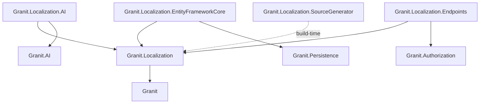
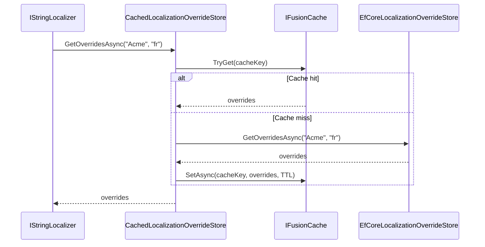

import { Tabs, TabItem, FileTree, Badge } from "@astrojs/starlight/components";

## Why a dedicated localization system?

.NET's built-in `IStringLocalizer` works for simple cases, but it falls short in
multi-tenant SaaS applications: there is no way for tenants to override translations
without redeploying, no culture fallback chain, and `.resx` files are painful to manage
at scale across dozens of cultures. Magic string keys like `L["Invoices.Status.Paid"]`
compile fine but fail silently at runtime when a key is missing or renamed.

Granit.Localization solves these problems with a layered architecture: JSON resource
files are embedded per module and auto-discovered at startup (no registration boilerplate).
Tenants can override any translation at runtime through a database-backed store, cached
in-memory with per-tenant isolation. A Roslyn source generator produces strongly-typed
key constants at build time — misspelled keys become compile errors, not runtime blanks.
The system ships with 17 cultures (14 base + 3 regional), so your application is
international from the first commit.

## Package structure

<FileTree>
- Granit.Localization/ Core abstractions, JSON resource loading, auto-discovery, override caching
  - Granit.Localization.AI AI-powered translation suggestions via LLM
  - Granit.Localization.EntityFrameworkCore EF Core persistence for translation overrides
  - Granit.Localization.Endpoints Minimal API (SPA bootstrapping + override CRUD)
  - Granit.Localization.SourceGenerator Roslyn incremental generator for type-safe keys
</FileTree>

| Package | Role | Depends on |
|---------|------|------------|
| `Granit.Localization` | `GranitLocalizationModule`, JSON localizer, override store abstractions | `Granit` |
| `Granit.Localization.AI` | `ITranslationSuggestionService`, LLM-based translation suggestions | `Granit.Localization`, `Granit.AI` |
| `Granit.Localization.EntityFrameworkCore` | `LocalizationDbContext`, `EfCoreLocalizationOverrideStore` | `Granit.Localization`, `Granit.Persistence` |
| `Granit.Localization.Endpoints` | Anonymous SPA endpoint, override CRUD endpoints | `Granit.Localization`, `Granit.Authorization` |
| `Granit.Localization.SourceGenerator` | Build-time `LocalizationKeys` class generation | _(analyzer, no runtime dependency)_ |

## Dependency graph



## Setup

<Tabs>
<TabItem label="Core only">

```csharp
[DependsOn(typeof(GranitLocalizationModule))]
public class AppModule : GranitModule
{
    public override void ConfigureServices(ServiceConfigurationContext context)
    {
        context.Services.Configure<GranitLocalizationOptions>(options =>
        {
            // Register your application resource
            options.Resources
                .Add<AcmeLocalizationResource>("fr")
                .AddJson(
                    typeof(AcmeLocalizationResource).Assembly,
                    "Acme.App.Localization.Acme");

            // Add supported languages
            options.Languages.Add(new LanguageInfo("nl", "Nederlands", "nl"));
            options.Languages.Add(new LanguageInfo("de", "Deutsch", "de"));
        });
    }
}
```

Default languages registered by the module: **fr**, **fr-CA**, **en** (default), **en-GB**.

</TabItem>
<TabItem label="With EF Core overrides">

```csharp
[DependsOn(
    typeof(GranitLocalizationModule),
    typeof(GranitLocalizationEntityFrameworkCoreModule))]
public class AppModule : GranitModule { }
```

```csharp
// Program.cs
builder.AddGranitLocalizationEntityFrameworkCore(opt =>
    opt.UseNpgsql(connectionString));
```

</TabItem>
<TabItem label="With endpoints">

```csharp
[DependsOn(
    typeof(GranitLocalizationModule),
    typeof(GranitLocalizationEntityFrameworkCoreModule),
    typeof(GranitLocalizationEndpointsModule))]
public class AppModule : GranitModule { }
```

```csharp
// Program.cs — map endpoints
app.MapGranitLocalization();          // GET /localization (anonymous)
app.MapGranitLocalizationOverrides(); // CRUD /localization/overrides (admin)
```

</TabItem>
</Tabs>

## Resource registration

Each module registers a **marker type** and its embedded JSON files via
`GranitLocalizationOptions.Resources`:

```csharp
options.Resources
    .Add<AcmeLocalizationResource>("fr")  // default culture = "fr"
    .AddJson(
        typeof(AcmeLocalizationResource).Assembly,
        "Acme.App.Localization.Acme")     // embedded resource prefix
    .AddBaseTypes(typeof(GranitLocalizationResource)); // inherit Granit keys
```

### LocalizationResourceStore

The `LocalizationResourceStore` holds all registered resources. Each entry is a
`LocalizationResourceInfo` with:

| Property | Description |
|----------|-------------|
| `ResourceType` | Marker type (empty class) |
| `DefaultCulture` | Fallback culture (e.g. `"fr"`) |
| `BaseTypes` | Parent resources for key inheritance |
| `JsonSources` | Embedded JSON file locations |

### Auto-discovery

When `EnableAutoDiscovery = true` (default), loaded module assemblies are scanned for
types decorated with `[LocalizationResourceName]`. Their embedded JSON files are
registered automatically without explicit `AddJson()` calls.

## JSON file format

Files follow the Granit convention: `{ "culture": "...", "texts": { ... } }`.
Nested keys are flattened with `.` separators.

```json title="Localization/Acme/en.json"
{
  "culture": "en",
  "texts": {
    "Patient": {
      "Created": "Patient {0} created successfully.",
      "NotFound": "Patient not found."
    },
    "Validation": {
      "NissRequired": "National identification number is required."
    }
  }
}
```

Usage in code:

```csharp
public class PatientHandler(IStringLocalizer<AcmeLocalizationResource> l)
{
    public string GetMessage(string name) =>
        l["Patient.Created", name];
}
```

## Localization key naming convention

Granit localization keys follow a **PascalCase, dot-separated** structure
with an optional **colon-separated namespace prefix**:

```text
[Prefix:]Feature.Section.Key
```

| Separator | Role | Example |
|-----------|------|---------|
| `:` colon | Namespace boundary (resource scope) | `Showcase:Admin:`, `Granit:Validation:` |
| `.` dot | Hierarchy within a scope | `Users.Columns.Email` |

Backend JSON files include the full prefix:

```json title="Localization/ShowcaseAdmin/en.json"
{
  "culture": "en",
  "texts": {
    "Showcase:Admin:Users.Title": "User Management",
    "Showcase:Admin:Users.Columns.Email": "Email"
  }
}
```

:::note[Frontend keys omit the prefix]
Frontend `t()` calls omit the namespace prefix — `applyTranslations()`
merges all resources by module, stripping the prefix automatically:

```tsx
t('Users.Title')        // resolves "User Management"
t('Users.Columns.Email') // resolves "Email"
```

:::

### Casing rules

All key segments use **PascalCase**, following Microsoft .NET naming
guidelines for acronyms:

| Rule | Example | Counter-example |
|------|---------|-----------------|
| Standard words → PascalCase | `Users`, `Columns`, `Title` | ~~`users`~~, ~~`columns`~~ |
| Acronyms ≤ 2 letters → ALL CAPS | `AI`, `UI`, `ID` | ~~`Ai`~~, ~~`Ui`~~, ~~`Id`~~ |
| Acronyms ≥ 3 letters → PascalCase | `Api`, `Url`, `Html` | ~~`API`~~, ~~`URL`~~ |
| Compound words → PascalCase | `ApiKeys`, `BackgroundJobs` | ~~`APIKeys`~~, ~~`BGJobs`~~ |

:::tip[Acronym rule]
This follows Microsoft's .NET naming guidelines: two-letter acronyms stay
uppercase (`AI`, `ID`, `UI`), three or more letters use PascalCase
(`Api`, `Url`, `Html`). Apply this to all key segments.
:::

### Namespace prefixes

Each application defines its own prefix using the `{App}:{Scope}:`
pattern:

| Application | Prefix | Example key |
|-------------|--------|-------------|
| Granit framework | `Granit:` | `Granit:EntityNotFound` |
| Granit validation | `Granit:Validation:` | `Granit:Validation:NotEmptyValidator` |
| Granit permissions | `Permission:` / `PermissionGroup:` | `Permission:Settings.Global.Read` |
| Guava admin | `Guava:Admin:` | `Guava:Admin:Users.Title` |
| Showcase admin | `Showcase:Admin:` | `Showcase:Admin:Auth.Login` |
| Webhook events | `WebhookEventType:` | `WebhookEventType:order.created` |

### Feature keys (admin UI)

For admin frontend applications, keys are organized by **feature**
(matching the frontend feature module structure):

```text
{Prefix}:{Feature}.{Section}.{Key}
```

Standard sections:

| Section | Purpose | Example |
|---------|---------|---------|
| `Title` | Page title | `Users.Title` → "User Management" |
| `Subtitle` | Page description | `Users.Subtitle` → "Manage platform users..." |
| `SearchPlaceholder` | Search input placeholder | `Users.SearchPlaceholder` → "Search by name..." |
| `Columns.*` | Table column headers | `Users.Columns.Email` → "Email" |
| `Form.*` | Form field labels | `Countries.Form.Alpha3` → "Alpha-3 Code" |
| `Actions.*` | Button/action labels | `Countries.Actions.Deactivate` → "Deactivate" |
| `Status.*` | Status/enum values | `Users.Status.Enabled` → "Enabled" |
| `Filters.*` | Filter labels | `Countries.Filters.Region` → "Region" |
| `Detail.*` | Detail page elements | `Users.Detail.BackToUsers` → "Back to users" |
| `*Dialog.*` | Dialog title/message | `Countries.DeactivateDialog.Title` → "Deactivate Country" |
| `*Success` | Toast success message | `Countries.SaveSuccess` → "Country saved successfully" |
| `*Error` | Toast error message | `Countries.SaveError` → "Failed to save country" |

### Shared keys

Keys shared across features use these namespaces:

| Namespace | Scope | Examples |
|-----------|-------|---------|
| `Common.*` | Buttons, labels reused everywhere | `Common.Save`, `Common.Cancel`, `Common.Close` |
| `Navigation.*` | Sidebar menu items | `Navigation.Users`, `Navigation.Countries` |
| `Navigation.Groups.*` | Sidebar group headings | `Navigation.Groups.Identity` |
| `Auth.*` | Authentication flow | `Auth.Login`, `Auth.AccessDenied` |
| `Header.*` / `Footer.*` | App chrome | `Header.AdminConsole` |
| `Components.*` | Reusable UI components | `Components.Querying.Columns.Label` |

### Complete example

```json title="Localization/ShowcaseAdmin/en.json"
{
  "culture": "en",
  "texts": {
    "Showcase:Admin:Common.AppName": "Granit Showcase Admin",
    "Showcase:Admin:Common.Save": "Save",
    "Showcase:Admin:Common.Cancel": "Cancel",
    "Showcase:Admin:Navigation.Users": "Users",
    "Showcase:Admin:Navigation.Groups.AI": "Artificial Intelligence",
    "Showcase:Admin:Auth.Login": "Sign in",
    "Showcase:Admin:Auth.LoginPage.Subtitle": "Sign in with your administrator account.",
    "Showcase:Admin:Users.Title": "User Management",
    "Showcase:Admin:Users.Columns.Name": "Name",
    "Showcase:Admin:Users.Columns.Email": "Email",
    "Showcase:Admin:Users.Status.Enabled": "Enabled",
    "Showcase:Admin:Users.Status.Disabled": "Disabled",
    "Showcase:Admin:Users.Actions.Enable": "Enable user",
    "Showcase:Admin:Users.SaveSuccess": "User saved successfully",
    "Showcase:Admin:Countries.Form.Code": "Alpha-2 Code",
    "Showcase:Admin:Countries.DeactivateDialog.Title": "Deactivate Country",
    "Showcase:Admin:AI.Workspaces.Title": "AI Workspaces"
  }
}
```

```tsx title="Frontend usage"
import { useTranslation } from '@granit/react-localization';

function UsersPage() {
  const { t } = useTranslation();
  return (
    <>
      <h1>{t('Users.Title')}</h1>
      <p>{t('Users.Subtitle')}</p>
    </>
  );
}
```

## LanguageInfo

Available languages are declared via `GranitLocalizationOptions.Languages`:

```csharp
new LanguageInfo(
    cultureName: "fr-CA",
    displayName: "Francais (Canada)",
    flagIcon: "ca",
    isDefault: false)
```

| Property | Description |
|----------|-------------|
| `CultureName` | BCP 47 culture code (`"fr"`, `"en-GB"`) |
| `DisplayName` | UI-friendly name |
| `FlagIcon` | Optional icon identifier for the language selector |
| `IsDefault` | Pre-selected language in the UI |

The `Languages` list also drives `SupportedUICultures` for ASP.NET Core request
localization (`UseGranitRequestLocalization`).

## Translation overrides

Overrides allow administrators to customize translations at runtime without redeploying.
They are stored per resource, per culture, per tenant.

### Abstractions

```csharp
public interface ILocalizationOverrideStoreReader
{
    Task<IReadOnlyDictionary<string, string>> GetOverridesAsync(
        string resourceName, string culture,
        CancellationToken cancellationToken = default);
}

public interface ILocalizationOverrideStoreWriter
{
    Task SetOverrideAsync(
        string resourceName, string culture, string key, string value,
        CancellationToken cancellationToken = default);

    Task RemoveOverrideAsync(
        string resourceName, string culture, string key,
        CancellationToken cancellationToken = default);
}
```

### Caching layer

The `CachedLocalizationOverrideStore` wraps the EF Core store with a FusionCache
layer (L1 memory + optional L2 distributed cache + backplane). Cache keys are
tenant-scoped (`localization:{tenantId}:{resource}:{culture}`) and invalidated on
every write.



## Endpoints

### SPA bootstrapping

`GET /localization?cultureName=fr` returns all registered resources for the requested
culture, plus the list of available languages. This endpoint is **anonymous** and includes
cache headers (`Cache-Control: public, max-age=3600`, `Vary: Accept-Language`).

```json
{
  "currentCulture": "fr",
  "resources": {
    "Acme": {
      "Patient.Created": "Patient {0} cree avec succes.",
      "Patient.NotFound": "Patient introuvable."
    },
    "Granit": {
      "EntityNotFound": "Entite introuvable."
    }
  },
  "languages": [
    { "cultureName": "fr", "displayName": "Francais (France)", "flagIcon": "fr", "isDefault": false },
    { "cultureName": "en", "displayName": "English (United States)", "flagIcon": "us", "isDefault": true }
  ]
}
```

### Override management

All override endpoints require the `Localization.Overrides.Manage` permission.

| Method | Route | Description |
|--------|-------|-------------|
| `GET` | `/localization/overrides?resourceName=X&cultureName=fr` | List overrides for a resource/culture |
| `PUT` | `/localization/overrides/{resourceName}/{cultureName}/{key}` | Create or update an override |
| `DELETE` | `/localization/overrides/{resourceName}/{cultureName}/{key}` | Remove an override |

If no `ILocalizationOverrideStoreReader`/`Writer` is registered (EF Core package not
installed), all override endpoints return `501 Not Implemented`.

## Source generator

The `Granit.Localization.SourceGenerator` package provides a Roslyn incremental generator
that reads JSON localization files declared as `<AdditionalFiles>` and produces a
`LocalizationKeys` class with nested constant string fields.

### Setup

```xml title="Acme.App.csproj"
<ItemGroup>
  <ProjectReference Include="..\Granit.Localization.SourceGenerator\Granit.Localization.SourceGenerator.csproj"
                    OutputItemType="Analyzer"
                    ReferenceOutputAssembly="false" />
</ItemGroup>

<ItemGroup>
  <AdditionalFiles Include="Localization\Acme\en.json" />
</ItemGroup>
```

### Generated output

Given the JSON file from the example above, the generator produces:

```csharp title="LocalizationKeys.g.cs (auto-generated)"
public static class LocalizationKeys
{
    public static class Patient
    {
        public const string Created = "Patient.Created";
        public const string NotFound = "Patient.NotFound";
    }

    public static class Validation
    {
        public const string NissRequired = "Validation.NissRequired";
    }
}
```

Usage with `IStringLocalizer`:

```csharp
string message = localizer[LocalizationKeys.Patient.Created, patientName];
```

Keys with the `Resource:Key` convention (e.g., `"Granit:EntityNotFound"`) produce nested
classes matching the resource prefix.

## Public API summary

| Category | Key types | Package |
|----------|-----------|---------|
| Module | `GranitLocalizationModule`, `GranitLocalizationAIModule`, `GranitLocalizationEntityFrameworkCoreModule`, `GranitLocalizationEndpointsModule` | -- |
| Core | `LocalizationResourceStore`, `LocalizationResourceInfo`, `LanguageInfo` | `Granit.Localization` |
| Options | `GranitLocalizationOptions` (`EnableAutoDiscovery`, `Resources`, `Languages`, `FormattingCultures`) | `Granit.Localization` |
| Abstractions | `ILocalizationOverrideStoreReader`, `ILocalizationOverrideStoreWriter` | `Granit.Localization` |
| Caching | `CachedLocalizationOverrideStore` _(internal, FusionCache L1+L2)_ | `Granit.Localization` |
| AI | `ITranslationSuggestionService`, `TranslationSuggestion`, `TranslationContext` | `Granit.Localization.AI` |
| EF Core | `LocalizationDbContext`, `EfCoreLocalizationOverrideStore` _(internal)_ | `Granit.Localization.EntityFrameworkCore` |
| Endpoints | `MapGranitLocalization()`, `MapGranitLocalizationOverrides()` | `Granit.Localization.Endpoints` |
| Generator | `LocalizationKeysGenerator` | `Granit.Localization.SourceGenerator` |

## When to use — and when not to

Use Granit.Localization when:

- Your application supports **multiple languages** (even just 2 — the investment pays off early)
- **Tenants need to customize** translations at runtime without redeployment
- You want **compile-time safety** on localization keys (source generator catches typos)
- You need **culture fallback chains** (fr-CA → fr → en) with module-scoped resource isolation

Skip it when:

- Your app is **single-language with no plans** for i18n — `IStringLocalizer` adds ceremony for no benefit
- You only need to localize **validation error messages** — FluentValidation's built-in `.WithMessage()` with resource files may be enough
- Your localization needs are **frontend-only** (React i18n) — use the frontend SDK instead

## Common pitfalls

:::caution[Missing JSON files for a culture]
All 17 cultures must have a JSON resource file, even if empty. The source generator
and auto-discovery expect the file to exist. A missing file for one culture means
`IStringLocalizer<T>` returns the key name instead of a translation — no error, just
silent degradation.
:::

:::caution[Overrides cached per tenant]
Translation overrides are cached via FusionCache **per tenant** (cache key includes
`tenantId`). Write operations (`SetOverrideAsync`, `RemoveOverrideAsync`) expire the
cache entry immediately. Other pods see the change after the FusionCache TTL expires
(default: 5 minutes, configurable via `LocalizationOverridesCacheOptions.CacheTtl`).
:::

:::caution[SmartFormat security restriction]
`JsonStringLocalizer` uses SmartFormat.NET for format strings (`{0}`, `{1}`, plural
rules). The `ReflectionSource` extension is **removed** from the formatter to prevent
template injection via database override values. This means format strings like
`{0.PropertyName}` (member access via reflection) are **not supported**. Use positional
placeholders (`{0}`, `{1}`) and built-in formatters (plural, conditional) instead.
:::

:::caution[Source generator not running]
If `LocalizationKeys` constants are not generated, verify that:
1. The `Granit.Localization.SourceGenerator` package is referenced as an analyzer
2. Your JSON resource files follow the `Namespace.ResourceName` naming convention
3. The project builds without errors (the generator runs at build time)
:::

## See also

- [Set up localization guide](/dotnet/guides/set-up-localization/) — step-by-step setup walkthrough
- [ADR-008: SmartFormat.NET](/dotnet/architecture/adr/008-smartformat-pluralization/) — Why SmartFormat.NET was chosen for CLDR pluralization
- [Settings, Features & Reference Data](./settings/) -- uses localization for display names
- [Persistence module](./persistence/) -- EF Core interceptors used by the override store
- [Security module](./authentication/) -- permission-based access for override management
