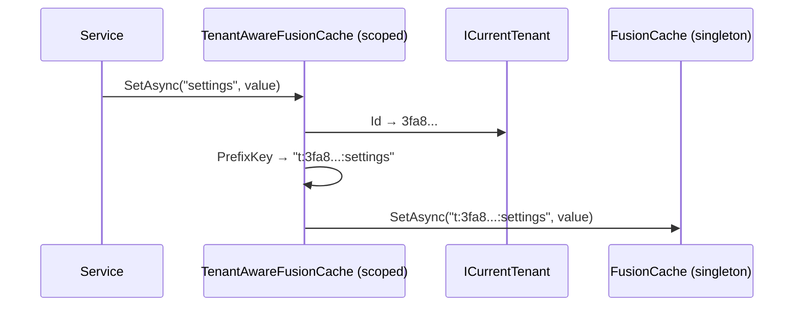

## The problem

FusionCache is registered as a singleton with a global key prefix (`"dd:"`).
When multiple tenants share a Redis instance, cache keys from different tenants
can collide — a `settings` key written by Tenant A is readable by Tenant B.

Some modules manually include `TenantId` in their cache keys (Permission, Features),
but this is opt-in, error-prone, and easy to forget. A single missed key creates
a cross-tenant cache leak.

## TenantAwareFusionCache

Granit wraps the singleton `IFusionCache` with a scoped decorator that
**automatically prefixes every cache key and tag** with the current tenant
identifier. No code change needed in modules — the decorator is transparent.

### Key format

| Context | Key format | Example |
|---------|-----------|---------|
| Tenant active | `t:{tenantId:N}:{key}` | `t:3fa85f6456954b5ab7d9c4f11f0b7f5e:settings` |
| Host (no tenant) | `t:host:{key}` | `t:host:global-config` |

Tags are prefixed identically, ensuring `RemoveByTag("products")` only invalidates
the current tenant's entries.

### What gets prefixed

| Operation | Prefixed |
|-----------|---------|
| `GetOrSetAsync`, `GetOrDefaultAsync`, `TryGetAsync` | Key |
| `SetAsync` | Key + tags |
| `RemoveAsync`, `ExpireAsync` | Key |
| `RemoveByTagAsync` | Tags |
| `Clear` | No (clears everything) |
| Infrastructure (`SetupDistributedCache`, etc.) | No (passthrough) |
| `Dispose` | No (singleton not disposed) |

## How it works



### DI registration

The raw FusionCache singleton is moved to a keyed service. The decorator becomes
the default `IFusionCache`:

```text
IFusionCache (default)  → TenantAwareFusionCache (scoped)
    └── IFusionCache ("__granit_raw_cache__")  → FusionCache (singleton)
```

All existing module code that injects `IFusionCache` gets the decorator
automatically — zero changes needed.

## Configuration

Cache isolation is enabled automatically by `AddGranitCaching()`. No configuration
needed.

If `ICurrentTenant` is not registered (standalone usage without multi-tenancy),
a `NullCurrentTenant` fallback is used — all keys are prefixed with `t:host:`.

## Migration from manual TenantId keys

Modules that already include `TenantId` in their cache keys (Permission, Features,
Settings) will temporarily have a double prefix:

```text
t:3fa8...:perm:3fa8...:Admin:Users.Read
```

This is harmless — it causes a cold cache miss (new key format), not a data leak.
The module keys can be cleaned up in a follow-up to remove the manual `TenantId`
segment, resulting in cleaner keys:

```text
t:3fa8...:perm:Admin:Users.Read
```

## Backplane compatibility

The Redis pub/sub backplane uses cache keys for invalidation notifications.
Since the decorator prefixes keys before they reach the inner cache, the backplane
sees the prefixed keys and invalidates correctly. No backplane configuration
change needed.

## See also

- [Caching module](/dotnet/data/caching/) — FusionCache setup, encryption,
  Redis L2
- [Host vs Tenant](./host-tenant/) — which modules are host-level vs tenant-level
- [Tenant Resolvers](./resolvers/) — how the current tenant is determined
