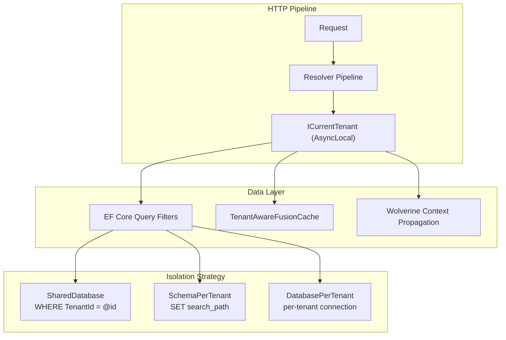

import { FileTree, Badge } from "@astrojs/starlight/components";

Granit.MultiTenancy provides a complete multi-tenancy stack for SaaS applications.
A pipeline of pluggable resolvers extracts the tenant from HTTP requests, sets an
`AsyncLocal` context for the entire request, and downstream modules — persistence,
caching, messaging — automatically scope their operations to the active tenant.

## Why Granit multi-tenancy

- **Zero manual WHERE clauses** — EF Core query filters handle tenant isolation
  transparently
- **Four built-in resolvers** — subdomain, header, JWT claim, query string
- **Three isolation strategies** — shared database, schema-per-tenant,
  database-per-tenant — switchable per tenant at runtime
- **Cache key isolation** — automatic TenantId prefix on all FusionCache keys
- **Host/tenant schema separation** — configurable via `appsettings.json`
- **Message propagation** — Wolverine automatically carries tenant context
  across async boundaries
- **Automatic provisioning** — new tenants get schema creation, EF Core
  migrations, and data seeding out of the box

## Package structure

<FileTree>
- Granit.MultiTenancy — Resolvers, CurrentTenant, middleware
- Granit.MultiTenancy.EntityFrameworkCore — Tenant store, EF Core persistence
- Granit.MultiTenancy.Endpoints — Tenant admin API endpoints
- Granit.Persistence.EntityFrameworkCore — Isolation strategies, GranitDbDefaults, SchemaEnsurer
- Granit.MultiTenancy.Provisioning — Automatic tenant provisioning handler
- Granit.Caching — TenantAwareFusionCache decorator
</FileTree>

| Package | Role |
|---------|------|
| `Granit.MultiTenancy` | Resolvers, `CurrentTenant`, middleware, options |
| `Granit.MultiTenancy.EntityFrameworkCore` | `ITenantReader`/`ITenantWriter`, tenant aggregate, EF persistence |
| `Granit.Persistence.EntityFrameworkCore` | `GranitDbDefaults`, `SchemaEnsurer`, isolation strategy factories |
| `Granit.MultiTenancy.Provisioning` | `TenantProvisioningHandler` — automatic tenant provisioning on creation |
| `Granit.Persistence.EntityFrameworkCore.Hosting` | `ITenantProvisioner`, `AutoTenantProvisioner` — schema + migration + seeding |
| `Granit.Caching` | `TenantAwareFusionCache` — automatic cache key isolation |

## Architecture



## Quick start

```csharp
[DependsOn(typeof(GranitMultiTenancyModule))]
public class AppModule : GranitModule { }
```

```json
{
  "MultiTenancy": {
    "IsEnabled": true,
    "DomainTemplate": "{0}.myapp.com"
  },
  "TenantIsolation": {
    "Strategy": "SchemaPerTenant",
    "HostSchema": "host"
  }
}
```

```csharp
app.UseAuthentication();
app.UseGranitMultiTenancy();   // After auth, before authorization
app.UseAuthorization();
```

## Section contents

This section covers multi-tenancy in depth:

- [**Tenant Resolvers**](./resolvers/) — the four built-in resolvers and how to
  add custom ones
- [**Isolation Strategies**](./isolation/) — shared database, schema-per-tenant,
  database-per-tenant, and the hybrid model
- [**Host vs Tenant**](./host-tenant/) — how to separate host infrastructure
  from tenant data using `GranitDbDefaults`
- [**Cache Isolation**](./cache/) — automatic tenant-scoped cache keys with
  `TenantAwareFusionCache`
- [**Automatic Provisioning**](./isolation/#automatic-tenant-provisioning) —
  zero-config schema creation, migrations, and seeding for new tenants

## See also

- [Multi-tenancy concept](/dotnet/concepts/multi-tenancy/) — the problem,
  decision matrix, and transparent query filters
- [Configure multi-tenancy](/dotnet/guides/configure-multi-tenancy/) —
  step-by-step setup guide
- [Persistence](/dotnet/data/persistence/) — `ApplyGranitConventions`,
  interceptors
- [Wolverine](/dotnet/infrastructure/wolverine-messaging/) — tenant context propagation
