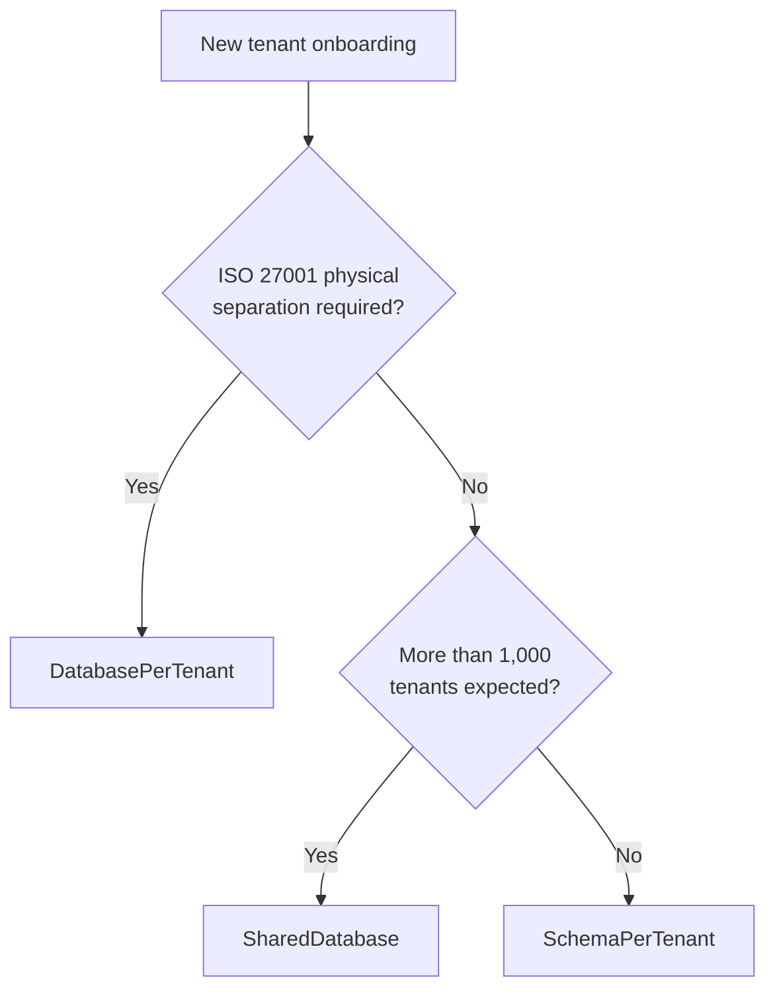
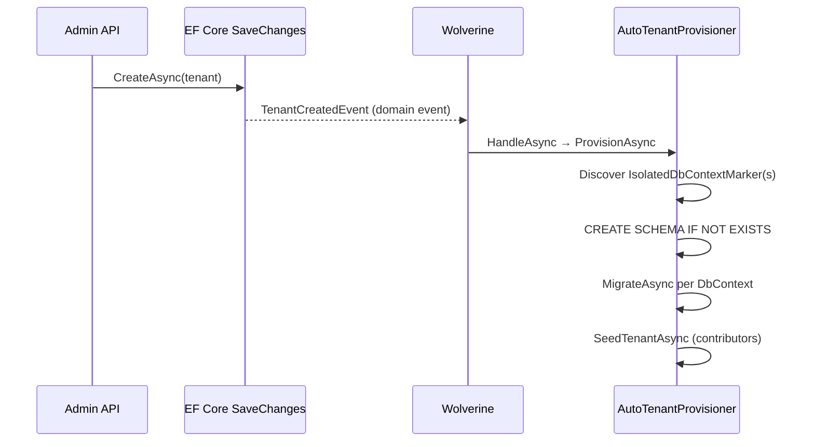

import { Tabs, TabItem } from "@astrojs/starlight/components";

Granit supports three data isolation strategies for multi-tenant applications.
You can choose a single strategy for all tenants, or mix strategies dynamically —
premium tenants get dedicated databases while standard tenants share a single database.

## Strategy comparison

| Strategy | Isolation | Tenant limit | Backup | Operational cost |
|----------|----------|-------------|--------|-----------------|
| `SharedDatabase` | Logical (WHERE clause) | Unlimited | Single backup | Lowest |
| `SchemaPerTenant` | Schema-level | ~1,000/database | Per-schema `pg_dump -n` | Medium |
| `DatabasePerTenant` | Physical (separate DB) | ~200 (with PgBouncer) | Per-tenant | Highest |

## Decision matrix



## Configuration

<Tabs>
<TabItem label="Shared database">

All tenants share one database. Isolation is enforced through EF Core query filters
on `IMultiTenant` entities. Default strategy — no additional configuration needed.

```json
{
  "TenantIsolation": {
    "Strategy": "SharedDatabase"
  }
}
```

```csharp
builder.Services.AddGranitIsolatedDbContext<AppDbContext>(
    configureShared: options =>
        options.UseNpgsql(connectionString));
```

</TabItem>
<TabItem label="Schema per tenant">

Each tenant gets a dedicated PostgreSQL schema. The `TenantSchemaConnectionInterceptor`
executes `SET search_path` unconditionally on every connection open.

```json
{
  "TenantIsolation": {
    "Strategy": "SchemaPerTenant",
    "HostSchema": "host"
  }
}
```

```csharp
builder.Services.AddGranitIsolatedDbContext<AppDbContext>(
    configureShared: options =>
        options.UseNpgsql(connectionString),
    configureSchemaPerTenant: options =>
        options.UseNpgsql(connectionString),
    configureTenantSchema: schema =>
    {
        schema.NamingConvention = TenantSchemaNamingConvention.TenantId;
        schema.Prefix = "tenant_";
    });
```

:::danger[Connection pool safety]
Schema activators execute on **every connection open**. Pooled connections retain the
previous tenant's schema — skipping the `SET search_path` call causes a
**data isolation breach** (ISO 27001 violation). Granit enforces this unconditionally.
:::

:::caution[HasDefaultSchema incompatibility]
`HasDefaultSchema("myschema")` in a DbContext generates schema-qualified SQL
(e.g., `"myschema"."products"`), which **bypasses** `SET search_path`. Tenant-isolated
DbContexts must use **unqualified table names** — do not call `HasDefaultSchema()`.
Host DbContexts (non-isolated) can use explicit schemas safely.
:::

</TabItem>
<TabItem label="Database per tenant">

Maximum isolation — each tenant has its own database. Connection strings are resolved
dynamically via `ITenantConnectionStringProvider`.

```json
{
  "TenantIsolation": {
    "Strategy": "DatabasePerTenant"
  }
}
```

```csharp
builder.Services.AddSingleton<ITenantConnectionStringProvider,
    VaultConnectionStringProvider>();

builder.Services.AddGranitIsolatedDbContext<AppDbContext>(
    configureShared: options =>
        options.UseNpgsql(connectionString),
    configureDatabasePerTenant: (options, cs) =>
        options.UseNpgsql(cs));
```

</TabItem>
</Tabs>

## SchemaEnsurer

EF Core / Npgsql never creates custom schemas automatically. If a module configures
a schema (e.g., `"host"`) and migrations run before the schema exists, the provider
throws a fatal error.

Call `SchemaEnsurer.EnsureSchemasAsync()` at application startup, before any migration:

```csharp
// In Program.cs, before migrations
await SchemaEnsurer.EnsureSchemasAsync(context, cancellationToken, "host");
```

For tenant provisioning, the `AutoTenantProvisioner` handles schema creation and
migration order automatically. If you need manual control:

```csharp
// Manual provisioning (rare — prefer AutoTenantProvisioner)
await SchemaEnsurer.EnsureSchemasAsync(context, ct, $"tenant_{tenantId:N}");
await context.Database.MigrateAsync(ct); // search_path already activated
```

:::caution[Provisioning order is critical]
If migrations start with a `search_path` pointing to a non-existent schema,
Npgsql throws a fatal error before creating the first table.
`AutoTenantProvisioner` handles this ordering automatically.
:::

## Automatic tenant provisioning

When a new tenant is created at runtime (via the admin API), `TenantCreatedEvent` is
dispatched as a domain event. The `Granit.MultiTenancy.Provisioning` package provides a
framework-level handler that **automatically provisions** the tenant — no application
code needed:

1. **Schema creation** — calls `SchemaEnsurer.EnsureSchemasAsync()` for SchemaPerTenant
2. **EF Core migrations** — runs `MigrateAsync()` on every isolated DbContext discovered
   via `IsolatedDbContextMarker`
3. **Data seeding** — executes all `ITenantDataSeedContributor` implementations for the
   new tenant



### Zero-configuration setup

Install the package and add the module dependency:

```bash
dotnet add package Granit.MultiTenancy.Provisioning
```

```csharp
[DependsOn(typeof(GranitMultiTenancyProvisioningModule))]
public sealed class AppHostModule : GranitModule { }
```

The handler is auto-discovered by Wolverine. All `DbContext` types registered via
`AddGranitIsolatedDbContext<T>()` are provisioned automatically — no manual listing needed.

### Custom provisioning

Replace the default `ITenantProvisioner` to add application-specific logic (e.g.,
external registry calls, per-tenant configuration seeding):

```csharp
// Register before AddGranitMigrateSupport() — TryAddSingleton won't override
builder.Services.AddSingleton<ITenantProvisioner, MyCustomTenantProvisioner>();
```

### Cold-start vs runtime

| Path | When | Who provisions |
|------|------|---------------|
| `--migrate` | First deploy / schema changes | `GranitMigrationRunner` (re-migration pass after host seeding) |
| Runtime | Admin creates tenant via API | `TenantProvisioningHandler` → `AutoTenantProvisioner` |

Both paths are **idempotent**: `CREATE SCHEMA IF NOT EXISTS`, EF Core migration tracking,
and seed contributors that guard against duplicate inserts. Wolverine's retry policies
can safely replay provisioning messages.

:::tip[Idempotent by design]
If the application crashes mid-provisioning and Wolverine replays the
`TenantCreatedEvent`, all already-completed steps are skipped automatically.
No cleanup or compensation logic is needed.
:::

## Hybrid model

The `IsolatedDbContextFactory<TContext>` resolves the strategy **per tenant** at
runtime via `ITenantIsolationStrategyProvider`. Premium tenants can use
`DatabasePerTenant` while standard tenants share a `SharedDatabase` — all in the
same deployment.

```csharp
public sealed class TieredIsolationProvider(
    ITenantReader tenantReader) : ITenantIsolationStrategyProvider
{
    public async ValueTask<TenantIsolationStrategy> GetStrategyAsync(
        Guid? tenantId, CancellationToken ct = default)
    {
        if (tenantId is null)
            return TenantIsolationStrategy.SharedDatabase;

        TenantData? tenant = await tenantReader
            .FindByIdAsync(tenantId.Value, ct)
            .ConfigureAwait(false);

        return tenant?.IsPremium == true
            ? TenantIsolationStrategy.DatabasePerTenant
            : TenantIsolationStrategy.SharedDatabase;
    }
}
```

## Wolverine context propagation

When Wolverine dispatches messages, the `OutgoingContextMiddleware` serializes
`ICurrentTenant.Id` into an `X-Tenant-Id` message header. The `TenantContextBehavior`
restores it on the receiving side:

```text
HTTP Request (Tenant A) --> Wolverine handler --> background job
         X-Tenant-Id: A  ------------------->  ICurrentTenant.Id = A
```

This ensures tenant isolation across async message processing without manual
propagation.

## See also

- [Host vs Tenant](./host-tenant/) — schema separation between host and tenant data
- [Cache Isolation](./cache/) — tenant-scoped cache keys
- [Persistence](/dotnet/data/persistence/) — `ApplyGranitConventions`,
  interceptors, query filters
