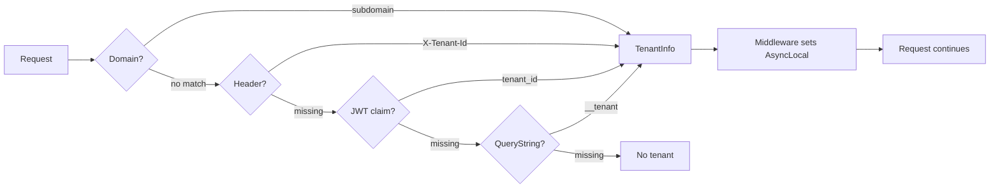

import { Tabs, TabItem } from "@astrojs/starlight/components";

The tenant resolution pipeline executes on every HTTP request. Resolvers run in
`Order` (ascending) — the first non-null result wins. The resolved tenant is stored
in an `AsyncLocal` context accessible via `ICurrentTenant`.

## Resolution flow



## Built-in resolvers

| Resolver | Order | Source | Enabled by | Use case |
|----------|-------|--------|------------|----------|
| `DomainTenantResolver` | 50 | `Host` header → identifier → `ITenantReader` | `DomainTemplate` set | SaaS with branded URLs |
| `HeaderTenantResolver` | 100 | `X-Tenant-Id` HTTP header | Always | Service-to-service, BFF |
| `JwtClaimTenantResolver` | 200 | `tenant_id` JWT claim | Always | End-user via Keycloak/OIDC |
| `QueryStringTenantResolver` | 300 | `?__tenant={guid}` | `QueryStringParamName` set | Dev/debug |

### Domain resolver

Extracts the tenant identifier from the request `Host` header using a configurable
template. The `{0}` placeholder matches the tenant's `Identifier` field (slug),
which is resolved via `ITenantReader.FindByIdentifierAsync()`.

```json
{
  "MultiTenancy": {
    "DomainTemplate": "{0}.monsaas.com"
  }
}
```

**Examples:**

| Request Host | Template | Extracted identifier |
|-------------|----------|---------------------|
| `acme.monsaas.com` | `{0}.monsaas.com` | `acme` |
| `my-tenant.app.local` | `{0}.app.local` | `my-tenant` |
| `tenant1.sub.example.com` | `{0}.sub.example.com` | `tenant1` |
| `monsaas.com` | `{0}.monsaas.com` | No match (null) |

The resolver returns `null` when:

- `DomainTemplate` is not configured (disabled)
- The host doesn't match the template pattern
- No tenant with the extracted identifier exists
- The matched tenant is inactive (`Activated = false`)

:::note
The domain resolver requires `ITenantReader`, provided by
`Granit.MultiTenancy.EntityFrameworkCore`. A `NullTenantReader` fallback is
registered when the EF Core module is not installed — the resolver simply
returns `null` (passes to the next resolver).
:::

### Header resolver

Reads the tenant GUID from the `X-Tenant-Id` HTTP header (configurable via
`TenantIdHeaderName`). Always active.

```bash
curl -H "X-Tenant-Id: 3fa85f64-5694-4b5a-b7d9-c4f11f0b7f5e" \
  http://localhost:5000/api/v1/products
```

### JWT claim resolver

Reads the tenant GUID from the `tenant_id` JWT claim (configurable via
`TenantIdClaimType`). Requires `UseAuthentication()` before `UseGranitMultiTenancy()`.

### Query string resolver

Reads the tenant GUID from a query parameter. Intended for development and
debugging — lowest priority (order 300).

```
GET /api/v1/products?__tenant=3fa85f64-5694-4b5a-b7d9-c4f11f0b7f5e
```

**Disabled by default** (`QueryStringParamName = null`). Enable in `appsettings.Development.json`:

```json
{
  "MultiTenancy": {
    "QueryStringParamName": "__tenant"
  }
}
```

:::danger[Never enable in production]
The query string resolver allows unauthenticated callers to select an arbitrary
tenant context. Only enable it in development environments.
:::

## Custom resolver

Implement `ITenantResolver` for additional resolution strategies:

```csharp
public sealed class CookieTenantResolver(
    IOptions<MultiTenancyOptions> options) : ITenantResolver
{
    public int Order => 150; // Between header and JWT

    public Task<TenantInfo?> ResolveAsync(
        HttpContext context, CancellationToken cancellationToken = default)
    {
        if (!context.Request.Cookies.TryGetValue("tenant_id", out string? value))
            return Task.FromResult<TenantInfo?>(null);

        if (!Guid.TryParse(value, out Guid tenantId))
            return Task.FromResult<TenantInfo?>(null);

        return Task.FromResult<TenantInfo?>(new TenantInfo(tenantId));
    }
}
```

Register in DI — the pipeline auto-discovers all `ITenantResolver` implementations:

```csharp
services.AddScoped<ITenantResolver, CookieTenantResolver>();
```

## Security hardening

### Tenant existence validation

By default, the middleware verifies that the resolved tenant ID exists in the
tenant store (`ITenantReader.ExistsAsync`). This prevents **phantom tenants** —
arbitrary GUIDs from spoofed headers creating orphaned data.

```json
{
  "MultiTenancy": {
    "ValidateTenantExistence": true
  }
}
```

Disable only in test environments where no tenant store is available.

### Header trust mode

The `X-Tenant-Id` header is accepted by default without cross-validation
(`Unrestricted`). This is safe when the header is set by a trusted BFF or
reverse proxy. For direct API exposure, enable `CrossValidate`:

```json
{
  "MultiTenancy": {
    "HeaderTrustMode": "CrossValidate"
  }
}
```

| Mode | Behavior | Use case |
|------|----------|----------|
| `Unrestricted` | Header accepted as-is | Behind BFF/reverse proxy |
| `CrossValidate` | Header must match JWT claim (403 on mismatch) | Direct API exposure |

## Configuration reference

| Property | Default | Description |
|----------|---------|-------------|
| `IsEnabled` | `true` | Enable/disable tenant resolution |
| `TenantIdClaimType` | `"tenant_id"` | JWT claim name for tenant ID |
| `TenantIdHeaderName` | `"X-Tenant-Id"` | HTTP header name for tenant ID |
| `HeaderTrustMode` | `"Unrestricted"` | `Unrestricted` or `CrossValidate` |
| `ValidateTenantExistence` | `true` | Verify resolved tenant exists in tenant store |
| `DomainTemplate` | `null` | Domain template with `{0}` placeholder (e.g. `"{0}.monsaas.com"`) |
| `QueryStringParamName` | `null` | Query string param name (`null` = disabled, set `"__tenant"` in dev) |

## Observability

The middleware emits OpenTelemetry counters under the `Granit.MultiTenancy` meter:

| Metric | Tags | Description |
|--------|------|-------------|
| `granit.multi_tenancy.resolution.succeeded` | `tenant_id`, `resolver_type` | Successful resolutions |
| `granit.multi_tenancy.resolution.failed` | `tenant_id` | No resolver matched or cross-validation rejected |
| `granit.multi_tenancy.context.switched` | `tenant_id` | Explicit `ICurrentTenant.Change()` calls |

The `resolver_type` tag identifies which resolver matched (`DomainTenantResolver`,
`HeaderTenantResolver`, etc.).
