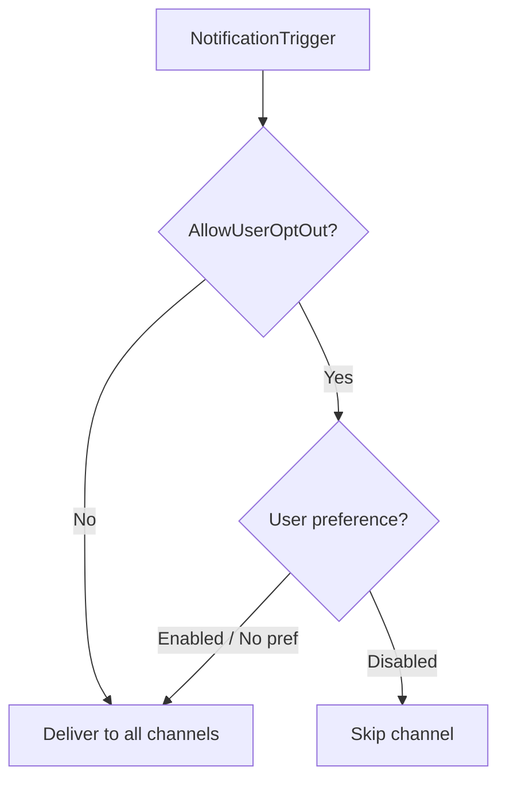

Granit.Notifications persists notifications, delivery attempts, user preferences, and subscriptions. All persistence follows CQRS with separate reader/writer interfaces. The core package registers in-memory defaults; `Granit.Notifications.EntityFrameworkCore` replaces them with EF Core implementations.

## Entity model

### UserNotification

In-app notification stored in the user's inbox. The database is the source of
truth; email/SMS/push copies are fire-and-forget.

```csharp
public sealed class UserNotification : Entity, IMultiTenant
{
    public Guid NotificationId { get; set; }
    public string NotificationTypeName { get; set; }
    public NotificationSeverity Severity { get; set; }
    public string RecipientUserId { get; set; }
    public JsonElement Data { get; set; }
    public UserNotificationState State { get; set; } // Unread, Read
    public DateTimeOffset CreatedAt { get; set; }
    public DateTimeOffset? ReadAt { get; set; }
    public Guid? TenantId { get; set; }
    public string? RelatedEntityType { get; set; }
    public string? RelatedEntityId { get; set; }
}
```

### NotificationDeliveryAttempt

INSERT-only audit record for ISO 27001 compliance. Never modified or deleted
during the retention period.

```csharp
public sealed class NotificationDeliveryAttempt : Entity
{
    public Guid DeliveryId { get; set; }
    public Guid NotificationId { get; set; }
    public string NotificationTypeName { get; set; }
    public string ChannelName { get; set; }
    public string RecipientUserId { get; set; }
    public Guid? TenantId { get; set; }
    public DateTimeOffset OccurredAt { get; set; }
    public long DurationMs { get; set; }
    public string? ErrorMessage { get; set; }
    public bool IsSuccess { get; set; }
}
```

### NotificationPreference

User opt-in/opt-out per notification type and channel. When no preference exists,
the default comes from `NotificationDefinition.DefaultChannels`.

```csharp
public sealed class NotificationPreference : AuditedEntity, IMultiTenant
{
    public string UserId { get; set; }
    public string NotificationTypeName { get; set; }
    public string ChannelName { get; set; }
    public bool IsEnabled { get; set; } = true;
    public Guid? TenantId { get; set; }
}
```

### NotificationSubscription

Topic subscription or entity follower (Odoo-style). When `EntityType` and
`EntityId` are set, the subscription is an entity follower.

```csharp
public sealed class NotificationSubscription : CreationAuditedEntity, IMultiTenant
{
    public string UserId { get; set; }
    public string NotificationTypeName { get; set; }
    public Guid? TenantId { get; set; }
    public string? EntityType { get; set; }  // null = topic subscription
    public string? EntityId { get; set; }    // null = topic subscription
}
```

## CQRS reader/writer pairs

All persistence follows the CQRS pattern with separate reader and writer
interfaces. The core package registers in-memory defaults;
`Granit.Notifications.EntityFrameworkCore` replaces them with EF Core
implementations.

| Reader | Writer | Store |
|--------|--------|-------|
| `IUserNotificationReader` | `IUserNotificationWriter` | Inbox (UserNotification) |
| `INotificationPreferenceReader` | `INotificationPreferenceWriter` | Preferences |
| `INotificationSubscriptionReader` | `INotificationSubscriptionWriter` | Subscriptions + entity followers |
| `IMobilePushTokenReader` | `IMobilePushTokenWriter` | Device tokens |
| -- | `INotificationDeliveryWriter` | Delivery audit trail (write-only) |

```csharp
// Read interfaces — inject only what you need (ISP)
public interface IUserNotificationReader
{
    Task<UserNotification?> GetAsync(Guid id, CancellationToken ct = default);
    Task<PagedResult<UserNotification>> GetListAsync(
        string recipientUserId, Guid? tenantId,
        int page = 1, int pageSize = 20, CancellationToken ct = default);
    Task<int> GetUnreadCountAsync(
        string recipientUserId, Guid? tenantId, CancellationToken ct = default);
    Task<PagedResult<UserNotification>> GetByEntityAsync(
        string entityType, string entityId, Guid? tenantId,
        int page = 1, int pageSize = 20, CancellationToken ct = default);
}

public interface IUserNotificationWriter
{
    Task InsertAsync(UserNotification notification, CancellationToken ct = default);
    Task MarkAsReadAsync(Guid id, string recipientUserId, DateTimeOffset readAt, CancellationToken ct = default);
    Task MarkAllAsReadAsync(
        string recipientUserId, Guid? tenantId,
        DateTimeOffset readAt, CancellationToken ct = default);
}
```

## Notification definitions

Notification types are declared at startup via `INotificationDefinitionProvider`
and stored in `INotificationDefinitionStore` (singleton). The [fan-out handler](./fan-out-engine/)
uses definitions to determine default channels and whether user opt-out is
allowed.

```csharp
public sealed class NotificationDefinition
{
    public string Name { get; }
    public NotificationSeverity DefaultSeverity { get; init; } = NotificationSeverity.Info;
    public IReadOnlyList<string> DefaultChannels { get; init; } = [];
    public string? DisplayName { get; init; }
    public string? Description { get; init; }
    public string? GroupName { get; init; }
    public bool AllowUserOptOut { get; init; } = true;
}
```

:::caution
When `AllowUserOptOut` is `false`, the notification is **always** delivered
regardless of user preferences. Use this for security alerts, GDPR breach
notifications, and regulatory communications only.
:::

## Notification preferences

Users can opt in/out per notification type per channel. The fan-out handler
checks `INotificationPreferenceReader.IsChannelEnabledAsync()` before producing
delivery commands.



The `GET /notifications/preferences` endpoint returns all preferences, and
`PUT /notifications/preferences` creates or updates a preference.
The `GET /notifications/types` endpoint lists all registered notification
definitions, enabling UIs to build a preference matrix.

## Entity tracking (Odoo-style chatter)

Entities implementing `ITrackedEntity` automatically generate notifications
to followers when tracked properties change. The `EntityTrackingInterceptor`
(in `Granit.Notifications.EntityFrameworkCore`) detects changes during
`SaveChanges`.

```csharp
public interface ITrackedEntity
{
    static abstract string EntityTypeName { get; }
    string GetEntityId();
    static abstract IReadOnlyDictionary<string, TrackedPropertyConfig>
        TrackedProperties { get; }
}

public sealed record TrackedPropertyConfig
{
    public required string NotificationTypeName { get; init; }
    public NotificationSeverity Severity { get; init; } = NotificationSeverity.Info;
}
```

```csharp
public class Patient : AuditedAggregateRoot, ITrackedEntity
{
    public static string EntityTypeName => "Patient";
    public string GetEntityId() => Id.ToString();

    public static IReadOnlyDictionary<string, TrackedPropertyConfig>
        TrackedProperties { get; } = new Dictionary<string, TrackedPropertyConfig>
    {
        ["Status"] = new() { NotificationTypeName = "Patient.StatusChanged" },
        ["AssignedDoctorId"] = new()
        {
            NotificationTypeName = "Patient.DoctorReassigned",
            Severity = NotificationSeverity.Warning,
        },
    };

    public string Status { get; set; } = string.Empty;
    public Guid? AssignedDoctorId { get; set; }
}
```

When `Patient.Status` changes, the interceptor publishes an
`EntityStateChangedData` notification to all followers of that patient.
