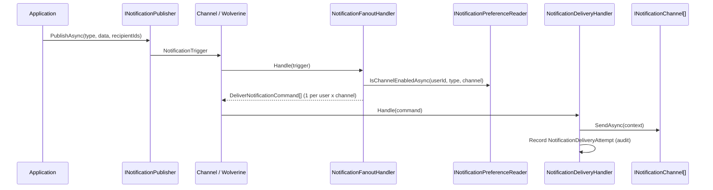

The fan-out engine is the core dispatch mechanism of Granit.Notifications. A single `PublishAsync()` call produces one `DeliverNotificationCommand` per recipient per channel, after filtering through [user preferences](./data-model/#notification-preferences).

## Fan-out pattern

A single `PublishAsync()` call produces one `DeliverNotificationCommand` per
recipient per channel. The fan-out handler resolves recipients, loads user
preferences, and filters out opted-out channels before dispatching.



### NotificationTrigger

Published by `INotificationPublisher`. Contains the notification type name,
severity, serialized data, recipient list, and optional entity reference.

```csharp
public sealed record NotificationTrigger
{
    public Guid NotificationId { get; init; }
    public required string NotificationTypeName { get; init; }
    public required NotificationSeverity Severity { get; init; }
    public required JsonElement Data { get; init; }
    public IReadOnlyList<string> RecipientUserIds { get; init; } = [];
    public EntityReference? RelatedEntity { get; init; }
    public Guid? TenantId { get; init; }
    public required DateTimeOffset OccurredAt { get; init; }
    public string? Culture { get; init; }
}
```

### DeliverNotificationCommand

Produced by `NotificationFanoutHandler`. One per recipient per channel.
Consumed by `NotificationDeliveryHandler` which routes to the matching
`INotificationChannel`.

```csharp
public sealed record DeliverNotificationCommand
{
    public required Guid DeliveryId { get; init; }
    public required Guid NotificationId { get; init; }
    public required string NotificationTypeName { get; init; }
    public required NotificationSeverity Severity { get; init; }
    public required string RecipientUserId { get; init; }
    public required string ChannelName { get; init; }
    public required JsonElement Data { get; init; }
    public EntityReference? RelatedEntity { get; init; }
    public Guid? TenantId { get; init; }
    public required DateTimeOffset OccurredAt { get; init; }
    public string? Culture { get; init; }
}
```

## INotificationPublisher

The application-facing facade for publishing notifications. Four overloads cover
explicit recipients, topic subscribers, and entity followers (Odoo-style).

```csharp
public interface INotificationPublisher
{
    // Explicit recipients
    ValueTask PublishAsync<TData>(
        NotificationType<TData> notificationType, TData data,
        IReadOnlyList<string> recipientUserIds,
        CancellationToken cancellationToken = default) where TData : notnull;

    // Explicit recipients + entity reference
    ValueTask PublishAsync<TData>(
        NotificationType<TData> notificationType, TData data,
        IReadOnlyList<string> recipientUserIds,
        EntityReference? relatedEntity,
        CancellationToken cancellationToken = default) where TData : notnull;

    // All subscribers of the notification type
    ValueTask PublishToSubscribersAsync<TData>(
        NotificationType<TData> notificationType, TData data,
        CancellationToken cancellationToken = default) where TData : notnull;

    // All followers of the entity (Odoo-style chatter)
    ValueTask PublishToEntityFollowersAsync<TData>(
        NotificationType<TData> notificationType, TData data,
        EntityReference relatedEntity,
        CancellationToken cancellationToken = default) where TData : notnull;
}
```

### Usage

```csharp
// 1. Define a notification type
public sealed class AppointmentReminder
    : NotificationType<AppointmentReminderData>
{
    public override string Name => "Appointments.Reminder";
    public override IReadOnlyList<string> DefaultChannels =>
        [NotificationChannels.InApp, NotificationChannels.Email,
         NotificationChannels.MobilePush];
}

public sealed record AppointmentReminderData(
    Guid AppointmentId, string PatientName,
    DateTimeOffset ScheduledAt, string DoctorName);

// 2. Register in a definition provider
public class AppNotificationDefinitionProvider : INotificationDefinitionProvider
{
    public void Define(INotificationDefinitionContext context)
    {
        context.Add(new NotificationDefinition("Appointments.Reminder")
        {
            DefaultSeverity = NotificationSeverity.Info,
            DefaultChannels = [NotificationChannels.InApp,
                NotificationChannels.Email, NotificationChannels.MobilePush],
            DisplayName = "Appointment Reminder",
            GroupName = "Appointments",
            AllowUserOptOut = true,
        });
    }
}

// 3. Register in DI
services.AddNotificationDefinitions<AppNotificationDefinitionProvider>();

// 4. Publish from application code
public class AppointmentReminderService(INotificationPublisher publisher)
{
    private static readonly AppointmentReminder Type = new();

    public async Task SendReminderAsync(
        Appointment appointment, CancellationToken cancellationToken)
    {
        await publisher.PublishAsync(
            Type,
            new AppointmentReminderData(
                appointment.Id, appointment.PatientName,
                appointment.ScheduledAt, appointment.DoctorName),
            [appointment.PatientUserId],
            new EntityReference("Appointment", appointment.Id.ToString()),
            cancellationToken).ConfigureAwait(false);
    }
}
```
