import { Tabs, TabItem, FileTree } from "@astrojs/starlight/components";

Granit.Notifications is a multi-channel notification engine built on a fan-out
pattern. A single `INotificationPublisher.PublishAsync()` call fans out to every
registered channel (InApp, Email, SMS, WhatsApp, Mobile Push, SignalR, SSE,
Web Push, Zulip) after filtering through user preferences. Delivery attempts are
recorded in an immutable audit trail (ISO 27001). By default, notifications
dispatch via an in-process `Channel<T>` -- add `Granit.Notifications.Wolverine`
for durable outbox-backed dispatch with exponential backoff retry.

## Package structure

<FileTree>
- Granit.Notifications/ Core: fan-out engine, InApp channel, definitions, entity tracking
  - Granit.Notifications.EntityFrameworkCore EF Core persistence (all stores)
  - Granit.Notifications.Endpoints Minimal API REST endpoints
  - Granit.Notifications.Wolverine Durable outbox dispatch via IMessageBus
  - Granit.Notifications.Email/ Email channel abstraction (Keyed Services)
    - Granit.Notifications.Email.Smtp MailKit SMTP provider
    - Granit.Notifications.Email.AzureCommunicationServices Azure Communication Services email
    - Granit.Notifications.Email.Scaleway Scaleway TEM email provider
    - Granit.Notifications.Email.SendGrid SendGrid email provider
  - Granit.Notifications.Sms SMS channel abstraction (Keyed Services)
    - Granit.Notifications.Sms.AzureCommunicationServices Azure Communication Services SMS
    - Granit.Notifications.Sms.AwsSns AWS SNS SMS provider
  - Granit.Notifications.WhatsApp WhatsApp Business API channel
  - Granit.Notifications.Brevo Unified Brevo provider (Email + SMS + WhatsApp)
  - Granit.Notifications.MobilePush/ Mobile push abstraction + token store
    - Granit.Notifications.MobilePush.GoogleFcm Firebase Cloud Messaging provider
    - Granit.Notifications.MobilePush.AzureNotificationHubs Azure Notification Hubs push
    - Granit.Notifications.MobilePush.AwsSns AWS SNS Platform Application push
  - Granit.Notifications.SignalR Real-time SignalR channel + Redis backplane
  - Granit.Notifications.WebPush W3C Web Push (VAPID, RFC 8030)
  - Granit.Notifications.Sse Server-Sent Events channel (.NET 10)
  - Granit.Notifications.Twilio Twilio SMS + WhatsApp provider
  - Granit.Notifications.Zulip Zulip chat integration
</FileTree>

| Package | Role | Depends on |
|---------|------|------------|
| `Granit.Notifications` | Fan-out engine, InApp channel, definitions, entity tracking | `Granit.Guids`, `Granit.Timing`, `Granit.QueryEngine` |
| `Granit.Notifications.EntityFrameworkCore` | EF Core stores (all entities + mobile push tokens) | `Granit.Notifications`, `Granit.Notifications.MobilePush`, `Granit.Persistence` |
| `Granit.Notifications.Endpoints` | Minimal API endpoints (inbox, preferences, subscriptions, followers) | `Granit.Notifications`, `Granit.Notifications.MobilePush`, `Granit.Validation`, `Granit.Http.ApiDocumentation` |
| `Granit.Notifications.Wolverine` | Durable outbox-backed dispatch via `IMessageBus` | `Granit.Notifications`, `Granit.Wolverine` |
| `Granit.Notifications.Email` | Email channel abstraction, Keyed Services resolution | `Granit.Notifications` |
| `Granit.Notifications.Email.Smtp` | MailKit SMTP provider (Keyed Service `"Smtp"`) | `Granit.Notifications.Email` |
| `Granit.Notifications.Email.AzureCommunicationServices` | Azure Communication Services email provider (Keyed Service `"AzureCommunicationServices"`) | `Granit.Notifications.Email` |
| `Granit.Notifications.Email.Scaleway` | Scaleway TEM email provider (Keyed Service `"Scaleway"`) | `Granit.Notifications.Email` |
| `Granit.Notifications.Email.SendGrid` | SendGrid email provider (Keyed Service `"SendGrid"`) | `Granit.Notifications.Email` |
| `Granit.Notifications.Brevo` | Unified Brevo provider (Email + SMS + WhatsApp) | `Granit.Notifications.Email`, `Granit.Notifications.Sms`, `Granit.Notifications.WhatsApp` |
| `Granit.Notifications.Sms` | SMS channel abstraction, Keyed Services resolution | `Granit.Notifications` |
| `Granit.Notifications.Sms.AzureCommunicationServices` | Azure Communication Services SMS provider (Keyed Service `"AzureCommunicationServices"`) | `Granit.Notifications.Sms` |
| `Granit.Notifications.Sms.AwsSns` | AWS SNS SMS provider (Keyed Service `"AwsSns"`) | `Granit.Notifications.Sms` |
| `Granit.Notifications.WhatsApp` | WhatsApp Business API channel | `Granit.Notifications` |
| `Granit.Notifications.MobilePush` | Mobile push abstraction + device token store | `Granit.Notifications` |
| `Granit.Notifications.MobilePush.GoogleFcm` | Firebase Cloud Messaging (FCM HTTP v1 API) | `Granit.Notifications.MobilePush` |
| `Granit.Notifications.MobilePush.AzureNotificationHubs` | Azure Notification Hubs push provider (Keyed Service `"AzureNotificationHubs"`) | `Granit.Notifications.MobilePush` |
| `Granit.Notifications.MobilePush.AwsSns` | AWS SNS Platform Application push provider (Keyed Service `"AwsSns"`) | `Granit.Notifications.MobilePush` |
| `Granit.Notifications.SignalR` | Real-time SignalR channel + Redis backplane | `Granit.Notifications` |
| `Granit.Notifications.WebPush` | W3C Web Push (VAPID, RFC 8030/8291/8292) | `Granit.Notifications` |
| `Granit.Notifications.Sse` | Server-Sent Events channel (.NET 10 native SSE) | `Granit.Notifications` |
| `Granit.Notifications.Twilio` | Twilio SMS + WhatsApp provider (Keyed Service `"Twilio"`) | `Granit.Notifications.Sms`, `Granit.Notifications.WhatsApp` |
| `Granit.Notifications.Zulip` | Zulip Bot API chat integration | `Granit.Notifications` |

## Dependency graph

```mermaid
graph TD
    N[Granit.Notifications] --> G[Granit.Guids]
    N --> T[Granit.Timing]
    N --> Q[Granit.QueryEngine]

    NEF[Granit.Notifications.EntityFrameworkCore] --> N
    NEF --> MP[Granit.Notifications.MobilePush]
    NEF --> P[Granit.Persistence]

    NE[Granit.Notifications.Endpoints] --> N
    NE --> MP
    NE --> V[Granit.Validation]
    NE --> AD[Granit.Http.ApiDocumentation]

    NW[Granit.Notifications.Wolverine] --> N
    NW --> W[Granit.Wolverine]

    EM[Granit.Notifications.Email] --> N
    SMTP[Granit.Notifications.Email.Smtp] --> EM
    ACSEM[Granit.Notifications.Email.AzureCommunicationServices] --> EM
    SCW[Granit.Notifications.Email.Scaleway] --> EM
    SG[Granit.Notifications.Email.SendGrid] --> EM
    BR[Granit.Notifications.Brevo] --> EM
    BR --> SMS[Granit.Notifications.Sms]
    BR --> WA[Granit.Notifications.WhatsApp]

    SMS --> N
    ACSSMS[Granit.Notifications.Sms.AzureCommunicationServices] --> SMS
    SNSSMS[Granit.Notifications.Sms.AwsSns] --> SMS
    TW[Granit.Notifications.Twilio] --> SMS
    TW --> WA
    WA --> N
    MP --> N
    FCM[Granit.Notifications.MobilePush.GoogleFcm] --> MP
    ANH[Granit.Notifications.MobilePush.AzureNotificationHubs] --> MP
    SNSMP[Granit.Notifications.MobilePush.AwsSns] --> MP
    SR[Granit.Notifications.SignalR] --> N
    WP[Granit.Notifications.WebPush] --> N
    SSE[Granit.Notifications.Sse] --> N
    ZU[Granit.Notifications.Zulip] --> N
```



## Setup

<Tabs>
<TabItem label="Production (Wolverine + EF Core)">

```csharp
[DependsOn(typeof(GranitNotificationsWolverineModule))]
[DependsOn(typeof(GranitNotificationsEntityFrameworkCoreModule))]
public class AppModule : GranitModule
{
    public override void ConfigureServices(ServiceConfigurationContext context)
    {
        // EF Core persistence (replaces in-memory defaults)
        context.Builder.AddGranitNotificationsEntityFrameworkCore(
            opts => opts.UseNpgsql(context.Configuration
                .GetConnectionString("Notifications")));

        // Email channel via SMTP
        context.Services.AddGranitNotificationsEmail(opts => opts.Provider = "Smtp");
        context.Services.AddGranitNotificationsEmailSmtp();

        // SignalR real-time channel with Redis backplane
        context.Services.AddGranitNotificationsSignalR(
            context.Configuration.GetConnectionString("Redis")!);

        // Notification endpoints
        context.Services.AddGranitNotificationsEndpoints();
    }

    public override void OnApplicationInitialization(ApplicationInitializationContext context)
    {
        context.App.MapGranitNotifications();
        context.App.MapHub<NotificationHub>("/hubs/notifications");
    }
}
```

</TabItem>
<TabItem label="Development (in-memory)">

```csharp
[DependsOn(typeof(GranitNotificationsModule))]
public class AppModule : GranitModule { }
```

In-memory stores, in-process `Channel<T>` dispatch. No database, no outbox.
Notifications are lost on crash -- suitable for development only.

</TabItem>
<TabItem label="With Brevo (Email + SMS + WhatsApp)">

```csharp
// One provider for three channels
context.Services.AddGranitNotificationsBrevo();
context.Services.AddGranitNotificationsEmail(opts => opts.Provider = "Brevo");
context.Services.AddGranitNotificationsSms(opts => opts.Provider = "Brevo");
context.Services.AddGranitNotificationsWhatsApp(opts => opts.Provider = "Brevo");
```

```json
{
  "Notifications": {
    "Brevo": {
      "ApiKey": "vault:secret/data/brevo#api-key",
      "DefaultSenderEmail": "noreply@clinic.example.com",
      "DefaultSenderName": "Clinic Portal",
      "DefaultSmsSenderId": "CLINIC"
    }
  }
}
```

</TabItem>
</Tabs>

## Building your own `*.Notifications` package

Modules that emit user-facing events (export ready, payment succeeded, quota
exceeded…) ship a sibling `Granit.{Module}.Notifications` package wiring the
event to the fan-out engine and providing the email templates. The
[notifications package conventions](./conventions/) page documents the
canonical file layout, the Wolverine handler shape, the `<title>`-tag subject
extraction, the JSON-array `*Display` companion gotcha, the manifest pinning
test, and the embedded-vs-DB template override mechanics.
