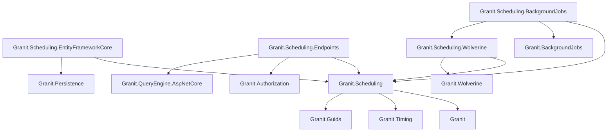
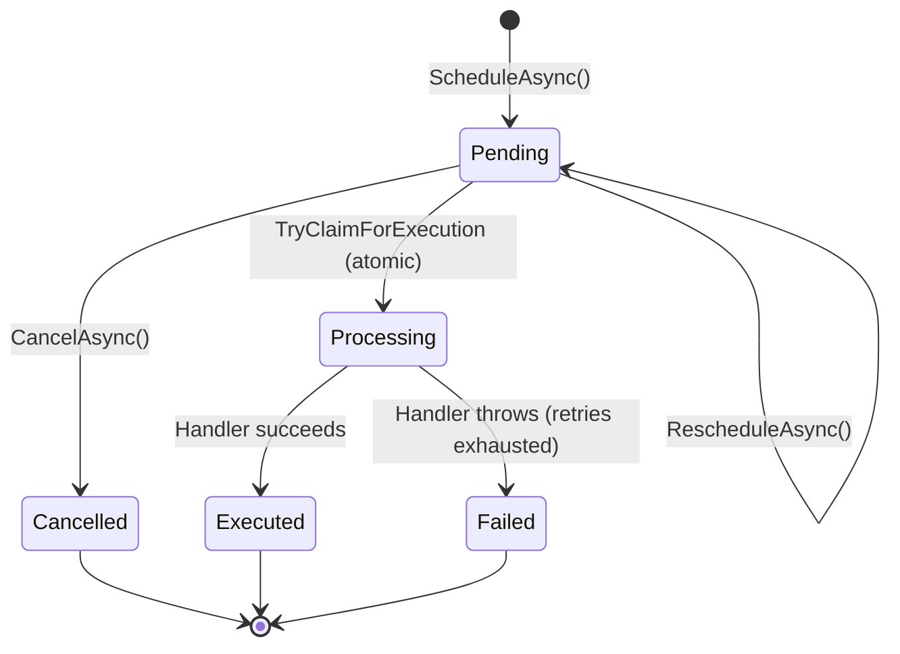

import { Tabs, TabItem, FileTree, Badge } from "@astrojs/starlight/components";

Granit.Scheduling provides a generic mechanism for scheduling **one-shot actions** at a specific
future date. Unlike `Granit.BackgroundJobs` (recurring cron), scheduled actions execute **exactly
once** at the specified time, carry a **typed payload**, and support **cancellation** and
**rescheduling**. The module handles persistence, Wolverine integration, atomic claim to prevent
double-execution, a catch-up safety net for lost messages, and a full audit trail.

:::tip[When to use Scheduling vs BackgroundJobs]
| | BackgroundJobs | Scheduling |
|---|---|---|
| **Trigger** | Cron expression (recurring) | Specific date (one-shot) |
| **Example** | "Every 1st Monday at 15h" | "On May 1st 2026, upgrade tenant X" |
| **Payload** | None (job discovers work) | Typed payload (the work IS the message) |
| **Cancellation** | Pause/resume | Cancel or reschedule specific instance |
:::

## Package structure

<FileTree>
- Granit.Scheduling/ Core: IScheduler, IScheduledPayload, ScheduledAction, Diagnostics
  - Granit.Scheduling.EntityFrameworkCore EF Core store (SQL Server / PostgreSQL)
  - Granit.Scheduling.Endpoints Minimal API admin endpoints (RBAC + QueryEngine)
  - Granit.Scheduling.Wolverine Durable ScheduleSend, atomic claim middleware
  - Granit.Scheduling.BackgroundJobs Catch-up safety net for overdue actions
</FileTree>

| Package | Role | Depends on |
|---------|------|------------|
| `Granit.Scheduling` | `IScheduler`, `IScheduledPayload`, `ScheduledAction` aggregate, metrics, type registry | `Granit`, `Granit.Timing`, `Granit.Guids` |
| `Granit.Scheduling.EntityFrameworkCore` | `SchedulingDbContext`, `EfScheduledActionStore`, atomic claim | `Granit.Scheduling`, `Granit.Persistence` |
| `Granit.Scheduling.Endpoints` | Admin API with QueryEngine pagination + RBAC | `Granit.Scheduling`, `Granit.Authorization`, `Granit.QueryEngine.AspNetCore` |
| `Granit.Scheduling.Wolverine` | `WolverineScheduler`, `ScheduledActionStatusMiddleware` | `Granit.Scheduling`, `Granit.Wolverine` |
| `Granit.Scheduling.BackgroundJobs` | `SchedulingCatchUpJob` (every 6h) | `Granit.Scheduling`, `Granit.BackgroundJobs`, `Granit.Scheduling.Wolverine` |

## Dependency graph



## Setup

<Tabs>
<TabItem label="Production (recommended)">

```csharp
[DependsOn(
    typeof(GranitSchedulingEntityFrameworkCoreModule),
    typeof(GranitSchedulingWolverineModule),
    typeof(GranitSchedulingEndpointsModule),
    typeof(GranitSchedulingBackgroundJobsModule))]
public class AppModule : GranitModule
{
    public override void ConfigureServices(ServiceConfigurationContext context)
    {
        context.Builder.AddGranitSchedulingEntityFrameworkCore(
            options => options.UseNpgsql(
                context.Configuration.GetConnectionString("Scheduling")));
    }
}
```

Map the admin endpoints:

```csharp
app.MapGranitScheduling();
```

</TabItem>
<TabItem label="Minimal (no endpoints)">

```csharp
[DependsOn(
    typeof(GranitSchedulingEntityFrameworkCoreModule),
    typeof(GranitSchedulingWolverineModule))]
public class AppModule : GranitModule
{
    public override void ConfigureServices(ServiceConfigurationContext context)
    {
        context.Builder.AddGranitSchedulingEntityFrameworkCore(
            options => options.UseNpgsql(
                context.Configuration.GetConnectionString("Scheduling")));
    }
}
```

</TabItem>
</Tabs>

## Define a scheduled payload

A payload is a `sealed record` implementing `IScheduledPayload`. It is serialized to JSON
and delivered to its Wolverine handler at execution time.

```csharp
// 1. Define the payload
public sealed record ApplyPlanChangePayload(
    Guid TenantId,
    Guid SubscriptionId,
    Guid NewPlanId) : IScheduledPayload;

// 2. Write the handler (standard Wolverine handler)
public static class ApplyPlanChangeHandler
{
    public static async Task HandleAsync(
        ApplyPlanChangePayload payload,
        ISubscriptionWriter subscriptionWriter,
        CancellationToken ct)
    {
        await subscriptionWriter.ChangePlanAsync(
            SubscriptionId.Create(payload.SubscriptionId),
            PlanId.Create(payload.NewPlanId),
            ct);
    }
}
```

## Schedule, cancel, reschedule

```csharp
public sealed class SubscriptionService(IScheduler scheduler)
{
    // Schedule a plan change for the future
    public async Task<ScheduledActionId> ScheduleUpgradeAsync(
        Guid subscriptionId, Guid newPlanId, DateTimeOffset upgradeDate, CancellationToken ct)
    {
        return await scheduler.ScheduleAsync(
            new ApplyPlanChangePayload(currentTenant.Id!.Value, subscriptionId, newPlanId),
            upgradeDate,
            correlationId: $"subscription:{subscriptionId}",
            ct);
    }

    // Cancel if the customer changes their mind
    public Task CancelUpgradeAsync(ScheduledActionId actionId, CancellationToken ct) =>
        scheduler.CancelAsync(actionId, ct);

    // Reschedule to a different date
    public Task RescheduleUpgradeAsync(
        ScheduledActionId actionId, DateTimeOffset newDate, CancellationToken ct) =>
        scheduler.RescheduleAsync(actionId, newDate, ct);
}
```

## Lifecycle



The `Processing` state is transitional: it prevents double-execution when concurrent
dispatches (catch-up job + original Wolverine message) target the same action. The claim
is atomic via `ExecuteUpdateAsync` with a `WHERE Status = Pending` guard.

## Security: payload type allowlist

The `ScheduledPayloadTypeRegistry` scans all loaded assemblies at startup and builds
an allowlist of concrete `IScheduledPayload` implementations. When deserializing a
payload (reschedule, catch-up), the registry validates the type name against this
allowlist — preventing confused-deputy attacks via crafted `PayloadType` strings.

:::caution
Never use `Type.GetType()` directly on `ScheduledAction.PayloadType`. Always use
`ScheduledPayloadTypeRegistry.Resolve()` which validates against the allowlist.
:::

## Catch-up safety net

Message brokers may lose scheduled messages over long periods (months). The
`SchedulingCatchUpJob` runs every 6 hours and re-dispatches overdue pending actions:

```text
[RecurringJob("0 */6 * * *", "scheduling-catch-up")]
Query: Status == Pending AND ExecuteAt < now - 5min
Action: re-dispatch payload via Wolverine (immediate, with ActionId header)
```

The `ScheduledActionStatusMiddleware` prevents double-execution: the atomic claim
ensures only one dispatch wins, regardless of whether it comes from the original
schedule or the catch-up job.

## Admin API

| Method | Route | Permission | Description |
|--------|-------|------------|-------------|
| GET | `/api/{version}/scheduling/{id}` | `Scheduling.Actions.Read` | Get action by ID |
| GET | `/api/{version}/scheduling/query` | `Scheduling.Actions.Read` | Paginated list (QueryEngine) |
| DELETE | `/api/{version}/scheduling/{id}` | `Scheduling.Actions.Manage` | Cancel a pending action |
| PUT | `/api/{version}/scheduling/{id}/reschedule` | `Scheduling.Actions.Manage` | Reschedule to new date |

## Observability

### Metrics (OpenTelemetry)

| Metric | Type | Tags | Description |
|--------|------|------|-------------|
| `granit.scheduling.action.scheduled` | Counter | `tenant_id`, `payload_type` | Actions scheduled |
| `granit.scheduling.action.executed` | Counter | `tenant_id`, `payload_type` | Actions executed successfully |
| `granit.scheduling.action.cancelled` | Counter | `tenant_id` | Actions cancelled |
| `granit.scheduling.action.failed` | Counter | `tenant_id`, `payload_type` | Actions failed |
| `granit.scheduling.action.rescheduled` | Counter | `tenant_id` | Actions rescheduled |
| `granit.scheduling.catchup.redispatched` | Counter | `tenant_id`, `payload_type` | Catch-up re-dispatched |

### Tracing

ActivitySource `Granit.Scheduling` with operations: `Schedule`, `Cancel`, `Reschedule`,
`Execute`, `CatchUp`.

## Database schema

Table prefix: `scheduling_` (configurable via `GranitSchedulingDbProperties.DbTablePrefix`).

| Column | Type | Notes |
| ------ | ---- | ----- |
| `Id` | GUID | Primary key |
| `PayloadType` | varchar(500) | Assembly-qualified CLR type name |
| `PayloadJson` | text | JSON-serialized payload |
| `ExecuteAt` | datetimeoffset | Scheduled execution time (UTC) |
| `CorrelationId` | varchar(500) | Optional domain entity link |
| `Status` | int | 0=Pending, 1=Executed, 2=Cancelled, 3=Failed, 4=Processing |
| `ExecutedAt` | datetimeoffset? | Completion timestamp |
| `CancelledBy` | varchar(450) | User who cancelled |
| `FailureReason` | varchar(500) | Truncated error message |
| `TenantId` | GUID? | Multi-tenant isolation |
| `CreatedAt` | datetimeoffset | Audit: creation time |
| `CreatedBy` | varchar(450) | Audit: creator |
| `ModifiedAt` | datetimeoffset? | Audit: last modification |
| `ModifiedBy` | varchar(450) | Audit: last modifier |

**Indexes:**

- `ix_scheduling_scheduled_actions_status_execute_at` — catch-up queries
- `ix_scheduling_scheduled_actions_correlation_id` — domain entity lookup

## Notifications

`Granit.Scheduling.Notifications` ships notifications for scheduled-action
lifecycle events. Tenants opt in via the notifications admin UI.

| Notification | Trigger | Channels | Severity |
| ------------ | ------- | -------- | :------: |
| `scheduling.action_failed` | `ScheduledActionFailedEto` — a scheduled action transitioned to `Failed` status (handler threw or returned a failure) | Email, InApp | Warning |

Email templates ship in EN + FR; additional cultures are produced via the
[translation script](/dotnet/business/templating/) (US #1311).

## See also

- [SaaS & Commerce](/dotnet/saas/) — ecosystem using Scheduling for plan changes and trials
- [Subscriptions](/dotnet/saas/subscriptions/) — scheduled plan changes via `ApplyPlanChangePayload`
- [Background Jobs](/dotnet/infrastructure/background-jobs) — recurring cron-based jobs
- [Wolverine Messaging](/dotnet/infrastructure/wolverine-messaging) — durable outbox and handlers
- [Feature Flags](/dotnet/infrastructure/feature-flags) — plan-driven feature cascade
