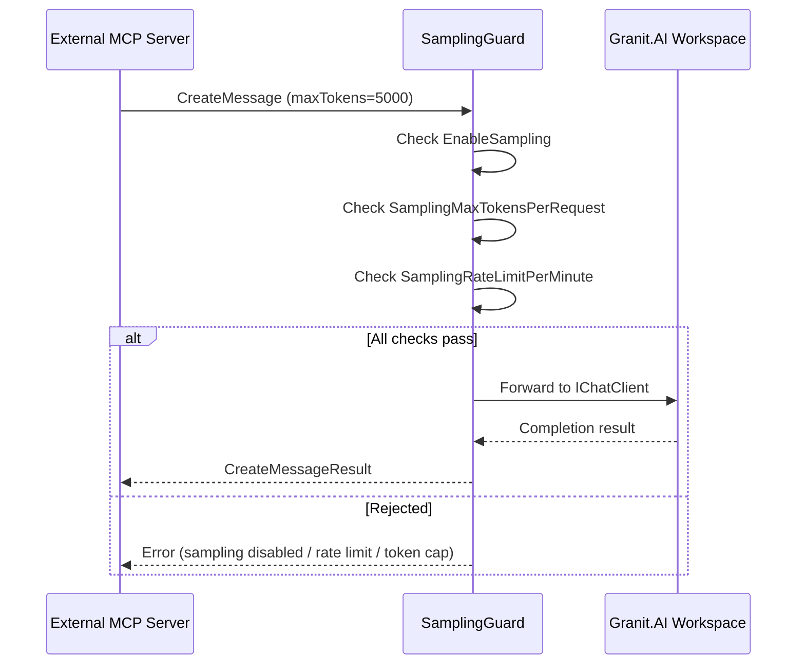

import { Tabs, TabItem } from "@astrojs/starlight/components";

`Granit.AI.Mcp` connects two worlds: external MCP servers (providing tools) and
Granit AI workspaces (providing LLM access). Tools from MCP servers become
`AITool` instances that slot into any `IChatClient` pipeline, and the
`SamplingGuard` protects against cost abuse when MCP servers request LLM
completions.

## Installation

```bash
dotnet add package Granit.AI.Mcp
dotnet add package Granit.Mcp.Client
```

```csharp
builder.AddGranitAI();              // Core AI (workspaces, IChatClient factory)
builder.AddGranitAIOpenAI();         // Provider (or AzureOpenAI, Ollama)
builder.AddGranitMcpClient();        // MCP client factory
builder.AddGranitAIMcp();            // AI-MCP bridge
```

## Configuration

```json
{
  "Mcp": {
    "Client": {
      "Connections": {
        "erp": { "Url": "https://erp.internal/mcp" },
        "crm": { "Url": "https://crm.internal/mcp" }
      }
    }
  },
  "AI": {
    "Mcp": {
      "ToolSourceConnections": ["erp", "crm"],
      "EnableSampling": false,
      "SamplingWorkspace": "default",
      "SamplingRateLimitPerMinute": 10,
      "SamplingMaxTokensPerRequest": 2000
    }
  }
}
```

### Options reference

| Property | Type | Default | Description |
|----------|------|---------|-------------|
| `ToolSourceConnections` | `List<string>` | `[]` | MCP client connection names to use as tool sources |
| `EnableSampling` | `bool` | `false` | Enable MCP sampling (external servers requesting LLM completions) |
| `SamplingWorkspace` | `string` | `"default"` | AI workspace for sampling requests |
| `SamplingRateLimitPerMinute` | `int` | `10` | Max sampling requests per tenant per minute (0 = unlimited) |
| `SamplingMaxTokensPerRequest` | `int` | `2000` | Max tokens per sampling request (0 = unlimited) |

## Injecting MCP tools into AI workspaces

`IMcpToolSourceProvider` resolves tools from configured MCP connections and
returns them as `AITool` instances:

```csharp
public sealed class IntelligentExportService(
    IAIChatClientFactory chatFactory,
    IMcpToolSourceProvider mcpTools)
{
    public async Task<string> AnalyzeAndExportAsync(string userRequest, CancellationToken ct)
    {
        // Get MCP tools from external servers
        IReadOnlyList<AITool> tools = await mcpTools.GetToolsAsync("default", ct);

        // Create an AI chat client with MCP tools available
        IChatClient chatClient = await chatFactory.CreateAsync("default", ct);

        // The LLM can now invoke MCP tools during the conversation
        ChatResponse response = await chatClient.GetResponseAsync(
            userRequest,
            new ChatOptions { Tools = [.. tools] },
            ct);

        return response.Text;
    }
}
```

The LLM sees tools from both your local Granit modules and external MCP servers.
It decides which tools to call based on the user's request.

## Sampling guard

**Sampling** is when an external MCP server asks your application to run an LLM
completion on its behalf. This is powerful but dangerous — a malicious or
misconfigured server could drain your AI budget.

The `SamplingGuard` validates every sampling request before it reaches the AI
workspace:



### Validation rules

| Check | Config | Default | Rejection message |
|-------|--------|---------|-------------------|
| Kill switch | `EnableSampling` | `false` | "MCP sampling is disabled." |
| Token cap | `SamplingMaxTokensPerRequest` | `2000` | "Requested N tokens exceeds limit of 2000." |
| Rate limit | `SamplingRateLimitPerMinute` | `10` | "Rate limit exceeded: 10 requests per minute." |

The rate limiter uses a **sliding window** algorithm per server origin. When the
limit is exceeded, subsequent requests are rejected until the window slides.
Set to `0` for unlimited (not recommended in production).

### Logging

Every sampling decision is logged:

- **Allowed**: `Information` — `"MCP sampling allowed from {ServerOrigin} (maxTokens={MaxTokens})"`
- **Rejected**: `Warning` — `"MCP sampling rejected from {ServerOrigin}: {Reason}"`

Uses `[LoggerMessage]` source generators for zero-allocation structured logging.

:::caution
**Sampling is disabled by default.** Enable it only for trusted MCP servers that
you control. An untrusted server could use sampling to:
- Consume your LLM API credits (cost attack)
- Extract information via crafted prompts (data exfiltration)
- Flood your rate limits (denial of service)
:::

## See also

- [MCP Client](/dotnet/mcp/client/) — configure external MCP server connections
- [Granit.AI setup](/dotnet/ai/setup/) — workspace management and provider configuration
- [Security](/dotnet/mcp/security/) — authorization, sanitization, audit
- [MCP overview](/dotnet/mcp/) — architecture and design principles
