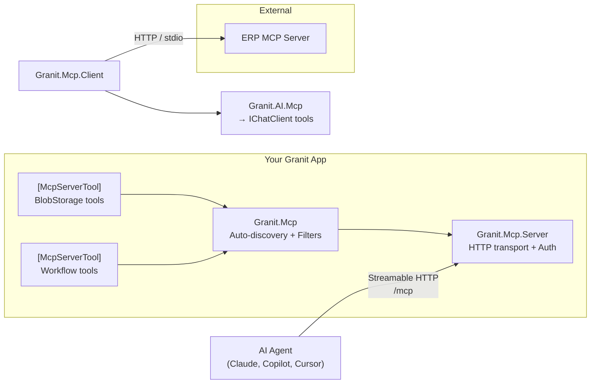

import { FileTree, Tabs, TabItem } from "@astrojs/starlight/components";

Granit wraps the official [MCP C# SDK](https://github.com/modelcontextprotocol/csharp-sdk)
to let any Granit-based application expose its capabilities to AI agents via the
**Model Context Protocol** (MCP). An agent connects to your app, discovers available
tools, and invokes them — with full Granit authorization, multi-tenancy, and GDPR
sanitization applied automatically.

## What you can do with Granit.Mcp

| Capability | Package | What it does |
|------------|---------|-------------|
| **Expose tools** | [Granit.Mcp](/dotnet/mcp/tools/) | Auto-discover `[McpServerTool]` methods from module assemblies |
| **HTTP transport** | [Granit.Mcp.Server](/dotnet/mcp/setup/) | Streamable HTTP endpoint with `[Authorize]` + RBAC permissions |
| **GDPR sanitization** | [Granit.Mcp](/dotnet/mcp/security/) | Omit PII from tool responses, truncate large payloads, strip stack traces |
| **Multi-tenancy** | [Granit.Mcp.Server](/dotnet/mcp/visibility/) | Per-tenant tool visibility, module scoping, opt-in discovery |
| **Consume external servers** | [Granit.Mcp.Client](/dotnet/mcp/client/) | Named factory for HTTP + stdio connections with credential forwarding |
| **AI workspace bridge** | [Granit.AI.Mcp](/dotnet/mcp/ai-integration/) | Inject MCP tools into `IChatClient` pipelines, cost-controlled sampling |

## Package structure

<FileTree>

- Granit.Mcp/ Core abstractions, auto-discovery, sanitization pipeline, diagnostics
  - Granit.Mcp.Server/ ASP.NET Core Streamable HTTP transport, auth, permissions, visibility filters
  - Granit.Mcp.Client/ Named factory for external MCP server connections (HTTP + stdio)
  - Granit.AI.Mcp/ Bridge MCP tools into Granit.AI workspaces, sampling guard

</FileTree>

## Architecture



## Design principles

### SDK-native, not wrapper-heavy

Granit delegates to the MCP C# SDK wherever possible. Cross-cutting concerns
(sanitization, visibility, audit) are wired into the SDK's **onion-model filter
pipeline** (`AddCallToolFilter`, `AddListToolsFilter`) — not a parallel abstraction.

### Standard ASP.NET Core authorization

No custom auth attributes. Tool authorization uses `[Authorize(Policy = "...")]`
via the SDK's `.AddAuthorizationFilters()`. Granit's `DynamicPermissionPolicyProvider`
maps policy names to RBAC permissions automatically.

### Opt-in by default

In production (`McpToolDiscoveryMode.Explicit`), tool classes need `[McpExposed]`
alongside `[McpServerToolType]`. An accidental `[McpServerTool]` on an internal
service stays hidden until explicitly opted in.

### GDPR-compliant output

Tool responses pass through a sanitization pipeline before reaching the AI agent.
PII is omitted (not masked — masked values waste LLM tokens and trigger hallucinations),
large payloads are truncated, and error messages are stripped of stack traces.

## Quick start

Three lines to expose your first MCP tool:

```csharp
// 1. Register
builder.AddGranitMcpServer();

// 2. Map
app.MapGranitMcpServer();

// 3. Create a tool (in any module assembly)
[McpServerToolType, McpExposed]
public sealed class InvoiceMcpTools(IInvoiceReader reader)
{
    [McpServerTool, Description("Search invoices by status and date range.")]
    [Authorize(Policy = "Invoicing.Invoices.Read")]
    [McpToolOptions(ReadOnly = true)]
    public async Task<string> SearchInvoicesAsync(
        [Description("Invoice status filter")] string status,
        [Description("Start date (ISO 8601)")] DateOnly from,
        ICurrentTenant tenant,
        CancellationToken ct)
    {
        var invoices = await reader.SearchAsync(status, from, ct);
        return JsonSerializer.Serialize(invoices);
    }
}
```

Connect Claude Desktop, Cursor, or any MCP client to `https://your-app/mcp` — your
tools appear automatically.

:::tip
Head to the [Setup guide](/dotnet/mcp/setup/) for the full installation walkthrough,
or jump to [Creating tools](/dotnet/mcp/tools/) for the complete tool authoring reference.
:::

## Observability

Meter: `Granit.Mcp` — all metrics follow Granit conventions.

| Metric | Type | Tags |
|--------|------|------|
| `granit.mcp.tools.invoked` | Counter | `tenant_id`, `tool_name`, `status` |
| `granit.mcp.resources.read` | Counter | `tenant_id`, `resource_uri` |
| `granit.mcp.sessions.active` | UpDownCounter | `tenant_id`, `transport` |
| `granit.mcp.request.duration` | Histogram (s) | `tenant_id`, `method` |

Activity source: `Granit.Mcp` — registered via `GranitActivitySourceRegistry`.

## See also

- [Setup & configuration](/dotnet/mcp/setup/)
- [Creating MCP tools](/dotnet/mcp/tools/)
- [Security & data protection](/dotnet/mcp/security/)
- [Tool visibility & multi-tenancy](/dotnet/mcp/visibility/)
- [Consuming external MCP servers](/dotnet/mcp/client/)
- [AI workspace integration](/dotnet/mcp/ai-integration/)
- [Granit.AI overview](/dotnet/ai/) — provider-agnostic LLM integration
- [MCP C# SDK documentation](https://csharp.sdk.modelcontextprotocol.io/)
