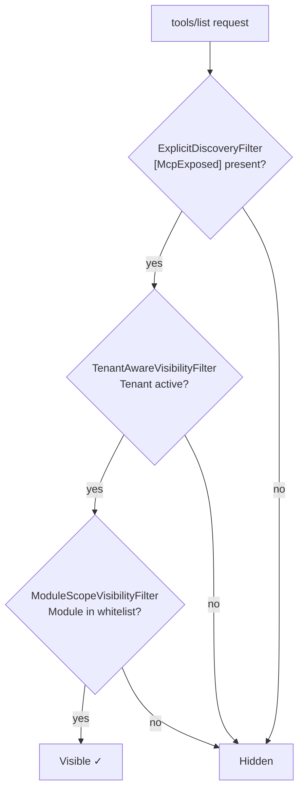

import { Tabs, TabItem } from "@astrojs/starlight/components";

Tool **visibility** determines which tools appear in `tools/list` responses —
separate from **authorization**, which controls whether an invocation is allowed.
A tool can be visible but denied by `[Authorize]`, or invisible but still callable
if the client knows its name.

Granit provides three independent visibility filters, all wired into the SDK's
`AddListToolsFilter` pipeline:

## Discovery modes

The `ToolDiscovery` option controls the baseline for tool discovery:

<Tabs>
<TabItem label="Explicit (default)">

Tool classes need both `[McpServerToolType]` (SDK) **and** `[McpExposed]` (Granit):

```csharp
[McpServerToolType, McpExposed]  // Both required
public sealed class InvoiceMcpTools(IInvoiceReader reader)
{
    [McpServerTool, Description("Search invoices by status.")]
    public async Task<string> SearchAsync(...) { ... }
}
```

A class with only `[McpServerToolType]` (no `[McpExposed]`) is registered in the
SDK but **hidden** from `tools/list`. This prevents accidental exposure of internal
services that happen to have the SDK attribute.

</TabItem>
<TabItem label="Auto (dev/staging)">

All `[McpServerToolType]` classes are visible — `[McpExposed]` is ignored:

```json
{
  "Mcp": {
    "ToolDiscovery": "Auto"
  }
}
```

Useful in development to see all tools without annotating each class.

</TabItem>
</Tabs>

:::caution
**Use `Explicit` in production.** A developer adding `[McpServerTool]` to a
service method for local testing could accidentally expose it. `Explicit` mode
ensures the team consciously opts in each tool class.
:::

## Tenant scope

Multi-tenant applications often have tools that only make sense within a tenant
context (e.g., querying tenant-specific data). Use `[McpTenantScope]` to hide
them when no tenant is active:

```csharp
[McpServerToolType, McpExposed]
[McpTenantScope(RequireTenant = true)]
public sealed class TenantReportMcpTools(IReportService reports, ICurrentTenant tenant)
{
    [McpServerTool, Description("Generates a monthly revenue report for the current tenant.")]
    [Authorize(Policy = "Reports.Revenue.Read")]
    public async Task<string> GenerateRevenueReportAsync(
        [Description("Month (1-12)")] int month,
        [Description("Year")] int year,
        CancellationToken ct)
    {
        var report = await reports.GetRevenueAsync(tenant.Id!.Value, month, year, ct);
        return JsonSerializer.Serialize(report);
    }
}
```

**Behavior:**
- `ICurrentTenant.IsAvailable == true` → tool is visible
- `ICurrentTenant.IsAvailable == false` → tool is hidden from `tools/list`
- No `[McpTenantScope]` → tool is always visible (tenant-agnostic)

Disable tenant filtering globally with `"EnableTenantFiltering": false` in
`GranitMcpOptions`.

## Module scoping

Applications using many Granit modules could expose hundreds of tools. AI agents
have limited context windows — listing 200 tools wastes tokens and confuses the
model. Module scoping narrows the exposed surface:

```json
{
  "Mcp": {
    "Server": {
      "EnabledModules": ["BlobStorage", "Workflow", "Notifications"]
    }
  }
}
```

The `ModuleScopeVisibilityFilter` checks each tool class's namespace against the
whitelist. A class in `Granit.BlobStorage.Mcp` matches `"BlobStorage"`. A class in
`Granit.Identity.Mcp` does not — it's hidden.

**Rules:**
- Empty `EnabledModules` (default) → all modules visible
- Matching is case-insensitive on the namespace segment
- A namespace matches if it contains `.{Module}.` or ends with `.{Module}`

:::tip
Start with a narrow set (3–5 modules) and expand as needed. AI agents perform
better with fewer, well-described tools than with a massive catalog.
:::

## Tool type resolution

Visibility filters receive the tool's CLR `Type` via `McpToolTypeRegistry` — a
mapping built during assembly scanning in `GranitMcpModule`. This allows filters
to inspect attributes (`[McpExposed]`, `[McpTenantScope]`) on the actual class.
The registry is populated automatically — no manual registration needed.

## Filter composition

All three filters compose independently. A tool must pass **all** filters to be
visible:



## Custom visibility filters

Implement `IMcpToolVisibilityFilter` for application-specific logic:

```csharp
internal sealed class FeatureFlagVisibilityFilter(
    IFeatureFlagChecker features) : IMcpToolVisibilityFilter
{
    public async ValueTask<bool> IsVisibleAsync(
        string toolName, Type? toolType, IServiceProvider services,
        CancellationToken ct)
    {
        // Hide tools behind feature flags
        return await features.IsEnabledAsync($"mcp.tool.{toolName}", ct);
    }
}

// Register:
services.TryAddEnumerable(
    ServiceDescriptor.Scoped<IMcpToolVisibilityFilter, FeatureFlagVisibilityFilter>());
```

## See also

- [Creating tools](/dotnet/mcp/tools/) — `[McpExposed]` and `[McpTenantScope]` usage
- [Security](/dotnet/mcp/security/) — authorization (separate from visibility)
- [Setup guide](/dotnet/mcp/setup/) — `EnabledModules` configuration
- Multi-tenancy — `ICurrentTenant` reference
