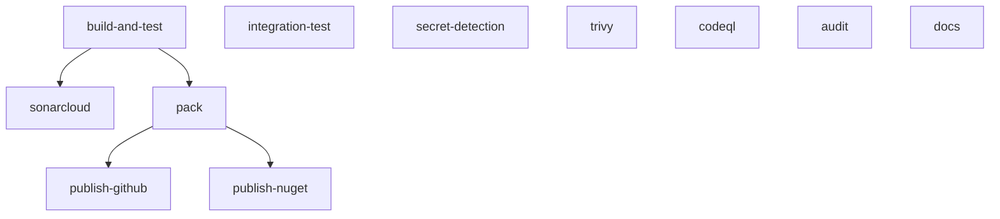

This guide covers the CI/CD pipeline for the Granit framework: compilation,
quality gates, security scanning, static analysis, NuGet packaging, and
publication to GitHub Packages, nuget.org, and Cloudflare Pages.

## Triggers

The pipeline runs on:

- Every pull request targeting `develop` or `main`
- Every push to `develop` or `main`
- Every version tag matching `v[0-9]+.[0-9]+.[0-9]+`

Concurrent runs on the same ref are cancelled automatically (`cancel-in-progress: true`).

## Job graph



Most jobs run in parallel. The only sequential chain is:
`build-and-test → sonarcloud` and `build-and-test → pack → publish`.

## Job details

### build-and-test

Single job combining compile, format check, unit tests, and architecture tests.
Avoids the 750 MB upload/download overhead of sharing `bin/`/`obj/` artifacts.

| Step | Command | Blocking |
| ---- | ------- | -------- |
| Build | `dotnet build -c Release -m:4 -p:SkipIntegrationTests=true` | Yes |
| Format | `dotnet format --verify-no-changes --no-restore` | Yes |
| Unit tests | `dotnet test` with OpenCover + Cobertura coverage | Yes |
| Architecture tests | `dotnet test tests/Granit.ArchitectureTests/...` | Yes |

Coverage reports (`coverage.opencover.xml`) and test results (`*.trx`) are
uploaded as artifacts for 7 days. The `sonarcloud` job downloads the coverage
artifact from here.

Timeout: **15 minutes**.

### integration-test

Runs in parallel with `build-and-test` (no dependency). Spins up a PostgreSQL 18
service container and runs each `*.Tests.Integration` project sequentially.
Marked `continue-on-error: true` — service container availability is not
guaranteed in all runner environments.

Service container:

```yaml
image: postgres:18
env:
  POSTGRES_DB: granit_test
  POSTGRES_USER: granit_test
  POSTGRES_PASSWORD: test_password
```

Environment variables exposed to tests: `POSTGRES_HOST`, `POSTGRES_PORT`,
`POSTGRES_DB`, `POSTGRES_USER`, `POSTGRES_PASSWORD`.

### Security jobs

Three security jobs run in parallel, independent of all other jobs:

| Job | Tool | Blocking |
| --- | ---- | -------- |
| `secret-detection` | Gitleaks 8.30.0 — detects committed secrets | Yes |
| `trivy` | Aqua Trivy — filesystem scan for HIGH/CRITICAL CVEs | Yes |
| `codeql` | GitHub CodeQL — semantic C# analysis | No (results in Security tab) |

Gitleaks performs a full history scan (`--log-opts="--all"`).
Trivy uses a pinned action digest for supply-chain security.
CodeQL results appear in the repository **Security › Code scanning alerts** tab.

### sonarcloud

Static analysis with coverage integration. Needs `build-and-test` (downloads
the `coverage` artifact). Excluded paths: `.nuget/**`, `docs-site/**`. Coverage
exclusions: test projects, `*Module.cs`, `*HostApplicationBuilderExtensions.cs`.

Requires **Java 17** (Temurin) for the SonarScanner CLI.
`sonar.qualitygate.wait=true` — the job waits for the quality gate result.
Marked `continue-on-error: true` — pipeline is not blocked by SonarCloud availability.

Timeout: **30 minutes**.

Skipped on pull requests from forks (no access to `SONAR_TOKEN`).

### audit

Runs `dotnet list package --vulnerable --include-transitive`. Fails if any
vulnerable package is found. The vulnerability report is saved as an artifact
for 7 days. Marked `continue-on-error: true` (advisory).

### pack

Needs `build-and-test`. Runs only on `develop`, `main`, or version tags.
Rebuilds the solution from the NuGet cache (no artifact sharing).

| Context | Version format |
| ------- | -------------- |
| Tag `vX.Y.Z` | `X.Y.Z` (stable release) |
| Branch `develop` or `main` | `0.1.0-dev.<run_number>` (prerelease) |

Packed `.nupkg` files are uploaded as the `nupkgs` artifact for 7 days.

### publish-github

Needs `pack`. Runs only on `develop` and `main` (not on tags).
Pushes `.nupkg` files to **GitHub Packages** using the automatic `GITHUB_TOKEN`
(`packages: write` permission declared on the job). Uses `--skip-duplicate` so
re-running the pipeline is safe.

### publish-nuget

Needs `pack`. Runs only on version tags (`refs/tags/v*`).
Pushes `.nupkg` files to **nuget.org** using the `NUGET_API_KEY` secret and
the `nuget-publish` deployment environment (protection rules apply).

### docs

Independent job — no dependency on `build-and-test`. Runs on `develop` and `main`.
Builds the Astro Starlight site with **pnpm 10** and **Node.js 22**, then deploys
to **Cloudflare Pages**:

```
project-name: granit-docs
branch:       ${{ github.ref_name }}   (develop or main)
```

Preview deployments on `develop`, production on `main`.

## Cache strategy

Every job uses `actions/cache` keyed by `runner.os` and a hash of
`**/*.csproj` + `Directory.Packages.props`. With a warm cache, NuGet restore
completes in 5–10 seconds.

Each job that compiles rebuilds independently — no `bin/`/`obj/` artifacts are
shared. This avoids the ~750 MB upload/download per run.

## Build commands

Core commands available locally and in CI:

```bash
# Compile (skip integration tests — no Docker needed locally)
dotnet build -p:SkipIntegrationTests=true

# Run unit tests with coverage
dotnet test -p:SkipIntegrationTests=true -p:SkipArchitectureTests=true \
  --collect:"XPlat Code Coverage"

# Run architecture tests only
dotnet test tests/Granit.ArchitectureTests/Granit.ArchitectureTests.csproj

# Verify formatting
dotnet format --verify-no-changes

# Pack for local feed
dotnet pack -c Release -o ./nupkgs
```

## CI secrets

### Required

| Secret | Description | Used by |
| ------ | ----------- | ------- |
| `NUGET_API_KEY` | nuget.org API key | `publish-nuget` (tag builds only) |
| `CLOUDFLARE_API_TOKEN` | Cloudflare API token | `docs` |
| `CLOUDFLARE_ACCOUNT_ID` | Cloudflare account ID | `docs` |

### Optional

| Secret | Description | Used by |
| ------ | ----------- | ------- |
| `SONAR_TOKEN` | SonarCloud authentication token | `sonarcloud` |

### Automatic

`GITHUB_TOKEN` is provided automatically by GitHub Actions and is used for
Gitleaks scanning, GitHub Packages publishing (`packages: write`), and
CodeQL results upload (`security-events: write`).

## Consuming Granit packages

Applications that depend on Granit prerelease packages add GitHub Packages as
a NuGet source:

```xml
<!-- nuget.config -->
<packageSources>
  <add key="github-granit"
       value="https://nuget.pkg.github.com/granit-fx/index.json" />
</packageSources>
<packageSourceMapping>
  <packageSource key="github-granit">
    <package pattern="Granit.*" />
  </packageSource>
</packageSourceMapping>
```

Authentication uses `GITHUB_TOKEN` in CI. For local development, add credentials
in `packageSourceCredentials`:

```xml
<packageSourceCredentials>
  <github-granit>
    <add key="Username" value="YOUR_GITHUB_USERNAME" />
    <add key="ClearTextPassword" value="YOUR_PERSONAL_ACCESS_TOKEN" />
  </github-granit>
</packageSourceCredentials>
```

The personal access token needs the `read:packages` scope.

## Definition of Done

Before any pull request is approved, the following gates must pass:

- [ ] `dotnet build` succeeds
- [ ] `dotnet test` passes
- [ ] `dotnet format --verify-no-changes` passes
- [ ] Architecture tests pass
- [ ] No HIGH/CRITICAL vulnerabilities (Trivy)
- [ ] Secret detection scan clean (Gitleaks)
- [ ] Documentation updated (if applicable)

:::caution[Blocking gates]
Tests passing, format clean, and documentation updated are **blocking** requirements.
Do not merge without satisfying all gates. See the full
[Definition of Done](/contributing/definition-of-done/) for details.
:::

## Troubleshooting

### build-and-test times out

The job has a 15-minute limit. If tests are slow, check for non-parallelized
test collections or missing `[assembly: CollectionBehavior(MaxParallelThreads = 4)]`.
Adjust `MaxCpuCount` in the test step if needed.

### SonarCloud shows 0% coverage

Verify that:

1. The `build-and-test` job produced `**/coverage.opencover.xml` artifacts.
2. The `sonarcloud` job successfully downloaded the `coverage` artifact.
3. `sonar.cs.opencover.reportsPaths` points to `**/coverage.opencover.xml`.

### audit job fails

A NuGet dependency has a known vulnerability. Check the `vulnerability-report`
artifact. Update the affected package or, if no fix is available, document the
risk assessment in the PR description.

### Integration tests fail with connection errors

Verify that:

1. The PostgreSQL 18 service container passed its health check (check job logs).
2. Environment variables `POSTGRES_HOST`, `POSTGRES_PORT`, `POSTGRES_DB`,
   `POSTGRES_USER`, `POSTGRES_PASSWORD` match the service definition.
3. The test fixture uses `localhost:5432` — service containers map to the
   runner's `localhost`.

### publish-github fails with 403

Ensure the `publish-github` job declares `permissions: packages: write`.
For organization repositories, verify that GitHub Actions is allowed to create
packages in the organization settings (**Settings › Actions › General**).

### docs deploy fails

Verify that `CLOUDFLARE_API_TOKEN` and `CLOUDFLARE_ACCOUNT_ID` are set in the
repository secrets. The token needs the **Cloudflare Pages: Edit** permission
scoped to the `granit-docs` project.
