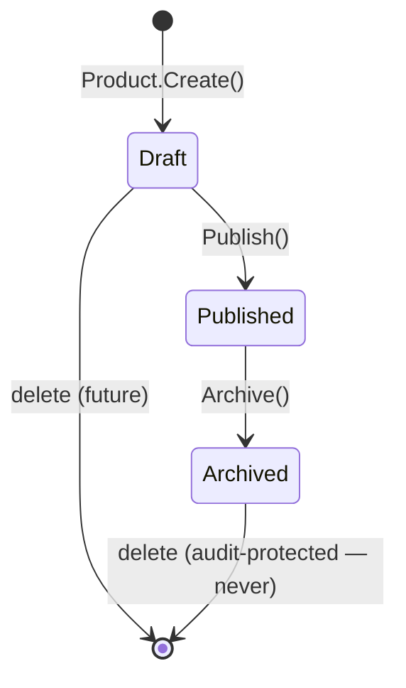
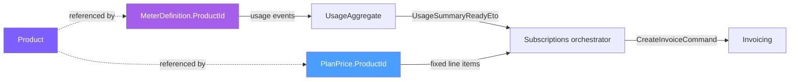

import { FileTree } from "@astrojs/starlight/components";

`Granit.Catalog` introduces a **single source of truth for "what is being sold"** —
a `Product` aggregate referenced by `Granit.Metering.MeterDefinition.ProductId`
and `Granit.Subscriptions.PlanPrice.ProductId`. This is the join key that makes
ORB-style invoice line item provenance possible: the audit chain
`event → meter → product → invoice line` becomes queryable in SQL instead of
relying on convention-based name matching.

:::note
**MVP scope**: the catalog is **Host-owned** — products are global to the SaaS
provider, not per-tenant. Tenants reference these products through their
subscriptions but cannot create their own. The future e-commerce phase will
extend the module with multi-tenant inventory; the chosen path is documented
in [ADR 032](/dotnet/architecture/adr/032-catalog-product-shared-billing-aggregate/).
:::

## Package structure

<FileTree>
- Granit.Catalog/ Domain: Product, ProductExternalMapping, ProductType, events, CQRS interfaces
  - Granit.Catalog.EntityFrameworkCore Isolated DbContext, Reader/Writer
  - Granit.Catalog.Endpoints Product CRUD, lifecycle, external mappings, QueryEngine
</FileTree>

## Domain model

### `Product` (aggregate root)

`AuditedAggregateRoot, IWorkflowStateful, IHasMetadata` — the catalog item.

Fields:

- `Sku` (string, **unique per Host catalog**) — stable business identifier
- `Name`, `Description?`
- `Type`: `Service` | `Metered` | `Physical` | `Digital`
- `Unit` (free text — `"call"`, `"GB"`, `"seat"`, `"license"`, ...)
- `LifecycleStatus`: `Draft` → `Published` → `Archived` (via `WorkflowLifecycleStatus`)
- `MetadataJson` (string?) — Stripe-style metadata via `IHasMetadata`;
  use the framework extensions (`GetMetadataValue`, `SetMetadataValue`, ...)
- `ExternalMappings` — provider integrations (Stripe `prod_xxx`, Avalara tax codes,
  Odoo product ids, ...)

Behaviors:

- `Create(id, sku, name, type, unit, description?)` — factory, starts in `Draft`
- `Update(name, description, unit)` — Draft only; `Sku` and `Type` are immutable
  post-creation (changing them reshapes downstream contracts and must be modeled
  as a fresh product)
- `Publish()` — Draft → Published; unlocks references from Metering / Subscriptions
- `Archive()` — Published → Archived; existing references unaffected
- `ReplaceMetadata(dict)` — bulk replace; for granular updates, use the
  framework `SetMetadataValue(name, value)` extension
- `AddExternalMapping(mapping)` / `RemoveExternalMapping(mappingId)` — allowed
  in any lifecycle state

Domain events: `ProductCreatedEvent`, `ProductPublishedEvent`, `ProductArchivedEvent`.

### `ProductType`

Drives downstream behavior — tax classification, shipping requirements, metering
binding:

- `Service` — consultancy, onboarding, training (no measurement)
- `Metered` — usage-based; bound to a `Granit.Metering.MeterDefinition` via
  `MeterDefinition.ProductId`
- `Physical` / `Digital` — placeholders for the future e-commerce phase

### `ProductExternalMapping`

Child entity, one row per external system:

- `ProviderName` (`"stripe"`, `"avalara"`, `"odoo"`, ...)
- `ExternalId` (the provider's identifier — `"prod_1234"`, `"PS080100"`, ...)

`(ProviderName, ExternalId)` is **globally unique across all products** — one
external identifier maps to exactly one product.

## Lifecycle



- **Draft**: editable; not yet usable by Metering or Subscriptions
- **Published**: immutable except for `Metadata` and `ExternalMappings`;
  new meters and plan prices may reference it
- **Archived**: tombstone; existing references keep working; new attachments
  are blocked at the application layer

## Cross-module wiring



References across modules are **soft** (no SQL FK across module schemas) —
the application layer is responsible for catalog deletion safety (refuse to
delete a product if any current meter or price still references it).

## Admin API

Reads (`Catalog.Products.Read`):

- `GET /catalog/products` — list Published products
- `GET /catalog/products/{id}` — get by id (any lifecycle status)
- `GET /catalog/products/by-sku/{sku}` — reverse lookup for integration syncs
- `GET /catalog/product-records/...` — QueryEngine surface (paginated, filterable, exportable)

Writes (`Catalog.Products.Manage`, all idempotent):

- `POST /catalog/products` — create in Draft
- `PUT  /catalog/products/{id}` — update editable fields (Draft only)
- `PUT  /catalog/products/{id}/metadata` — bulk-replace extra properties
- `POST /catalog/products/{id}/publish` — Draft → Published
- `POST /catalog/products/{id}/archive` — Published → Archived
- `POST   /catalog/products/{id}/external-mappings` — add a Stripe / Avalara / Odoo mapping
- `DELETE /catalog/products/{id}/external-mappings/{mappingId}` — remove a mapping

The `/catalog/product-records` route exposes the full Granit **QueryEngine**
surface (`/`, `/meta`, `/saved-views/*`) — filter, sort, group, paginate, export
to CSV/XLSX, and save per-user views. Mounted on a dedicated sub-path to avoid
colliding with the resource endpoints above (mirrors `/metering/meter-definitions`).

All endpoints are Host-side only (`MultiTenancySide.Host`) — only the SaaS
provider's host admin manages the catalog.

## Quick start

Wire the module into a Granit app:

```csharp
builder.AddGranitCatalog();
builder.AddGranitCatalogEntityFrameworkCore(opts =>
    opts.UseNpgsql(builder.Configuration.GetConnectionString("Catalog")));

// Then in MapEndpoints:
app.MapGranitCatalog();
```

Reference a Catalog product from a meter:

```csharp
var apiCallsProduct = Product.Create(
    productId, sku: "API-CALLS", name: "API Calls",
    type: ProductType.Metered, unit: "call");
apiCallsProduct.Publish();
await productWriter.AddAsync(apiCallsProduct);

var meter = MeterDefinition.Create(
    meterId, name: "api.calls", unit: "call",
    aggregationType: AggregationType.Count,
    description: null,
    productId: apiCallsProduct.Id);   // ← cross-module link
await meterWriter.AddAsync(meter);
```

## See also

- [SaaS Overview](/dotnet/saas/) — ecosystem architecture and choreography
- [Subscriptions](/dotnet/saas/subscriptions/) — `PlanPrice.ProductId` consumer
- [Metering](/dotnet/saas/metering/) — `MeterDefinition.ProductId` consumer
- [ADR 032](/dotnet/architecture/adr/032-catalog-product-shared-billing-aggregate/) — design decisions and the path to multi-tenant e-commerce
