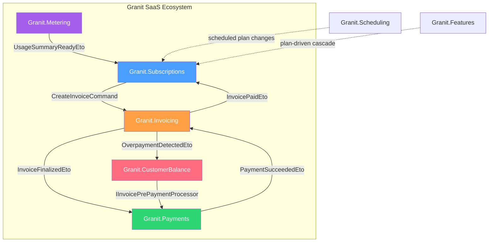

import { FileTree } from "@astrojs/starlight/components";

Granit provides a complete SaaS & Commerce ecosystem through five interdependent modules.
Together they cover the full monetization lifecycle: **plans → subscriptions → usage tracking →
invoicing → credit balance → payment collection**, with sovereignty-first design (SEPA transfer
works without any external dependency).

## Architecture



## Event choreography

The modules communicate exclusively via integration events (Wolverine outbox).
**Subscriptions never listens to Payment events directly** — this is critical
for credit note scenarios.

```text
Metering ──UsageSummaryReadyEto──→ Subscriptions (billing cycle orchestrator)
                                        │
                                        ├── fixed line items (plan price)
                                        ├── usage line items (from IUsageReader)
                                        │
                                        └──CreateInvoiceCommand──→ Invoicing
                                                                      │
                                              InvoiceFinalizedEto ←───┘
                                                      │
                                                      ▼
                                            IInvoicePrePaymentProcessor
                                              (CustomerBalance deducts credit,
                                               or PassThrough if not installed)
                                                      │
                                                      ▼
                                                  Payments
                                                      │
                                        PaymentSucceededEto ───→ Invoicing (RecordPayment)
                                                                      │
                                                  InvoicePaidEto ←───┘
                                                      │
                                                      ▼
                                                Subscriptions (renews/activates)
```

:::tip[Why Subscriptions doesn't listen to PaymentSucceededEto]
If a credit note covers 100% of an invoice, Invoicing marks it Paid without
any payment — `InvoicePaidEto` fires, Subscriptions renews. If Subscriptions
listened to `PaymentSucceededEto`, it would never renew in this scenario.
:::

## Modules

| Module | Purpose | Phase |
|--------|---------|-------|
| [Subscriptions](/dotnet/saas/subscriptions/) | Plans, subscriptions, seats, entitlements, billing cycle orchestration | 1 |
| [Invoicing](/dotnet/saas/invoicing/) | Invoices, credit notes, partial payments, tax, external accounting sync | 1 |
| [Payments](/dotnet/saas/payments/) | Provider-agnostic payment processing, webhooks, refunds, disputes | 1 |
| [Metering](/dotnet/saas/metering/) | Usage event recording, watermark aggregation, quota enforcement | 1 |
| [Tax](/dotnet/saas/tax/) | Tax calculation (EU VAT, Stripe Tax), VIES validation, rate management | 2 |
| [Customer Balance](/dotnet/saas/customer-balance/) | Per-tenant credit ledger, pre-payment deduction, promotional credits with expiration | 3 |

Each module has a `.Notifications` package with `NotificationType<TData>` definitions
(15 types total: 6 Subscriptions, 4 Invoicing, 5 Payments). Email templates are Phase 2.

## Supporting modules

| Module | Role in SaaS |
|--------|-------------|
| [Scheduling](/dotnet/infrastructure/scheduling/) | One-shot future actions (scheduled plan changes, trial expiration) |
| [Background Jobs](/dotnet/infrastructure/background-jobs/) | Recurring scans (trial expiration, period end, aggregation, quota checks) |
| [Features](/dotnet/infrastructure/feature-flags/) | Plan-driven feature cascade via `Subscriptions.Features` bridge |
| [Workflow](/dotnet/infrastructure/wolverine-messaging/) | FSM for subscription and plan lifecycle |
| [Notifications](/dotnet/infrastructure/notifications/) | Payment reminders, trial expiration, quota alerts |

## Design principles

### Sovereignty first

Every payment flow has a zero-dependency option. SEPA bank transfer works without
Stripe, Mollie, or any US cloud provider — critical for HDS/sovereign hosting.

### Agnostic by design

Invoicing and Payments are **not** SaaS-specific. `InvoiceLineItem.SourceType`
accepts `Subscription`, `Usage`, `OneShot`, or `Credit` — enabling future
`Granit.Commerce` (e-commerce) to reuse the same billing and payment infrastructure.

### Hybrid provider model

Granit is the **source of truth** for subscription and payment status. External
providers (Stripe, Mollie) are **executors** with declared capabilities. A tenant
can have multiple providers active simultaneously (Card → Stripe, BankTransfer → SEPA,
iDEAL → Mollie).

## Phase strategy

| Phase | Scope | Status |
|-------|-------|--------|
| **1** | Subscriptions + Invoicing + Payments (Stripe + Mollie) + Metering + Notifications | Implemented |
| **2** | SEPA providers, Invoicing.Internal (PDF), Invoicing.Odoo, Tax (EU VAT + Stripe Tax), dunning, multi-currency, pricing resolver | Implemented |
| **3** | Email templates, customer balance (credit ledger), Open Banking (PSD2), Granit.Commerce | Implemented |

## Compliance

| Requirement | Implementation |
|-------------|---------------|
| **GDPR** | Tenant isolation, data minimization, right to erasure on billing data |
| **ISO 27001** | Immutable audit trails on invoices and payment transactions, 3-year retention |
| **PCI DSS** | Hosted payment pages only — no card data in Granit |
| **HDS** | Sovereign hosting capable — SEPA transfer has zero external dependency |

## See also

- [Scheduling](/dotnet/infrastructure/scheduling/) — one-shot future actions
- [Background Jobs](/dotnet/infrastructure/background-jobs/) — recurring cron-based jobs
- [Feature Flags](/dotnet/infrastructure/feature-flags/) — plan-driven feature cascade
