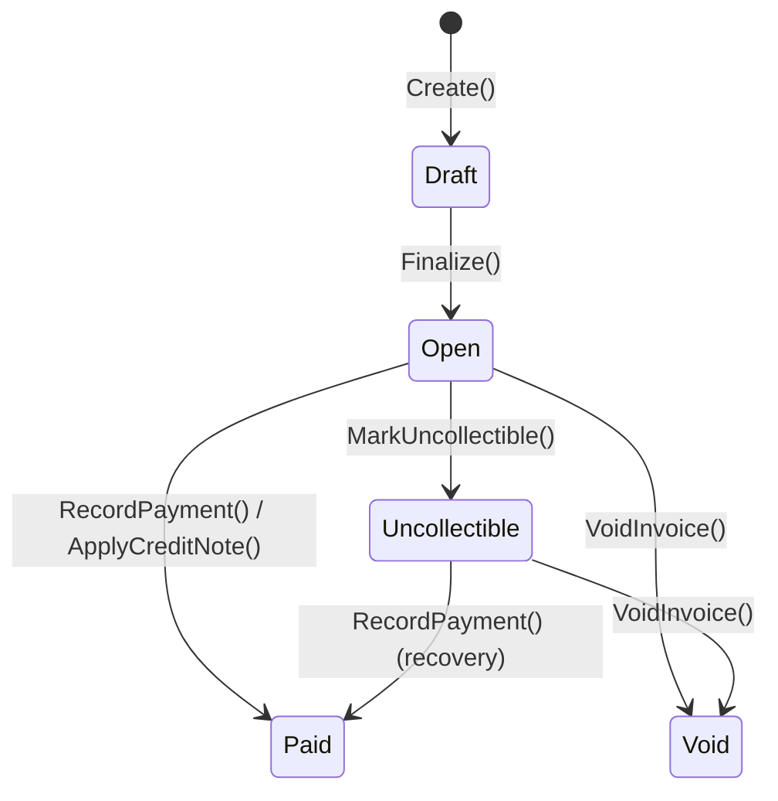

import { FileTree } from "@astrojs/starlight/components";

Granit.Invoicing manages the full invoice lifecycle from draft to paid, including
credit notes, partial payments, and overpayment detection. It is **agnostic** — any
module can create invoices via `CreateInvoiceCommand`, not just Subscriptions.

## Package structure

<FileTree>
- Granit.Invoicing/ Domain: Invoice (unified with CreditNote), line items, tax, provider abstractions
  - Granit.Invoicing.EntityFrameworkCore EF Core store (SQL Server / PostgreSQL)
  - Granit.Invoicing.Endpoints Minimal API (invoice listing, PDF download) with RBAC
  - Granit.Invoicing CreateInvoiceHandler, payment event handlers
  - Granit.Invoicing.BackgroundJobs Overdue invoice scan
  - Granit.Invoicing.Internal Self-hosted PDF via Granit.Templating (Phase 2)
  - Granit.Invoicing.Odoo External accounting sync via XML-RPC (Phase 2)
  - Granit.Invoicing.EuVat EU VAT calculator with VIES validation (Phase 2)
</FileTree>

## Invoice lifecycle



- **Draft**: mutable — add line items, set billing address, adjust tax
- **Open**: finalized, immutable financial fields, awaiting payment
- **Paid**: payment received (terminal)
- **Void**: cancelled with paper trail (terminal)
- **Uncollectible**: bad debt write-off, can still recover

:::caution[Immutability after Finalize]
Once an invoice transitions past Draft, all financial fields (Subtotal, TaxTotal,
Total, line items) are **frozen**. This is a legal requirement in most jurisdictions.
The `EnsureDraft()` guard throws `InvalidOperationException` on any mutation attempt.
:::

## Unified Invoice + Credit Note

Invoices and credit notes share the same aggregate, differentiated by
`InvoiceDocumentType`. Value Objects group related parameters:

- **`BillingPeriod(Start, End)`** — billing period dates
- **`CreditNoteInfo(ParentInvoiceId, Reason)`** — credit note link + reason
- **`LineItemSource(Type, Id?)`** — agnostic source reference

```csharp
// Regular invoice with billing period
var invoice = Invoice.Create(id, tenantId,
    InvoiceDocumentType.Invoice, "EUR",
    CollectionMethod.Auto, BillingReason.SubscriptionCycle,
    period: new BillingPeriod(periodStart, periodEnd));

// Credit note (linked to parent invoice)
var creditNote = Invoice.CreateCreditNote(id, tenantId,
    parentInvoiceId, "EUR", "Service interruption compensation");
```

When a credit note is finalized, `CreditNoteIssuedEto` is published instead
of `InvoiceFinalizedEto`.

## Partial payments

`RecordPayment()` **accumulates** payments rather than replacing the amount.
Auto-transition to Paid occurs when `AmountRemaining <= tolerance`:

```csharp
invoice.RecordPayment(10.00m, paidAt);     // AmountPaid = 10, still Open
invoice.RecordPayment(19.99m, paidAt);     // AmountPaid = 29.99, → Paid

// With tolerance (SEPA rounding)
invoice.RecordPayment(29.98m, paidAt, tolerance: 0.05m); // → Paid
```

### Credit note application

`ApplyCreditNote()` enables Paid transition **without any payment** — critical
for the event choreography (Subscriptions renews on `InvoicePaidEto`, not on
`PaymentSucceededEto`):

```csharp
invoice.ApplyCreditNote(29.99m, issuedAt); // AmountCredited = 29.99, → Paid
```

### Overpayment detection

When `AmountPaid + AmountCredited > Total`, the `Overpayment` property tracks
the excess and `OverpaymentDetectedEto` is published for reconciliation.

## Line item source types

```csharp
public enum InvoiceSourceType
{
    Subscription,   // Fixed plan charges
    Usage,          // Metered usage charges
    OneShot,        // One-time purchases
    Credit,         // Credit adjustments
}
```

This makes Invoicing agnostic — future `Granit.Commerce` can create invoices
with `OneShot` line items using the exact same infrastructure.

### Source convention (ADR-036)

`Subscription` and `Usage` lines MUST carry a Guid `SourceId` referencing the
originating entity:

| `SourceType` | `SourceId` |
| ------------ | ---------- |
| `Subscription` | `Subscription.Id` (or `PlanPrice.Id`) |
| `Usage` | `MeterDefinition.Id` |
| `OneShot` | Free-form (SKU, external id, or `null`) |
| `Credit` | Free-form (refund reference, credit memo, or `null`) |

`InvoiceLineItem.Create` rejects non-Guid `SourceId` for the two billing
source types — the audit chain `event → metric → product → invoice line` is
SQL-queryable by construction.

### `ProductId` propagation

`InvoiceLineItem.ProductId` (`Guid?`) is a soft reference to a
`Granit.Catalog.Product`. The `Subscriptions` orchestrators populate it from
`PlanPrice.ProductId` (Subscription line) or from `MeterDefinition.ProductId`
forwarded via `UsageSummaryReadyEto.MeterProductId` (Usage line). The field
survives meter / price renames and replacements, keeping invoice lines
attributable to a stable catalog item for cross-cutting reporting.

## Provider abstractions

| Interface | Purpose | Phase |
|-----------|---------|-------|
| `ITaxCalculator` | Tax computation per line item | 1 (stub) |
| `IInvoiceSyncProvider` | External accounting sync (Odoo, Sage) | 2 |
| `IInvoiceDocumentGenerator` | PDF generation via `Granit.Templating` | 2 |
| `IInvoiceNumberGenerator` | Gap-free sequential numbering with `InvoiceDocumentType` | 1 (interface) |

## Decoupled command

Any module can create an invoice without referencing Invoicing directly:

```csharp
var command = new CreateInvoiceCommand(
    TenantId: tenantId,
    Currency: "EUR",
    CollectionMethod: CollectionMethod.Auto,
    BillingReason: BillingReason.SubscriptionCycle,
    LineItems: [
        new("Pro Plan — Monthly", 1, 29.99m, InvoiceSourceType.Subscription),
        new("API Calls: 15,000 requests", 15000, 0.001m, InvoiceSourceType.Usage),
    ],
    PeriodStart: periodStart,
    PeriodEnd: periodEnd);

await messageBus.SendAsync(command);
```

### Idempotency key

`CreateInvoiceCommand` accepts an optional `IdempotencyKey` to prevent
duplicate invoice creation on handler retries:

```csharp
new CreateInvoiceCommand(
    ...,
    IdempotencyKey: $"billing-cycle-{subscriptionId}-{periodEnd:yyyyMMdd}");
```

Key derivation by handler:

| Handler | Key format |
|---------|-----------|
| `BillingCycleCompletedHandler` | `billing-cycle-{subscriptionId}-{periodEnd:yyyyMMdd}` |
| `UsageSummaryReadyHandler` | `usage-{tenantId}-{meterId}-{periodEnd:yyyyMMdd}` |

## Domain services

Business logic is encapsulated in domain services, keeping handlers as thin
pass-through delegates.

| Interface | Responsibility | Package |
| --------- | -------------- | ------- |
| `IInvoiceCreationService` | Creates draft invoices, calculates tax, generates numbers, finalizes | `Granit.Invoicing` |
| `IOverdueInvoiceDetectionService` | Scans open invoices past due date, publishes `InvoiceOverdueEto` | `Granit.Invoicing` |

`IInvoiceCreationService` is the domain entry point for `CreateInvoiceCommand`
processing. It handles the full draft → finalize flow including optional
`ITaxCalculator` and `IInvoiceNumberGenerator` integration:

```csharp
public interface IInvoiceCreationService
{
    Task CreateAsync(CreateInvoiceCommand command,
        CancellationToken cancellationToken = default);
}
```

Both services are registered automatically by `AddGranitInvoicing()`.

## Admin API

| Method | Route | Permission |
|--------|-------|------------|
| GET | `/api/{version}/invoicing/invoices` | `Invoicing.Invoices.Read` |
| GET | `/api/{version}/invoicing/invoices/{id}` | `Invoicing.Invoices.Read` |
| GET | `/api/{version}/invoicing/invoices/{id}/pdf` | `Invoicing.Invoices.Download` |
| POST | `/api/{version}/invoicing/credit-notes` | `Invoicing.CreditNotes.Manage` |

## Notifications

`Granit.Invoicing.Notifications` defines 4 notification types:

| Type | Name | Severity | Opt-out |
|------|------|----------|---------|
| `InvoiceIssuedNotificationType` | `Invoicing.InvoiceIssued` | Info | Yes |
| `InvoiceOverdueNotificationType` | `Invoicing.InvoiceOverdue` | Warning | No |
| `InvoicePaidNotificationType` | `Invoicing.InvoicePaid` | Success | Yes |
| `CreditNoteIssuedNotificationType` | `Invoicing.CreditNoteIssued` | Info | Yes |

## See also

- [SaaS Overview](/dotnet/saas/) — ecosystem architecture and choreography
- [Subscriptions](/dotnet/saas/subscriptions/) — billing cycle orchestration
- [Payments](/dotnet/saas/payments/) — payment collection and webhooks
