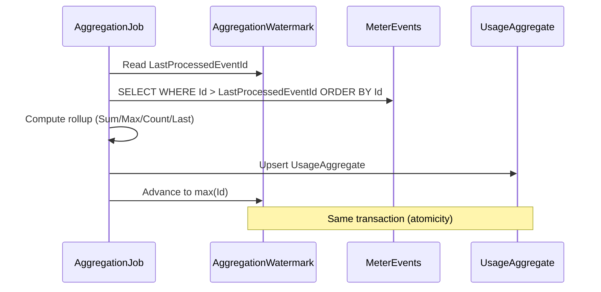

import { FileTree } from "@astrojs/starlight/components";

Granit.Metering records usage events as **append-only time-series data**, aggregates
them into rollups via a **watermark-based cursor** (guaranteed no double-counting),
and enforces quotas with threshold alerts. The module is **agnostic** — it works for
API call metering, IoT telemetry, storage tracking, or any usage-based scenario.

## Package structure

<FileTree>
- Granit.Metering/ Domain: MeterDefinition, MeterEvent, UsageAggregate, AggregationWatermark
  - Granit.Metering.EntityFrameworkCore EF Core store, insert-first dedup, watermark tracking
  - Granit.Metering.Endpoints Usage reporting, quota status, meter admin with RBAC
  - Granit.Metering.BackgroundJobs Hourly aggregation (watermark), quota threshold checks
  - Granit.Metering.Wolverine Event handlers (minimal — grows with integration)
</FileTree>

## Domain model

### MeterDefinition (AggregateRoot)

Defines what to measure and how to aggregate. Implements `IWorkflowStateful`
with the `Draft → Published → Archived` lifecycle (ADR-033) — only `Published`
meters accept ingestion.

```csharp
var meter = MeterDefinition.Create(
    Guid.NewGuid(), "API Calls", "requests",
    AggregationType.Sum, "HTTP API request counter",
    productId: catalogProductId);          // optional Granit.Catalog.Product reference

meter.Publish();   // Draft → Published; ingestion accepted
meter.Archive();   // Published → Archived; aggregates remain readable, ingestion rejected
```

| Aggregation type | Description |
|-----------------|-------------|
| `Sum` | Sum of all event quantities in the period |
| `Max` | Maximum event quantity in the period |
| `Count` | Count of events (ignores quantity) |
| `Last` | Last recorded value (gauge-style) |
| `CountDistinct` | Count of distinct values at `MeterDefinition.DistinctProperty` (a JSON path inside `MeterEvent.Metadata`). Events whose metadata does not contain the property are excluded from the count. |

For `CountDistinct`, `DistinctProperty` is **required** at meter creation and
**must be `null`** for every other aggregation type — the validator enforces both
directions.

`MeterDefinition.ProductId` (`Guid?`) is an optional soft reference to a
`Granit.Catalog.Product` (no SQL FK across modules). When set, downstream invoice
lines surface the product id automatically (see ADR-036).

The legacy `Activated` boolean is retained one release as a computed alias
(`Activated => LifecycleStatus == Published`) and marked `[Obsolete]`. The
`POST /meters/{id}/deactivate` endpoint stays one release as an alias for
`POST /meters/{id}/archive`.

### MeterEvent (Entity — append-only)

MeterEvents are **time-series data** — no state transitions, no EF Core change
tracking overhead. Designed for high-throughput bulk inserts:

```csharp
var evt = MeterEvent.Create(
    Guid.NewGuid(),
    meterDefinitionId,
    idempotencyKey: $"req-{requestId}",
    quantity: 1m,
    timestamp: clock.Now,
    metadata: """{"endpoint":"/api/users","method":"GET"}""");
```

Deduplication is handled at the persistence layer via a **unique index** on
`(TenantId, IdempotencyKey)`. Duplicates are silently ignored (insert-first pattern).

### UsageAggregate (Entity)

Pre-computed rollup for fast queries:

```csharp
// Automatically computed by MeteringAggregationJob
UsageAggregate
├── MeterDefinitionId
├── Period: Hourly | Daily | BillingPeriod
├── PeriodStart / PeriodEnd
├── AggregatedValue: 15,234
└── EventCount: 15,234
```

## CQRS interfaces

| Interface | Side | Methods |
|-----------|------|---------|
| `IMeterDefinitionReader` | Query | `GetByIdAsync`, `GetByNameAsync`, `GetActiveAsync` |
| `IMeterDefinitionWriter` | Command | `AddAsync`, `UpdateAsync` |
| `IMeterEventRecorder` | Command | `RecordAsync`, `RecordBatchAsync` (dedup) |
| `IUsageReader` | Query | `GetForPeriodAsync`, `GetCurrentAsync`, `GetAllForPeriodAsync` |
| `IQuotaChecker` | Query | `CheckAsync → QuotaStatus` |
| `IQuotaLimitProvider` | Query | `GetLimitAsync` — returns plan limit (default: unlimited) |
| `IAggregationRunner` | Command | `RunAsync` — aggregates pending events for all active meters |
| `IBillingPeriodProvider` | Query | `GetCurrentPeriodAsync` — billing period boundaries for quota checks |

## Watermark-based aggregation

The aggregation job uses a **cursor pattern** to ensure idempotent rollup
computation without mutating append-only events:



:::tip[Crash safety]
If the job crashes mid-batch, the watermark is **not advanced** — the next run
re-processes from the same point. No double-counting, no data loss. No
`IsAggregated` flag on events (that would require UPDATE locks and break
the append-only model).
:::

## Quota enforcement

`IQuotaChecker` returns a `QuotaStatus` record:

```csharp
var status = await quotaChecker.CheckAsync(tenantId, meterId, ct);
// QuotaStatus { MeterName, CurrentUsage, Limit, PercentUsed, IsExceeded }

// Factory methods for edge cases
QuotaStatus.Unlimited("API Calls", 500m);           // No limit
QuotaStatus.WithLimit("API Calls", 800m, 1000m);    // 80%, not exceeded
```

### Billing period resolution

Quota checks sum **hourly aggregates** within the current billing period.
The period boundaries are resolved via `IBillingPeriodProvider`:

```csharp
public interface IBillingPeriodProvider
{
    Task<BillingPeriodBoundaries?> GetCurrentPeriodAsync(
        Guid tenantId, CancellationToken cancellationToken = default);
}
```

| Provider | Package | Resolution |
|----------|---------|------------|
| `CalendarMonthBillingPeriodProvider` | `Granit.Metering` | 1st to last day of the current month (default) |
| `SubscriptionBillingPeriodProvider` | `Granit.Subscriptions` | `Subscription.CurrentPeriodStart` / `CurrentPeriodEnd` |

When `Granit.Subscriptions` is loaded, it overrides the default with the actual
subscription billing cycle. Without it (standalone metering), the calendar month
is used as fallback.

### Threshold alerts

The `QuotaThresholdCheckJob` runs every 15 minutes and publishes:

| Event | Trigger |
|-------|---------|
| `QuotaThresholdReachedEto` | Usage >= threshold% of limit (default 80%) |
| `QuotaExceededEto` | Usage >= 100% of limit |

The threshold percentage is configurable via `GranitMeteringOptions`:

```json
{
  "Granit": {
    "Metering": {
      "ThresholdPercentage": 80
    }
  }
}
```

## Admin reprocessing — recompute, backfill, deprecate (ADR-033)

Three cold-path operations for fixing billing data. All three acquire a
**transaction-scoped advisory lock** per `(meter, tenant)` so they mutually
exclude with the hourly aggregator job and with each other (PostgreSQL
`pg_advisory_xact_lock(hashtext(...))`, SQL Server `sp_getapplock @LockOwner='Transaction'`).

### Recompute on-demand

Rebuilds `UsageAggregate` rows for an arbitrary window. Window edges snap to
hourly buckets server-side. The global ingestion watermark is **never rewound** —
events past `to` keep flowing through the hot path.

```http
POST /api/{version}/metering/meters/{id}/recompute
{
  "from": "2026-04-01T00:00:00Z",
  "to":   "2026-04-15T00:00:00Z"
}

→ 200 RecomputeUsageResponse {
    meterDefinitionId, windowStart, windowEnd,
    eventsScanned, aggregatesRebuilt, durationMilliseconds
  }
```

Permission: `Metering.Meters.Manage`.

### Backfill historical events

Same shape as `POST /events`, but the per-event age validator allows up to
**365 days** instead of the standard 7-day window. Auto-triggers a recompute
on every meter window the backfilled events touched.

```http
POST /api/{version}/metering/events/backfill
{ "events": [ { meterDefinitionId, idempotencyKey, quantity, timestamp, metadata }, ... ] }

→ 200 BackfillUsageResponse { eventsAccepted, metersAffected, aggregatesRebuilt }
```

Permission: `Metering.Events.Backfill` (deliberately separated from
`Metering.Usage.Record` because backfill is destructive at the billing-data
level — ISO 27001 A.9.4 — least privilege).

### Soft-deprecate an event

Marks an individual event as discarded for billing purposes. The event row is
preserved (audit trail, `DeprecatedAt` + `DeprecationReason` columns); the
auto-recompute on the affected hourly bucket follows.

```http
POST /api/{version}/metering/events/{id}/deprecate
{ "reason": "duplicate from retried client" }

→ 200 DeprecateEventResponse { eventId, meterDefinitionId, deprecatedAt, aggregatesRebuilt }
```

Permission: `Metering.Events.Manage`.

## Integration with Subscriptions

When a billing-period aggregation completes, `UsageSummaryReadyEto` is published.
**Subscriptions.Wolverine** consumes it and creates an invoice with usage line items:

```text
Metering ──UsageSummaryReadyEto──→ Subscriptions (orchestrator)
                                       │
                                       ├── fixed: "Pro Plan — Monthly" × 1 × 29.99
                                       ├── usage: "API Calls: 15,000 requests" × 15000 × 0.001
                                       │
                                       └──CreateInvoiceCommand──→ Invoicing
```

## Background jobs

| Job | Cron | Description |
|-----|------|-------------|
| `MeteringAggregationJob` | `0 */1 * * *` | Hourly rollup via watermark cursor |
| `QuotaThresholdCheckJob` | `*/15 * * * *` | Quota alerts at 80% and 100% |

## Observability

### Metrics (OpenTelemetry)

Meter: `Granit.Metering`

| Metric | Type | Tags |
|--------|------|------|
| `granit.metering.event.recorded` | Counter | `tenant_id`, `meter_name` |
| `granit.metering.event.deduplicated` | Counter | `tenant_id`, `meter_name` |
| `granit.metering.aggregation.completed` | Counter | `tenant_id`, `meter_name` |
| `granit.metering.quota.threshold_reached` | Counter | `tenant_id`, `meter_name` |
| `granit.metering.quota.exceeded` | Counter | `tenant_id`, `meter_name` |

### Tracing

ActivitySource `Granit.Metering` with operations: `RecordEvent`, `RecordBatch`,
`Aggregate`, `CheckQuota`.

## Database schema

Table prefix: `metering_` (configurable via `GranitMeteringDbProperties.DbTablePrefix`).

### metering_meter_definitions

| Column | Type | Notes |
|--------|------|-------|
| `Id` | GUID | Primary key |
| `Name` | varchar(200) | Meter display name |
| `Unit` | varchar(50) | Unit of measure |
| `AggregationType` | int | Sum / Max / Count / Last / CountDistinct |
| `LifecycleStatus` | int | Draft / Published / Archived (ADR-033) |
| `DistinctProperty` | varchar(256)? | JSON path inside `MeterEvent.Metadata` (`CountDistinct` only) |
| `ProductId` | GUID? | Soft reference to `Granit.Catalog.Product` (no FK) |
| `TenantId` | GUID? | Multi-tenant isolation |

The legacy `Activated` column is dropped by the
`MeterDefinition_StatusFromActivated` migration (`Activated => true` ⇒
`LifecycleStatus = Published`, `Activated => false` ⇒ `Archived`).

### metering_meter_events

| Column | Type | Notes |
|--------|------|-------|
| `Id` | GUID | Primary key |
| `MeterDefinitionId` | GUID | FK to meter definition |
| `IdempotencyKey` | varchar(256) | Client-provided dedup key |
| `Quantity` | decimal(18,6) | Measured quantity |
| `Timestamp` | datetimeoffset | When usage occurred |
| `Metadata` | varchar(4000) | Optional JSON context |
| `DeprecatedAt` | datetimeoffset? | Set when the event is soft-deprecated; aggregator skips it |
| `DeprecationReason` | varchar(500)? | Audit trail for the deprecation |
| `TenantId` | GUID? | Multi-tenant isolation |

**Indexes:**

- `ix_metering_meter_events_dedup` — unique on `(TenantId, IdempotencyKey)`
- `ix_metering_meter_events_aggregation` — on `(TenantId, MeterDefinitionId, Id)` for watermark queries

### metering_aggregation_watermarks

| Column | Type | Notes |
|--------|------|-------|
| `Id` | GUID | Primary key |
| `MeterDefinitionId` | GUID | Which meter |
| `LastProcessedEventId` | GUID | Cursor position |
| `LastProcessedAt` | datetimeoffset? | Last aggregation time |
| `TenantId` | GUID? | Multi-tenant isolation |

## Admin API

| Method | Route | Permission |
|--------|-------|------------|
| GET | `/api/{version}/metering/meters` | `Metering.Meters.Read` |
| POST | `/api/{version}/metering/meters` | `Metering.Meters.Manage` |
| PUT | `/api/{version}/metering/meters/{id}` | `Metering.Meters.Manage` |
| POST | `/api/{version}/metering/meters/{id}/publish` | `Metering.Meters.Manage` |
| POST | `/api/{version}/metering/meters/{id}/archive` | `Metering.Meters.Manage` |
| POST | `/api/{version}/metering/meters/{id}/recompute` | `Metering.Meters.Manage` |
| GET | `/api/{version}/metering/usage` | `Metering.Usage.Read` |
| GET | `/api/{version}/metering/quota/{meterId}` | `Metering.Usage.Read` |
| POST | `/api/{version}/metering/events` | `Metering.Usage.Record` |
| POST | `/api/{version}/metering/events/backfill` | `Metering.Events.Backfill` |
| POST | `/api/{version}/metering/events/{id}/deprecate` | `Metering.Events.Manage` |
| GET | `/api/{version}/metering/meter-definitions` | `Metering.Meters.Read` |
| GET | `/api/{version}/metering/usage-aggregates` | `Metering.Usage.Read` |

All usage endpoints require tenant context. `POST /events` validates that each
`MeterDefinitionId` in the batch belongs to the current tenant and is active.

The `/meter-definitions` and `/usage-aggregates` routes expose the full Granit
**QueryEngine** surface (`/`, `/meta`, `/saved-views/*`) — filter, sort, group,
paginate, export to CSV/XLSX, and save per-user views. When called without a
tenant context (host admin), the multi-tenant query filter is bypassed so the
host can review usage cross-tenant.

## Idempotency model

`POST /api/{version}/metering/events` enforces idempotency at **two complementary
layers** — neither replaces the other.

### HTTP layer — request envelope dedup

- **Mechanism**: `Idempotency-Key` header (RFC 8700, Stripe-style), required
- **Scope**: the whole request envelope (the batch as a unit)
- **Failure modes**:
  - Missing header → 422
  - Same key + different body → 422
  - Replay returns the cached response with `Idempotent-Replayed: true`

### Database layer — per-event dedup

- **Mechanism**: `UNIQUE (TenantId, IdempotencyKey)` on `meter_events`
- **Scope**: each event in the batch
- **Failure mode**: duplicate event silently ignored (insert-first pattern)

**Why both?** They protect against different threats:

- **HTTP layer** prevents network-level replay of the entire batch (proxy retry,
  client SDK retry without state). Without it, a flaky network could cause two
  separate ingestions of the same batch under different HTTP keys.
- **Database layer** allows safe partial-overlap retries: a client that resends
  `[A, B, C, D]` after a previous successful `[A, B, C]` will only insert `D`
  (the others are deduplicated against the per-event `IdempotencyKey`).

**Client guidance**:

- Generate a fresh UUID for the `Idempotency-Key` HTTP header on every new
  logical send. Reuse it across retries of *the same* batch.
- Generate a stable per-event `IdempotencyKey` payload value (e.g.,
  `"{external_request_id}:{event_index}"`) so partial retries deduplicate
  correctly at the DB layer.
- Never put PII in either key (audit logs and Redis store retain them).

## Notifications

`Granit.Metering.Notifications` ships notifications for quota lifecycle events.
Tenants opt in via the notifications admin UI.

| Notification | Trigger | Channels | Severity |
| ------------ | ------- | -------- | :------: |
| `metering.quota_threshold_reached` | `QuotaThresholdReachedEto` — emitted when usage crosses a configured warning threshold (e.g. 80 %) | Email, InApp | Warning |
| `metering.quota_exceeded` | `QuotaExceededEto` — emitted when usage exceeds the hard quota | Email, InApp | Error |

Email templates ship in EN + FR; additional cultures are produced via the
[translation script](/dotnet/business/templating/) (US #1311).

## See also

- [SaaS Overview](/dotnet/saas/) — ecosystem architecture and choreography
- [Subscriptions](/dotnet/saas/subscriptions/) — billing cycle orchestration
- [Invoicing](/dotnet/saas/invoicing/) — invoice creation from usage data
- [ADR-033 — Metering hybrid](/dotnet/architecture/adr/033-metering-hybrid-lifecycle-and-recompute/) — lifecycle, CountDistinct, recompute, backfill, deprecate
- [ADR-036 — Invoicing line item source convention](/dotnet/architecture/adr/036-invoicing-line-source-convention/) — `MeterDefinition.ProductId` propagation
- [Spike — SQL ad-hoc metric definitions (DEFER)](/dotnet/architecture/spikes/metering-sql-ad-hoc-metrics/)
