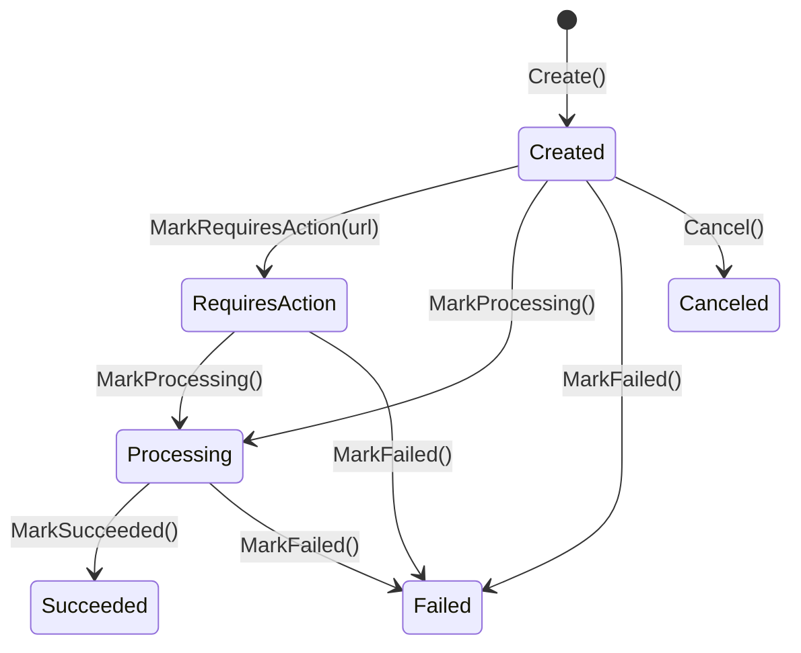

import { FileTree, LinkCard, CardGrid } from "@astrojs/starlight/components";

Granit.Payments provides provider-agnostic payment processing with a **multi-provider
per tenant** model. A single tenant can route Card payments to Stripe, iDEAL to Mollie,
and bank transfers to SEPA — all simultaneously. No card data ever touches Granit
(hosted payment pages only, PCI DSS compliant).

<CardGrid>
  <LinkCard
    title="Providers"
    description="IPaymentProvider contract, Stripe implementation, Mollie, SEPA Transfer, SEPA Direct Debit. How to wire a new provider."
    href="/dotnet/saas/payments/providers/"
  />
  <LinkCard
    title="Availability & provider catalog"
    description="Provider-driven method catalogue, capability snapshots, and runtime filtering by country / currency / amount / sequence type."
    href="/dotnet/saas/payments/availability/"
  />
</CardGrid>

## Package structure

<FileTree>
- Granit.Payments/ Domain: PaymentTransaction, PaymentMethod, webhook dedup, provider interfaces
  - Granit.Payments.EntityFrameworkCore EF Core store, webhook dedup (insert-first)
  - Granit.Payments.Endpoints Checkout, payment methods, webhooks (AllowAnonymous + signature)
  - Granit.Payments.Stripe Stripe provider (PaymentIntent API, Checkout, WebhookVerifier)
  - Granit.Payments.Mollie Mollie EU-sovereign provider
  - Granit.Payments.Notifications Payment lifecycle notifications (5 types)
  - Granit.Payments.SepaTransfer Bank transfer + reconciliation
  - Granit.Payments.SepaDirectDebit Mandate management + SDD collection
</FileTree>

## Payment transaction FSM



- **Created**: payment recorded, awaiting provider
- **RequiresAction**: customer must act (3DS/SCA redirect, hosted page)
- **Processing**: async processing (SEPA, bank transfer)
- **Succeeded**: funds captured
- **Failed**: payment declined or error
- **Canceled**: cancelled by system or user

## Multi-provider resolution

```csharp
public interface IPaymentProviderResolver
{
    Task<IPaymentProvider> ResolveAsync(Guid tenantId, string methodType,
        CancellationToken cancellationToken = default);

    Task<IReadOnlyList<PaymentAvailableMethod>> GetAvailableProvidersAsync(
        Guid tenantId,
        PaymentAvailabilityContext? context = null,
        CancellationToken cancellationToken = default);
}
```

The resolver reads the active `PaymentMethodConfiguration` records and returns the
methods each registered `IPaymentProvider` can handle. Passing a
`PaymentAvailabilityContext` filters the result against the capability snapshot
captured at activation time — see
[Availability & provider catalog](/dotnet/saas/payments/availability/).

Configuration per tenant:

```json
{
  "Payments": {
    "ProviderMappings": {
      "Card": "stripe",
      "SepaDebit": "sepa-direct-debit",
      "BankTransfer": "sepa-transfer",
      "Ideal": "mollie",
      "Bancontact": "mollie"
    }
  }
}
```

## Refund invariant

Refunds are **child entities** of `PaymentTransaction`. The aggregate enforces:

> `sum(refunds.Amount) + new.Amount <= transaction.Amount`

```csharp
var tx = PaymentTransaction.Create(..., amount: 100m, ...);
tx.MarkProcessing();
tx.MarkSucceeded("pi_123", succeededAt);

tx.RequestRefund(id, 30m, now, "Partial refund");   // OK: 30 <= 100
tx.RequestRefund(id, 60m, now, "Another refund");    // OK: 90 <= 100
tx.RequestRefund(id, 20m, now, "Too much");          // Throws: 110 > 100
```

## Dispute tracking

Disputes (chargebacks) are also child entities:

```csharp
tx.OpenDispute(id, "dp_123", "Fraudulent", 100m, now);
// Dispute status: Open → Won | Lost | Closed
```

## Webhook deduplication

Inbound webhooks use an **insert-first** dedup pattern — race-condition safe:

```text
POST /api/payments/webhooks/{provider}  [AllowAnonymous]
  1. Resolve IPaymentWebhookVerifier by {provider}
  2. VerifyAsync (signature + timestamp validation)
  3. TryRecordAsync → INSERT ProcessedWebhookEvent
     - Success: first time → dispatch command
     - DbUpdateException (unique constraint): duplicate → return 200 OK
  4. Dispatch ProcessWebhookCommand via Wolverine outbox
  5. Return 200 OK
```

`ProcessedWebhookEvent` has a unique constraint on `(ProviderName, ProviderEventId)`.

## Event choreography

```text
Invoicing ──InvoiceFinalizedEto──→ Payments (auto-charge if CollectionMethod == Auto)
Payments  ──PaymentSucceededEto──→ Invoicing (RecordPayment)
Payments  ──PaymentFailedEto────→ Invoicing (keeps Open)
```

:::caution[Payments has zero references to Subscriptions]
Payments never knows about subscriptions. It only communicates with Invoicing.
The cascade to Subscriptions goes through Invoicing (`InvoicePaidEto`).
:::

### Auto-charge with default payment method

`AutoChargeOnInvoiceHandler` queries the tenant's **saved default payment method**
to determine the provider and method type:

```csharp
PaymentMethod? defaultMethod = await paymentMethodReader
    .GetDefaultForTenantAsync(tenantId, ct);

// Uses defaultMethod.Type ("card", "sepa_debit") and
// defaultMethod.ProviderName ("stripe", "mollie") for routing
```

If no default method is configured, the invoice stays Open for manual payment.

### PaymentTransaction.MethodType

Each transaction stores both `ProviderName` ("stripe") and `MethodType` ("card").
On payment failure, both are propagated through the dunning retry chain via
`PaymentFailedEto` → `RetryPaymentPayload` → `InitiatePaymentCommand(ProviderName: override)`.
This ensures retries use the **exact same provider**, even if the tenant's config
changes between the original payment and a retry 14 days later.

## Checkout flow

```csharp
// 1. Customer selects a payment method type — filtered by context
var context = new PaymentAvailabilityContext(
    CountryCode: "BE",
    CurrencyCode: "EUR",
    Amount: 25m,
    SequenceType: PaymentMethodSequenceType.OneOff);

var methods = await resolver.GetAvailableProvidersAsync(tenantId, context, ct);
// → only methods whose capability snapshot accepts (BE, EUR, 25€, OneOff)

// 2. Resolve the provider for the selected method
var provider = await resolver.ResolveAsync(tenantId, "card", ct);

// 3. Create a checkout session (hosted page)
var session = await checkoutFactory.CreateAsync(
    invoiceId, amount, currency, returnUrl, ct);
// → { Url: "https://checkout.stripe.com/...", SessionId: "cs_xxx" }
```

## Notifications

`Granit.Payments.Notifications` defines 5 notification types:

| Type | Name | Severity | Opt-out |
|------|------|----------|---------|
| `PaymentSucceededNotificationType` | `Payments.PaymentSucceeded` | Success | Yes |
| `PaymentFailedNotificationType` | `Payments.PaymentFailed` | Warning | No |
| `PaymentMethodExpiringNotificationType` | `Payments.PaymentMethodExpiring` | Warning | Yes |
| `RefundProcessedNotificationType` | `Payments.RefundProcessed` | Success | Yes |
| `DisputeOpenedNotificationType` | `Payments.DisputeOpened` | Error | No |

## Admin API

| Method | Route | Permission |
|--------|-------|------------|
| GET | `/api/payments/transactions` | `Payments.Transactions.Read` |
| GET | `/api/payments/transactions/{id}` | `Payments.Transactions.Read` |
| POST | `/api/payments/charge` | `Payments.Charges.Execute` |
| POST | `/api/payments/refund` | `Payments.Refunds.Execute` |
| POST | `/api/payments/checkout` | `Payments.Charges.Execute` |
| GET | `/api/payments/methods` | `Payments.Methods.Read` |
| GET | `/api/payments/methods/available` | `Payments.Methods.Read` |
| POST | `/api/payments/methods` | `Payments.Methods.Manage` |
| DELETE | `/api/payments/methods/{id}` | `Payments.Methods.Manage` |
| GET | `/api/payments/configuration` | `Payments.Configuration.Manage` |
| GET | `/api/payments/configuration/catalog` | `Payments.Configuration.Manage` |
| POST | `/api/payments/configuration/{p}/{m}/activate` | `Payments.Configuration.Manage` |
| POST | `/api/payments/configuration/{p}/{m}/deactivate` | `Payments.Configuration.Manage` |
| POST | `/api/payments/configuration/{p}/{m}/resync` | `Payments.Configuration.Manage` |
| POST | `/api/payments/webhooks/{provider}` | `[AllowAnonymous]` |

Charge and checkout endpoints use `Granit.Http.Idempotency` (`[Idempotent]`)
to prevent double charges. Configuration endpoints (activate / deactivate / resync) are
also idempotent. The `/methods/available` endpoint accepts
`?country=&currency=&amount=&sequenceType=` query params — details in
[Availability & provider catalog](/dotnet/saas/payments/availability/).

## See also

- [Providers](/dotnet/saas/payments/providers/) — `IPaymentProvider` contract, Stripe, Mollie, SEPA
- [Availability & provider catalog](/dotnet/saas/payments/availability/) — method catalog, capability snapshots, runtime filtering
- [SaaS Overview](/dotnet/saas/) — ecosystem architecture and choreography
- [Invoicing](/dotnet/saas/invoicing/) — invoice lifecycle and partial payments
- [Subscriptions](/dotnet/saas/subscriptions/) — billing cycle orchestration
