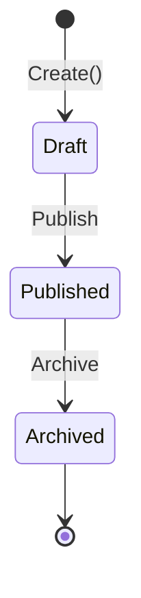
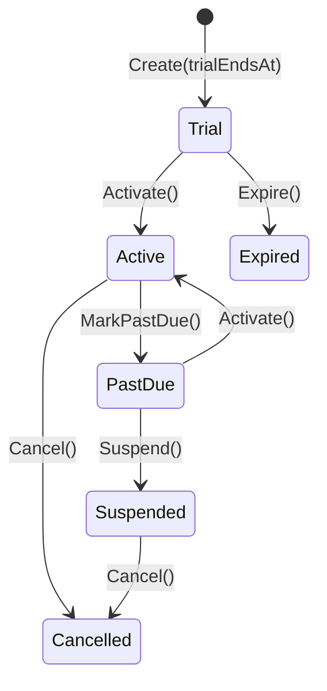
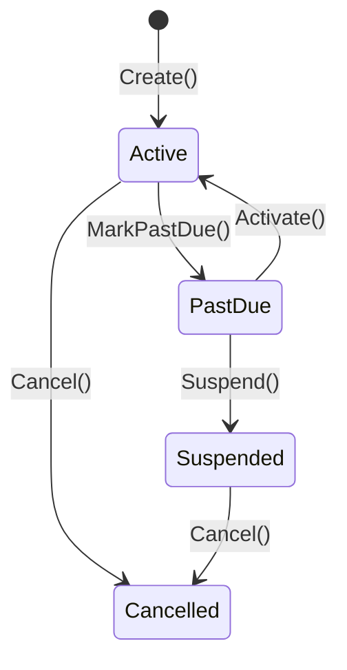

import { Tabs, TabItem, FileTree } from "@astrojs/starlight/components";

Granit.Subscriptions is the **billing cycle orchestrator** of the SaaS ecosystem.
It manages plan catalogs, subscription lifecycles, seat assignments, and coordinates
with [Invoicing](/dotnet/saas/invoicing/) and [Metering](/dotnet/saas/metering/) to
produce invoices at the right time with the right line items.

## Package structure

<FileTree>
- Granit.Subscriptions/ Domain: Plan, Subscription, seats, workflows, provider abstraction
  - Granit.Subscriptions.EntityFrameworkCore EF Core store (SQL Server / PostgreSQL)
  - Granit.Subscriptions.Endpoints Minimal API (plans, subscriptions, seats) with RBAC
  - Granit.Subscriptions Event handlers (provider sync, usage → invoice)
  - Granit.Subscriptions.BackgroundJobs Trial expiration, period end, cancel-at-period-end scans
  - Granit.Subscriptions.Features Bridge to Granit.Features (IPlanIdProvider + IPlanFeatureStore)
  - Granit.Subscriptions.Internal No-op provider for self-hosted mode (zero dependencies)
</FileTree>

## Plan lifecycle

Plans follow a `WorkflowLifecycleStatus` managed by `Granit.Workflow`:



- **Draft**: mutable — prices, features, metadata can be modified
- **Published**: available for purchase, immutable
- **Archived**: not purchasable, but existing subscribers keep their plan

```csharp
var plan = Plan.Create(
    Guid.NewGuid(), "Pro", "Professional plan",
    PricingModel.PerSeat, BillingInterval.Monthly,
    trialDays: 14, seatLimit: 50);

plan.AddPrice(PlanPrice.Create(Guid.NewGuid(), 29.99m, "EUR", BillingInterval.Monthly, clock.Now));
plan.AddPrice(PlanPrice.Create(Guid.NewGuid(), 299.99m, "EUR", BillingInterval.Yearly, clock.Now));
```

### Pricing models

| Model | Description |
|-------|-------------|
| `Flat` | Fixed price per interval |
| `PerSeat` | Price multiplied by seat count |
| `PerUnit` | Price per unit of consumption |
| `Tiered` | Bracketed pricing — see [Tiered pricing](#tiered-pricing--pricingtier-adr-034) |

`PlanPrice.ProductId` (`Guid?`) is an optional soft reference to a
`Granit.Catalog.Product`, preserved across price versions. The orchestrator
propagates it onto invoice lines (see ADR-036).

## Tiered pricing — `PricingTier` (ADR-034)

When a `PlanPrice` carries a non-empty `Tiers` collection and a `TieringMode`,
the usage orchestrator computes the invoice amount via
`TieredPricingCalculator.Compute(quantity, mode, tiers)`:

```csharp
var price = PlanPrice.Create(
    Guid.NewGuid(), amount: 0m, "EUR", BillingInterval.Monthly,
    effectiveFrom: clock.Now, productId: apiProduct.Id,
    tieringMode: TieringMode.Graduated);

price.SetTiers(TieringMode.Graduated, [
    PricingTier.Create(upToQuantity: 10_000m, unitAmount: 0.10m, sortOrder: 0),
    PricingTier.Create(upToQuantity: 100_000m, unitAmount: 0.05m, sortOrder: 1),
    PricingTier.Create(upToQuantity: null,    unitAmount: 0.02m, sortOrder: 2), // open-ended last tier
]);
```

| `TieringMode` | Math |
| ------------- | ---- |
| `Volume` | The bracket containing `quantity` is selected; its `UnitAmount` applies to the **full quantity** |
| `Graduated` | Each bracket charged at its own `UnitAmount`; results summed (`PricingTier.FlatAmount` is added on top per bracket if set) |

Validator invariants (enforced at the create endpoint):

- Ascending `UpToQuantity`
- Exactly one open-ended tier (`UpToQuantity = null`), which must be last
- `TieringMode` is required when `Tiers.Count > 0`, must be `null` otherwise

## Scheduled plan changes — `SubscriptionPhase` (ADR-034)

A subscription can carry zero or more `SubscriptionPhase` entries. Each phase
covers a half-open `[StartDate, EndDate)` window and pins:

- a `PlanId` (the plan active during that window)
- an optional `OverridePriceId` (a specific `PlanPrice` row, used for grandfathered enterprise terms)
- an optional `DiscountPercent` (0–100, applied to the resolved base price)

```csharp
subscription.SchedulePhase(SubscriptionPhase.Create(
    startDate: clock.Now.AddMonths(3),
    endDate:   clock.Now.AddMonths(6),
    planId:    promotionalPlanId,
    overridePriceId: null,
    discountPercent: 20m));   // 20% off for 3 months starting 3 months from now
```

At billing time, `subscription.GetActivePhase(clock.Now)` resolves the phase
covering "now". When no phase covers the instant, the orchestrator falls back
to `subscription.PlanId` / `PlanPriceId` (single-phase = backward compatible
with pre-Phase-3 behavior).

The orchestrator combines all four ingredients in one pass: phase-resolved
plan → phase-pinned override price (if any) → phase-flat discount → cumulative
`SubscriptionDiscount` stack. Implementation lives in
`DefaultBillingCycleInvoiceOrchestrator`; the math is covered in detail in
[ADR-034](/dotnet/architecture/adr/034-subscriptions-phases-and-tiered-pricing/).

:::note[No HTTP surface yet]
`PricingTier`, `SubscriptionPhase`, `SubscriptionDiscount`, and
`SubscriptionPriceOverride` are domain entities populated through configuration
tooling (Stripe sync, internal admin scripts, EF Core migrations). Admin
endpoints will land in a follow-up — see [ADR-034 §6](/dotnet/architecture/adr/034-subscriptions-phases-and-tiered-pricing/#6-no-http-endpoints-in-this-iteration--orchestrator-only).
:::

## Subscription FSM

Two workflow definitions depending on whether the plan has a trial:

<Tabs>
<TabItem label="With trial">



</TabItem>
<TabItem label="Direct (no trial)">



</TabItem>
</Tabs>

All state transition methods are **idempotent** — they return `bool` (`true` if
state actually changed, `false` if already in target state). This prevents
webhook ping-pong between Granit and external providers.

## Hybrid provider model

Granit is the **source of truth** for subscription status. Providers are executors
with declared capabilities:

```csharp
public interface ISubscriptionProvider
{
    string Name { get; }
    SubscriptionProviderCapabilities Capabilities { get; }

    Task CreateExternalAsync(Subscription subscription, CancellationToken ct);
    Task CancelExternalAsync(SubscriptionExternalMapping mapping,
        bool atPeriodEnd, CancellationToken ct);
}

[Flags]
public enum SubscriptionProviderCapabilities
{
    None           = 0,
    Provisioning   = 1,
    Cancellation   = 2,
    PlanChange     = 4,
    TrialManagement = 8,
    SeatManagement = 16,
}
```

Built-in providers:

| Provider | Package | Capabilities |
|----------|---------|-------------|
| Internal | `Granit.Subscriptions.Internal` | None (no-op, zero dependency) |
| Stripe | `Granit.Subscriptions.Stripe` | All (Phase 2) |

## Value Objects

### SubscriptionPeriod

Groups the billing period boundaries and the anchor date used to compute future periods:

```csharp
public sealed record SubscriptionPeriod(
    DateTimeOffset Start,
    DateTimeOffset End,
    DateTimeOffset BillingCycleAnchor);
```

The `BillingCycleAnchor` is the reference date for calculating period boundaries.
For example, an anchor of January 15 means periods always align on the 15th
(Feb 15, Mar 15…) regardless of when the subscription was actually created.

## Multi-currency

Each subscription stores the **currency selected at creation** (`Currency` property,
ISO 4217). All invoice creation uses `subscription.Currency` — no hardcoded values.
Plans can have multiple `PlanPrice` entries for different currency/interval combinations.

```csharp
var subscription = Subscription.Create(
    id, tenantId, planId,
    currency: "EUR",       // ← stored on the subscription
    new SubscriptionPeriod(now, now.AddMonths(1), BillingCycleAnchor: now));
```

## Pricing resolution

`IPricingResolver` resolves prices from the plan's `PlanPrice` entries.
`planPriceId` (optional) lets the caller pin a specific price version (used
for grandfathered subscriptions and `SubscriptionPhase.OverridePriceId`):

```csharp
public interface IPricingResolver
{
    Task<decimal> ResolveBasePriceAsync(
        PlanId planId, string currency, BillingInterval interval,
        Guid? planPriceId = null, CancellationToken ct = default);

    Task<decimal> ResolveUsageUnitPriceAsync(
        PlanId planId, string currency, BillingInterval interval,
        string meterId, Guid? planPriceId = null, CancellationToken ct = default);

    /// <summary>
    /// Returns the total amount owed for the given quantity, applying tiered
    /// pricing (Volume / Graduated) when the resolved PlanPrice carries a
    /// non-empty Tiers collection. Falls back to quantity × unit-price for
    /// flat per-unit pricing.
    /// </summary>
    Task<decimal> ResolveUsageAmountAsync(
        PlanId planId, string currency, BillingInterval interval,
        string meterId, decimal quantity, Guid? planPriceId = null,
        CancellationToken ct = default);
}
```

`ResolveUsageAmountAsync` is the canonical entry point for usage billing —
it dispatches to `TieredPricingCalculator` when tiers are present and
falls back to `quantity × unit price` otherwise.

## Billing cycle orchestration

Subscriptions acts as the **billing cycle orchestrator** (Stripe Billing model).
**Exclusive routing** prevents double invoicing (split-brain):

```text
PeriodEndScan detects end of cycle
  ├── Flat/PerSeat plan → BillingCycleCompletedHandler creates invoice
  └── PerUnit/Tiered plan → wait for UsageSummaryReadyHandler (consolidated invoice)
```

- **BillingCycleCompletedHandler**: Flat/PerSeat only. Skips plans with usage component.
- **UsageSummaryReadyHandler**: PerUnit/Tiered. Creates a consolidated invoice with
  fixed charges (base price) + usage charges (metered data).

Both handlers use `IPricingResolver` and `subscription.Currency`.

### BillingInterval-aware period calculation

`PeriodEndScanHandler` reads `Plan.DefaultInterval` to advance periods correctly:

| Interval | Period advance |
|----------|---------------|
| Monthly | `AddMonths(1)` |
| Quarterly | `AddMonths(3)` |
| Yearly | `AddMonths(12)` |

## Dunning (payment retry)

When a payment fails, the dunning system automatically handles retries:

```text
PaymentFailedEto → PaymentFailedHandler
  ├── MarkPastDue() + IncrementDunningAttempt()
  ├── Attempt ≤ 3: schedule RetryPaymentPayload via IScheduler
  │     ├── Attempt 1: +3 days
  │     ├── Attempt 2: +7 days
  │     └── Attempt 3: +14 days
  └── Attempt > 3: Suspend()

InvoicePaidEto → InvoicePaidHandler
  └── Activate() + ResetDunning()
```

Retry attempts use the **exact same provider and method type** as the original
payment (propagated via `ProviderName` + `MethodType` in the retry chain).

:::note[Concurrency safety]
`PaymentFailedHandler` catches `DbUpdateConcurrencyException` — if two webhook
deliveries arrive simultaneously for the same invoice, only one dunning increment
is processed. The other is safely skipped with a warning log.
:::

## Seat management

```csharp
// Assign a seat (seatLimit from the plan prevents over-allocation)
var seat = SubscriptionSeat.Create(Guid.NewGuid(), userId, clock.Now);
subscription.AssignSeat(seat, plan.SeatLimit);

// Revoke a seat
subscription.RevokeSeat(userId);
```

`AssignSeat` enforces two invariants:

1. **Duplicate guard** — a user cannot hold two seats on the same subscription
   (backed by a unique DB index on `(SubscriptionId, UserId)`)
2. **Seat limit** — when `seatLimit` is provided, the current seat count is
   checked before adding

CQRS split: `ISeatReader` (query) / `ISeatWriter` (command).

## Domain services

Business logic is encapsulated in domain services, keeping all handlers as thin
pass-through delegates.

| Interface | Responsibility | Package |
| --------- | -------------- | ------- |
| `IPeriodAdvancementService` | Advances billing periods for subscriptions past their period end | `Granit.Subscriptions` |
| `ICancelAtPeriodEndService` | Cancels subscriptions flagged for end-of-period cancellation | `Granit.Subscriptions` |
| `ISubscriptionReactivationService` | Reactivates PastDue subscriptions after payment, resets dunning | `Granit.Subscriptions` |
| `IDunningService` | Handles payment failures: PastDue transition, retry scheduling, suspension | `Granit.Subscriptions` |
| `ISubscriptionProviderSyncService` | Syncs cancellations to external providers (Stripe, etc.) | `Granit.Subscriptions` |

All five services are registered automatically by `AddGranitSubscriptions()`.
Application-level orchestrators (billing cycle invoice creation, usage invoice
creation, payment retry dispatch) are internal to their respective
`.Wolverine` / `.BackgroundJobs` packages.

## Background jobs

| Job | Cron | Description |
|-----|------|-------------|
| `TrialExpirationScanJob` | `0 */4 * * *` | Detects expiring/expired trials |
| `PeriodEndScanJob` | `0 */1 * * *` | Detects subscriptions at billing period end |
| `CancelAtPeriodEndScanJob` | `0 */2 * * *` | Processes cancel-at-period-end flag |

## Features bridge

`Granit.Subscriptions.Features` implements `IPlanIdProvider` and `IPlanFeatureStore`
from `Granit.Features`. This enables automatic feature resolution per plan — existing
feature flag cascade works without any additional configuration.

### Cache invalidation on lifecycle changes

When a subscription is suspended, cancelled, or expired, a Wolverine handler
(`SubscriptionLifecycleCacheInvalidationHandler`) automatically expires **all**
cached feature values for the affected tenant. This prevents a suspended tenant
from retaining premium feature access through stale cache entries.

## Admin API

| Method | Route | Permission |
|--------|-------|------------|
| GET | `/api/{version}/subscriptions/plans` | `Subscriptions.Plans.Read` |
| POST | `/api/{version}/subscriptions/plans` | `Subscriptions.Plans.Manage` |
| GET | `/api/{version}/subscriptions/subscriptions` | `Subscriptions.Subscriptions.Read` |
| POST | `/api/{version}/subscriptions/subscriptions` | `Subscriptions.Subscriptions.Manage` |
| GET | `/api/{version}/subscriptions/seats` | `Subscriptions.Seats.Read` |
| POST | `/api/{version}/subscriptions/seats` | `Subscriptions.Seats.Manage` |

## Notifications

`Granit.Subscriptions.Notifications` defines 6 notification types:

| Type | Name | Severity | Opt-out |
|------|------|----------|---------|
| `TrialExpiringNotificationType` | `Subscriptions.TrialExpiring` | Warning | Yes |
| `TrialExpiredNotificationType` | `Subscriptions.TrialExpired` | Info | No |
| `PlanChangedNotificationType` | `Subscriptions.PlanChanged` | Info | Yes |
| `CancellationConfirmedNotificationType` | `Subscriptions.CancellationConfirmed` | Info | No |
| `SuspensionWarningNotificationType` | `Subscriptions.SuspensionWarning` | Error | No |
| `ScheduledChangeReminderNotificationType` | `Subscriptions.ScheduledChangeReminder` | Info | Yes |

Default channels: Email + InApp. Email templates are Phase 2 (requires `Granit.Templating`).

## See also

- [SaaS Overview](/dotnet/saas/) — ecosystem architecture and choreography
- [Invoicing](/dotnet/saas/invoicing/) — invoice creation and payment tracking
- [Payments](/dotnet/saas/payments/) — provider-agnostic payment processing
- [Metering](/dotnet/saas/metering/) — usage-based metering
- [Scheduling](/dotnet/infrastructure/scheduling/) — scheduled plan changes
- [Feature Flags](/dotnet/infrastructure/feature-flags/) — plan-driven cascade
- [ADR-034 — Subscriptions phases & tiered pricing](/dotnet/architecture/adr/034-subscriptions-phases-and-tiered-pricing/)
- [ADR-036 — Invoicing line item source convention](/dotnet/architecture/adr/036-invoicing-line-source-convention/) — `PlanPrice.ProductId` propagation
