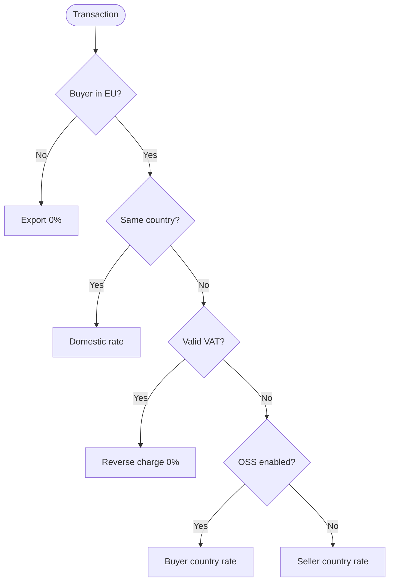

import { FileTree } from "@astrojs/starlight/components";

Granit.Tax provides a **provider-agnostic** tax engine for SaaS and e-commerce.
It handles tax rate lookup, online tax ID validation, and EU VAT classification
(reverse charge, OSS, export). Two providers ship out of the box: self-hosted
EU VAT rules or Stripe Tax API.

## Why Granit.Tax?

- **EU VAT compliance** out of the box: reverse charge, OSS, intra-community rules
- **Online validation** against VIES (EU), with offline fallback and retry
- **Provider-agnostic** — switch between self-hosted and Stripe Tax without code changes
- **Multi-tenant** — rates, validations, and metrics are tenant-aware
- **Audit trail** — VIES request identifiers stored for ISO 27001 compliance

## Package structure

<FileTree>
- Granit.Tax/ Abstractions: ITaxIdValidator, ITaxRateProvider, domain types, metrics
  - Granit.Tax.Internal Self-hosted EU VAT rules + VIES validation + configurable rates
  - Granit.Tax.EntityFrameworkCore DB-persisted rate overrides and validated tax ID cache
  - Granit.Tax.Endpoints Minimal API (validate, rates, rate by country) with RBAC
  - Granit.Tax.Stripe Stripe Tax Calculations + Tax IDs API integration
</FileTree>

## Provider comparison

| Feature | Internal (self-hosted) | Stripe Tax |
| ------- | --------------------- | ---------- |
| EU VAT rules | Full (reverse charge, OSS, export) | Stripe-managed |
| Tax ID validation | VIES + offline fallback | Stripe Tax IDs |
| Rate source | Config + DB overrides | Stripe API |
| US Sales Tax | Not supported | Supported |
| Dependency | None (EU only) | Stripe account |

## EU VAT classification

The internal provider uses a pure rule engine to classify transactions:



## Quick start

### Self-hosted EU VAT

```csharp
// Program.cs
builder.AddGranitTax();          // Base abstractions + metrics

// Granit.Tax.Internal provides ITaxCalculator, ITaxIdValidator, ITaxRateProvider
// via GranitTaxInternalModule — auto-discovered by the module system.

// Optional: DB-managed rate overrides
builder.AddGranitTaxEntityFrameworkCore(options =>
    options.UseNpgsql(connectionString));
```

### Stripe Tax

```csharp
// appsettings.json
{
  "Tax": {
    "SellerCountryCode": "BE",
    "Stripe": {
      "SecretKey": "sk_live_..."
    }
  }
}
```

Register `GranitTaxStripeModule` instead of `GranitTaxInternalModule` — the
abstractions (`ITaxCalculator`, `ITaxIdValidator`) are swapped automatically.

## Configuration

```json
{
  "Tax": {
    "SellerCountryCode": "BE",
    "SellerVatNumber": "BE0123456789",
    "OssEnabled": true,
    "OssRegisteredCountries": ["FR", "DE", "NL"],
    "AllowOfflineFallback": true,
    "ValidationCacheTtlHours": 24,
    "Internal": {
      "Rates": {
        "StandardRates": { "FI": 0.255 },
        "ReducedRates": { "FR": 0.055 }
      }
    }
  }
}
```

| Option | Default | Description |
| ------ | ------- | ----------- |
| `SellerCountryCode` | `"BE"` | Seller's ISO country code |
| `OssEnabled` | `false` | Enable EU One-Stop Shop for B2C |
| `AllowOfflineFallback` | `true` | Accept offline VAT check when VIES is down |
| `ValidationCacheTtlHours` | `24` | FusionCache TTL for VIES results |

## Endpoints

All endpoints require authorization. Map them with `endpoints.MapGranitTax()`.

| Method | Path | Permission | Description |
| ------ | ---- | ---------- | ----------- |
| POST | `/tax/validate` | `Tax.Validations.Execute` | Validate a tax ID online |
| GET | `/tax/rates` | `Tax.Rates.Read` | List all current tax rates |
| GET | `/tax/rates/{countryCode}` | `Tax.Rates.Read` | Get rate for a country |

## Metrics

Meter: `Granit.Tax`

| Metric | Type | Tags | Description |
| ------ | ---- | ---- | ----------- |
| `granit.tax.calculation.completed` | Counter | `tenant_id`, `provider` | Tax calculations completed |
| `granit.tax.validation.completed` | Counter | `tenant_id`, `source`, `is_valid` | Tax ID validations completed |
| `granit.tax.vies.request` | Counter | `tenant_id`, `success` | VIES API requests |

## See also

- [Invoicing](/dotnet/saas/invoicing/) — Invoices consume `ITaxCalculator` for line-item tax
- [Payments](/dotnet/saas/payments/) — Payment collection after invoice finalization
- [Subscriptions](/dotnet/saas/subscriptions/) — Subscription plans trigger invoice creation
