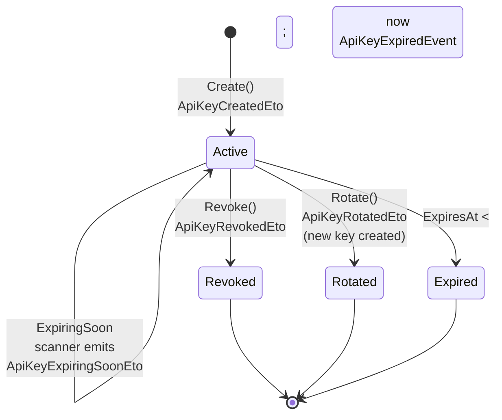

import { Tabs, TabItem, FileTree, Aside, Badge } from "@astrojs/starlight/components";

## Why API keys?

JWT bearer tokens (Keycloak, Entra ID, Cognito, OpenIddict) are the right primitive
for **interactive** users and short-lived service identities. They are the wrong
primitive for **long-running, non-interactive** callers — cron jobs, partner
integrations, internal CLIs, lab equipment uploading results overnight. Forcing
those callers through a full OIDC client-credentials flow buys little security
and adds operational drag (token caches, refresh logic, IdP availability on the
critical path).

`Granit.Authentication.ApiKeys` is the dedicated answer for that audience:

- **Long-lived but rotatable** — opaque secrets with optional `ExpiresAt`, rotation
  endpoint, and a daily scanner that emails administrators ahead of expiry so a
  silent expiration never takes a partner integration down at 03:00.
- **Hashed at rest, exposed once** — only the SHA-256 digest is persisted; the raw
  secret is returned exactly once, on the create / rotate response. The hash never
  leaves the persistence layer.
- **Defence in depth on every emission** — integration events, notification
  payloads, and email templates all carry public-safe metadata only (id, name,
  type, expiry). The hash, the raw secret, and even the on-the-wire prefix are
  excluded from anything routed to a recipient.
- **Tenant- and CIDR-scoped** — keys are `IMultiTenant` aggregates and accept an
  allow-list of CIDR ranges, so a leaked key still cannot be used from outside
  the configured network.
- **Stripe-style typed prefixes** — `gk_live_sk_…` for secret server-to-server,
  `gk_live_pk_…` for client-side publishable, `gk_live_wh_…` for inbound
  webhooks, `gk_live_ep_…` for ephemeral workflow keys. Operators recognise the
  category at a glance without dereferencing the key.

## Package structure

<FileTree>

- Granit.Authentication.ApiKeys/ Abstractions, domain, options, generator
  - Granit.Authentication.ApiKeys.EntityFrameworkCore Isolated DbContext + EF configurations
  - Granit.Authentication.ApiKeys.Endpoints/ Admin REST API, permissions, validators
  - Granit.Authentication.ApiKeys.BackgroundJobs/ Daily expiration scanner
  - Granit.Authentication.ApiKeys.Notifications/ Email + InApp notification bridge

</FileTree>

| Package | Role | Depends on |
|---------|------|------------|
| `Granit.Authentication.ApiKeys` | `ApiKeyEntry` aggregate, `IApiKeyStore` / `IApiKeyAdminStore` / `IApiKeyGenerator`, `ApiKeyAuthenticationHandler`, CIDR validator | `Granit.Users`, `Granit.Guids`, `Granit.Timing` |
| `Granit.Authentication.ApiKeys.EntityFrameworkCore` | Isolated `DbContext`, entity configurations, migrations | `Granit.Persistence` |
| `Granit.Authentication.ApiKeys.Endpoints` | Five admin route groups, `ApiKeyPermissions`, FluentValidation validators | `Granit.Authorization`, `Granit.Validation` |
| `Granit.Authentication.ApiKeys.BackgroundJobs` | `ExpiringApiKeyScannerJob` (daily, 07:00 UTC) | `Granit.BackgroundJobs` |
| `Granit.Authentication.ApiKeys.Notifications` | Four `*NotificationType` + Wolverine handlers + EN/FR templates | `Granit.Notifications.Abstractions`, `Granit.Templating` |

## Anatomy of a key

`ApiKeyEntry` is a `FullAuditedAggregateRoot` and `IMultiTenant`. The on-the-wire
secret is composed of three parts:

```
gk_live_sk_a1b2c3d4e5f6g7h8i9j0k1l2m3n4o5p6q7r8s9t0
└──┬──┘└┬┘└┬┘└──────────────────┬──────────────────┘
   │   │  │                     │
   │   │  │                     └─ random body (last 4 chars stored)
   │   │  └─ key kind (sk/pk/wh/ep — see ApiKeyType)
   │   └─ environment (live, test, dev — configurable)
   └─ Granit prefix
```

Persisted columns (`ApiKeyEntry`):

| Column | Notes |
|--------|-------|
| `Id` | `Guid` aggregate id |
| `Name` | Operator-facing display name (e.g. `Partner Lab X`) |
| `Type` | `ApiKeyType` — `Secret`, `Publishable`, `Webhook`, `Ephemeral` |
| `Environment` | `live` / `test` / `dev` (validated against `ApiKeysEndpointsOptions.AllowedEnvironments`) |
| `HashedKey` | SHA-256 hex digest. <Badge text="SensitiveData(Restricted, Omit)" variant="caution" /> in audit serialisers. |
| `Prefix`, `LastFourChars` | UI identification only — never the raw secret |
| `Permissions` | Granted permission strings (e.g. `["MyApp.Patients.Read"]`) |
| `AllowedCidrs` | IP allow-list. Empty = no IP restriction. |
| `ExpiresAt` | Optional. `null` means never expires. |
| `LastUsedAt` | Stamped on every successful authentication |
| `RevokedAt` | `null` while active |
| `LastExpirationNotifiedAt` | Used by the scanner to dedupe alerts (one per week) |
| `CacheBehavior` | Per-key cache override |

The raw secret is never persisted: the create / rotate endpoint hashes it, stores
the digest, and returns the plain value once in the HTTP response.

## Lifecycle



Five lifecycle events (`*Eto` reach the Wolverine outbox; `*Event` is local-only):

| Event | Type | Emitted by | Used by |
|-------|------|------------|---------|
| `ApiKeyCreatedEto` | Integration | `ApiKeyEntry.Create()` | Notifications (`apikeys.new_key_issued`) |
| `ApiKeyUsedEto` | Integration | Auth handler on every accepted call | Audit / metering |
| `ApiKeyScopesUpdatedEto` | Integration | `UpdatePermissions()` | Cache invalidation |
| `ApiKeyRotatedEto` | Integration | Rotate endpoint | Notifications (`apikeys.rotation_completed`) |
| `ApiKeyRevokedEto` | Integration | `Revoke()` | Notifications (`apikeys.revoked`), cross-instance cache eviction |
| `ApiKeyExpiringSoonEto` | Integration | Daily scanner | Notifications (`apikeys.expiring_soon`) |
| `ApiKeyExpiredEvent` | Domain | Auth handler on first rejection | Audit log only — never recipient-bound |

## Configuration

```json
{
  "Granit": {
    "ApiKeys": {
      "ExpirationLeadTimeDays": 14
    }
  }
}
```

| Property | Section | Default | Description |
|----------|---------|---------|-------------|
| `ExpirationLeadTimeDays` | `Granit:ApiKeys` | `14` | Days before `ExpiresAt` at which the scanner starts emitting `ApiKeyExpiringSoonEto`. Range: 1–90. |
| `RoutePrefix` | `ApiKeysEndpoints` | `"authentication"` | URL prefix for the admin endpoints (full path: `/{prefix}/api-keys`). |
| `TagName` | `ApiKeysEndpoints` | `"API Keys"` | OpenAPI tag (Title Case With Spaces — see [tag conventions](/dotnet/architecture/http-conventions/#openapi-endpoint-metadata)). |
| `AllowedEnvironments` | `ApiKeysEndpointsOptions` | `["live", "test", "dev"]` | Whitelist enforced at create-time. |

`ApiKeysOptions` lives in the base module and is distinct from the ASP.NET
authentication scheme options (`ApiKeyOptions`) — the former tunes shared
background behaviour (scanner cadence, lead time), the latter the JWT-Bearer-style
scheme registration on the request pipeline.

## Endpoints

All endpoints are mounted under `MapGranitApiKeys()` (default prefix
`/authentication/api-keys`). Each endpoint declares the [five mandatory OpenAPI
metadata elements](/dotnet/architecture/http-conventions/#openapi-endpoint-metadata) and is gated by a granular permission
(see next section).

| Verb | Path | Operation | Permission |
|------|------|-----------|------------|
| <Badge text="GET" variant="note" /> | `/api-keys` | `ListApiKeys` | `AuthenticationApiKeys.Keys.Read` |
| <Badge text="GET" variant="note" /> | `/api-keys/{id:guid}` | `GetApiKeyById` | `AuthenticationApiKeys.Keys.Read` |
| <Badge text="POST" variant="success" /> | `/api-keys` | `CreateApiKey` | `AuthenticationApiKeys.Keys.Create` |
| <Badge text="POST" variant="success" /> | `/api-keys/{id:guid}/revoke` | `RevokeApiKey` | `AuthenticationApiKeys.Keys.Revoke` |
| <Badge text="POST" variant="success" /> | `/api-keys/{id:guid}/rotate` | `RotateApiKey` | `AuthenticationApiKeys.Keys.Rotate` |
| <Badge text="PUT" variant="note" /> | `/api-keys/{id:guid}/scopes` | `UpdateApiKeyScopes` | `AuthenticationApiKeys.Keys.UpdateScopes` |

### Privilege-escalation guard (OWASP API5:2023)

`CreateApiKey` and `UpdateApiKeyScopes` enforce a strict rule: the caller must
itself possess every permission being assigned to the key. Trying to grant
`MyApp.Patients.Delete` on a key while the caller does not hold that permission
returns **403 Forbidden** with an explanatory `application/problem+json`. This
prevents an account with `Keys.Create` from minting a super-admin key.

### One-time secret exposure

`CreateApiKey` and `RotateApiKey` are the **only two** endpoints that return the
raw secret, exactly once, in the response body (`rawSecret` field). After that,
the secret cannot be retrieved — `GetApiKeyById` and `ListApiKeys` return only
`prefix`, `lastFourChars`, and the metadata. Operators must capture the value at
issuance and store it securely.

## Permissions

All five permissions live under the `AuthenticationApiKeys` group. Localisation
keys: `PermissionGroup:AuthenticationApiKeys` and
`Permission:AuthenticationApiKeys.Keys.{Action}` (resolved through
`GET /api/{version}/localization`).

| Permission | Action | Localisation key |
|------------|--------|------------------|
| `AuthenticationApiKeys.Keys.Read` | List + view individual keys | `Permission:AuthenticationApiKeys.Keys.Read` |
| `AuthenticationApiKeys.Keys.Create` | Issue new keys | `Permission:AuthenticationApiKeys.Keys.Create` |
| `AuthenticationApiKeys.Keys.Revoke` | Revoke a key | `Permission:AuthenticationApiKeys.Keys.Revoke` |
| `AuthenticationApiKeys.Keys.Rotate` | Rotate (revoke + reissue with same settings) | `Permission:AuthenticationApiKeys.Keys.Rotate` |
| `AuthenticationApiKeys.Keys.UpdateScopes` | Edit permissions and CIDR allow-list | `Permission:AuthenticationApiKeys.Keys.UpdateScopes` |

`Revoke`, `Rotate`, and `UpdateScopes` are deliberately split (rather than rolled
into a single `Manage`) to support least-privilege delegation under
ISO 27001 A.9.4 — for example, granting "rotate only" to an automated rotation
agent without giving it the ability to revoke keys outright.

## Notifications

`Granit.Authentication.ApiKeys.Notifications` ships four notification types,
each backed by EN + FR Scriban templates embedded in the assembly. Tenants opt
in via the notifications admin UI; channels and severity are defaults that the
host can override.

| Notification | Trigger event | Channels | Severity |
|--------------|---------------|----------|:--------:|
| `apikeys.new_key_issued` | `ApiKeyCreatedEto` — a new API key was issued (audit trail; the plain secret is delivered via the issuance endpoint, never the email) | Email, InApp | Info |
| `apikeys.rotation_completed` | `ApiKeyRotatedEto` — a key was rotated (overlap rotation, mirroring the [webhook signing-key model](/dotnet/api/webhooks/signing-keys/)) | Email, InApp | Info |
| `apikeys.revoked` | `ApiKeyRevokedEto` — a key was explicitly revoked by an operator | Email, InApp | Info |
| `apikeys.expiring_soon` | `ApiKeyExpiringSoonEto` — daily scanner; key is within `ExpirationLeadTimeDays` of `ExpiresAt` and not notified within the last week | Email, InApp | **Warning** |

### What the templates can see

Notification data records carry public-safe fields only —
`KeyId`, `KeyName`, `KeyType`, `ExpiresAt`, `DaysUntilExpiry`. The SHA-256 hash,
the raw secret, and the on-the-wire prefix are never bound into a template
context. This is enforced at the data-record boundary: there is no path from
`ApiKeyEntry.HashedKey` to a recipient, by construction.

Hosts that want to override the legal wording for a specific tenant override
the embedded templates at runtime via the `Granit.Templating` admin API — the
DB-backed resolver runs at higher priority than the embedded one.

## Background jobs

`Granit.Authentication.ApiKeys.BackgroundJobs` ships a single recurring job:

| Job | Schedule (cron, UTC) | Purpose |
|-----|----------------------|---------|
| `apikeys-expiring-soon` (`ExpiringApiKeyScannerJob`) | `0 7 * * *` (daily 07:00) | Emits `ApiKeyExpiringSoonEto` for every active key within `ExpirationLeadTimeDays` of `ExpiresAt`, dedup'd against `LastExpirationNotifiedAt` (one alert per key per week). |

The job runs early enough to land in administrators' morning inboxes and late
enough to avoid contention with overnight maintenance windows. The handler
delegates to `ExpiringApiKeyScannerService`, which uses
`IApiKeyAdminStore.ListExpiringSoonAsync` to fetch only the keys needing an
alert, calls `MarkExpirationNotified`, and saves the entry — the Eto reaches
the Wolverine outbox in the same transaction as the `LastExpirationNotifiedAt`
stamp.

## Setup

```csharp
[DependsOn(
    typeof(GranitAuthenticationApiKeysModule),
    typeof(GranitAuthenticationApiKeysEntityFrameworkCoreModule),
    typeof(GranitAuthenticationApiKeysEndpointsModule),
    typeof(GranitApiKeysBackgroundJobsModule),       // optional — daily scanner
    typeof(GranitApiKeysNotificationsModule))]       // optional — email + in-app
public sealed class AppModule : GranitModule { }
```

```csharp
// In your endpoint registration
app.MapGranitApiKeys();
// or, with overrides:
app.MapGranitApiKeys(options =>
{
    options.RoutePrefix = "v1/auth";
    options.TagName = "API Keys";
    options.AllowedEnvironments = ["prod", "staging"];
});
```

The `.BackgroundJobs` and `.Notifications` packages are independent: the core
module functions without either, but you almost always want the scanner +
notifications pair to surface expiring keys before they cause an outage.

## Security guarantees

<Aside type="caution" title="Redaction contract">

Three layers of defence in depth, none of which rely on operator discipline:

1. **Storage** — only `HashedKey` (SHA-256) is persisted; the raw secret is never
   written to the database. `HashedKey` carries `[SensitiveData(Level = Restricted,
   Mode = Omit)]` so the audit serialiser and any reflection-based loggers omit
   it from their output.
2. **Integration events** — `ApiKeyExpiringSoonEto` and the recipient-bound
   payloads carry public-safe metadata only (id, name, type, expiry). Even the
   prefix is omitted from the expiring-soon path: the notification's job is to
   nudge an admin to rotate by name, not to identify the key on the wire.
3. **Templates** — Scriban templates can only access fields that exist on the
   notification data record. There is no path from `ApiKeyEntry.HashedKey` to
   a template context — the field simply isn't bound.

</Aside>

Additional hardening:

- **Constant-time hash comparison** — `IApiKeyStore.FindByHashAsync` looks up by
  the precomputed SHA-256 digest; no application-level string comparison of the
  raw secret happens at request time.
- **CIDR allow-listing** — `AllowedCidrs` is enforced before any permission check
  (a leaked key from outside the configured network is rejected at L3).
- **Tenant isolation** — `ApiKeyEntry` is `IMultiTenant`. The framework's
  `Granit.Persistence` query filter applies automatically; no cross-tenant lookup
  by hash is possible.
- **Privilege-escalation guard** — Create / UpdateScopes refuse to assign a
  permission the caller does not itself hold (OWASP API5:2023).

## See also

- [Authentication](/dotnet/security/authentication/) — JWT Bearer for interactive users
  and short-lived service identities
- [Authorization](/dotnet/security/authorization/) — RBAC permissions, dynamic policy provider
- [Webhooks signing keys](/dotnet/api/webhooks/signing-keys/) — sibling overlap-rotation
  pattern for inbound HMAC verification
- [Inter-service authorization](/dotnet/security/inter-service-authorization/) — choosing
  between API keys and OIDC client credentials
- [Notifications conventions](/dotnet/infrastructure/notifications/conventions/) — the
  canonical `*.Notifications` package shape
- [Background jobs](/dotnet/infrastructure/background-jobs/) — the framework that
  dispatches `ExpiringApiKeyScannerJob`
