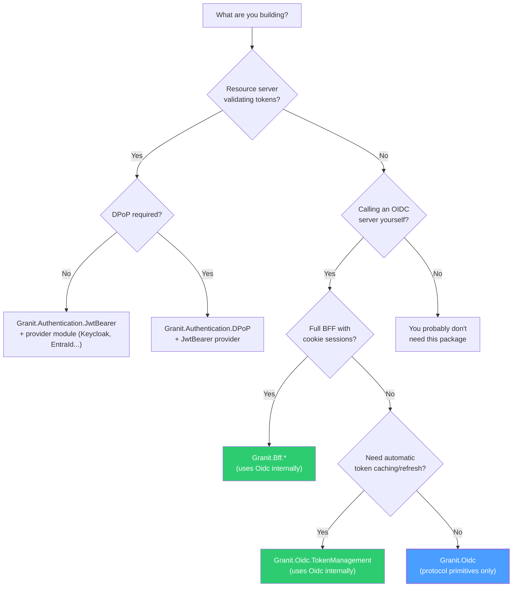

import { Tabs, TabItem, FileTree } from "@astrojs/starlight/components";

`Granit.Oidc` is the foundation library for all OIDC and OAuth 2.0
interactions in the Granit framework. It provides strongly-typed records for every
protocol message, a caching discovery document service, DPoP proof generation, PKCE
helpers, and pluggable client authentication strategies. It does **not** perform
HTTP calls to token endpoints itself -- that responsibility belongs to higher-level
packages like `Granit.Bff` and `Granit.Oidc.TokenManagement`, which
reference this package and use its primitives to build, sign, and parse protocol
messages.

If you are building a BFF, a token management layer, or any service that talks to an
OIDC authorization server, this package gives you the building blocks without imposing
an HTTP stack or a particular flow orchestration.

## When to use this package

| I need to... | Package | Why |
|--------------|---------|-----|
| Build or parse OIDC protocol messages (token requests, authorization URLs, discovery) | **Granit.Oidc** | Foundation primitives -- no HTTP calls, no middleware |
| Validate JWT Bearer tokens on an API | `Granit.Authentication.JwtBearer` | Middleware + claims transformation |
| Validate DPoP proofs on a resource server | `Granit.Authentication.DPoP` | Proof-of-possession middleware |
| Manage token lifecycle (acquire, cache, refresh) for outgoing HTTP calls | `Granit.Oidc.TokenManagement` | Built on top of this package |
| Run a full BFF with cookie sessions, YARP proxy, and silent refresh | `Granit.Bff` / `Granit.Bff.Endpoints` | Built on top of this package |
| Host your own OIDC server | `Granit.OpenIddict.*` | OpenIddict-based authorization server |

The following diagram helps you pick the right package for your scenario:



## Package structure

<FileTree>

- Granit.Oidc/
  - GranitOidcModule.cs Module registration
  - OidcConstants.cs Grant types, parameters, algorithms, discovery fields
  - Discovery/
    - IDiscoveryDocumentService.cs Fetch and cache .well-known/openid-configuration
    - OidcDiscoveryDocument.cs Immutable record with all endpoints
    - OidcDiscoveryException.cs Thrown on fetch/parse failure
  - Requests/
    - TokenRequest.cs Abstract base + AuthorizationCodeTokenRequest, RefreshTokenRequest, ClientCredentialsTokenRequest
    - AuthorizationRequest.cs Builds authorization redirect URL via ToUrl()
    - EndSessionRequest.cs Builds logout redirect URL via ToUrl()
    - RevocationRequest.cs RFC 7009 token revocation
    - PushedAuthorizationRequest.cs RFC 9126 PAR
  - Responses/
    - TokenResponse.cs Access token, refresh token, expiry, DPoP nonce, error
    - PushedAuthorizationResponse.cs Request URI + expiry or error
    - OidcError.cs Error code + description + URI
  - ClientAuthentication/
    - ClientAuthenticationMethod.cs Enum: ClientSecretPost, PrivateKeyJwt, ClientSecretBasic
    - IClientAuthenticationStrategy.cs Strategy pattern for token endpoint authentication
  - DPoP/
    - IDPoPProofService.cs Generate EC P-256 key pairs and DPoP proof JWTs
  - Pkce/
    - PkceHelper.cs GenerateCodeVerifier() + ComputeCodeChallenge() (S256)

</FileTree>

## Setup

Register the module in your application's module class. This registers
`IDiscoveryDocumentService` and `IDPoPProofService` as singletons.

```csharp
[DependsOn(typeof(GranitOidcModule))]
public class AppModule : GranitModule { }
```

The module depends only on `GranitTimingModule` (for `IClock`). All other types --
request records, response records, `PkceHelper`, `OidcConstants` -- are plain data
classes and can be used without DI registration.

:::note
You rarely need to depend on `GranitOidcModule` directly. Packages
like `Granit.Bff` and `Granit.Oidc.TokenManagement` already declare it
as a transitive dependency. Add a direct `[DependsOn]` only when you are building
a custom OIDC client from scratch.
:::

## Discovery

`IDiscoveryDocumentService` fetches and caches the `.well-known/openid-configuration`
document for any OIDC authority. The cache is in-memory with a 24-hour TTL and uses
per-authority semaphores to prevent thundering herd on cold start.

```csharp
public sealed class AppointmentSyncService(
    IDiscoveryDocumentService discovery)
{
    public async Task<string> GetTokenEndpointAsync(CancellationToken ct)
    {
        OidcDiscoveryDocument doc = await discovery.GetAsync(
            "https://idp.example.com",
            ct).ConfigureAwait(false);

        // All standard endpoints are available as typed properties
        string tokenEndpoint = doc.TokenEndpoint;
        string? parEndpoint = doc.PushedAuthorizationRequestEndpoint;
        IReadOnlyList<string> dpopAlgs = doc.DPoPSigningAlgValuesSupported;

        return tokenEndpoint;
    }
}
```

The service validates that the `issuer` field in the response matches the requested
authority (per OpenID Connect Discovery 1.0 section 4.3). A mismatch throws
`OidcDiscoveryException`.

To force a refresh (e.g., after a key rotation at the identity provider), call
`InvalidateCache`:

```csharp
discovery.InvalidateCache("https://idp.example.com");
```

### Discovery document properties

| Property | Type | Required | Source field |
|----------|------|----------|-------------|
| `Issuer` | `string` | Yes | `issuer` |
| `AuthorizationEndpoint` | `string` | Yes | `authorization_endpoint` |
| `TokenEndpoint` | `string` | Yes | `token_endpoint` |
| `RevocationEndpoint` | `string?` | No | `revocation_endpoint` |
| `EndSessionEndpoint` | `string?` | No | `end_session_endpoint` |
| `UserInfoEndpoint` | `string?` | No | `userinfo_endpoint` |
| `JwksUri` | `string?` | No | `jwks_uri` |
| `PushedAuthorizationRequestEndpoint` | `string?` | No | `pushed_authorization_request_endpoint` |
| `ScopesSupported` | `IReadOnlyList<string>` | No | `scopes_supported` |
| `GrantTypesSupported` | `IReadOnlyList<string>` | No | `grant_types_supported` |
| `ResponseTypesSupported` | `IReadOnlyList<string>` | No | `response_types_supported` |
| `DPoPSigningAlgValuesSupported` | `IReadOnlyList<string>` | No | `dpop_signing_alg_values_supported` |

## Token requests

All token requests inherit from the abstract `TokenRequest` base record, which
carries the `ClientId` and an `AdditionalParameters` dictionary for vendor-specific
extensions.

### Authorization code exchange

After receiving an authorization code from the callback, exchange it for tokens:

```csharp
var request = new AuthorizationCodeTokenRequest
{
    ClientId = "patient-portal",
    Code = authorizationCode,
    RedirectUri = "https://app.example.com/callback",
    CodeVerifier = storedCodeVerifier,
};
```

### Refresh token

Silently acquire a new access token using a previously issued refresh token:

```csharp
var request = new RefreshTokenRequest
{
    ClientId = "patient-portal",
    RefreshToken = currentRefreshToken,
    Scope = "openid profile appointments:read",
};
```

### Client credentials

Service-to-service communication where no user context is needed:

```csharp
var request = new ClientCredentialsTokenRequest
{
    ClientId = "invoice-processor",
    Scope = "invoices:write patients:read",
};
```

:::tip
All three request types support `AdditionalParameters` for vendor-specific fields.
For example, Keycloak accepts an `audience` parameter for token exchange:

```csharp
var request = new ClientCredentialsTokenRequest
{
    ClientId = "invoice-processor",
    Scope = "invoices:write",
    AdditionalParameters = { ["audience"] = "https://api.example.com" },
};
```

:::

## Token responses

`TokenResponse` represents the result of any token endpoint call. It uses a
discriminated pattern: check `IsSuccess` before accessing token properties.

```csharp
if (response.IsSuccess)
{
    // Compiler knows AccessToken is non-null here (MemberNotNullWhen)
    string accessToken = response.AccessToken;
    string? refreshToken = response.RefreshToken;
    int expiresIn = response.ExpiresIn;
    string? tokenType = response.TokenType; // "Bearer" or "DPoP"
    string? dpopNonce = response.DPoPNonce;  // Server nonce for next request
}
else
{
    // Compiler knows Error is non-null here
    OidcError error = response.Error;
    logger.LogWarning(
        "Token request failed: {Error} — {Description}",
        error.Error,
        error.ErrorDescription);
}
```

### DPoP nonce handling

When using DPoP, the authorization server may return a `DPoP-Nonce` header with
both success and error responses. `TokenResponse.DPoPNonce` captures this value
so callers can include it in subsequent DPoP proofs:

```csharp
TokenResponse response = /* token endpoint call */;

if (response is { IsSuccess: false, Error.Error: "use_dpop_nonce" })
{
    // Server requires a nonce — retry with the provided nonce
    string nonce = response.DPoPNonce!;
    // ... retry the request with IDPoPProofService.CreateProof(..., nonce)
}
```

### Error construction

For testing or error propagation, create error responses directly:

```csharp
var error = TokenResponse.FromError(
    "invalid_grant",
    "The authorization code has expired.");
```

## DPoP proof generation

`IDPoPProofService` generates EC P-256 key pairs and creates signed DPoP proof JWTs
per [RFC 9449](https://www.rfc-editor.org/rfc/rfc9449). This service is used by the
BFF and TokenManagement packages to sender-constrain access tokens.

```csharp
public sealed class InvoiceApiClient(IDPoPProofService dpop)
{
    // Generate a key pair once (typically at client startup or per session)
    private readonly string _privateKeyJwk = dpop.GenerateKeyPair();

    public string CreateProofForTokenEndpoint(string tokenEndpoint, string? nonce)
    {
        return dpop.CreateProof(
            _privateKeyJwk,
            httpMethod: "POST",
            httpUri: tokenEndpoint,
            nonce: nonce);
    }

    public string CreateProofForResourceServer(string resourceUrl, string? nonce)
    {
        return dpop.CreateProof(
            _privateKeyJwk,
            httpMethod: "GET",
            httpUri: resourceUrl,
            nonce: nonce);
    }
}
```

The generated proof JWT contains:

| Claim | Value | Purpose |
|-------|-------|---------|
| `typ` | `dpop+jwt` | Identifies as a DPoP proof (RFC 9449 section 4.2) |
| `alg` | `ES256` | ECDSA P-256 + SHA-256 |
| `jwk` | Public key (JWK) | Binds the proof to the key pair |
| `htm` | HTTP method | Binds to the request method |
| `htu` | HTTP URI (scheme + authority + path) | Binds to the target URL |
| `iat` | Current timestamp | Freshness check |
| `jti` | Random unique ID | Replay protection |
| `nonce` | Server-provided nonce (optional) | Server-controlled replay window |

:::caution
The private key JWK returned by `GenerateKeyPair()` contains the `d` parameter
(private exponent). Store it securely -- in the BFF session store (encrypted at
rest) or in-memory only. Never log it or expose it to the browser.
:::

## PKCE

`PkceHelper` implements [RFC 7636](https://www.rfc-editor.org/rfc/rfc7636) with the
S256 challenge method. It generates cryptographically random code verifiers and
computes their SHA-256 challenges.

```csharp
// 1. Generate a code verifier (64 random bytes, base64url-encoded)
string codeVerifier = PkceHelper.GenerateCodeVerifier();

// 2. Compute the S256 challenge for the authorization request
string codeChallenge = PkceHelper.ComputeCodeChallenge(codeVerifier);

// 3. Include in the authorization request
var authRequest = new AuthorizationRequest
{
    AuthorizationEndpoint = discoveryDoc.AuthorizationEndpoint,
    ClientId = "patient-portal",
    RedirectUri = "https://app.example.com/callback",
    ResponseType = OidcConstants.ResponseTypes.Code,
    Scope = "openid profile appointments:read",
    State = GenerateState(),
    CodeChallenge = codeChallenge,
    CodeChallengeMethod = OidcConstants.CodeChallengeMethods.S256,
};

// 4. Redirect the user
string redirectUrl = authRequest.ToUrl();

// 5. After callback, include the verifier in the token request
var tokenRequest = new AuthorizationCodeTokenRequest
{
    ClientId = "patient-portal",
    Code = receivedCode,
    RedirectUri = "https://app.example.com/callback",
    CodeVerifier = codeVerifier,  // Proves possession of the challenge
};
```

:::note
PKCE is mandatory for public clients (RFC 7636) and recommended for confidential
clients as defense-in-depth. The BFF module always uses PKCE regardless of client
type.
:::

## Client authentication

The package provides three client authentication methods via the strategy pattern.
Each implementation of `IClientAuthenticationStrategy` knows how to add the
appropriate parameters to a token endpoint request.

<Tabs>
<TabItem label="client_secret_post">

The client secret is included as a POST body parameter. This is the simplest method
and the default for most OIDC providers.

```csharp
// The strategy adds client_secret to the form parameters
// parameters["client_secret"] = "my-secret-value"
```

| Parameter | Value |
|-----------|-------|
| `client_id` | Included by the request record |
| `client_secret` | Added by the strategy |

</TabItem>
<TabItem label="private_key_jwt (recommended)">

The client authenticates with a signed JWT assertion ([RFC 7523](https://www.rfc-editor.org/rfc/rfc7523)).
No shared secret is transmitted -- only a short-lived, self-signed JWT proves the
client's identity. Supports both EC (ES256) and RSA (PS256) keys.

```csharp
// The strategy generates a JWT assertion and adds it to the form parameters:
// parameters["client_assertion"] = "<signed-jwt>"
// parameters["client_assertion_type"] = "urn:ietf:params:oauth:client-assertion-type:jwt-bearer"
```

The assertion JWT contains:

| Claim | Value |
|-------|-------|
| `iss` | Client ID |
| `sub` | Client ID |
| `aud` | Token endpoint URL |
| `jti` | Random unique ID |
| `iat` | Current timestamp |
| `exp` | Current timestamp + 60 seconds |

</TabItem>
<TabItem label="client_secret_basic">

The client secret is sent via HTTP Basic authentication (`Authorization: Basic base64(id:secret)`).
Supported for compatibility with providers that require it.

| Header | Value |
|--------|-------|
| `Authorization` | `Basic base64({client_id}:{client_secret})` |

</TabItem>
</Tabs>

:::tip
Prefer `private_key_jwt` for production deployments. It eliminates shared secrets
entirely -- the authorization server only needs the client's public key. This
aligns with FAPI 2.0 Security Profile and simplifies secret rotation.
:::

## Authorization request

`AuthorizationRequest` builds a complete authorization redirect URL. Use it to
start the authorization code flow with PKCE:

```csharp
var request = new AuthorizationRequest
{
    AuthorizationEndpoint = discoveryDoc.AuthorizationEndpoint,
    ClientId = "patient-portal",
    RedirectUri = "https://app.example.com/callback",
    ResponseType = OidcConstants.ResponseTypes.Code,
    Scope = "openid profile email appointments:read",
    State = state,
    CodeChallenge = PkceHelper.ComputeCodeChallenge(codeVerifier),
    CodeChallengeMethod = OidcConstants.CodeChallengeMethods.S256,
    Nonce = nonce,
};

string redirectUrl = request.ToUrl();
// https://idp.example.com/connect/authorize?client_id=patient-portal&redirect_uri=...
```

## Pushed Authorization Requests (PAR)

[RFC 9126](https://www.rfc-editor.org/rfc/rfc9126) allows clients to push
authorization parameters directly to the server, receiving a short-lived
`request_uri` in return. This keeps sensitive parameters (scope, redirect URI)
off the browser's URL bar and prevents parameter tampering.

```csharp
// 1. Build the PAR request
var parRequest = new PushedAuthorizationRequest
{
    ClientId = "patient-portal",
    RedirectUri = "https://app.example.com/callback",
    ResponseType = OidcConstants.ResponseTypes.Code,
    Scope = "openid profile appointments:read",
    State = state,
    CodeChallenge = codeChallenge,
    CodeChallengeMethod = OidcConstants.CodeChallengeMethods.S256,
};

// 2. POST to the PAR endpoint (your HTTP layer handles this)
PushedAuthorizationResponse parResponse = /* POST to par_endpoint */;

// 3. Check for success
if (parResponse.IsSuccess)
{
    // 4. Redirect using the request_uri instead of inline parameters
    string redirectUrl = $"{discoveryDoc.AuthorizationEndpoint}" +
        $"?client_id={parRequest.ClientId}" +
        $"&request_uri={Uri.EscapeDataString(parResponse.RequestUri!)}";
}
else
{
    logger.LogError("PAR failed: {Error}", parResponse.Error!.Error);
}
```

:::note
PAR is required by the [FAPI 2.0 Security Profile](/dotnet/security/openiddict/advanced/fapi-2-security-profile/).
Even when not mandated, it improves security by preventing authorization request
parameter injection attacks.
:::

## Token revocation

`RevocationRequest` implements [RFC 7009](https://www.rfc-editor.org/rfc/rfc7009)
for revoking access tokens and refresh tokens:

```csharp
// Revoke a refresh token (cascade revokes the access token in most IdPs)
var revocationRequest = new RevocationRequest
{
    ClientId = "patient-portal",
    Token = refreshToken,
    TokenTypeHint = OidcConstants.TokenTypes.RefreshToken,
};

// Revoke an access token explicitly (defense-in-depth)
var accessRevocation = new RevocationRequest
{
    ClientId = "patient-portal",
    Token = accessToken,
    TokenTypeHint = OidcConstants.TokenTypes.AccessToken,
};
```

## End session (logout)

`EndSessionRequest` builds an RP-Initiated Logout URL per
[OpenID Connect RP-Initiated Logout 1.0](https://openid.net/specs/openid-connect-rpinitiated1_0.html):

```csharp
var logoutRequest = new EndSessionRequest
{
    EndSessionEndpoint = discoveryDoc.EndSessionEndpoint!,
    IdTokenHint = idToken,
    PostLogoutRedirectUri = "https://app.example.com/signed-out",
    ClientId = "patient-portal",
    State = logoutState,
};

string logoutUrl = logoutRequest.ToUrl();
// https://idp.example.com/connect/endsession?id_token_hint=...&post_logout_redirect_uri=...
```

## Constants

`OidcConstants` provides compile-time constants for all standard OAuth 2.0 and OIDC
protocol values, organized by category:

| Nested class | Examples | Spec |
|--------------|----------|------|
| `GrantTypes` | `AuthorizationCode`, `RefreshToken`, `ClientCredentials`, `TokenExchange`, `DeviceCode` | RFC 6749, 8693, 8628 |
| `ResponseTypes` | `Code` | RFC 6749 |
| `CodeChallengeMethods` | `S256` | RFC 7636 |
| `TokenTypes` | `AccessToken`, `RefreshToken` | RFC 7009 |
| `TokenTypeIdentifiers` | URN-based identifiers for token exchange | RFC 8693 |
| `ClientAssertionTypes` | `JwtBearer` | RFC 7523 |
| `Parameters` | `ClientId`, `GrantType`, `Code`, `RedirectUri`, `CodeVerifier`, `State`, `Nonce`, ... | RFC 6749, 7636 |
| `Discovery` | `Issuer`, `AuthorizationEndpoint`, `TokenEndpoint`, `JwksUri`, `PushedAuthorizationRequestEndpoint`, ... | RFC 8414 |
| `Algorithms` | `ES256`, `PS256` | RFC 7518 |

Use these constants instead of string literals to catch typos at compile time:

```csharp
// Correct
parameters[OidcConstants.Parameters.GrantType] = OidcConstants.GrantTypes.AuthorizationCode;

// Avoid — typos become runtime bugs
parameters["grant_type"] = "authorization_code";
```

## Public API summary

| Category | Key types | Description |
|----------|-----------|-------------|
| Module | `GranitOidcModule` | Registers `IDPoPProofService` + `IDiscoveryDocumentService` |
| Discovery | `IDiscoveryDocumentService`, `OidcDiscoveryDocument`, `OidcDiscoveryException` | Fetch, cache, and validate `.well-known/openid-configuration` |
| Token requests | `TokenRequest` (abstract), `AuthorizationCodeTokenRequest`, `RefreshTokenRequest`, `ClientCredentialsTokenRequest` | Typed records for each grant type |
| URL builders | `AuthorizationRequest`, `EndSessionRequest` | Build redirect URLs via `ToUrl()` |
| Responses | `TokenResponse`, `PushedAuthorizationResponse`, `OidcError` | Parse and inspect endpoint responses |
| Revocation | `RevocationRequest` | RFC 7009 token revocation |
| PAR | `PushedAuthorizationRequest`, `PushedAuthorizationResponse` | RFC 9126 Pushed Authorization Requests |
| Client auth | `ClientAuthenticationMethod`, `IClientAuthenticationStrategy` | Strategy pattern for `client_secret_post`, `private_key_jwt`, `client_secret_basic` |
| DPoP | `IDPoPProofService` | EC P-256 key generation and DPoP proof JWT creation (RFC 9449) |
| PKCE | `PkceHelper` | `GenerateCodeVerifier()` + `ComputeCodeChallenge()` (RFC 7636) |
| Constants | `OidcConstants` | All standard parameter names, grant types, algorithms, discovery fields |

## See also

- [Authentication](/dotnet/security/authentication/) -- JWT Bearer validation, provider-specific claims transformation
- [BFF Architecture](/dotnet/security/bff/architecture/) -- BFF login flow using Oidc primitives
- [DPoP Resource Server Validation](/dotnet/security/openiddict/advanced/dpop-resource-server-validation/) -- IdP-agnostic DPoP proof validation on resource servers
- [DPoP -- Proof-of-Possession](/dotnet/security/openiddict/advanced/proof-of-possession-dpop/) -- BFF-side key generation and proof creation
- [Pushed Authorization Requests](/dotnet/security/openiddict/advanced/pushed-authorization-requests/) -- PAR configuration on the OpenIddict server
- [Private Key JWT Authentication](/dotnet/security/openiddict/advanced/private-key-jwt-authentication/) -- Server-side `private_key_jwt` configuration
- [FAPI 2.0 Security Profile](/dotnet/security/openiddict/advanced/fapi-2-security-profile/) -- Financial-grade API security requirements
- [OpenIddict](/dotnet/security/openiddict/) -- Self-hosted OIDC server with OpenIddict
