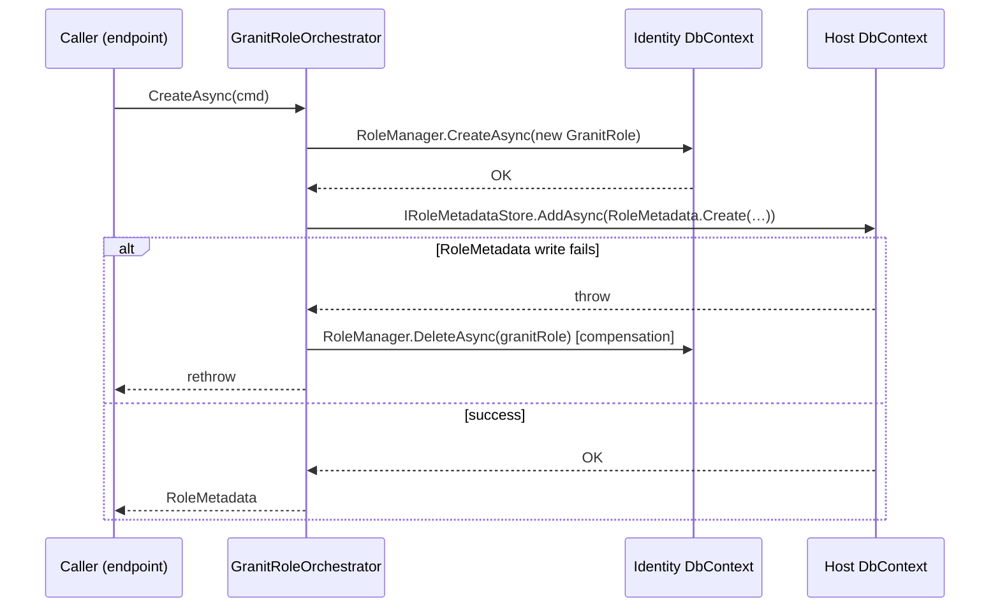

import { Aside } from "@astrojs/starlight/components";

## Why this matters

Granit ships a dynamic RBAC system where permissions are declared statically by
modules and granted to roles at runtime. Two things were missing before this feature:

1. A role had no declarative **scope**. Nothing stopped a tenant administrator from
   granting a `Tenants.Manage` permission (host-only) to one of their tenant roles,
   or from having the same role assignable in both host and tenant admin UIs.
2. There was no HTTP surface to **create, rename, or delete** roles. Platform
   operators had to hand-roll role management endpoints or reach into the database.

`RoleMetadata` and the `/admin/roles` CRUD close both gaps with the same
`MultiTenancySide` vocabulary already used by
[`PermissionDefinition`](/dotnet/security/authorization-multitenancy-side/).

## The `RoleMetadata` aggregate

Every Granit-managed role now has a companion `RoleMetadata` row that carries its
declarative scope:

```csharp
public sealed class RoleMetadata : AuditedAggregateRoot, IMultiTenant
{
    public string Name { get; private set; }                       // "Manager"
    public Guid? TenantId { get; private set; }                    // required when Side = Tenant
    public string? ClientId { get; private set; }                  // realm / client role distinction (reserved)
    public MultiTenancySide MultiTenancySide { get; private set; } // Host / Tenant / Both
    public string? Description { get; private set; }
    public bool IsSystem { get; private set; }                     // true for seeded roles
}
```

### Invariants

Enforced by the static `RoleMetadata.Create` factory **and** a database `CHECK`
constraint (`ck_authorization_role_metadata_side_tenant_consistency`):

| Side | `TenantId` |
| --- | --- |
| `Host` | **must** be `null` |
| `Both` | **must** be `null` (defined by the platform, assignable in any tenant context) |
| `Tenant` | **must** be non-null |

### Uniqueness

The table carries a unique composite index on `(Name, TenantId, ClientId)` with
PostgreSQL `NULLS NOT DISTINCT` semantics (via the `Npgsql:IndexNullsDistinct`
annotation). That means two host-level rows with `TenantId = null` and
`ClientId = null` cannot share the same name — silent duplicates are impossible.

<Aside type="note">
The same `NULLS NOT DISTINCT` fix was applied to the existing
`authorization_permission_grants` unique index, closing a latent duplicate-row risk
on host-scope grants.
</Aside>

### Events

Each state transition raises a plain `IDomainEvent` record that the
`DomainEventDispatcherInterceptor` dispatches after `SaveChanges` commits:

- `RoleCreatedEvent` — factory call
- `RoleUpdatedEvent` — `Rename(newName, newDescription)` when anything actually changes
- `RoleDeletedEvent` — `MarkAsDeleted()` before removing the entity

## System roles

`IdentityLocalRoleSeedContributor` (registered by `Granit.Identity.Local.AspNetIdentity`)
idempotently seeds three platform roles on every `IDataSeeder.SeedHostAsync` run:

| Role | Side | Purpose |
| --- | --- | --- |
| `SuperAdmin` | `Host` | Platform administrator with cross-tenant access. |
| `TenantAdministrator` | `Both` | Manages users, roles, and settings within a tenant. |
| `User` | `Both` | Default role assigned to every authenticated user. |

All three are flagged `IsSystem = true`, which protects them from being renamed or
deleted through the CRUD endpoints. The seeder includes a repair path that removes
orphan `GranitRole` rows (Identity side with no matching `RoleMetadata`) before
re-seeding, so partial failures of a previous seed self-heal.

## `/admin/roles` CRUD

The endpoints live in `Granit.Identity.Local.Endpoints` and map via:

```csharp title="Program.cs"
app.MapGranitRoles(opts =>
{
    opts.RolesRoutePrefix = "admin/roles"; // default
    opts.AllowTenantRoles = true;          // default — tenant admins can CRUD tenant roles
});
```

| Verb | Route | Permission | Notes |
| --- | --- | --- | --- |
| `GET` | `/admin/roles` | `IdentityLocal.Roles.Read` | Scoped to visible roles (matrix below). |
| `GET` | `/admin/roles/{id}` | `IdentityLocal.Roles.Read` | 404 when not visible. |
| `POST` | `/admin/roles` | `IdentityLocal.Roles.Manage` | Tenant admins create in own tenant only. Set `AllowTenantRoles = false` to disable tenant-scope creation entirely. |
| `PUT` | `/admin/roles/{id}` | `IdentityLocal.Roles.Manage` | Side and tenant scope are immutable. |
| `DELETE` | `/admin/roles/{id}` | `IdentityLocal.Roles.Delete` | System roles refuse deletion with 403. |

### Visibility matrix

Applied server-side via `ICurrentTenant` — the store never leaks a non-visible row:

| Caller context | `Host` roles | `Both` roles | Tenant-own roles | Other-tenant roles |
| --- | --- | --- | --- | --- |
| **Host admin** | CRUD | CRUD | Read (audit) | Read (audit) |
| **Tenant admin** | ∅ (invisible) | Read + assignable | CRUD | ∅ (invisible) |

Non-visible roles **always** return 404, never 403 — existence is not disclosed.

## Tenant-scope roles

Tenant admins CRUD tenant-scope roles in their own tenant by default
(`AllowTenantRoles = true`). Tenant-scope roles would otherwise collide on
ASP.NET Core Identity's process-wide unique index on `AspNetRoles.NormalizedName`
when two tenants create a role with the same display name. The solution is
`TenantAwareRoleLookupNormalizer`, which prefixes the normalized name with
`T_{tenantId}_` whenever a tenant context is active — it's wired automatically
by `Granit.Identity.Local.AspNetIdentity` (no action required).

### Opt-out: host-only deployments

For hosts that don't want to expose tenant-scope role creation at all (e.g. a
single-tenant product that keeps permission scoping at the Host level only),
opt out:

```csharp title="Program.cs"
app.MapGranitRoles(opts =>
{
    opts.AllowTenantRoles = false; // POST / with Side = Tenant now returns 403
});
```

When `AllowTenantRoles = false` the CRUD endpoints refuse `Side = Tenant` create
requests with a 403 problem detail; Host and Both roles remain fully available.

## Orchestration across two DbContexts

`GranitRole` rows live in the Identity DbContext (e.g. `OpenIddictDbContext`) and
`RoleMetadata` rows live in the host DbContext that implements
`IPermissionGrantDbContext`. The `IGranitRoleOrchestrator` serialises the two writes
with a **compensating-write strategy**:



This trades cross-DbContext atomicity for portability:

- **No** `TransactionScope` → no MSDTC escalation on Linux with Npgsql.
- **No** shared-connection transaction requirement → works regardless of whether both
  DbContexts target the same physical database.
- The compensating delete converges the invariant "every Granit-managed role has
  matching metadata" on the happy failure path.

Deployments that guarantee both DbContexts target the same physical database **and**
can expose the Identity DbContext connection across assemblies can replace the default
implementation with a shared-connection EF Core transaction
(`Database.OpenConnectionAsync` / `SetDbConnection` / `BeginTransactionAsync` /
`UseTransactionAsync`). The current `OpenIddictDbContext` is `internal sealed`, so the
shared-connection path requires either widening its visibility or introducing a
provider-specific orchestrator implementation.

## Grant-side coherence

Once a role has declared metadata, the built-in
`MultiTenancySidePermissionGrantValidator` enforces the full grant-vs-role matrix on
every permission grant where `ProviderName == "R"`. See
[**Host/Tenant & multi-provider — Role-side scoping**](/dotnet/security/authorization-multitenancy-side/#role-side-scoping)
for the decision table and the `role_side_forbidden` / `role_tenant_mismatch` rejection
codes.

## Related

- [Authorization — Policies & RBAC](/dotnet/security/authorization/)
- [Host/Tenant scope & multi-provider grants](/dotnet/security/authorization-multitenancy-side/)
- [Identity providers](/dotnet/security/identity/)
