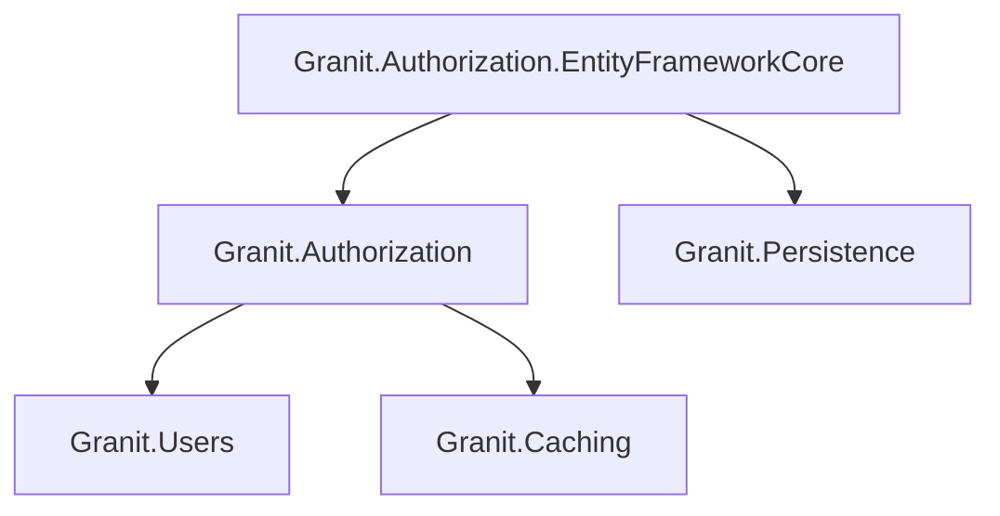
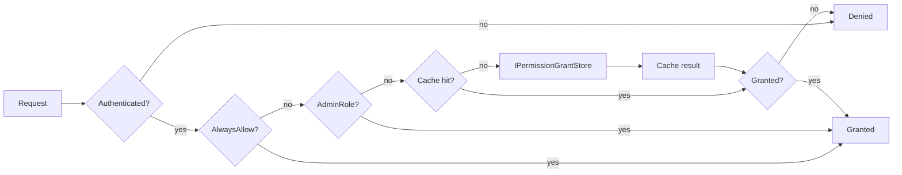

import { FileTree } from "@astrojs/starlight/components";

## Why dynamic permissions?

Static `[Authorize(Roles = "Admin")]` policies are hardcoded at compile time. Adding a
new role or changing what "Editor" can do requires a code change, a build, and a
deployment. In multi-tenant SaaS or enterprise applications, each customer expects to
define their own roles and fine-tune access — without waiting for a release.

Granit.Authorization solves this with a fully dynamic RBAC system: permissions are
declared by modules at startup, stored in a database, and cached per role in distributed
cache. Administrators assign permissions to roles at runtime through management
endpoints — no redeployment needed. The policy provider evaluates grants on every
request, so access changes take effect within the cache TTL (seconds, not sprints).

## Package structure

<FileTree>

- Granit.Authorization/ Dynamic RBAC, permission definitions, policy provider
  - Granit.Authorization.EntityFrameworkCore EF Core permission grant store
  - Granit.Authorization.Endpoints Permission management HTTP endpoints

</FileTree>

| Package | Role | Depends on |
|---------|------|------------|
| `Granit.Authorization` | RBAC permissions, dynamic policy provider | `Granit.Users`, `Granit.Caching` |
| `Granit.Authorization.EntityFrameworkCore` | EF Core permission grant store | `Granit.Authorization`, `Granit.Persistence` |

## Dependency graph



## Setup

```csharp
[DependsOn(typeof(GranitAuthorizationModule))]
public class AppModule : GranitModule { }
```

With EF Core persistence:

```csharp
[DependsOn(typeof(GranitAuthorizationEntityFrameworkCoreModule))]
public class AppModule : GranitModule
{
    public override void ConfigureServices(ServiceConfigurationContext context)
    {
        context.Services.AddGranitAuthorizationEntityFrameworkCore<AppDbContext>();
    }
}
```

## Permission definitions

Modules declare their permissions via `IPermissionDefinitionProvider`:

```csharp
public class InvoicePermissionDefinitionProvider : IPermissionDefinitionProvider
{
    public void DefinePermissions(IPermissionDefinitionContext context)
    {
        var group = context.AddGroup("Invoices", "Invoice management");
        group.AddPermission("Invoices.Invoices.Read", "View invoices");
        group.AddPermission("Invoices.Invoices.Create", "Create invoices");
        group.AddPermission("Invoices.Invoices.Update", "Edit invoices");
        group.AddPermission("Invoices.Invoices.Delete", "Delete invoices");
    }
}
```

**Naming convention:** `[Module].[Resource].[Action]`

Standard actions: `Read`, `Create`, `Update`, `Delete`, `Manage` (all CRUD), `Execute` (non-CRUD).

## Permission checking pipeline



The `PermissionChecker` evaluates in order:

1. **Not authenticated → denied** — anonymous users are always rejected, even with `AlwaysAllow`
2. `AlwaysAllow` option (development only, authenticated users only)
3. Admin role bypass — users with any role in `AdminRoles` get all permissions (case-insensitive)
4. Per-role cache lookup (key: `perm:{tenantId}:{roleName}:{permissionName}`)
5. `IPermissionGrantStore` fallback (default: `NullPermissionGrantStore` — always denied)

## Using permissions

```csharp
// Option 1: Attribute on endpoint
app.MapGet("/invoices", [Permission("Invoices.Invoices.Read")] async (
    AppDbContext db,
    CancellationToken cancellationToken) =>
{
    return await db.Invoices
        .ToListAsync(cancellationToken)
        .ConfigureAwait(false);
});

// Option 2: Imperative check
public class InvoiceService(IPermissionChecker permissionChecker)
{
    public async Task DeleteAsync(Guid id, CancellationToken cancellationToken)
    {
        if (!await permissionChecker.IsGrantedAsync(
            "Invoices.Invoices.Delete", cancellationToken)
            .ConfigureAwait(false))
        {
            throw new ForbiddenException("Not authorized to delete invoices");
        }
        // ...
    }
}
```

## Configuration

```json
{
  "Authorization": {
    "AdminRoles": ["admin"],
    "CacheDuration": "00:05:00",
    "AlwaysAllow": false
  }
}
```

| Property | Default | Description |
|----------|---------|-------------|
| `AdminRoles` | `["admin"]` | Roles that bypass all permission checks (case-insensitive) |
| `CacheDuration` | `00:05:00` | Per-role permission cache TTL (10s – 30min) |
| `AlwaysAllow` | `false` | Skip all checks for authenticated users (development only) |

:::danger
Never set `AlwaysAllow: true` in production. This bypasses all permission checks
for authenticated users. The startup validator rejects it in `Production` environment.
Anonymous users are always denied regardless of this setting.
:::

## EF Core permission store

`Granit.Authorization.EntityFrameworkCore` replaces `NullPermissionGrantStore` with a
real store backed by EF Core.

**Entity:**

```csharp
public class PermissionGrant : AuditedEntity, IMultiTenant
{
    public string Name { get; init; } = string.Empty;     // Permission name (immutable)
    public string RoleName { get; init; } = string.Empty;  // Role granted to (immutable)
    public Guid? TenantId { get; set; }                    // Tenant scope (null = global)
}
// Unique index: (TenantId, Name, RoleName)
```

**DbContext integration:**

```csharp
public class AppDbContext : DbContext, IPermissionGrantDbContext
{
    public DbSet<PermissionGrant> PermissionGrants => Set<PermissionGrant>();
}
```

**Managing grants:**

```csharp
public class PermissionAdminService(
    IPermissionManagerWriter writer,
    IPermissionManagerReader reader)
{
    public async Task GrantAsync(
        string roleName, string permissionName, CancellationToken cancellationToken)
    {
        await writer.SetAsync(permissionName, roleName, tenantId: null,
            isGranted: true, cancellationToken)
            .ConfigureAwait(false);
    }

    public async Task<IReadOnlyList<string>> GetGrantedAsync(
        string roleName, CancellationToken cancellationToken)
    {
        return await reader.GetGrantedPermissionsAsync(roleName, tenantId: null,
            cancellationToken)
            .ConfigureAwait(false);
    }
}
```

All grant changes are audit-logged via `AuditedEntity` (ISO 27001 — 3-year retention).

:::note[Privilege escalation prevention]
The `PUT /roles/{roleName}/{permissionName}` grant endpoint requires the calling user
to **hold the permission they are granting**. A user with `Authorization.Grants.Manage`
cannot grant permissions they do not themselves possess (returns 403 Forbidden).
:::

## Public API summary

| Category | Key types | Package |
|----------|-----------|---------|
| Modules | `GranitAuthorizationModule`, `GranitAuthorizationEntityFrameworkCoreModule` | — |
| Abstractions | `IPermissionDefinitionProvider`, `IPermissionDefinitionManager`, `IPermissionChecker`, `IPermissionGrantStore`, `PermissionAttribute` | `Granit.Authorization` |
| Options | `GranitAuthorizationOptions` | — |
| EF Core | `PermissionGrant`, `IPermissionGrantDbContext`, `IPermissionManagerReader`, `IPermissionManagerWriter` | `Granit.Authorization.EntityFrameworkCore` |
| Extensions | `AddGranitAuthorization()`, `AddGranitAuthorizationEntityFrameworkCore<T>()` | — |

## When to use — and when not to

Use Granit.Authorization when:

- **Roles and permissions change at runtime** — administrators assign permissions via UI without redeployment
- You need **module-scoped permissions** — each module declares its own permissions, no central registry to maintain
- **Audit trail** is required — every grant/revoke is tracked with `AuditedEntity` (ISO 27001)

Skip it when:

- Your app has **2–3 fixed roles** that never change (Admin, User) — static `[Authorize(Roles = "Admin")]` policies are simpler
- You only need **claim-based** authorization (e.g., "user has scope X") — ASP.NET Core policies handle this natively

## Common pitfalls

:::caution[Permissions not evaluated at runtime]
If `IPermissionChecker` returns false for everything, check that:
1. `GranitAuthorizationEntityFrameworkCoreModule` is loaded (permissions need a store)
2. Permissions are actually granted to the role via `IPermissionManagerWriter`
3. The distributed cache is reachable — grants are cached per role
:::

:::caution[Permissions declared but not discovered]
`IPermissionDefinitionProvider` implementations are discovered from loaded module
assemblies. If your provider is in an assembly that is not referenced by any module
in the dependency graph, it will not be found. Verify with a breakpoint in
`DefinePermissions`.
:::

## Host admin access

Multi-tenant endpoints default to **tenant-only mode**: without an `X-Tenant-Id`
header, the `MultiTenant` query filter produces `WHERE TenantId IS NULL` — returning
no tenant data. Host administrators need cross-tenant visibility on specific
endpoints.

### `.AllowHostAccess()` marker

Chain `.AllowHostAccess()` after `.RequireAuthorization()` on endpoints that should
support host admin access:

```csharp
group.MapGet("/{id:guid}", GetByIdAsync)
    .WithName("GetSubscription")
    .RequireAuthorization(SubscriptionsPermissions.Subscriptions.Read)
    .AllowHostAccess();  // Host admin can see any tenant's subscription
```

The `RequireHostContextEndpointFilter` behind `.AllowHostAccess()` checks:

- **Tenant context active** — filter is a no-op, normal tenant-scoped access
- **No tenant context** — verifies the caller is authenticated (defense in depth)

Permission checks are handled by `.RequireAuthorization()` which already calls
`IPermissionChecker` with the contextual cache key
`perm:global:{role}:{permission}` in host context. No need to repeat the
permission in `.AllowHostAccess()`.

### Three-layer defense

| Layer | Component | Role |
|-------|-----------|------|
| **Endpoint** | `.AllowHostAccess()` | Authentication gate for host requests |
| **Authorization** | `.RequireAuthorization(perm)` | Permission check (`global` scope in host context) |
| **Data** | `EfStoreBase.Query(db)` | `IgnoreQueryFilters([MultiTenant])` per query |

A tenant user who omits the `X-Tenant-Id` header gets **no data** (safe default)
on endpoints without `.AllowHostAccess()`, and **403 Forbidden** from the
authorization layer on endpoints with `.AllowHostAccess()` (no global permissions).

### When to use

Add `.AllowHostAccess()` on **read** endpoints where host administrators need
cross-tenant visibility: GET by ID, list, and admin dashboards.

Do **not** add it on:

- **Tenant-only writes** — `CreateSubscription`, `AssignSeat` (require tenant context)
- **Endpoints with explicit tenant checks** — already return 400 if `!currentTenant.IsAvailable`
- **QueryEngine endpoints** — `IQueryableSource` implementations handle the bypass separately

## Testing authorization

Mock `IPermissionChecker` in unit tests to isolate business logic from the permission system:

```csharp
[Fact]
public async Task Should_reject_unauthorized_user()
{
    // Arrange
    var checker = Substitute.For<IPermissionChecker>();
    checker.IsGrantedAsync("Invoices.Invoices.Delete")
        .Returns(false);
    var service = new InvoiceService(checker, dbContext);

    // Act & Assert
    await Should.ThrowAsync<ForbiddenException>(
        () => service.DeleteAsync(invoiceId));
}
```

## See also

- [Adding Authentication guide](/dotnet/getting-started/adding-authentication/) — getting started with auth
- [Authentication](/dotnet/security/authentication/) -- JWT Bearer, claims transformation
- [Security](/dotnet/security/security-overview/) -- core abstractions (ICurrentUserService, ActorKind)
- [Persistence](/dotnet/data/persistence/) -- `AuditedEntity` base class, interceptors
