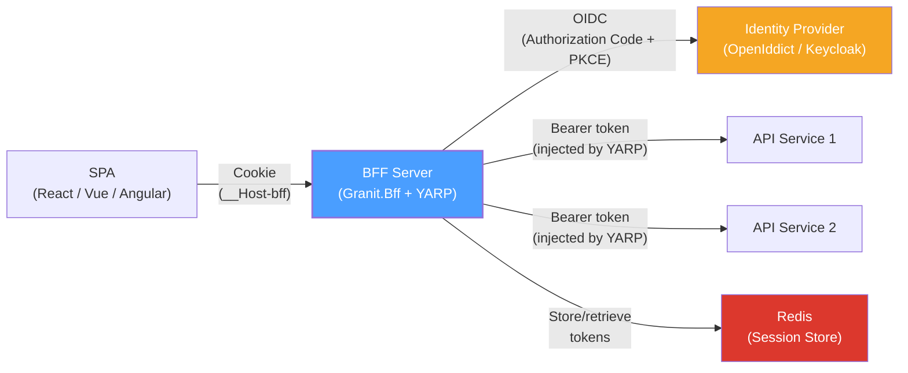
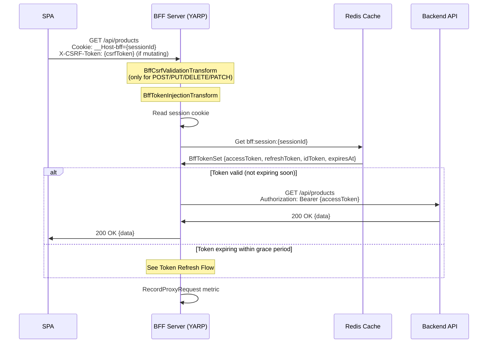
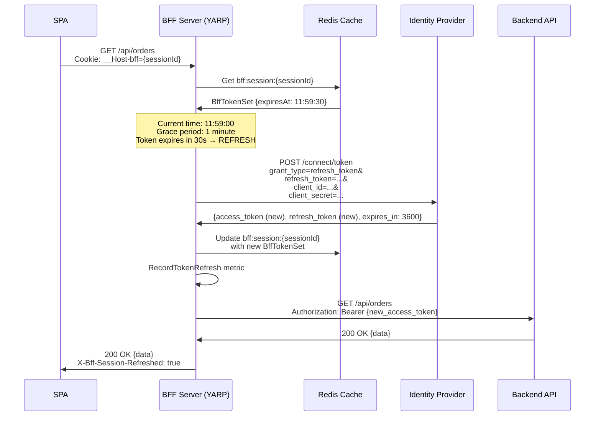
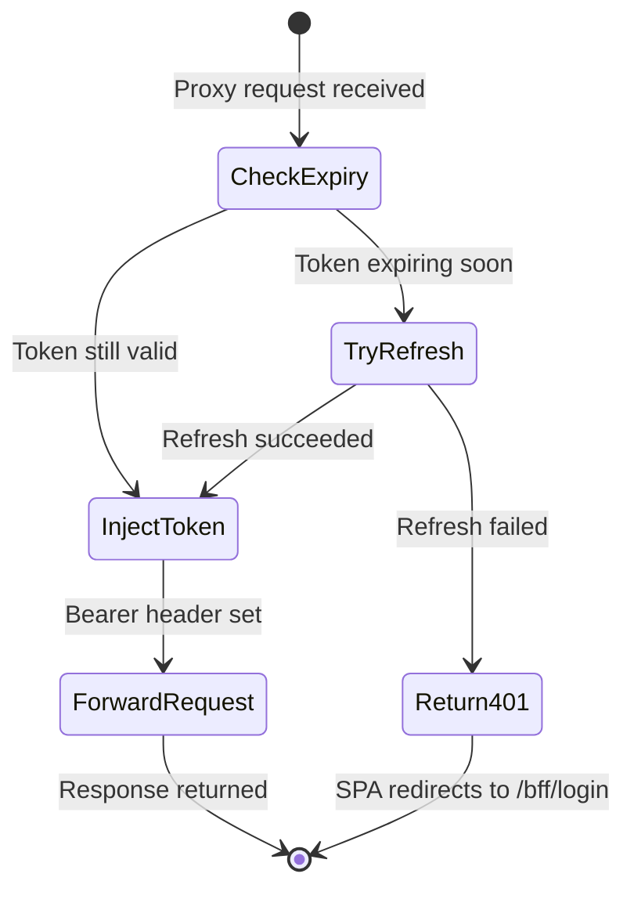
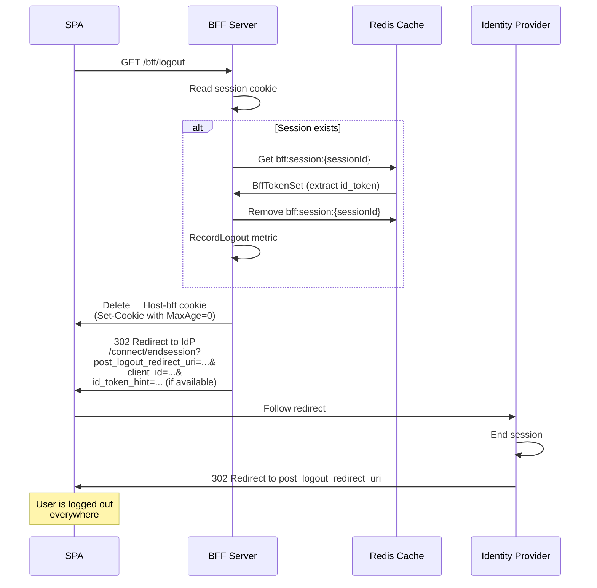
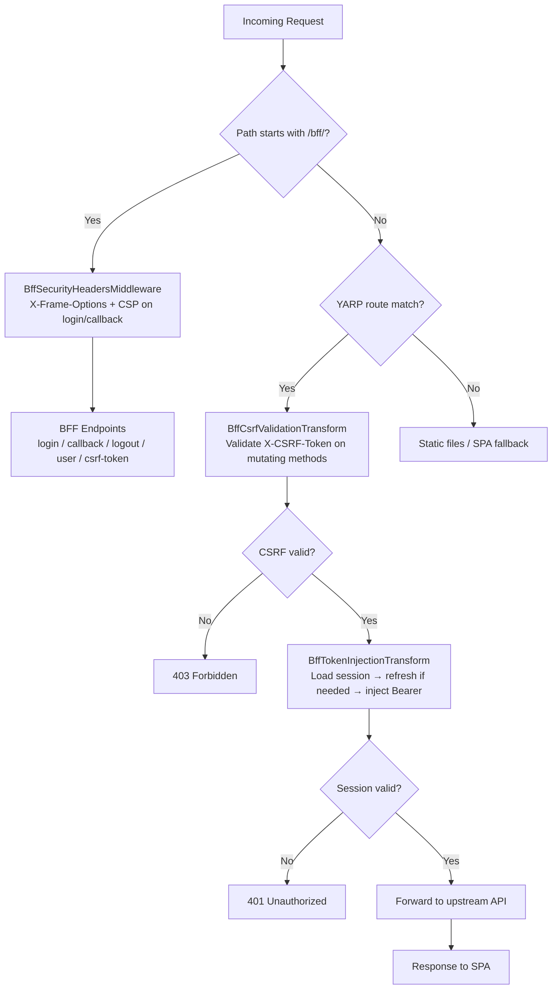

import { Tabs, TabItem, Badge, Aside } from "@astrojs/starlight/components";

## High-level architecture

The BFF sits between the SPA and all backend services. It handles all OIDC
interactions and proxies API calls with Bearer token injection. The SPA never
communicates directly with the identity provider or backend APIs.



## Component responsibilities

| Component | Responsibility | Package |
|-----------|---------------|---------|
| `GranitBffModule` | Registers `IBffTokenStore`, `IBffCsrfTokenGenerator`, `BffMetrics`, `BffActivitySource` | `Granit.Bff` |
| `GranitBffOptions` | Central configuration: authority, client credentials, session duration, cookie name | `Granit.Bff` |
| `IBffTokenStore` | Store, retrieve, and remove `BffTokenSet` by session ID in `IDistributedCache` | `Granit.Bff` |
| `IBffCsrfTokenGenerator` | Generate and validate HMAC-SHA256 CSRF tokens bound to sessions | `Granit.Bff` |
| `BffLoginEndpoints` | OIDC authorization code flow with PKCE: `/bff/login` + `/bff/callback` | `Granit.Bff.Endpoints` |
| `BffLogoutEndpoints` | Session cleanup + RP-Initiated Logout: `/bff/logout` | `Granit.Bff.Endpoints` |
| `BffUserEndpoints` | Filtered user claims for the SPA: `/bff/user` | `Granit.Bff.Endpoints` |
| `BffCsrfEndpoints` | CSRF token generation: `/bff/csrf-token` | `Granit.Bff.Endpoints` |
| `BffSecurityHeadersMiddleware` | `X-Frame-Options: DENY` + CSP `frame-ancestors 'none'` on login/callback | `Granit.Bff.Endpoints` |
| `BffTokenInjectionTransform` | YARP transform: load tokens, silent refresh, inject `Authorization: Bearer` | `Granit.Bff.Yarp` |
| `BffCsrfValidationTransform` | YARP transform: validate `X-CSRF-Token` on POST/PUT/DELETE/PATCH | `Granit.Bff.Yarp` |

## Login flow

The login flow implements the full OAuth 2.0 Authorization Code flow with PKCE.
The BFF acts as a confidential client — it has a `client_secret` that is never
exposed to the browser.

```mermaid
sequenceDiagram
    participant User as User (Browser)
    participant SPA as SPA
    participant BFF as BFF Server
    participant Cache as Redis Cache
    participant IdP as Identity Provider

    User->>SPA: Click "Login"
    SPA->>BFF: GET /bff/login

    Note over BFF: Generate PKCE pair:<br/>code_verifier (64 bytes, base64url)<br/>code_challenge = SHA256(code_verifier)

    Note over BFF: Generate state parameter<br/>(32 random bytes, base64)

    BFF->>Cache: Store {code_verifier, state}<br/>key: bff:pkce:{state}<br/>TTL: 10 minutes

    BFF->>User: 302 Redirect to IdP<br/>/connect/authorize?<br/>client_id=...&<br/>response_type=code&<br/>code_challenge=...&<br/>code_challenge_method=S256&<br/>state=...&<br/>scope=openid profile email roles offline_access

    User->>IdP: Follow redirect
    IdP->>User: Login page
    User->>IdP: Enter credentials
    IdP->>User: Consent (if required)

    IdP->>BFF: 302 Redirect to /bff/callback?code=...&state=...

    BFF->>Cache: Get + remove bff:pkce:{state}
    Cache->>BFF: {code_verifier, state}

    BFF->>IdP: POST /connect/token<br/>grant_type=authorization_code&<br/>code=...&<br/>client_id=...&<br/>client_secret=...&<br/>code_verifier=...&<br/>redirect_uri=.../bff/callback

    IdP->>BFF: {access_token, refresh_token, id_token, expires_in}

    Note over BFF: Generate session ID<br/>(Guid, no dashes)

    BFF->>Cache: Store BffTokenSet<br/>key: bff:session:{sessionId}<br/>TTL: SessionDuration (8h default)

    BFF->>User: 302 Redirect to PostLoginRedirectPath<br/>Set-Cookie: __Host-bff={sessionId};<br/>HttpOnly; Secure; SameSite=Strict; Path=/

    Note over User: Cookie stored automatically<br/>by the browser. Invisible<br/>to JavaScript.

    BFF->>BFF: RecordLogin metric
```

### PKCE details

PKCE (Proof Key for Code Exchange) prevents authorization code interception attacks.
Even though the BFF is a confidential client, PKCE provides defense-in-depth:

| Parameter | Value |
|-----------|-------|
| `code_verifier` | 64 random bytes, base64url-encoded |
| `code_challenge` | `BASE64URL(SHA256(code_verifier))` |
| `code_challenge_method` | `S256` |
| Storage | Distributed cache, 10-minute TTL |

The `code_verifier` is generated server-side and never sent to the browser.
After the callback, it is consumed (get + delete) to prevent replay attacks.

## API call flow

When the SPA makes an API call, the browser automatically attaches the session
cookie. The YARP reverse proxy intercepts the request, loads the tokens from
Redis, and injects the `Authorization: Bearer` header before forwarding.



### Route metadata

Not all YARP routes require authentication. The `Granit.Bff.RequireAuth` metadata
key controls which routes trigger token injection and CSRF validation:

```json
{
  "Routes": {
    "api-route": {
      "ClusterId": "backend",
      "Match": { "Path": "/api/{**catch-all}" },
      "Metadata": {
        "Granit.Bff.RequireAuth": "true"
      }
    },
    "public-route": {
      "ClusterId": "backend",
      "Match": { "Path": "/public/{**catch-all}" }
    }
  }
}
```

Routes without the metadata key (or with `"false"`) pass through without
authentication — useful for public endpoints, health checks, or OpenAPI specs.

## Token refresh flow

When the access token is about to expire (within the configurable `RefreshGracePeriod`,
default 1 minute), the YARP token injection transform automatically performs a
silent refresh. This is invisible to both the SPA and the end user.



### Refresh failure handling

If the refresh token is expired or revoked by the identity provider:



When refresh fails, the BFF returns `401 Unauthorized`. The SPA should detect this
and redirect the user to `/bff/login` to start a new authentication flow.

<Aside type="tip" title="X-Bff-Session-Refreshed header">
When a silent refresh succeeds, the BFF adds the `X-Bff-Session-Refreshed: true`
response header. The SPA can use this to update the session expiry displayed in the
UI without making a separate `/bff/user` call.
</Aside>

## Logout flow

Logout involves three steps: clearing the server-side session, deleting the browser
cookie, and notifying the identity provider via RP-Initiated Logout.



### Why `id_token_hint`?

The `id_token_hint` parameter tells the identity provider which session to
terminate without prompting the user for confirmation. If the ID token is
available in the session store, the BFF includes it automatically. If the
session has already expired, logout still works — the user is simply shown
the IdP's logout confirmation page.

## Token revocation on logout (RFC 7009)

When a user logs out, the BFF revokes both the refresh token and access token at
the authorization server's `/connect/revoke` endpoint (RFC 7009) before clearing
the local session. This is a **best-effort** operation -- logout always completes
even if revocation fails (e.g., the IdP is temporarily unreachable). Revocation
order: refresh token first (cascades to access token in OpenIddict), then explicit
access token revocation for defense in depth. DPoP proofs and `private_key_jwt`
assertions are included in revocation requests when those features are enabled.

## Back-channel logout (OIDC)

The BFF supports [OIDC Back-Channel Logout 1.0](https://openid.net/specs/openid-connect-backchannel-1_0.html).
When a user logs out at the identity provider (or an admin revokes a session), the
IdP sends a signed `logout_token` to `/{pathPrefix}/bff/backchannel-logout`.

The `ILogoutTokenValidator` performs full JWT validation:

1. **Signature verification** against the IdP's JWKS (auto-discovered from
   `/.well-known/openid-configuration`). Supports RS256/384/512, PS256/384/512,
   and ES256/384/512. JWKS keys are cached for 1 hour with automatic re-fetch
   on unknown `kid` (handles key rotation).
2. **`alg:none` rejection** (CWE-345) — unsigned tokens are always refused.
3. **Issuer validation** — `iss` must match the configured `Authority`.
4. **Audience validation** — `aud` must contain the frontend's `ClientId`.
5. **Event claim** — the `events` object must contain the back-channel logout event.
6. **Replay protection** — `jti` is cached for 10 minutes to prevent replay.

After validation, all matching sessions for the subject are removed from the token
store. This ensures server-side session cleanup even when the user closes the browser
without calling `/bff/logout`.

:::note[BFF vs API back-channel logout]
`/{prefix}/bff/backchannel-logout` invalidates **BFF cookie sessions** (this module).
`/auth/back-channel-logout` (documented in [Authentication](/dotnet/security/authentication/)) handles **API-level token revocation** for JWT Bearer resource servers. They serve different purposes and can coexist.
:::

## Session management

The BFF provides endpoints for listing and revoking active sessions per user:

| Endpoint | Method | Description |
|----------|--------|-------------|
| `/{prefix}/bff/sessions` | `GET` | Lists the current user's active sessions (masked IDs, timestamps, user agents) |
| `/{prefix}/bff/sessions/{id}` | `DELETE` | Revokes a specific session ("log out that device") |
| `/{prefix}/bff/sessions` | `DELETE` | Revokes all other sessions ("log out everywhere else") |

These endpoints require a valid session cookie. The current session cannot be revoked
via `DELETE /sessions/{id}` -- use `/bff/logout` instead.

## Sliding session expiration

By default (`UseSessionSlidingExpiration: true`), the BFF extends the session TTL
when a proxied request occurs past the session's halfway point. This prevents active
users from being logged out mid-work while still enforcing a hard ceiling via
`SessionAbsoluteMaxDuration` (default: 8 hours) to meet ISO 27001 A.9.4.2.

## Token store strategies

The `IBffTokenStore` abstraction supports two persistence backends:

| Strategy | Package | Use case |
|----------|---------|----------|
| **Distributed cache** (default) | `Granit.Bff` | Redis, SQL Server, or in-memory. Best for horizontally scaled deployments with existing Redis infrastructure. |
| **EF Core** | `Granit.Bff.EntityFrameworkCore` | Stores sessions in `BffDbContext` (table `bff_sessions`). Best for deployments without Redis, or when session data must be queryable (session listing, admin dashboards). Includes an automatic expired session cleanup job. |

To switch to EF Core, add a `[DependsOn(typeof(GranitBffEntityFrameworkCoreModule))]`
to your module. This replaces the default `IBffTokenStore` registration with
`EfCoreBffTokenStore` backed by `BffDbContext`.

## Where tokens live

A clear picture of where each piece of sensitive data resides:

| Data | Location | Format | Lifetime | Accessible to JS |
|------|----------|--------|----------|------------------|
| **Access token** | Redis (`bff:session:{id}`) | JSON (serialized `BffTokenSet`) | `SessionDuration` (default 8h) | No |
| **Refresh token** | Redis (`bff:session:{id}`) | JSON (serialized `BffTokenSet`) | `SessionDuration` (default 8h) | No |
| **ID token** | Redis (`bff:session:{id}`) | JSON (serialized `BffTokenSet`) | `SessionDuration` (default 8h) | No |
| **Session ID** | Browser cookie (`__Host-bff`) | GUID (32 hex chars) | `SessionDuration` | No (`HttpOnly`) |
| **CSRF token** | SPA memory (from `/bff/csrf-token`) | `{timestamp}:{hmac-hex}` | 24h sliding window | Yes (intentional) |
| **PKCE code_verifier** | Redis (`bff:pkce:{state}`) | JSON | 10 minutes | No |

<Aside type="caution" title="Encryption at rest">
The default `DistributedCacheBffTokenStore` uses `IDistributedCache` directly.
For production deployments, enable Redis TLS and consider integrating
[`Granit.Caching`](/dotnet/data/caching/) with `ICacheValueEncryptor`
(AES-256-GCM) for encryption at rest. See the
[Security](/dotnet/security/bff/token-security/) page for details.
</Aside>

## Request pipeline

The middleware and transform order is critical for correct behavior:



## Next steps

- **[Getting Started](/dotnet/security/bff/getting-started/)** — set up a working BFF in 15 minutes
- **[Security](/dotnet/security/bff/token-security/)** — deep dive into cookie hardening, CSRF, and session management
- **[YARP Proxy](/dotnet/security/bff/reverse-proxy-yarp/)** — route configuration and multi-service proxying
