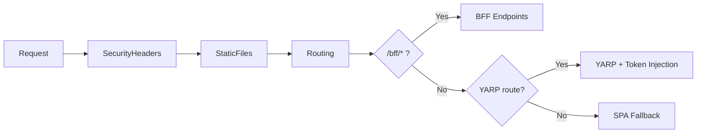
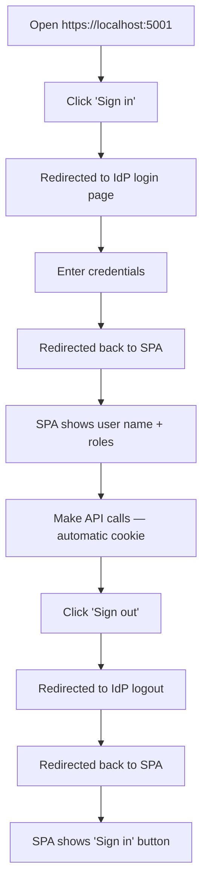

import { Tabs, TabItem, FileTree, Badge, Aside } from "@astrojs/starlight/components";

This guide walks through setting up a complete BFF from scratch. By the end,
you will have a working SPA that authenticates via an OIDC provider with all
tokens stored server-side.

## Prerequisites

- .NET 10 SDK
- Redis instance (for session storage)
- An OIDC-compliant identity provider (OpenIddict, Keycloak, Entra ID)
- A SPA project (React, Vue, Angular, or any framework)

## 1. Install packages

```bash
dotnet add package Granit.Bff
dotnet add package Granit.Bff.Endpoints
dotnet add package Granit.Bff.Yarp
dotnet add package Granit.Caching.StackExchangeRedis
```

The `Granit.Caching.StackExchangeRedis` package provides the `IDistributedCache`
implementation backed by Redis. You can also use any other `IDistributedCache`
provider (SQL Server, NCache, etc.), but Redis is recommended for production.

## 2. Register the OIDC application

The BFF is a **confidential client** — it has a `client_secret` and uses the
Authorization Code flow with PKCE. Register it in your identity provider.

<Tabs>
<TabItem label="OpenIddict (Granit)">

Add the BFF application to the `OpenIddict:Seeding:Applications` configuration:

```json
{
  "OpenIddict": {
    "Seeding": {
      "Applications": [
        {
          "ClientId": "my-bff",
          "ClientSecret": "bff-secret-from-vault",
          "DisplayName": "My Application (BFF)",
          "Permissions": [
            "ept:authorization",
            "ept:token",
            "ept:logout",
            "gt:authorization_code",
            "gt:refresh_token",
            "scp:openid",
            "scp:profile",
            "scp:email",
            "scp:roles",
            "scp:offline_access"
          ],
          "RedirectUris": ["https://app.example.com/bff/callback"],
          "PostLogoutRedirectUris": ["https://app.example.com"]
        }
      ]
    }
  }
}
```

<Aside type="tip" title="Client secret management">
Never hardcode the client secret. Use [Granit.Vault](/dotnet/data/vault/)
to inject it from HashiCorp Vault or Azure Key Vault at runtime.
</Aside>

</TabItem>
<TabItem label="Keycloak">

1. Go to **Clients** > **Create client**
2. Set **Client ID** to `my-bff`
3. Set **Client authentication** to **On** (confidential client)
4. Under **Valid redirect URIs**, add `https://app.example.com/bff/callback`
5. Under **Valid post logout redirect URIs**, add `https://app.example.com`
6. Under **Capability config**, enable:
   - Standard flow (Authorization Code)
   - Direct access grants (for testing only)
7. Copy the **Client secret** from the **Credentials** tab

Required scopes: `openid`, `profile`, `email`, `roles`, `offline_access`.

</TabItem>
<TabItem label="Entra ID">

1. Go to **App registrations** > **New registration**
2. Set **Redirect URI** to `https://app.example.com/bff/callback` (Web platform)
3. Under **Certificates & secrets**, create a new client secret
4. Under **API permissions**, add:
   - `openid`, `profile`, `email`, `offline_access`
5. Under **Token configuration**, add `roles` optional claim

Use the **Application (client) ID** as `ClientId` and the secret value as `ClientSecret`.
Set `Authority` to `https://login.microsoftonline.com/{tenant-id}/v2.0`.

</TabItem>
</Tabs>

## 3. Configure appsettings.json

```json
{
  "Bff": {
    "Authority": "https://auth.example.com",
    "ClientId": "my-bff",
    "ClientSecret": "bff-secret-from-vault",
    "Scopes": ["openid", "profile", "email", "roles", "offline_access"],
    "SessionCookieName": "__Host-bff",
    "SessionDuration": "08:00:00",
    "RefreshGracePeriod": "00:01:00",
    "PostLoginRedirectPath": "/",
    "PostLogoutRedirectPath": "/"
  },

  "ReverseProxy": {
    "Routes": {
      "api": {
        "ClusterId": "backend-api",
        "Match": {
          "Path": "/api/{**catch-all}"
        },
        "Metadata": {
          "Granit.Bff.RequireAuth": "true"
        }
      }
    },
    "Clusters": {
      "backend-api": {
        "Destinations": {
          "primary": {
            "Address": "https://api.example.com"
          }
        }
      }
    }
  },

  "ConnectionStrings": {
    "Redis": "localhost:6379"
  }
}
```

<Aside type="caution" title="HTTPS required">
The `__Host-` cookie prefix requires HTTPS. The BFF will not work over plain HTTP.
In development, use `dotnet dev-certs https --trust` or configure Kestrel with a
development certificate.
</Aside>

## 4. Register modules

```csharp
using Granit.Bff;
using Granit.Bff.Endpoints;
using Granit.Bff.Yarp;
using Granit.Caching.StackExchangeRedis;
using Granit.Modularity;

[DependsOn(
    typeof(GranitBffModule),
    typeof(GranitBffEndpointsModule),
    typeof(GranitBffYarpModule),
    typeof(GranitCachingStackExchangeRedisModule))]
public sealed class AppModule : GranitModule;
```

## 5. Configure the host

```csharp
var builder = WebApplication.CreateBuilder(args);

// Add Granit modules
builder.AddGranit<AppModule>();

// Add Redis distributed cache (used by IBffTokenStore)
builder.Services.AddStackExchangeRedisCache(options =>
{
    options.Configuration = builder.Configuration.GetConnectionString("Redis");
    options.InstanceName = "bff:";
});

// Add YARP with BFF transforms (token injection + CSRF validation)
builder.AddGranitBffYarp();

// Add HttpClient for token exchange with the IdP
builder.Services.AddHttpClient("Granit.Bff", client =>
{
    client.Timeout = TimeSpan.FromSeconds(10);
});

var app = builder.Build();
```

## 6. Configure the middleware pipeline

The order of middleware matters. The BFF security headers must come before
routing, and the YARP proxy must come after authentication.

```csharp
// Security headers on login/callback endpoints (X-Frame-Options, CSP)
app.UseMiddleware<BffSecurityHeadersMiddleware>();

// Serve SPA static files
app.UseDefaultFiles();
app.UseStaticFiles();

// Standard ASP.NET Core middleware
app.UseRouting();

// Map BFF endpoints (/bff/login, /bff/callback, /bff/logout, /bff/user, /bff/csrf-token)
app.MapGranitBff();

// Map YARP reverse proxy (with token injection)
app.UseGranitBffYarp();

// SPA fallback — serve index.html for all unmatched routes
app.MapFallbackToFile("index.html");

app.Run();
```



<Aside type="caution" title="Middleware order">
`UseGranitBffYarp()` must come **after** `MapGranitBff()`. If reversed,
YARP may intercept BFF endpoint routes before they are handled.
</Aside>

## 7. React integration

The SPA interacts with the BFF through standard HTTP calls. No OAuth library
is needed on the frontend — the browser handles cookies automatically.

<Tabs>
<TabItem label="Auth hook">

```tsx
// src/hooks/useAuth.ts
import { useCallback, useEffect, useState } from "react";

interface BffUser {
  authenticated: boolean;
  sub?: string;
  name?: string;
  email?: string;
  roles?: string[];
  tenantId?: string;
  sessionExpiresAt?: string;
}

export function useAuth() {
  const [user, setUser] = useState<BffUser | null>(null);
  const [loading, setLoading] = useState(true);

  const checkSession = useCallback(async () => {
    try {
      const response = await fetch("/bff/user", {
        credentials: "include", // sends the session cookie
      });
      const data: BffUser = await response.json();
      setUser(data.authenticated ? data : null);
    } catch {
      setUser(null);
    } finally {
      setLoading(false);
    }
  }, []);

  useEffect(() => {
    checkSession();
  }, [checkSession]);

  const login = useCallback(() => {
    // Full-page redirect — BFF handles the OIDC flow
    window.location.href = "/bff/login";
  }, []);

  const logout = useCallback(() => {
    // Full-page redirect — BFF clears session + IdP logout
    window.location.href = "/bff/logout";
  }, []);

  return { user, loading, login, logout, checkSession };
}
```

</TabItem>
<TabItem label="CSRF hook">

```tsx
// src/hooks/useCsrfToken.ts
import { useCallback, useRef } from "react";

let cachedToken: string | null = null;

export function useCsrfToken() {
  const fetchingRef = useRef(false);

  const getCsrfToken = useCallback(async (): Promise<string> => {
    if (cachedToken) return cachedToken;

    // Prevent concurrent fetches
    if (fetchingRef.current) {
      await new Promise((resolve) => setTimeout(resolve, 100));
      return cachedToken ?? "";
    }

    fetchingRef.current = true;
    try {
      const response = await fetch("/bff/csrf-token", {
        method: "POST",
        credentials: "include",
      });

      if (!response.ok) {
        throw new Error(`CSRF token fetch failed: ${response.status}`);
      }

      const data = await response.json();
      cachedToken = data.csrfToken;
      return cachedToken ?? "";
    } finally {
      fetchingRef.current = false;
    }
  }, []);

  const clearCsrfToken = useCallback(() => {
    cachedToken = null;
  }, []);

  return { getCsrfToken, clearCsrfToken };
}
```

</TabItem>
<TabItem label="API client">

```tsx
// src/lib/api.ts
import { useCsrfToken } from "../hooks/useCsrfToken";

const { getCsrfToken } = useCsrfToken();

export async function apiFetch(
  url: string,
  options: RequestInit = {}
): Promise<Response> {
  const headers = new Headers(options.headers);

  // Add CSRF token for mutating requests
  const method = (options.method ?? "GET").toUpperCase();
  if (["POST", "PUT", "DELETE", "PATCH"].includes(method)) {
    const csrfToken = await getCsrfToken();
    headers.set("X-CSRF-Token", csrfToken);
  }

  const response = await fetch(url, {
    ...options,
    headers,
    credentials: "include", // always send session cookie
  });

  // Session expired — redirect to login
  if (response.status === 401) {
    window.location.href = "/bff/login";
    throw new Error("Session expired");
  }

  return response;
}

// Usage:
// const products = await apiFetch("/api/products").then(r => r.json());
// await apiFetch("/api/orders", { method: "POST", body: JSON.stringify(order) });
```

</TabItem>
<TabItem label="App component">

```tsx
// src/App.tsx
import { useAuth } from "./hooks/useAuth";

export function App() {
  const { user, loading, login, logout } = useAuth();

  if (loading) return <div>Loading...</div>;

  if (!user) {
    return (
      <div>
        <h1>Welcome</h1>
        <button onClick={login}>Sign in</button>
      </div>
    );
  }

  return (
    <div>
      <header>
        <span>Hello, {user.name}</span>
        <span>Roles: {user.roles?.join(", ")}</span>
        <button onClick={logout}>Sign out</button>
      </header>
      <main>
        {/* Your app content — all API calls go through the BFF proxy */}
      </main>
    </div>
  );
}
```

</TabItem>
</Tabs>

## 8. Run and test

Start the application and verify each endpoint.

### Verify the login flow

```bash
# Open in browser — should redirect to the IdP login page
curl -v https://localhost:5001/bff/login
# Expected: 302 redirect to {Authority}/connect/authorize?...
```

### Verify user claims

```bash
# Before login — should return { authenticated: false }
curl -s https://localhost:5001/bff/user | jq
# {
#   "authenticated": false
# }
```

### Verify CSRF token

```bash
# After login — extract the session cookie and request a CSRF token
curl -s -X POST https://localhost:5001/bff/csrf-token \
  -b "__Host-bff=your-session-id" | jq
# {
#   "csrfToken": "1711234567:a1b2c3d4..."
# }
```

### Verify API proxying

```bash
# After login — API calls are proxied with Bearer token injection
curl -s https://localhost:5001/api/products \
  -b "__Host-bff=your-session-id" | jq
# Response from your backend API — no tokens visible
```

### Complete integration test

Open the SPA in a browser and perform the following sequence:



## Project structure

A typical BFF project looks like this:

<FileTree>
- MyApp.Bff/
  - Program.cs Host configuration + middleware pipeline
  - AppModule.cs Granit module with [DependsOn]
  - appsettings.json BFF + YARP + Redis configuration
  - appsettings.Development.json Development overrides
  - wwwroot/ SPA static files (React build output)
    - index.html SPA entry point
    - assets/ JS, CSS, images
  - MyApp.Bff.csproj
</FileTree>

<Aside type="tip" title="SPA build integration">
Add a `<Target Name="BuildSpa" BeforeTargets="Build">` in the `.csproj` to
automatically build the SPA and copy the output to `wwwroot/` during
`dotnet build`. This ensures the SPA and BFF are always in sync.
</Aside>

## Next steps

- **[Architecture](/dotnet/security/bff/architecture/)** — understand the full flow diagrams
- **[Security](/dotnet/security/bff/token-security/)** — harden cookies, enable cache encryption, configure CSRF
- **[YARP Proxy](/dotnet/security/bff/reverse-proxy-yarp/)** — advanced routing, multi-service, WebSocket proxying
- **[Configuration](/dotnet/security/bff/configuration/)** — all options, metrics, and tracing reference
