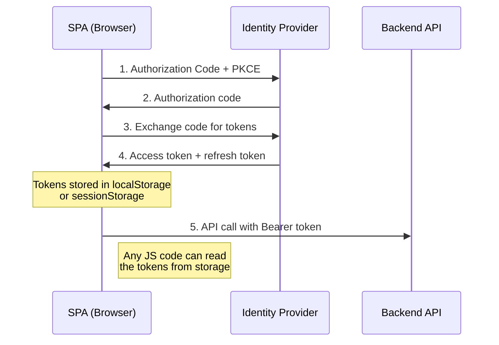
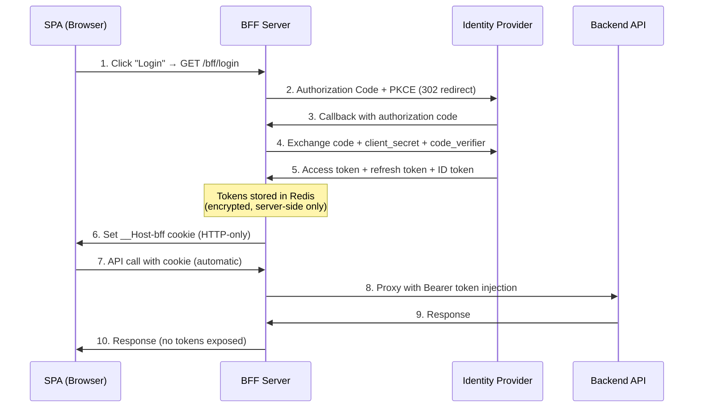
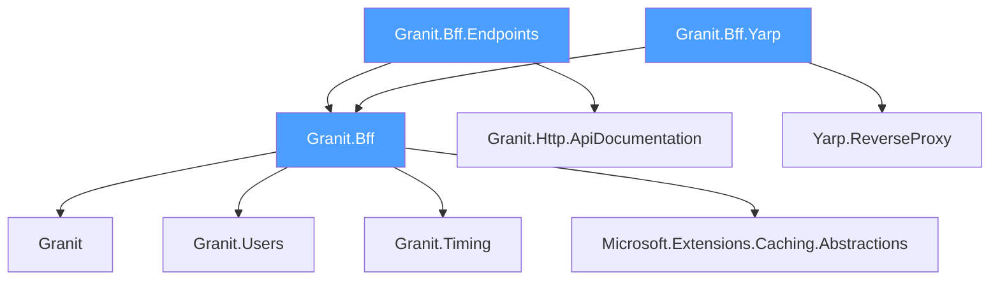

import { Tabs, TabItem, FileTree, Badge, Aside } from "@astrojs/starlight/components";

## The problem: tokens in the browser

Single-page applications (SPAs) that authenticate directly with an identity provider
face a fundamental security problem: **tokens end up in JavaScript-accessible storage**.

### How most SPAs authenticate today

A typical SPA uses the Authorization Code flow with PKCE to obtain tokens directly
from the identity provider. The tokens are then stored in `localStorage`,
`sessionStorage`, or in-memory variables — all of which are accessible to JavaScript.

### Why this is dangerous

Even with PKCE (which prevents authorization code interception), the fundamental
problem remains: **JavaScript can read the tokens**.

**XSS is the real threat.** A cross-site scripting vulnerability — whether from a
compromised npm dependency, a malicious ad script, or a user-injected payload —
gives an attacker full access to every token in the browser:

- **Access tokens** let the attacker call your APIs as the victim
- **Refresh tokens** let the attacker maintain access indefinitely
- **ID tokens** leak personal information (name, email, roles)

The attack surface is enormous. A typical SPA has hundreds of npm dependencies,
each of which can inject arbitrary JavaScript. A single `postMessage` handler or
`innerHTML` assignment can open the door.

<Aside type="danger" title="Supply chain attacks are real">
In 2024, the `event-stream` and `ua-parser-js` incidents demonstrated that
popular npm packages can be silently compromised. Any dependency in your SPA's
dependency tree can exfiltrate tokens stored in `localStorage` with a single
`fetch()` call to an attacker-controlled server.
</Aside>

### What the RFCs say

The [OAuth 2.0 for Browser-Based Applications](https://datatracker.ietf.org/doc/html/draft-ietf-oauth-browser-based-apps)
draft explicitly recommends the BFF pattern:

> *The backend component acts as a confidential client and handles all interaction
> with the authorization server [...]. The browser-based application never receives
> tokens, and the only credential visible in the browser is the session cookie.*

The [OAuth 2.1](https://datatracker.ietf.org/doc/html/draft-ietf-oauth-v2-1-12)
specification reinforces this by mandating PKCE and removing the implicit flow —
but even with these protections, tokens in the browser remain vulnerable to XSS.

## The solution: the BFF pattern

The Backend For Frontend (BFF) pattern moves all token handling server-side.
The browser never sees, stores, or transmits any OAuth token. Instead, it holds
a single `HttpOnly` session cookie that references a server-side session.

### Key security properties

| Property | How the BFF achieves it |
|----------|------------------------|
| **Tokens never reach the browser** | Code exchange + storage happen server-side |
| **Confidential client** | BFF has a `client_secret` — SPAs cannot have one |
| **XSS cannot steal tokens** | `HttpOnly` cookie is invisible to JavaScript |
| **CSRF protection** | `SameSite=Strict` + HMAC-SHA256 double-submit token |
| **Session revocation** | Delete from Redis = instant invalidation |
| **Automatic token refresh** | YARP proxy refreshes silently before expiry |

### BFF vs direct SPA authentication

| | BFF pattern | Direct SPA OIDC |
|---|---|---|
| **Token storage** | Server-side (Redis) | Browser (`localStorage` / memory) |
| **Client type** | Confidential (has secret) | Public (no secret) |
| **XSS token theft** | Impossible (`HttpOnly` cookie) | Possible (JS reads tokens) |
| **CSRF risk** | Mitigated (`SameSite` + CSRF token) | N/A (no cookies) |
| **Token refresh** | Transparent (proxy handles it) | SPA must implement silent refresh |
| **CORS complexity** | None (same origin) | Must configure per API |
| **Logout** | Server clears session + RP-Initiated | Client-only, session may linger |
| **Compliance (ISO 27001)** | Tokens under your control | Tokens in user's browser |
| **Setup complexity** | Moderate (reverse proxy) | Low (but insecure by default) |

## Package structure

Granit.Bff is split into three packages following the standard Granit module anatomy:

<FileTree>
- Granit.Bff/ Abstractions, token store, CSRF generator, diagnostics
  - Internal/
    - DistributedCacheBffTokenStore.cs IDistributedCache-backed session storage
    - HmacBffCsrfTokenGenerator.cs HMAC-SHA256 CSRF token generator
  - Diagnostics/
    - BffMetrics.cs OpenTelemetry counters (logins, logouts, refreshes, CSRF rejections)
    - BffActivitySource.cs Distributed tracing spans
  - Options/
    - GranitBffOptions.cs All BFF configuration (authority, session, cookies)
  - IBffTokenStore.cs Store/retrieve/remove tokens by session ID
  - IBffCsrfTokenGenerator.cs Generate/validate CSRF tokens
  - BffTokenSet.cs Token record (access, refresh, ID, expiry)
  - GranitBffModule.cs Module registration
- Granit.Bff.Endpoints/ Login, callback, logout, user claims, CSRF endpoints
  - Endpoints/
    - BffLoginEndpoints.cs OIDC login + PKCE + callback token exchange
    - BffLogoutEndpoints.cs RP-Initiated Logout + session cleanup
    - BffUserEndpoints.cs User claims for the SPA (filtered from ID token)
    - BffCsrfEndpoints.cs CSRF token generation endpoint
  - Extensions/
    - BffEndpointRouteBuilderExtensions.cs MapGranitBff() + security headers middleware
  - GranitBffEndpointsModule.cs Module registration
- Granit.Bff.Yarp/ YARP reverse proxy with token injection + CSRF validation
  - Internal/
    - BffTokenInjectionTransform.cs Bearer token injection + silent refresh
    - BffCsrfValidationTransform.cs CSRF validation on POST/PUT/DELETE/PATCH
  - Extensions/
    - BffYarpHostApplicationBuilderExtensions.cs AddGranitBffYarp() service registration
    - BffYarpApplicationBuilderExtensions.cs UseGranitBffYarp() middleware
  - GranitBffYarpModule.cs Module registration
</FileTree>

| Package | NuGet | Role |
|---------|-------|------|
| `Granit.Bff` | <Badge text="Granit.Bff" variant="note" /> | Abstractions, `IBffTokenStore`, `IBffCsrfTokenGenerator`, options, diagnostics |
| `Granit.Bff.Endpoints` | <Badge text="Granit.Bff.Endpoints" variant="note" /> | Minimal API endpoints: `/bff/login`, `/bff/callback`, `/bff/logout`, `/bff/user`, `/bff/csrf-token` |
| `Granit.Bff.Yarp` | <Badge text="Granit.Bff.Yarp" variant="note" /> | YARP reverse proxy with Bearer injection, CSRF validation, silent token refresh |

## Dependency graph

## BFF endpoints

All endpoints are grouped under `/bff`:

| Method | Path | Purpose | Auth required |
|--------|------|---------|---------------|
| `GET` | `/bff/login` | Initiate OIDC login with PKCE | No |
| `GET` | `/bff/callback` | Exchange authorization code for tokens | No |
| `GET` | `/bff/logout` | Clear session + RP-Initiated Logout | No (idempotent) |
| `GET` | `/bff/user` | Return filtered user claims for the SPA | No (returns `authenticated: false`) |
| `POST` | `/bff/csrf-token` | Generate a CSRF token for the session | Yes (session cookie) |

:::note[Multi-frontend]
With multi-frontend enabled, all paths become `/{pathPrefix}/bff/...` (e.g., `/admin/bff/login`).
See [Configuration](/dotnet/security/bff/configuration/) for details.
:::

## Next steps

- **[Architecture](/dotnet/security/bff/architecture/)** — detailed flow diagrams for login, API calls, token refresh, and logout
- **[Getting Started](/dotnet/security/bff/getting-started/)** — step-by-step setup guide with React integration
- **[Security](/dotnet/security/bff/token-security/)** — cookie hardening, CSRF protection, clickjacking, session management
- **[YARP Proxy](/dotnet/security/bff/reverse-proxy-yarp/)** — route configuration, token injection pipeline, multi-service routing
- **[Configuration](/dotnet/security/bff/configuration/)** — full `appsettings.json` reference, metrics, and tracing

### Advanced security features

The BFF supports FAPI 2.0 security features configured per-frontend:

- **[Pushed Authorization Requests (PAR)](/dotnet/security/openiddict/advanced/pushed-authorization-requests/)** — move authorization parameters to back-channel
- **[DPoP (Proof-of-Possession)](/dotnet/security/openiddict/advanced/proof-of-possession-dpop/)** — bind tokens to cryptographic keys
- **[Private Key JWT](/dotnet/security/openiddict/advanced/private-key-jwt-authentication/)** — eliminate shared secrets for client authentication
- **[FAPI 2.0 Security Profile](/dotnet/security/openiddict/advanced/fapi-2-security-profile/)** — one-switch financial-grade conformance
