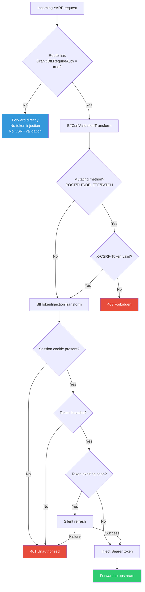
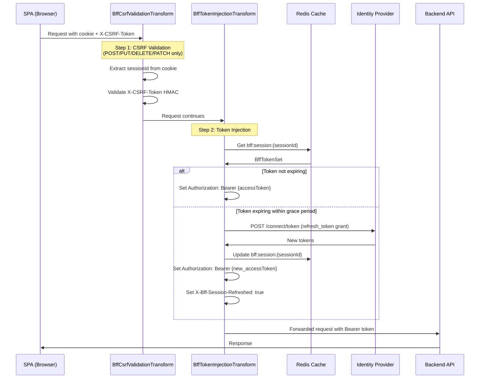
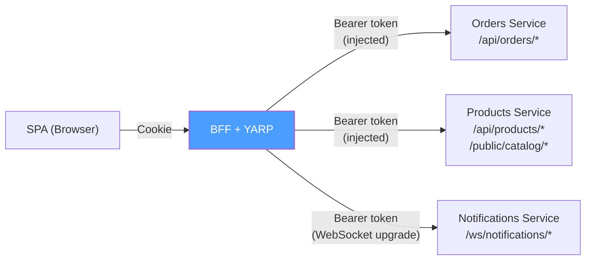

import { Tabs, TabItem, Badge, Aside } from "@astrojs/starlight/components";

## What is YARP?

[YARP](https://microsoft.github.io/reverse-proxy/) (Yet Another Reverse Proxy) is
Microsoft's open-source, high-performance reverse proxy library built on ASP.NET Core.
Granit.Bff uses YARP to proxy API calls from the SPA to backend services, injecting
Bearer tokens from the server-side session store.

Key YARP features used by Granit.Bff:

| Feature | How Granit.Bff uses it |
|---------|------------------------|
| **Request transforms** | `BffTokenInjectionTransform` and `BffCsrfValidationTransform` |
| **Configuration-based routing** | Routes and clusters from `appsettings.json` |
| **Route metadata** | `Granit.Bff.RequireAuth` to mark authenticated routes |
| **Streaming** | Large responses streamed without buffering |
| **WebSocket proxying** | Native WebSocket upgrade support |

## Route configuration

YARP routes are configured in the `ReverseProxy` section of `appsettings.json`.
Each route defines a URL pattern and maps it to a cluster (backend service).

### Basic setup

```json
{
  "ReverseProxy": {
    "Routes": {
      "api": {
        "ClusterId": "backend-api",
        "Match": {
          "Path": "/api/{**catch-all}"
        },
        "Metadata": {
          "Granit.Bff.RequireAuth": "true"
        }
      }
    },
    "Clusters": {
      "backend-api": {
        "Destinations": {
          "primary": {
            "Address": "https://api.example.com"
          }
        }
      }
    }
  }
}
```

### The `Granit.Bff.RequireAuth` metadata key

This metadata key controls which routes trigger the BFF security pipeline.
When set to `"true"`, the route activates both transforms:



### Public routes (no auth)

Routes without the `Granit.Bff.RequireAuth` metadata are forwarded without
any authentication. Use this for public endpoints:

```json
{
  "ReverseProxy": {
    "Routes": {
      "public-api": {
        "ClusterId": "backend-api",
        "Match": {
          "Path": "/public/{**catch-all}"
        }
      },
      "health": {
        "ClusterId": "backend-api",
        "Match": {
          "Path": "/health"
        }
      }
    }
  }
}
```

### Mixed routes (optional auth)

For routes where authentication is optional (e.g., a product listing that shows
different data for authenticated users), you can omit `Granit.Bff.RequireAuth`
and handle the `Authorization` header presence on the backend side:

```json
{
  "ReverseProxy": {
    "Routes": {
      "products": {
        "ClusterId": "backend-api",
        "Match": {
          "Path": "/api/products/{**catch-all}"
        }
      }
    }
  }
}
```

Without `RequireAuth`, the YARP transforms will not inject tokens. The request
is forwarded as-is, and the backend can check for the presence of an
`Authorization` header.

## Token injection pipeline

The `BffTokenInjectionTransform` is the core of the BFF proxy. It runs as a
YARP request transform on every route with `Granit.Bff.RequireAuth = true`.

### Transform chain



### Transform registration

Both transforms are registered in `AddGranitBffYarp()`:

```csharp
builder.Services
    .AddReverseProxy()
    .LoadFromConfig(builder.Configuration.GetSection("ReverseProxy"))
    .AddTransforms(context =>
    {
        // CSRF validation runs first (blocks 403 before token injection)
        context.RequestTransforms.Add(
            context.Services.GetRequiredService<BffCsrfValidationTransform>());

        // Token injection + silent refresh
        context.RequestTransforms.Add(
            context.Services.GetRequiredService<BffTokenInjectionTransform>());
    });
```

The order matters: **CSRF validation before token injection**. If the CSRF token
is invalid, the request is rejected with `403` before any token lookup or refresh
occurs. This prevents unnecessary cache reads and IdP calls.

## Multi-service routing

A single BFF can proxy to multiple backend services. Define multiple clusters
and route patterns:

```json
{
  "ReverseProxy": {
    "Routes": {
      "orders-api": {
        "ClusterId": "orders-service",
        "Match": {
          "Path": "/api/orders/{**catch-all}"
        },
        "Metadata": {
          "Granit.Bff.RequireAuth": "true"
        }
      },
      "products-api": {
        "ClusterId": "products-service",
        "Match": {
          "Path": "/api/products/{**catch-all}"
        },
        "Metadata": {
          "Granit.Bff.RequireAuth": "true"
        }
      },
      "notifications-ws": {
        "ClusterId": "notifications-service",
        "Match": {
          "Path": "/ws/notifications/{**catch-all}"
        },
        "Metadata": {
          "Granit.Bff.RequireAuth": "true"
        }
      },
      "public-catalog": {
        "ClusterId": "products-service",
        "Match": {
          "Path": "/public/catalog/{**catch-all}"
        }
      }
    },
    "Clusters": {
      "orders-service": {
        "Destinations": {
          "primary": {
            "Address": "https://orders.internal:5001"
          }
        }
      },
      "products-service": {
        "Destinations": {
          "primary": {
            "Address": "https://products.internal:5002"
          }
        }
      },
      "notifications-service": {
        "Destinations": {
          "primary": {
            "Address": "https://notifications.internal:5003"
          }
        }
      }
    }
  }
}
```



All routes share the same BFF session and token store. The access token is the same
regardless of which backend service is called — the identity provider issues a single
token, and the BFF injects it into all proxied requests.

<Aside type="tip" title="Per-service tokens">
If different backend services require different access tokens (e.g., different audiences
or scopes), you need multiple OIDC registrations and a custom `IBffTokenStore` that
stores tokens per audience. This is an advanced scenario not covered by the default
implementation.
</Aside>

## Load balancing

YARP supports multiple destinations per cluster for load balancing:

```json
{
  "Clusters": {
    "backend-api": {
      "LoadBalancingPolicy": "RoundRobin",
      "Destinations": {
        "instance-1": {
          "Address": "https://api-1.internal:5001"
        },
        "instance-2": {
          "Address": "https://api-2.internal:5001"
        },
        "instance-3": {
          "Address": "https://api-3.internal:5001"
        }
      }
    }
  }
}
```

Available policies: `FirstAlphabetical`, `RoundRobin`, `Random`, `LeastRequests`,
`PowerOfTwoChoices`.

## Path transformation

By default, YARP forwards the full path to the upstream. Use `Transforms` to
rewrite paths:

```json
{
  "Routes": {
    "api-v2": {
      "ClusterId": "backend-api",
      "Match": {
        "Path": "/api/v2/{**catch-all}"
      },
      "Transforms": [
        { "PathRemovePrefix": "/api/v2" },
        { "PathPrefix": "/api" }
      ],
      "Metadata": {
        "Granit.Bff.RequireAuth": "true"
      }
    }
  }
}
```

This transforms `/api/v2/products/123` into `/api/products/123` before forwarding.

## Header forwarding

By default, YARP forwards most request headers. The BFF transforms add or
override specific headers:

| Header | Set by | Value |
|--------|--------|-------|
| `Authorization` | `BffTokenInjectionTransform` | `Bearer {accessToken}` |
| `X-Bff-Session-Refreshed` | `BffTokenInjectionTransform` | `true` (only after refresh) |
| `X-Forwarded-For` | YARP (automatic) | Client IP |
| `X-Forwarded-Proto` | YARP (automatic) | `https` |
| `X-Forwarded-Host` | YARP (automatic) | Original `Host` header |

The `X-CSRF-Token` header is **consumed** by `BffCsrfValidationTransform` and
not forwarded to the upstream — the backend does not need to see it.

## Error handling

| Scenario | HTTP status | Source | SPA action |
|----------|-------------|--------|------------|
| No session cookie | `401` | `BffTokenInjectionTransform` | Redirect to `/bff/login` |
| Session expired in Redis | `401` | `BffTokenInjectionTransform` | Redirect to `/bff/login` |
| Token refresh failed | `401` | `BffTokenInjectionTransform` | Redirect to `/bff/login` |
| Missing CSRF token (mutating) | `403` | `BffCsrfValidationTransform` | Fetch new CSRF token |
| Invalid CSRF token | `403` | `BffCsrfValidationTransform` | Fetch new CSRF token |
| Upstream returned error | Pass-through | Backend API | Handle in SPA |

### SPA error handling pattern

```typescript
async function handleApiResponse(response: Response): Promise<Response> {
  if (response.status === 401) {
    // Session expired or invalid — re-authenticate
    window.location.href = "/bff/login";
    throw new Error("Session expired");
  }

  if (response.status === 403) {
    // CSRF token expired — fetch a new one and retry
    const csrfResponse = await fetch("/bff/csrf-token", {
      method: "POST",
      credentials: "include",
    });
    const { csrfToken } = await csrfResponse.json();
    // Store new token and retry the original request
    // ...
  }

  return response;
}
```

## Performance considerations

| Aspect | Impact | Mitigation |
|--------|--------|------------|
| Redis round-trip per request | ~0.5ms per `Get` | Redis connection pooling, local cache for hot sessions |
| Token refresh adds latency | ~100-500ms (IdP round-trip) | Proactive refresh via `RefreshGracePeriod` (default 1 min before expiry) |
| CSRF HMAC computation | ~0.01ms | CPU-only, no I/O |
| YARP streaming | Negligible overhead | Zero-copy buffering, kernel-level optimization |

The BFF adds minimal latency to proxied requests. The primary overhead is the
Redis lookup (~0.5ms per request), which is typically negligible compared to
backend processing time.

## Next steps

- **[Configuration](/dotnet/security/bff/configuration/)** — full options reference, metrics, and tracing
- **[Security](/dotnet/security/bff/token-security/)** — cookie hardening and session management deep dive
- **[Architecture](/dotnet/security/bff/architecture/)** — review all flow diagrams
