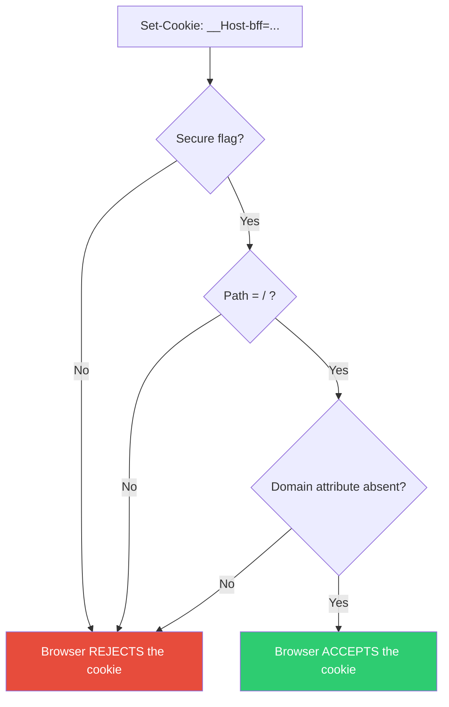
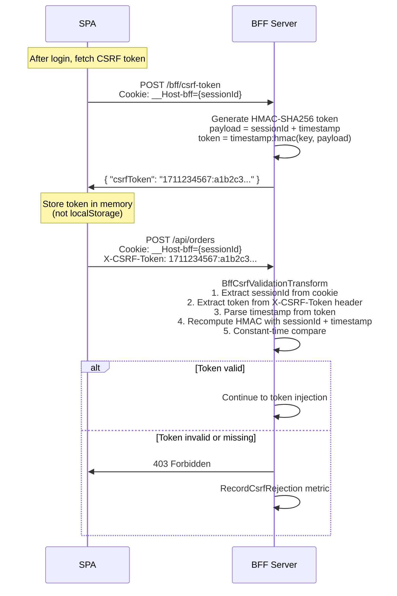
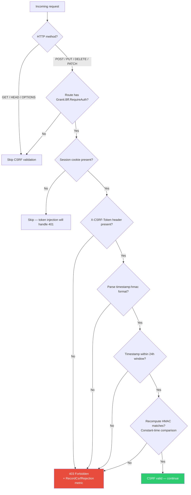
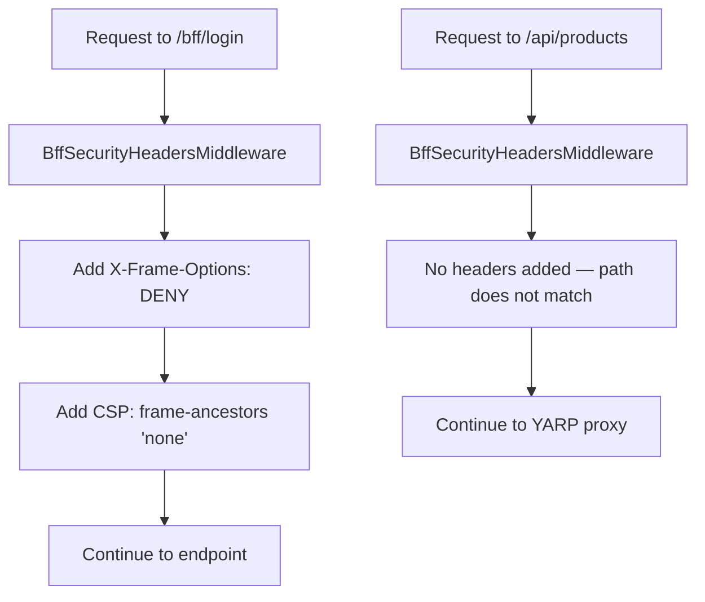
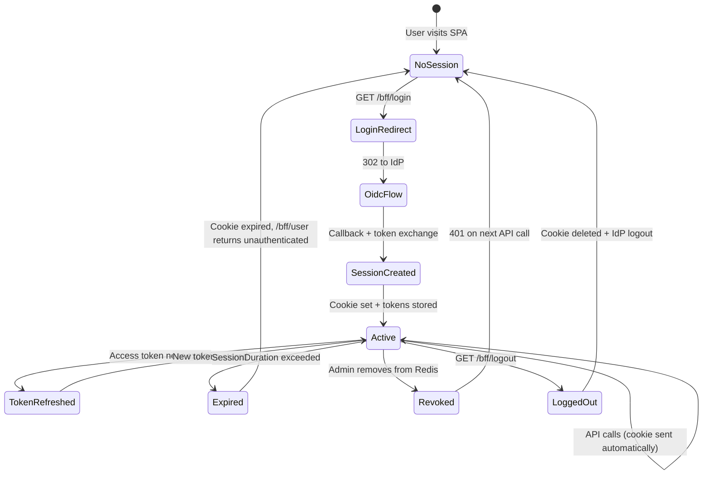

import { Tabs, TabItem, Badge, Aside } from "@astrojs/starlight/components";

The BFF pattern is only as secure as its implementation. This page covers every
security mechanism in Granit.Bff and how each one mitigates specific attack vectors.

## Cookie security

The session cookie is the only credential visible to the browser. Its configuration
is critical for security.

### Cookie attributes

```http
Set-Cookie: __Host-bff=a1b2c3d4e5f6...;
            HttpOnly;
            Secure;
            SameSite=Strict;
            Path=/;
            Max-Age=28800
```

| Attribute | Value | Purpose |
|-----------|-------|---------|
| **Name** | `__Host-bff` | `__Host-` prefix enforces Secure + Path=/ + no Domain |
| **HttpOnly** | `true` | JavaScript cannot read the cookie (XSS-safe) |
| **Secure** | `true` | Cookie only sent over HTTPS |
| **SameSite** | `Strict` | Cookie never sent on cross-site requests (CSRF-safe) |
| **Path** | `/` | Available on all paths (required by `__Host-` prefix) |
| **Max-Age** | `28800` (8h default) | Matches `SessionDuration` configuration |
| **IsEssential** | `true` | Sent even when user declines non-essential cookies |

### The `__Host-` prefix

The `__Host-` cookie prefix is a browser-enforced security mechanism
([RFC 6265bis](https://datatracker.ietf.org/doc/html/draft-ietf-httpbis-rfc6265bis)).
When a cookie name starts with `__Host-`, the browser **rejects** it unless all of
these conditions are met:



This prevents:

- **Cookie injection via HTTP** — the `Secure` flag is mandatory
- **Subdomain cookie sharing** — no `Domain` attribute means the cookie is
  strictly bound to the exact host
- **Path-scoped attacks** — `Path=/` is mandatory, preventing path-based isolation bypass

### Why `SameSite=Strict` and not `Lax`

`SameSite=Strict` means the cookie is **never** sent on cross-site navigations,
even top-level ones. This provides the strongest CSRF protection because an attacker
cannot trick the browser into sending the cookie from a different origin.

The OIDC redirect flow works because:

1. The user navigates to `/bff/login` (same-site) which returns a 302 to the IdP
2. The IdP redirects back to `/bff/callback` (same-site navigation from the user's perspective)
3. The browser includes the cookie because the final request is same-site

<Aside type="note" title="SameSite=Strict and OAuth redirects">
Some guides recommend `SameSite=Lax` for OAuth because the callback is a cross-site
redirect from the IdP. This is unnecessary for Granit.Bff because the session cookie
is **set** during the callback (not read from a prior visit). The cookie does not
need to exist before the callback — it is created fresh after successful authentication.
</Aside>

### Cookie vs token comparison

| Attack | Cookie (`__Host-`, HttpOnly, Strict) | Token in `localStorage` |
|--------|--------------------------------------|-------------------------|
| **XSS reads credential** | Impossible (HttpOnly) | Token stolen |
| **XSS exfiltrates credential** | Impossible | `fetch()` to attacker server |
| **CSRF** | Blocked (SameSite=Strict) | N/A (no cookies) |
| **Man-in-the-middle** | Blocked (Secure, HTTPS only) | Depends on app |
| **Subdomain takeover** | Blocked (`__Host-` prefix) | N/A |

## CSRF protection

Even with `SameSite=Strict`, Granit.Bff implements a second layer of CSRF
protection using the **double-submit** pattern. This provides defense-in-depth
and protects against browser bugs or policy misconfigurations.

### How the double-submit pattern works



### HMAC-SHA256 token format

The CSRF token format is `{timestamp}:{hmac-hex}`:

```text
1711234567:a1b2c3d4e5f6789012345678901234567890abcdef1234567890abcdef12
```

| Part | Description |
|------|-------------|
| `timestamp` | Unix epoch seconds when the token was generated |
| `hmac-hex` | HMAC-SHA256 of `{sessionId}:{timestamp}` using a server-side key |

The HMAC key is:

- **32 random bytes** generated at application startup
- **Per-instance** — each BFF server instance has its own key
- **In-memory only** — never persisted, never exposed

### Validation rules

The `BffCsrfValidationTransform` applies these checks in order:



### Security properties

| Property | Implementation |
|----------|---------------|
| **Session binding** | HMAC payload includes `sessionId` — token is useless for other sessions |
| **Timestamp freshness** | 24-hour sliding window prevents token reuse after key rotation |
| **Tamper resistance** | HMAC-SHA256 — attacker cannot forge without the server key |
| **Timing attack resistance** | `CryptographicOperations.FixedTimeEquals()` for constant-time comparison |
| **No database lookups** | Validation is purely computational — zero I/O |

<Aside type="tip" title="CSRF token lifecycle">
The CSRF token is valid for 24 hours and is bound to the session. Best practice
is to fetch it once after login and store it in a JavaScript variable (not
`localStorage`). If the SPA is a long-running app, refresh it periodically by
calling `POST /bff/csrf-token` again.
</Aside>

## Clickjacking protection

The `BffSecurityHeadersMiddleware` adds anti-framing headers on login and callback
endpoints to prevent clickjacking attacks:

```http
X-Frame-Options: DENY
Content-Security-Policy: frame-ancestors 'none'
```

These headers are added on any request matching:

- `/bff/login*`
- `/bff/callback*`



This prevents an attacker from embedding the login page in a hidden iframe
and tricking users into entering credentials.

## Token storage

### Cache key format

Tokens are stored in `IDistributedCache` with the key format:

```text
bff:session:{sessionId}
```

Where `sessionId` is a GUID without dashes (32 hex characters), generated by
`Guid.NewGuid().ToString("N")`.

PKCE state is stored separately with:

```text
bff:pkce:{state}
```

Where `state` is a base64-encoded random value (32 bytes). This entry has a
10-minute TTL and is consumed (get + delete) during the callback.

### Serialization format

The `BffTokenSet` record is serialized as JSON with `camelCase` naming:

```json
{
  "accessToken": "<encrypted-jwt-access-token>",
  "refreshToken": "<encrypted-refresh-token>",
  "idToken": "<encrypted-jwt-id-token>",
  "expiresAt": "2026-03-22T19:30:00+00:00"
}
```

### Encryption at rest

The default `DistributedCacheBffTokenStore` stores tokens as plain JSON in the
distributed cache. For production deployments handling sensitive data, you have
two options for encryption at rest:

<Tabs>
<TabItem label="Redis TLS (recommended)">

Enable TLS on the Redis connection to encrypt data in transit and at rest
(if Redis persistence is enabled):

```json
{
  "ConnectionStrings": {
    "Redis": "redis.example.com:6380,ssl=true,password=...,abortConnect=false"
  }
}
```

This protects against network sniffing and disk access to Redis RDB/AOF files.

</TabItem>
<TabItem label="Application-level encryption">

For additional protection, replace the default `IBffTokenStore` with a custom
implementation that uses `ICacheValueEncryptor` from `Granit.Caching`:

```csharp
internal sealed class EncryptedBffTokenStore(
    IDistributedCache cache,
    ICacheValueEncryptor encryptor,
    IOptions<GranitBffOptions> options,
    IClock clock) : IBffTokenStore
{
    private const string KeyPrefix = "bff:session:";

    public async Task StoreAsync(
        string sessionId,
        BffTokenSet tokens,
        CancellationToken cancellationToken = default)
    {
        byte[] json = JsonSerializer.SerializeToUtf8Bytes(tokens);
        byte[] encrypted = encryptor.Encrypt(json); // AES-256-GCM

        await cache.SetAsync(
            $"{KeyPrefix}{sessionId}",
            encrypted,
            new DistributedCacheEntryOptions
            {
                AbsoluteExpiration = clock.Now.Add(options.Value.SessionDuration),
            },
            cancellationToken).ConfigureAwait(false);
    }

    public async Task<BffTokenSet?> GetAsync(
        string sessionId,
        CancellationToken cancellationToken = default)
    {
        byte[]? encrypted = await cache.GetAsync(
            $"{KeyPrefix}{sessionId}",
            cancellationToken).ConfigureAwait(false);

        if (encrypted is null or { Length: 0 }) return null;

        byte[] json = encryptor.Decrypt(encrypted);
        return JsonSerializer.Deserialize<BffTokenSet>(json);
    }

    // RemoveAsync remains unchanged
}
```

Register it in DI to replace the default:

```csharp
services.AddScoped<IBffTokenStore, EncryptedBffTokenStore>();
```

With `Granit.Caching`, the `AesCacheValueEncryptor` uses AES-256-GCM with a
random nonce per encryption call and a 128-bit authentication tag for tamper detection.
The key is configured via `CacheEncryptionOptions.Key` (sourced from Vault in production).

</TabItem>
</Tabs>

## Session management

### Session lifecycle



### Session duration

| Property | Default | Description |
|----------|---------|-------------|
| `SessionDuration` | 8 hours | Absolute expiry — after this, the user must re-authenticate |
| `RefreshGracePeriod` | 1 minute | Token is refreshed this long before it expires |
| Cookie `Max-Age` | Matches `SessionDuration` | Browser deletes the cookie when it expires |
| Cache entry TTL | Matches `SessionDuration` | Redis auto-evicts the session data |

### Sliding expiration (default)

Granit.Bff uses **sliding expiration** by default (`UseSessionSlidingExpiration: true`).
When a proxied request occurs past the session's halfway point, the token store TTL
is extended by `SessionDuration`. This prevents active users from being logged out
mid-work.

To prevent indefinite sessions (ISO 27001 A.9.4.2), a hard ceiling is enforced via
`SessionAbsoluteMaxDuration` (default: 8 hours). Once reached, the user must
re-authenticate regardless of activity.

Set `UseSessionSlidingExpiration: false` to revert to absolute-only expiration where
the session duration starts at login and is never extended.

### Session revocation

Sessions can be revoked in three ways:

1. **User self-service** -- the BFF exposes session management endpoints per frontend:
   - `GET /{prefix}/bff/sessions` -- list active sessions (masked IDs, timestamps, user agents)
   - `DELETE /{prefix}/bff/sessions/{id}` -- revoke a specific session ("log out that device")
   - `DELETE /{prefix}/bff/sessions` -- revoke all other sessions ("log out everywhere else")

2. **Back-channel logout** -- when the IdP sends a `logout_token` to
   `/{prefix}/bff/backchannel-logout`, all sessions for that subject are removed.

3. **Direct cache removal** -- for admin operations:

```csharp
await cache.RemoveAsync($"bff:session:{sessionId}", cancellationToken);
```

All three methods are immediate -- the next API call from the SPA receives
`401 Unauthorized` and the SPA's `401` handler redirects to `/bff/login`.

## Attack mitigation summary

| Attack | Mitigation | Granit.Bff mechanism |
|--------|------------|---------------------|
| **XSS token theft** | Tokens never in browser | Server-side storage, `HttpOnly` cookie |
| **XSS cookie theft** | `HttpOnly` flag | `CookieOptions.HttpOnly = true` |
| **CSRF** | `SameSite=Strict` + double-submit | Cookie config + `BffCsrfValidationTransform` |
| **Session fixation** | Fresh session ID on login | `Guid.NewGuid()` after token exchange |
| **Session hijacking** | `__Host-` prefix + `Secure` | Cookie only sent over HTTPS, no subdomain sharing |
| **Token replay** | Short-lived access tokens | IdP-configured expiry + auto-refresh + DPoP |
| **Token leakage after logout** | Token revocation (RFC 7009) | `RevokeTokensAsync` on `/bff/logout` |
| **IdP session revocation** | Back-channel logout (OIDC) | `/{prefix}/bff/backchannel-logout` endpoint |
| **Clickjacking** | X-Frame-Options + CSP | `BffSecurityHeadersMiddleware` |
| **Authorization code interception** | PKCE | `code_challenge` + `code_verifier` |
| **Token storage compromise** | Redis TLS + optional AES encryption | `DistributedCacheBffTokenStore` + `ICacheValueEncryptor` |
| **CSRF token forgery** | HMAC-SHA256 with server key | `HmacBffCsrfTokenGenerator` |
| **Timing attacks on CSRF** | Constant-time comparison | `CryptographicOperations.FixedTimeEquals()` |
| **Stale sessions** | Absolute expiry | `SessionDuration` TTL on cache + cookie |

## Compliance notes

### ISO 27001

- **A.9.4.2 — Secure log-on**: PKCE + confidential client, no tokens in browser
- **A.9.4.3 — Password management**: delegated to IdP, BFF does not handle passwords
- **A.14.1.2 — Securing application services**: TLS mandatory (`__Host-` prefix enforces it)
- **A.14.1.3 — Protecting application transactions**: CSRF double-submit on all mutations

### GDPR

- **Data minimization**: only `sub`, `name`, `email`, `roles`, `tenantId` exposed to SPA
- **Storage limitation**: session data auto-expires (configurable, default 8h)
- **Right to erasure**: session revocation = immediate data deletion from Redis

## Next steps

- **[Architecture](/dotnet/security/bff/architecture/)** — review the full flow diagrams
- **[YARP Proxy](/dotnet/security/bff/reverse-proxy-yarp/)** — route configuration and token injection pipeline
- **[Configuration](/dotnet/security/bff/configuration/)** — full options reference
