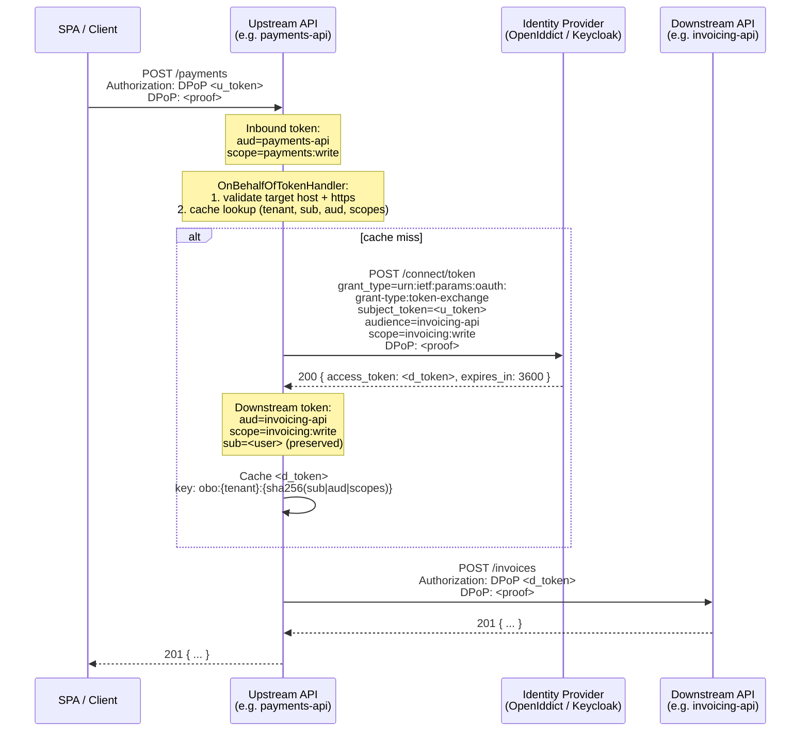

import { Tabs, TabItem, Aside } from "@astrojs/starlight/components";

## Why this page exists

A Granit API often needs to call another API — an invoicing backend, a document
generator, a third-party partner. That downstream service enforces its own
authorization, and the question becomes: **whose identity does the outbound
call carry?**

Three answers live in Granit, in decreasing order of subtlety:

1. **Client Credentials + DPoP** — the caller service authenticates as itself,
   with no user context. Right for machine-to-machine work.
2. **On-Behalf-Of (RFC 8693 Token Exchange) + DPoP** — the caller service acts
   on behalf of an inbound user, with a token whose audience and scope are
   narrowed to the downstream service. Right for user-initiated chains.
3. **~~Naive bearer-token propagation~~** — forward the caller's inbound
   `Authorization: Bearer …` as-is. Granit **does not offer this**: it is a
   confused-deputy vulnerability (OAuth 2.0 Security BCP §4.8 — RFC 8725).
   [`AddAuthTokenPropagation` was removed](#anti-pattern-naive-bearer-propagation).

## Pattern decision matrix

| Scenario | Pattern | API |
|----------|---------|-----|
| Background job, scheduled task, webhook processor calling another Granit service | Client Credentials + DPoP | `AddClientCredentialsHttpClient` |
| User-initiated HTTP handler that fans out to a downstream API | On-Behalf-Of (RFC 8693) + DPoP | `AddOnBehalfOfHttpClient` |
| SPA → BFF → backend API (user tokens never leave the server) | BFF token injection | `Granit.Bff.Yarp` transform |
| "Just forward the token I received" | **No** — rewrite using one of the three above | — |

---

## Client Credentials + DPoP

Use when the calling service has no ambient user — a scheduled job, a
background worker, an event consumer, a webhook receiver.

```csharp
builder.Services
    .AddGranitHttpClient("PaymentsGateway")
    .AddClientCredentialsHttpClient("PaymentsGateway", opts =>
    {
        opts.Authority    = "https://idp.example.com";
        opts.ClientId     = "billing-worker";
        opts.ClientSecret = builder.Configuration["Billing:Secret"]; // Vault
        opts.Scope        = "payments:write";
        opts.UseDPoP      = true;
    });
```

The handler acquires an access token via `grant_type=client_credentials`,
caches it for `expires_in − DefaultCacheMargin`, and attaches it to every
outbound request. DPoP proofs are generated per request from a per-process
EC P-256 key pair. Full reference: [Token Management](/dotnet/security/token-management/).

---

## On-Behalf-Of (RFC 8693 Token Exchange) + DPoP

Use when an HTTP handler receives a user's access token and must call a
downstream API **as that user**. The handler exchanges the inbound token at
the identity provider for a new token whose `aud` claim is bound to the
downstream service. This is the only safe way to propagate user identity
across a service boundary.

### Sequence



### Minimum viable configuration

```csharp
builder.Services
    .AddGranitHttpClient("InvoicingApi")
    .AddOnBehalfOfHttpClient("InvoicingApi", opts =>
    {
        opts.Authority     = "https://idp.example.com";
        opts.ClientId      = "payments-service";
        opts.ClientSecret  = builder.Configuration["Obo:Secret"]; // Vault
        opts.Audience      = "invoicing-api";         // hard-narrows `aud`
        opts.Scopes        = ["invoicing:write"];     // least-privilege
        opts.AllowedHosts  = ["invoicing.internal"];  // SSRF guard
        // opts.RequireDPoP and opts.RequireHttps are true by default.
    });
```

### Options

| Option | Default | Purpose |
|--------|---------|---------|
| `Authority` | — *(required)* | Base URL of the identity provider |
| `ClientId` | — *(required)* | OAuth client id of THIS service (not the caller) |
| `ClientSecret` / `ClientSigningKeyJwk` | — *(one required)* | Auth at the token endpoint |
| `Audience` | — *(required)* | Downstream API's `aud` value — **mandatory** |
| `Scopes` | `[]` | Downstream scopes — narrow to least-privilege |
| `AllowedHosts` | — *(required, min 1)* | Exact-match host allow-list for outbound targets |
| `RequireDPoP` | `true` | Binds the exchanged token to a per-process proof key |
| `RequireHttps` | `true` | Rejects `http://` targets even if allow-listed |
| `TokenLifetimeSafetyMargin` | 30 s | Subtracted from `expires_in` in the cache TTL |

### Fail-closed vs fail-open

The handler's failure modes are asymmetric on purpose:

| Failure | Behavior | Reasoning |
|---------|----------|-----------|
| No ambient `HttpContext` (background job) | Request sent **unauthenticated** + `Warning` log | There is no user to act on behalf of; silently forwarding nothing is safer than silently forwarding client-credentials |
| Outbound host not in `AllowedHosts` | Request sent **unauthenticated** + `Warning` log | Defense in depth against SSRF / attacker-influenced URLs |
| Outbound target is `http://` and `RequireHttps = true` | Request sent **unauthenticated** + `Warning` log | Tokens must never cross a plaintext channel |
| IdP refuses the exchange (`invalid_grant`, `access_denied`, etc.) | Request sent **unauthenticated** | **Never** fall back to naive bearer propagation — the downstream returns a clean 401 instead |
| Distributed cache (Redis) unavailable | Call the IdP, continue without caching | **Fail-open** on cache outage — availability beats a cache hit |
| Token endpoint returns `401 use_dpop_nonce` with a fresh nonce | Re-sign the request with the new nonce and retry once | Per RFC 9449 §8 nonce handshake |

<Aside type="caution" title="The cache key is tenant-scoped">
The exchanged token is cached by `(tenant, caller_sub, audience, scopes)`.
Two tenants with the same subject identifier get **different** cache keys —
without that segment, a tenant-A request could be served a token minted for
tenant B. In a multi-tenant deployment this is non-negotiable.
</Aside>

### Observability

Both handlers emit metrics through `TokenManagementMetrics`:

| Metric | Tags | Meaning |
|--------|------|---------|
| `granit.oidc.token.request` | `tenant_id`, `grant_type`, `client_id` | Token endpoint calls (includes token-exchange grants) |
| `granit.oidc.token.cache.hit` | `tenant_id`, `client_name` | Cached-token reuse |
| `granit.oidc.token.cache.miss` | `tenant_id`, `client_name` | Forced IdP round-trip |
| `granit.oidc.token.error` | `tenant_id`, `error` | Any token endpoint refusal |

Warning-level log lines to alert on:

- `OBO[{ClientName}]: rejected token attachment — {Reason}` — a request went
  out unauthenticated. Frequent occurrences indicate misconfiguration or an
  attack probe.
- `OBO[{ClientName}]: cache operation GetAsync failed` — distributed cache
  degraded; user traffic is still served but with higher IdP load.

### Identity provider requirements

The identity provider must support RFC 8693 and recognise the calling service
as a client permitted to request token-exchange grants for the target
audience.

<Tabs>
<TabItem label="OpenIddict">

```csharp
options.RegisterScopes("invoicing:write");
options.SetTokenEndpointUris("/connect/token");

options.UseReferenceAccessTokens(); // or signed JWTs

// Grant the calling service permission to exchange tokens for this audience.
await manager.CreateAsync(new OpenIddictApplicationDescriptor
{
    ClientId     = "payments-service",
    ClientSecret = secret,
    Permissions  =
    {
        Permissions.Endpoints.Token,
        Permissions.GrantTypes.TokenExchange,  // urn:ietf:params:oauth:grant-type:token-exchange
        Permissions.Scopes.Prefixes.Scope + "invoicing:write",
    },
});
```

</TabItem>
<TabItem label="Keycloak">

In the Keycloak admin console for the calling client (`payments-service`):

1. **Capability config** — enable *Service accounts roles* and *OAuth 2.0
   Device Authorization Grant* is **not** needed.
2. **Client scopes** — add `invoicing:write`.
3. **Permissions** (Authorization tab) — create a scope-based permission
   that allows the client to request audience `invoicing-api`.
4. **Realm settings → Tokens** — enable *Token Exchange* (preview feature
   until Keycloak 26). Pin the realm's `token-exchange` feature flag in
   production.

</TabItem>
</Tabs>

---

## Anti-pattern: naive bearer propagation

Before the VULN-100 fix, `Granit.Http.Resilience` shipped
`AddAuthTokenPropagation()` — a `DelegatingHandler` that copied the inbound
`Authorization` header verbatim onto every outbound request. **This extension
has been removed.**

### Why it was unsafe

The inbound bearer token is issued with a specific `aud` claim (the upstream
API) and a specific scope set (what the user agreed to). Forwarding it to a
downstream service creates multiple failure modes:

- **Confused deputy.** If any downstream URL is derived from user input
  (avatar proxy, webhook dispatcher, partner hop), the handler forwards the
  caller's token to an attacker-chosen host. The attacker captures a full
  upstream-valid token and replays it against the real upstream API.
- **Over-privileged downstream.** The downstream service sees a token whose
  `aud` is the *upstream* service, not itself. Proper validation would reject
  it; weak validation (audience check missing) would mistakenly accept it,
  and the token's full scope set is honoured regardless of what the
  downstream actually needed.
- **No revocation horizon.** A stolen bearer token is valid until expiry and
  can be replayed from any network location. DPoP plus a narrowed audience
  (the On-Behalf-Of pattern) both close this gap.

### Migration

Every `AddGranitHttpClient(...).AddAuthTokenPropagation()` call site must
become `AddOnBehalfOfHttpClient(...)` with an explicit audience, allow-list,
and client authentication. The resulting token is narrowed to the downstream
service and bound to a per-process DPoP key. See [Minimum viable
configuration](#minimum-viable-configuration).

If the calling context has no ambient user (a background job), the correct
replacement is `AddClientCredentialsHttpClient(...)` instead — the service
acts as itself, not on behalf of a user.

## Security properties at a glance

| Property | Client Credentials + DPoP | On-Behalf-Of + DPoP | Naive propagation *(removed)* |
|----------|:-:|:-:|:-:|
| Downstream `aud` scoped to target | ✓ | ✓ | ✗ — carries upstream `aud` |
| Scope narrowed to downstream needs | ✓ | ✓ | ✗ — full upstream scopes |
| Sender-constrained (DPoP) | ✓ | ✓ | ✗ |
| Downstream sees user identity | ✗ *(service identity only)* | ✓ `sub` preserved | ✓ *(but at high cost)* |
| Host allow-list enforced | N/A *(client-level policy)* | ✓ | ✗ |
| Fail-closed on IdP refusal | ✓ | ✓ | N/A — always sent |

## Testing

Both `ClientCredentialsTokenHandler` and `OnBehalfOfTokenHandler` are
exercised with NSubstitute + xUnit v3 + Shouldly. Minimal fixture:

```csharp
public sealed class MyHandlerTests
{
    private readonly ITokenEndpointService _endpoint = Substitute.For<ITokenEndpointService>();
    private readonly IConditionalCache _cache = Substitute.For<IConditionalCache>();

    [Fact]
    public async Task NoHttpContext_SendsUnauthenticated()
    {
        // ambient HttpContextAccessor returns null → fail-closed, no Authorization header
    }
}
```

Look at
[`OnBehalfOfTokenHandlerTests`](https://github.com/granit-fx/granit-dotnet/blob/develop/tests/Granit.Oidc.TokenManagement.Tests/Handlers/OnBehalfOfTokenHandlerTests.cs)
for the full set — 9 scenarios covering fail-closed paths, cache hit/miss,
and the tenant-key partitioning invariant.

## Standards

| Standard | Scope |
|----------|-------|
| [RFC 8693](https://datatracker.ietf.org/doc/html/rfc8693) | OAuth 2.0 Token Exchange |
| [RFC 9449](https://datatracker.ietf.org/doc/html/rfc9449) | OAuth 2.0 Demonstrating Proof-of-Possession (DPoP) |
| [RFC 8725](https://datatracker.ietf.org/doc/html/rfc8725) §4.8 | JWT Best Current Practices — audience constraints |
| [RFC 8707](https://datatracker.ietf.org/doc/html/rfc8707) | Resource Indicators (optional `resource` parameter) |
| OWASP ASVS V13.2 | OAuth and OIDC controls |
| OWASP API Security Top 10 (2023) — API2 | Broken Authentication |

## See also

- [Token Management](/dotnet/security/token-management/) — client-credentials
  caching, DPoP, token revocation.
- [Authentication — Keycloak, EntraID & JWT](/dotnet/security/authentication/)
  — provider-specific claim handling and back-channel logout.
- [BFF — Architecture](/dotnet/security/bff/architecture/) — the alternative
  pattern when the calling "service" is a browser SPA.
