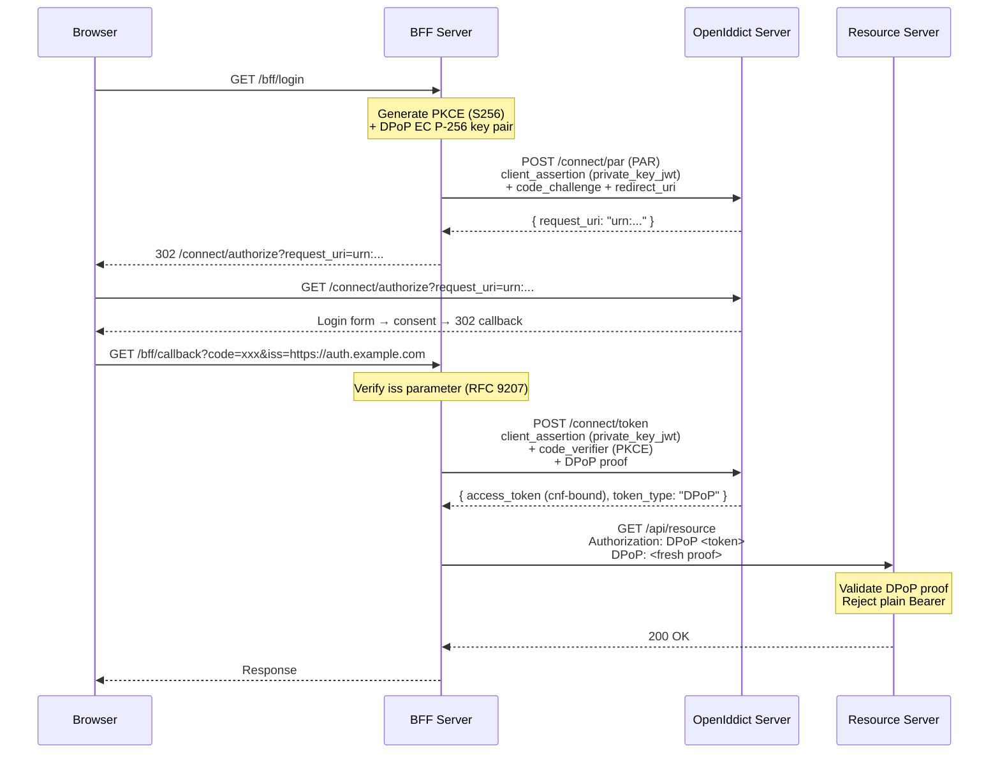

import { Tabs, TabItem, Aside, Steps } from "@astrojs/starlight/components";

The [FAPI 2.0 Security Profile](https://openid.net/specs/fapi-2_0-security-profile.html)
is a set of mandatory security constraints designed for high-risk APIs — Open Banking
(PSD2), healthcare data exchange, government identity, and any scenario where token
theft or parameter tampering would have severe consequences.

Granit implements every FAPI 2.0 requirement across its OpenIddict server, BFF proxy,
and resource server validation layers. Enable the full profile with a single flag or
configure each mechanism individually.

## Why FAPI 2.0 matters

Standard OAuth 2.0 flows are vulnerable to several classes of attacks that FAPI 2.0
explicitly addresses:

| Attack | Impact | FAPI 2.0 mitigation |
|--------|--------|---------------------|
| Authorization code interception | Attacker exchanges stolen code for tokens | PKCE with S256 (RFC 7636) |
| Authorization parameter tampering | Attacker modifies scopes, redirect URI in browser URL | PAR (RFC 9126) — parameters sent via back-channel |
| Token replay / theft | Stolen access token used from another device | DPoP (RFC 9449) — tokens bound to client key |
| Client credential leakage | Shared secret logged by proxy or WAF | `private_key_jwt` (RFC 7523) — no secret on the wire |
| IdP mix-up attack | Client tricked into sending code to wrong issuer | Issuer verification (RFC 9207) |
| Authorization code replay | Stolen code reused after a long window | Short-lived authorization codes (60 seconds) |

## Requirement mapping

The following table maps each FAPI 2.0 requirement to its Granit implementation:

| FAPI 2.0 requirement | RFC | Granit feature | Layer |
|-----------------------|-----|----------------|-------|
| PKCE with S256 | RFC 7636 | `RequireProofKeyForCodeExchange()` (default) | OpenIddict server |
| Pushed Authorization Requests | RFC 9126 | `RequirePar: true` | OpenIddict server |
| Sender-constrained access tokens | RFC 9449 | `UseDPoP: true` on BFF frontend | BFF + OpenIddict server |
| DPoP enforcement on resource servers | RFC 9449 | `RequireDPoP: true` | Resource server |
| `private_key_jwt` or mTLS client auth | RFC 7523 | `ClientAuthenticationMethod: PrivateKeyJwt` | BFF frontend |
| Authorization response issuer verification | RFC 9207 | `RequireIssuerValidation: true` (default) | BFF |
| Short-lived authorization codes | FAPI 2.0 SS5.3.2.1 | 60-second lifetime (auto-applied) | OpenIddict server |

## Quick start

Enable the full FAPI 2.0 profile on the OpenIddict server with a single option:

```json title="appsettings.json"
{
  "OpenIddict": {
    "EnableFapi2Profile": true
  }
}
```

This single flag enforces all server-side FAPI 2.0 constraints:

- `RequirePar` is set to `true` (PAR mandatory for all authorization code flows)
- Authorization code lifetime is reduced to 60 seconds
- PKCE with S256 remains enforced (already the default)

<Aside type="caution" title="BFF and resource server configuration required">
`EnableFapi2Profile` only configures the **OpenIddict server**. You must also
configure DPoP, `private_key_jwt`, and issuer verification on the BFF and
resource server sides. See the full configuration example below.
</Aside>

## Full configuration example

A complete FAPI 2.0-compliant deployment requires configuration across three layers:

<Tabs>
<TabItem label="OpenIddict Server">

```json title="appsettings.json (identity server)"
{
  "OpenIddict": {
    "Issuer": "https://auth.example.com",
    "EnableFapi2Profile": true,

    "Seeding": {
      "Applications": [
        {
          "ClientId": "my-bff",
          "ClientSecret": null,
          "DisplayName": "My BFF (FAPI 2.0)",
          "SigningKeyJwk": "{\"kty\":\"EC\",\"crv\":\"P-256\",\"x\":\"...\",\"y\":\"...\"}",
          "Permissions": [
            "ept:token", "ept:authorization", "ept:pushed_authorization", "ept:logout",
            "gt:authorization_code", "gt:refresh_token", "rst:code",
            "scp:openid", "scp:profile", "scp:email", "scp:roles", "scp:offline_access"
          ],
          "RedirectUris": ["https://app.example.com/bff/callback"],
          "PostLogoutRedirectUris": ["https://app.example.com/"]
        }
      ]
    }
  }
}
```

</TabItem>
<TabItem label="BFF Proxy">

```json title="appsettings.json (BFF)"
{
  "Bff": {
    "Authority": "https://auth.example.com",
    "RequireIssuerValidation": true,

    "Frontends": [
      {
        "Name": "admin",
        "ClientId": "my-bff",
        "ClientAuthenticationMethod": "PrivateKeyJwt",
        "ClientSigningKeyJwk": "{\"kty\":\"EC\",\"crv\":\"P-256\",\"x\":\"...\",\"y\":\"...\",\"d\":\"...\"}",
        "UsePushedAuthorizationRequests": true,
        "UseDPoP": true,
        "Scopes": ["openid", "profile", "email", "roles", "offline_access"]
      }
    ]
  }
}
```

</TabItem>
<TabItem label="Resource Server">

```json title="appsettings.json (API)"
{
  "Authentication": {
    "OpenIddict": {
      "Issuer": "https://auth.example.com",
      "Audience": "my-api",
      "RequireDPoP": true
    }
  }
}
```

</TabItem>
</Tabs>

<Aside type="caution" title="Private keys in production">
Never store `ClientSigningKeyJwk` in `appsettings.json` for production. The
private key must come from [Granit.Vault](/dotnet/data/vault/)
or an environment variable:

```bash
export Bff__Frontends__0__ClientSigningKeyJwk='{"kty":"EC","crv":"P-256",...,"d":"..."}'
```

</Aside>

## Compliance checklist

| Requirement | RFC | Status | Configuration |
|-------------|-----|--------|---------------|
| PKCE with S256 | [RFC 7636](https://www.rfc-editor.org/rfc/rfc7636) | Enforced by default | `RequireProofKeyForCodeExchange()` — always on |
| Pushed Authorization Requests | [RFC 9126](https://www.rfc-editor.org/rfc/rfc9126) | Opt-in | `OpenIddict.EnableFapi2Profile: true` or `OpenIddict.RequirePar: true` |
| DPoP sender-constrained tokens | [RFC 9449](https://www.rfc-editor.org/rfc/rfc9449) | Opt-in | `Bff.Frontends[].UseDPoP: true` |
| DPoP enforcement (resource server) | [RFC 9449](https://www.rfc-editor.org/rfc/rfc9449) | Opt-in | `Authentication.OpenIddict.RequireDPoP: true` |
| `private_key_jwt` client auth | [RFC 7523](https://www.rfc-editor.org/rfc/rfc7523) | Opt-in | `Bff.Frontends[].ClientAuthenticationMethod: PrivateKeyJwt` |
| Issuer verification | [RFC 9207](https://www.rfc-editor.org/rfc/rfc9207) | Enabled by default | `Bff.RequireIssuerValidation: true` (default) |
| Short-lived authorization codes | FAPI 2.0 SS5.3.2.1 | Auto-applied | 60-second lifetime when `EnableFapi2Profile: true` |
| Confidential client only | FAPI 2.0 SS5.3.1 | Enforced by BFF | Public clients (SPAs) are never exposed — tokens stay server-side |

## How the mechanisms work together



## See also

- [Pushed Authorization Requests (PAR)](/dotnet/security/openiddict/advanced/pushed-authorization-requests/) — move authorization parameters to back-channel
- [DPoP (Proof-of-Possession)](/dotnet/security/openiddict/advanced/proof-of-possession-dpop/) — bind tokens to cryptographic keys
- [Private Key JWT Authentication](/dotnet/security/openiddict/advanced/private-key-jwt-authentication/) — eliminate shared secrets
- [OIDC Server Configuration](/dotnet/security/openiddict/openid-connect-server/) — endpoints and flows overview
- [BFF Configuration](/dotnet/security/bff/configuration/) — global and frontend options reference
- [DPoP Resource Server Validation](/dotnet/security/openiddict/advanced/dpop-resource-server-validation/) — validate DPoP proofs on any IdP (Keycloak, Entra ID, Auth0)
- [Authentication](/dotnet/security/authentication/) — DPoP enforcement on resource servers
